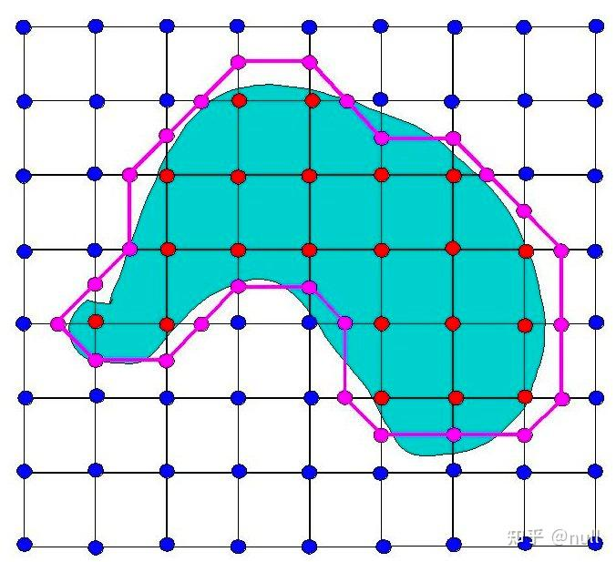
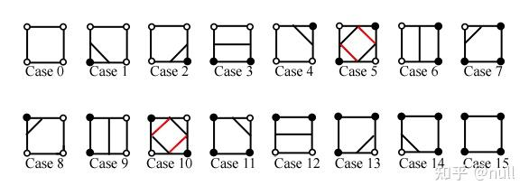
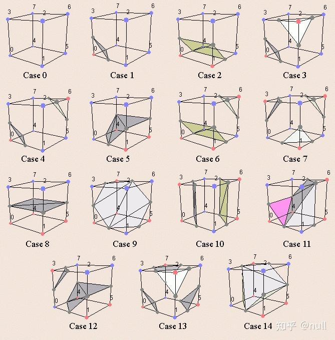
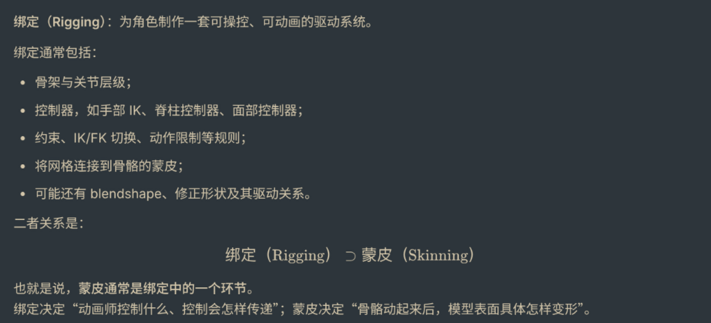
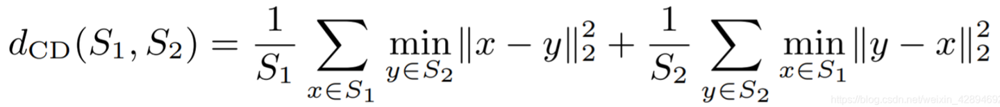

# 3D Vision入门笔记

## 概念

### Mesh

用**顶点**、**边**和**面**来近似表示三维物体表面的数据结构。通常面是三角面。

常见的存储格式：`.obj`、`.stl`、`.fbx`、`.glb`

### SDF

#### Signed Distance Function

Signed Distance Function，这是一种函数，$SDF(x)$。接受的输入$x$是空间中的一个坐标点，输出一个**带符号距离**，常用来标识一个物体的轮廓。

- $SDF(x)<0$，说明点在物体的内部；
- $>0$，说明点在物体外部
- $=0$，说明点在物体表面上。

在SDF不能用公式完美表示的时候，常常经过网络使用某种latent code来表示实际物体的形状。因此，当给定了一个SDF和某个点的坐标的时候，可以通过一个SDF Decoder来转换，得到带符号距离。

```
distance = Decoder(shape_latent_code, spatial_position)
```

#### Simulation Description Format

机器人仿真文件格式（<https://sdformat.org/>），描述 ***机器人/物体 + 所处虚拟世界 + 各种物理规则与背景条件*** ，常用在Gazebo里。

##### 基本层级

一个典型文件大致是：

```
<sdf version="1.12">
  <world name="demo_world">

    <physics type="ode">
      <gravity>0 0 -9.81</gravity>
    </physics>

    <light name="sun" type="directional">
      ...
    </light>

    <model name="box">
      <pose>0 0 0.5 0 0 0</pose>

      <link name="body">
        <inertial>...</inertial>
        <visual>...</visual>
        <collision>...</collision>
      </link>
    </model>

  </world>
</sdf>
```

最重要的标签是：

| 标签          | 意思                              |
| ------------- | --------------------------------- |
| `<sdf>`       | 文件根节点，声明 SDF 版本         |
| `<world>`     | 整个仿真世界                      |
| `<model>`     | 一个机器人、物体、桌子、杯子等    |
| `<link>`      | 一个刚体部件                      |
| `<joint>`     | 两个 link 之间的运动/动力学关系   |
| `<visual>`    | 看起来是什么样                    |
| `<collision>` | 碰撞时用什么几何                  |
| `<inertial>`  | 质量、质心、惯量                  |
| `<sensor>`    | 相机、激光雷达、IMU、接触传感器等 |
| `<plugin>`    | 给仿真器加载行为/控制逻辑         |

SDF 的 `<world>` 可以包含模型、场景、物理、插件和灯光；`<model>` 则可以描述一个完整机器人或其他物理对象。[SDF 规范](https://sdformat.org/spec/1.7/sdf/)

### 等值面

函数取同一个值的所有点构成的面。比如对于上文的SDF，经常取$SDF(x) = 0$这一等值面作为**物体表面**。

### Marching Cubes：从SDF到Mesh的转换

常用Marching Cubes算法，这是一个很著名的三维重建算法。（[算法讲解](https://zhuanlan.zhihu.com/p/561731427)）2D版本称为Marching Squares。






按照以上编号规范，上面图形的第一行可以存储为`00231000`。

而推广到3D，可以如下编号：



> [!Note]
>
> 如果不在乎表面朝向，可以就这样编号，因为顶点5外3内和顶点5内3外对应构建出的多边形的形状是一致的，只不过法线方向不一样。
>
> 而实际实现中可能会使用256项查表来确定mask。

### URDF格式

**URDF（Unified Robot Description Format）**，使用XML书写，最初常用于 ROS 机器人系统，可以描述任何由**刚体部件和关节**组成的物体。

#### 核心元素

- Link：刚体部件；

- Joint：关节，连接两个刚体的运动约束，有六个常见类型，按照自由度从小到大如下列出（详细说明参考ROS[官方文档](https://docs.ros.org/en/rolling/p/urdfdom_headers/generated/classurdf_1_1Joint.html)）

  - fixed
  - revolute（绕轴旋转，但是有停止角度（限位），不能无限往一个方向旋转）
  - continuous（无限旋转，比如车轮）
  - prismatic（沿轴平移）
  - planar（自由平移）
  - floating

  > 有另外一套描述关节性质的分类（[参考资料](https://zhuanlan.zhihu.com/p/613137379)），和这里有相似但是不太相同。

#### 数据示例

这是一个柜子/柜门铰链的示例数据。

```xml
<robot name="cabinet">
  <link name="body">
    <visual>
      <geometry>
        <mesh filename="cabinet_body.obj"/>
      </geometry>
    </visual>
  </link>

  <link name="door">
    <visual>
      <geometry>
        <mesh filename="cabinet_door.obj"/>
      </geometry>
    </visual>
  </link>

  <joint name="door_hinge" type="revolute">
    <parent link="body"/>
    <child link="door"/>
    <origin xyz="0.4 0 0.8" rpy="0 0 0"/>
    <axis xyz="0 0 1"/>
    <limit lower="0" upper="1.92"/>
  </joint>
</robot>
```

> - `axis`：指示绕哪个轴旋转
> - `origin`：铰链在柜体坐标系中的**位置**。`rpy`表示`roll/pitch/yellow`，分别表示关节坐标系绕parent坐标系x/y/z轴转多少弧度，也就是从parent到joint的坐标系变换。
> - `limit`：可旋转范围，单位是弧度

另外每种`link`也会包括以下几种信息：

```
visual    ：看起来是什么样，可引用带纹理的 Mesh
collision ：碰撞时用什么形状，常比 visual 更简单
inertial  ：质量、质心、惯量，用于物理仿真
```

### SRDF格式

Semantic Robot Description Format，描述**机器人怎么被运动规划系统理解和使**用。一般`MoveIt`/`MoveIt2`来使用，而URDF一般是ROS/Gazebo/RViz使用。

SRDF无法被单独使用，一般要配合已有的URDF文件。

> **ROS** 和 **MoveIt** 的核心区别在于：ROS 是机器人操作系统（底层通信与通用框架），而 MoveIt 是基于 ROS 的高级功能库（专注机械臂运动规划与操作）。两者的联系是：MoveIt 运行在 ROS 之上，依赖 ROS 的通信机制，是 ROS 生态中专门用于机械臂控制的核心组件。

[MoveIt文档](https://moveit.picknik.ai/main/doc/examples/urdf_srdf/urdf_srdf_tutorial.html)。

其他可能有用的[资源](https://zhuanlan.zhihu.com/p/2019539613136471433)。

#### 数据示例

```xml
<group name="arm">
  <chain base_link="base_link" tip_link="tool0"/>
</group>

<group_state name="home" group="arm">
  <joint name="shoulder" value="0"/>
</group_state>

<disable_collisions link1="upper_arm_link"
                    link2="forearm_link"
                    reason="Adjacent"/>
```

### STEP格式
> [!Note]
> 感觉了解就好，不需要深究。

一种通用的CAD交换文件格式，Standard for the Exchange of Product model data，后缀名`.stp`/`.step`。
分为文件头和数据集两部分。文件头包含文件的元数据信息，如文件名称、版本号、生成工具等；数据集则包含产品的几何形状、属性、材料等所有信息。
#### 使用什么表示方式？
常见的是B-Rep（Boundary Representation，边界表示）。

### Blendshape

一种基于同一网格拓扑的顶点形变表示与驱动方法。要有一个基础（Neutral）Mesh $V_0$，然后要有n种blendshape target $V_i$，最后的形状由基础Mesh和n种目标形状的加权混合组合而成。经典的Linear定义如下：

#### Linear

最常见的线性定义为：

$V(\mathbf{w}) = V_0 + \sum_{i=1}^{n}w_i(V_i-V_0)$

> 目标blendshape和中性脸相比，必须具有相同的顶点数量、顶点顺序和连接关系，只允许顶点位置（有时也包括法线等属性）不同。

#### Quadratic

二次 blendshape 则允许最终形状中出现权重的二次项：

$V(\mathbf w)=V_0+\sum_i w_i\Delta V_i+ \sum_{i\le j}w_iw_j\Delta V_{ij}$

其中：

- $w_i^2\Delta V_{ii}$：同一个形状的非线性变化；
- $w_iw_j\Delta V_{ij}\;(i\neq j)$：两个形状同时激活时的交互修正。

例如“张嘴 + 微笑”时，嘴角、脸颊的形变往往不等于两者线性相加；二次项能专门拟合这部分额外形变。

### 绑定 Rigging

**绑定（Rigging）**：为角色制作一套可操控、可动画的驱动系统。



#### 蒙皮 Skinning

定义了**网格顶点如何跟随骨骼（Skeleton）运动**，建立二者之间的数学绑定关系，使得网格顶点位置可以用骨骼姿态驱动/计算。

### 关节树 Kinematic Tree

描述**一个可动物体由哪些刚体部件组成，以及它们怎样通过关节连接**的层级结构。

结合上面的URDF文件理解。

```
根
├── 子部件
│   ├── 孙部件
│   └── 孙部件
└── 子部件
```

### Chamfer Distance 倒角距离



其中$S_i$表示两组3D点云。第一项代表$S_1$中所有点到点云2的最小距离的均值，第二项就是反过来的。这个距离越小，说明重建的效果越好。
### UV坐标
图形学中用来描述**二维纹理图片**如何贴到**三维模型表面**。
U for 水平方向，V for 垂直方向，是归一化的坐标。所以左下角就是`(0, 0)`，右上角就是`(1, 1)`。

可以如此理解：UV用到纹理图片上，而三维坐标XYZ用到三维模型上。一个三维模型中的点取到的颜色的UV坐标是`(u, v)`，那么意味着这个颜色就是纹理图片中UV坐标`(u, v)`处那个点的颜色。

### 面片 Face
一个 3D 模型通常由：

- **Vertex（顶点）**
- **Edge（边）**
- **Face（面）**

组成。
所以一个面片存储的是“由哪些Vertices组成”。
#### `.obj`中的表示
```obj
# vertices
v 0 0 0
v 1 0 0
v 1 1 0
v 0 1 0


# faces
f 1 2 3
f 1 3 4
```
索引从1开始，所以`f 1 2 3`就是指的是前三个v组成的一个三角面。
或者是这样的数据：
```obj
f 1/5/10 2/6/11 3/7/12
```
每个对应的是`顶点索引 / 纹理坐标（UV）索引 / 法向量索引`。

#### PyTorch3D
```python
verts = [
    [0,0,0],  # index 0
    [1,0,0],  # index 1
    [1,1,0],  # index 2
    [0,1,0],  # index 3
]


faces = [
    [0,1,2],
    [0,2,3]
]
```
是从0开始的索引。

### USDZ
USDZ（Universal Scene Description ZIP）是由Apple和Pixar共同开发的3D文件格式，基于Pixar的USD（Universal Scene Description）技术。

#### 主要特点

**压缩打包格式**

- 将USD文件及其相关资源（纹理、材质、动画等）打包成单个未压缩的ZIP归档
- 方便分享和传输，保持所有资源的完整性

**跨平台兼容**

- 主要用于Apple生态系统（iOS、iPadOS、macOS）
- 支持AR Quick Look功能，可在Safari等应用中直接预览3D模型

**AR增强现实优化**

- 专为移动设备AR体验设计
- 轻量级，适合实时渲染
- 支持物理基础渲染（PBR）材质
### AU与FACS
**FACS = Facial Action Coding System（面部动作编码系统）**
它是由心理学家 Paul Ekman 和 Wallace V. Friesen 在 1970s 提出的一个标准体系。
AU就是Action Unit，是FACS中的基本单位。
### dxf 文件
DXF 是 AutoCAD 定义的一种 CAD 交换文件格式，全称是 Drawing eXchange Format。主要存的是“图纸里的几何和标注数据”，**以2D图形为主**。

### Step Parts
[step.parts](https://www.step.parts/) 是一个开源 CAD 零件目录网站：收集常见可采购部件的 **STEP 三维模型**。
### SDK
SDK（Software Development Kit，软件开发工具包） 通常包含以下核心组成部分：
- API接口/库文件；
- 文档
- 开发工具
- 示例代码/Demo
- 依赖项管理

### CAD 几何工具：OCCT、CadQuery 与 build123d

**Open CASCADE Technology（OCCT）** 是开源 CAD 的几何内核，负责精确的 B-Rep 几何与拓扑：顶点、边、面、实体，以及布尔运算、拉伸、旋转、扫掠、圆角、倒角、距离/体积/干涉计算。它也负责读写 STEP、IGES 等工程格式。一般不直接让 Agent 操作 OCCT，而是通过更高层的建模 SDK。

`CadQuery` 与 `build123d` 都是基于 OCCT 的 Python 参数化建模库：前者以链式工作平面（workplane）为主，后者以更接近 Python 上下文/草图操作的 API 为主。二者生成的都是精确 B-Rep 实体，可导出 STEP/STP（工程交换）、IGES/IGS（曲面交换）、STL/3MF（打印网格）、DXF（二维图纸）和 GLB/OBJ（渲染/网页网格）等格式。

CadQuery 示例：在顶面打孔。

```python
import cadquery as cq

part = (
    cq.Workplane("XY")
    .box(80, 50, 20)
    .faces(">Z")
    .workplane()
    .hole(6)
)
```

build123d 示例：在盒体中减去圆柱孔。

```python
from build123d import *

with BuildPart() as part:
    Box(80, 50, 20)
    Cylinder(radius=3, height=20, mode=Mode.SUBTRACT)
```

参考：[CadQuery 文档](https://cadquery.readthedocs.io/en/stable/)；[build123d 文档](https://build123d.readthedocs.io/)。
### Albedo
Albedo 指材质的“固有颜色”或“反照率”——物体本身在不受光照影响时的颜色属性。

在人脸模型中：

- Albedo：肤色、雀斑、唇色、皮肤纹理等；
- Lighting：环境光、阴影、高光；
- Geometry：脸型和表情造成的三维形变。

### Landmark

在 3D 人脸中，landmark 指一组具有稳定语义的关键点（特征点），每个点有三维坐标 $(x,y,z)$。

典型 landmark 包括：

- 左右眼角、眼睑点；
- 左右眉毛端点和眉峰；
- 鼻尖、鼻翼；
- 嘴角、上下唇中心与唇缘；
- 下巴尖、脸部轮廓点。

它们可用来描述脸的几何结构和表情变化。例如：

- 两嘴角上移、拉远：微笑；
- 上下嘴唇距离增大：张嘴；
- 眼睑距离减小：眨眼或闭眼；
- 眉峰上移：抬眉。

### Photometric Error Signal / Photometric Loss

一个可能的形式为：

$$L_{\text{photo}}=\sum_{p}\left\|I_{\text{input}}(p)-I_{\text{render}}(p)\right\|$$

也就是真实输入图像$I_{input}$和预测出来的图像$I_{render}$之间算loss。