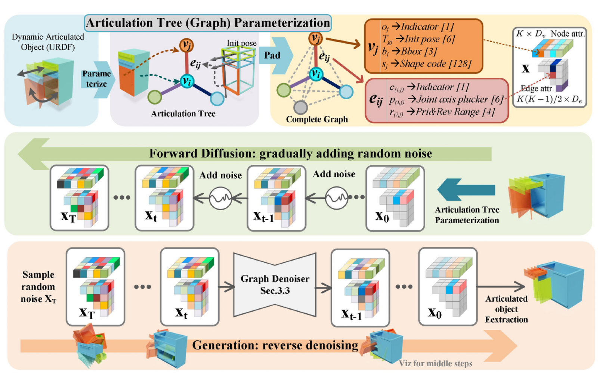
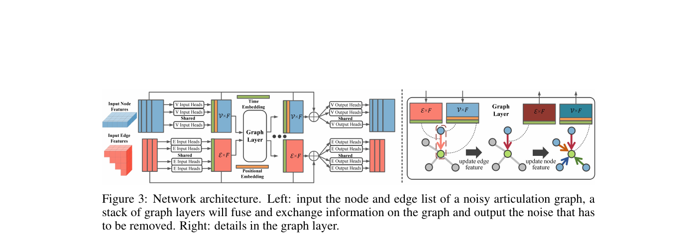
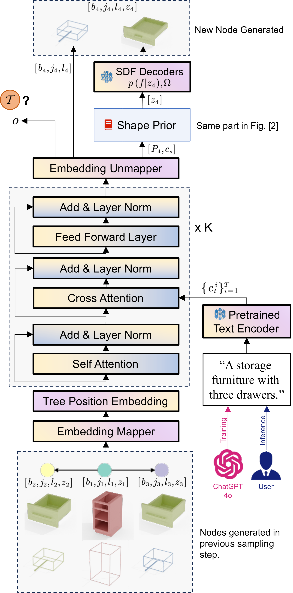
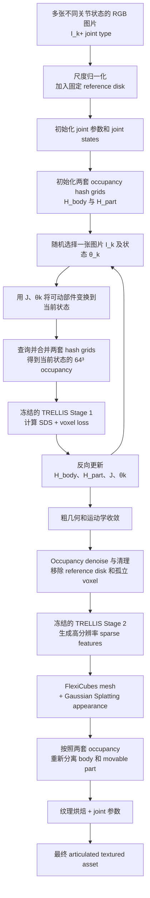
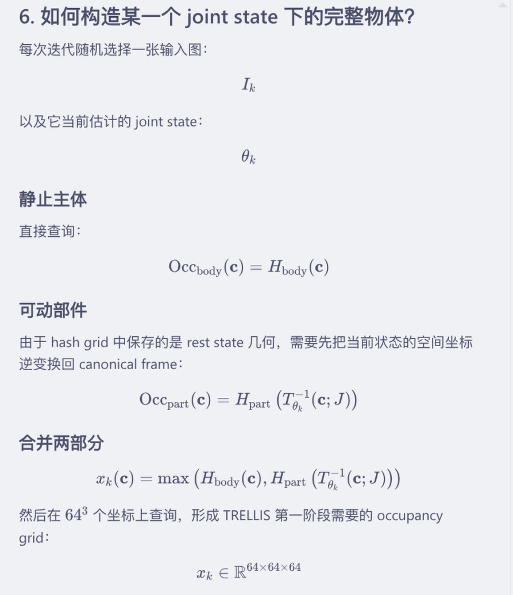
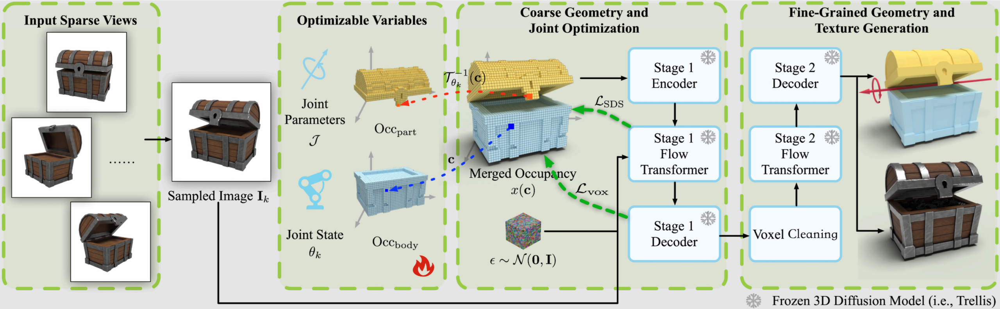
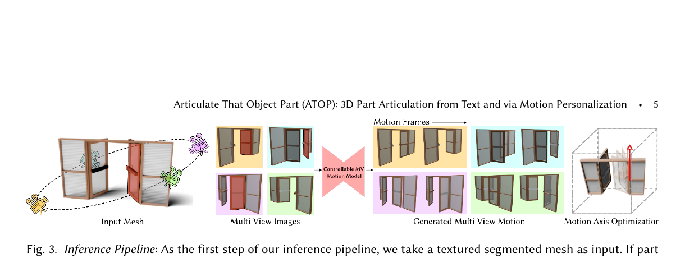

# 3D 场景、单体物体与 Agentic CAD：统一研究地图

> 更新：2026-08-12  
> 范围：第一层区分多物体场景/交互生成与单体物体生成；第二层再把单体物体分为 articulated 与 static，并比较端到端学习模型、逐实例优化和 agentic pipeline。  
> 图像原则：下文的 pipeline 图优先直接引用论文/arXiv/官方项目页；NAP 与 ATOP 的官方页面没有可稳定嵌入的静态 pipeline 图，因此使用从其论文 PDF 原图截取的本地副本，并在图下注明来源。

## 1. 两层分类与论文清单

这里先按**生成目标的尺度**分类，再只对“单体物体生成”按运动学类型细分。场景论文的研究对象首先是多个独立物体及其关系，而不是其中某件家具有没有关节。

### 第一层：场景生成 vs. 单体物体生成

- **A. 场景生成 / 不同物体交互**：输出包含多个可独立存在的语义对象，核心问题是对象选择、生成、摆放、接触/包含关系、场景布局或整体物理可用性。Real-to-Sim 场景重建也属于这一类。
- **B. 单体物体生成**：输出的核心是一个语义资产。它内部可以由多个 part、link 或 CAD component 构成；只要这些部件共同形成一个功能对象，仍然算“单体”。

### 第二层：单体物体分为 articulated vs. static

- **B1. Articulated 单体物体**：方法的主要输出明确包含或恢复运动学结构，例如 `part/link、parent–child、joint type、axis、origin、limit`。
- **B2. Static 单体物体**：生成一个静态 mesh 或 CAD solid/history，不输出部件之间的运动学结构。

### 按两层分类列出的论文

| 两层分类 | 论文 | 核心输出 |
|---|---|---|
| **A. 场景生成 / 不同物体交互** | Interact3D、Sketch2CAD (2023)、SimFoundry、SceneSmith、SceneAssistant、SAGE、ArtiWorld | interacting object composition、multi-primitive CAD scene、room/house scene、real-to-sim scene、articulation-aware simulation world |
| **B1. 单体物体 — Articulated** | NAP、ArtFormer、ArtLLM、URDF-Anything、FreeArt3D、ATOP、Articulate-Anything、LAM、ArtiCAD、Articraft、**ArticFlow、SPARK** | 一个带 part/link 与 joint kinematics 的对象或装配体 |
| **B2. 单体物体 — Static / Geometry** | DeepCAD、SkexGen、Text2CAD、STEP-LLM、TransCAD、Sketch2CAD (2020)、CSGNet、UCSG-Net、SolidGen、BrepGen、SECAD-Net、Arko-T、CADSmith、NURBGen、**Flatten The Complex、DualBrep、B-repLer、TripoSG、TRELLIS.2**；Vitruvion 是 2D 参数化草图子问题 | 一个静态、可编辑的 CAD/CSG construction program、NURBS/STEP/B-Rep，或静态 mesh/PBR 资产 |

```text
本文覆盖的 3D 生成 / 重建工作
├── A. 场景生成 / 不同物体交互
│   ├── Interact3D / Sketch2CAD (2023) / SimFoundry
│   ├── SceneSmith / SceneAssistant / SAGE
│   └── ArtiWorld
└── B. 单体物体生成
    ├── B1. Articulated
    │   ├── NAP / ArtFormer
    │   ├── ArtLLM / URDF-Anything / FreeArt3D / ATOP / ArticFlow / SPARK
    │   └── Articulate-Anything / LAM / ArtiCAD / Articraft
    └── B2. Static
        ├── DeepCAD / SkexGen / Text2CAD / CADSmith
        ├── STEP-LLM / TransCAD / Sketch2CAD (2020)
        ├── CSGNet / UCSG-Net / SECAD-Net
        ├── SolidGen / BrepGen / Flatten The Complex / DualBrep / B-repLer
        ├── Arko-T / NURBGen / TripoSG / TRELLIS.2
        └── Vitruvion（2D sketch 子问题）
```

### 分类边界：按“最终在生成什么”判断

> 发表口径：每篇方法卡片的“发表”或“论文 / 版本”项均优先写正式会议/期刊；若本次核验没有找到正式版本，则明确标为 arXiv 预印本，而不把预印本年份误当作接收状态。

- **ArtiCAD** 的多个 CAD parts 共同组成一个功能对象，所以属于 **B1 单体 articulated object**，不是场景生成。
- **Interact3D** 的 anchor 与 complementary object 各自可以独立存在；论文研究二者的接触、插入、包含或支撑，因此属于 **A 多物体交互**，即使它没有生成整间房。
- **SceneSmith、SAGE** 会检索 articulated furniture，但顶层输出仍是场景，属于 **A**。
- **SimFoundry** 的顶层输出是完整 Real-to-Sim scene，因此属于 **A**；内部的 articulation reconstruction 子模块是跨界能力，不改变顶层分类。
- **ArtiWorld** 的顶层任务是从场景中定位可关节化对象、逐个生成 URDF，再放回原场景，因此属于 **A**；它内部的 **Arti4URDF** 则是典型的 B1 单体 articulation 模型。
- **Text2CAD** 的建模 history 不是 kinematic joint，所以属于 **B2 单体 static object**。
- **ArtLLM** 即便最终以 mesh 表示几何，也显式预测同一功能资产的部件及关节配置，因而属于 **B1**；mesh 与 CAD program 的可编辑性不同，不改变其 articulated 单体分类。
- **CADSmith、NURBGen** 的目标都是静态 CAD 几何：前者生成并验证 CadQuery 程序，后者以 NURBS 曲面表达高保真 CAD；二者都不输出对象内部的 link–joint kinematics，属于 **B2**。
- **Arko-T** 输出单个静态、参数化 Build123d 设计程序，不生成 link/joint，因此属于 **B2**；其“structured design”指 feature、parameter、constraint、history 与 attachment，不是 articulated kinematics。
- **Vitruvion** 只生成 2D parametric sketch，不是完整 3D object；但它是 static CAD 中“primitive + constraint”表示的关键子问题，因此作为 B2 的边界工作保留。
- **Sketch2CAD (2023)** 输出一组对象的 shape、position、rotation、size，再由 Grasshopper 重建场景，属于 **A**；不要与 **Sketch2CAD (2020)** 的单体 CAD 交互式建模系统混淆。
- **Articulated object** 与 **interactive composition** 不是同义词：前者要求一个对象内部的显式运动副；后者可以只有不同对象之间的空间关系。
- **TripoSG、TRELLIS.2** 生成的是静态 mesh/PBR 资产，不是 CAD；为了与“单体 object generation”统一比较，本文将其放入广义 B2，但在所有结论中单独标为 **geometry prior / mesh-first**。
- **B-repLer** 的输入是已有 B-Rep 加编辑文本，输出是编辑后的 B-Rep；它属于 static CAD 的**生成式编辑**支线，不应被误写成从零 text-to-CAD。
- **ArticFlow** 生成 action-conditioned mechanism point sets 与动力学响应，**SPARK** 从单图生成 part meshes 与 URDF；二者均输出显式运动结构，因此属于 B1，但都不是 code-first CAD agent。
- **Flow Matching / Rectified Flow 不是本地图的分类维度**：它只是生成连续 latent、field、particle 或 part geometry 的方法标签。分类仍只看最终对象：ArticFlow、SPARK 归 B1；TripoSG、TRELLIS.2、Flatten The Complex、B-repLer、DualBrep 归 B2。后文在各自目标类别内标出该方法。

---

## 2. A 类：场景生成 / 不同物体交互

本节各方法的顶层输出包含多个独立语义对象及其空间关系。场景里可以使用 articulated asset，甚至可以带 articulation reconstruction 子模块，但分类依据仍是整个系统最终生成或重建的是一个多物体环境。

### 2.1 Interact3D — Compositional 3D Generation of Interactive Objects

- **论文 / 版本**：[arXiv:2603.16085](https://arxiv.org/abs/2603.16085)（2026 预印本）
- **输入**：一个已有 3D mesh + 描述 complementary object 及空间关系的文本，例如“花插在花瓶中”。
- **输出**：多个几何独立、相互接触或包含且低穿插的 meshes。
- **核心流程**：
  1. 渲染输入 mesh，并用图像生成/编辑模型在 2D 中补出完整交互构图；
  2. TRELLIS2 将构图中的对象重建为 3D，PartField 分出 anchor object 与 complementary object；（谁的投影面积大，也就是2D bbox更大，谁就是anchor，另一个就是remaining）
  3. 先做 global-to-local registration，让生成结果对齐原始高质量 mesh；（即Stage 1，固定 anchor，用清晰的$M_{anchor}$替换分割出来的$M'_{anchor}$，OBB来得到uniform scale，GeoTransformer来获取旋转和平移关系等，最后用ICP（Iterative Closest Point）来获得最后的精确变换）
  4. 再用 SDF-based collision-aware optimization 对齐 $M_{comp}$ 的，减少穿插并保持接触，先模仿上一个stage的步骤，用OBB + GeoTransformer求变换，然后对$M_{anchor}$求SDF函数，作为惩罚项，来优化；
>（两个Stage就是让$M_{comp}$/$M$/$M'$/$M'_{comp}$与$M_{anchor}/M_{remaining}/M'_{anchor}/M'_{remaining}$一一对应，然后用高清mesh$M_{part}$替换分割出来的$M'_{part}$）

  5. 严重碰撞无法靠刚体优化解决时，VLM 查看多视图和内部 cross-section，写出定向 image-edit 指令，再重生成 complementary geometry。
  
- **分类位置**：**A. 场景生成 / 不同物体交互**。这里的 `interactive` 是“独立对象之间有接触、插入、支撑、包含关系”，不是一个对象内部的 link–joint articulation。
- **agent 判断**：VLM 只承担困难样例的语义修复；主体是生成、配准与几何优化流水线，不是贯穿全流程的通用 agent。


*原图：Interact3D Figure 3/4；[arXiv HTML 原文](https://arxiv.org/html/2603.16085v1)。*

---

### 2.2 SimFoundry — Modular and Automated Scene Generation for Policy Learning and Evaluation

- **论文 / 版本**：[arXiv:2606.28276](https://arxiv.org/abs/2606.28276)（2026 预印本）
- **输入**：一段真实场景 RGB video。
- **输出**：simulation-ready digital twin，以及对象、布局与任务层面的 digital cousins。
- **核心流程**：
  1. **Extraction**：估计 depth，融合 point cloud，检测/分割对象并恢复背景；
  2. **Generation**：从对象图像生成 3D mesh，做尺度与位姿对齐；对可动柜门/抽屉调用 articulation reconstruction；补 collision geometry 与物理属性，并在 PyBullet 中稳定化；
  3. **Augmentation**：保持 affordance，改变对象、场景布局或任务，形成用于 policy learning/evaluation 的 cousins。
- **分类位置**：**A. 场景生成 / 不同物体交互**，具体是 Real-to-Sim；它含有真正恢复 movable parts/joint parameters 的 articulation 子模块，但顶层输出仍是多物体场景。
- **端到端判断**：不是。深度、分割、2D-to-3D、配准、articulation、物理注释和稳定化由多个模型与确定性模块串联。
- **agent 判断**：会用 VLM 做理解与属性推断，但总体控制流是预先规定的 `Extraction → Generation → Augmentation`，更适合称自动化模块流水线，而非持续自主决策的 agent。


*原图：SimFoundry Figure 2；[arXiv HTML 原文](https://arxiv.org/html/2606.28276v3)。*

---

### 2.3 SceneSmith — Agentic Generation of Simulation-Ready Indoor Scenes

- **论文 / 版本**：[arXiv:2602.09153](https://arxiv.org/abs/2602.09153)（2026 预印本）
- **输入**：房间或住宅的自然语言描述。
- **输出**：包含房间结构、家具、墙面/天花板物体和 manipulands 的 simulation-ready indoor scene。
- **层级流程**：依次生成 `layout → furniture → wall-mounted objects → ceiling objects → manipulands`；每一阶段都有 Designer、Critic、Orchestrator 三个 VLM 角色。
- **几何来源**：静态资产可以由 `text → image → SAM3 → SAM3D` 生成；articulated furniture 从 ArtVIP 等资产库检索，再统一进行物理属性估计与 physics post-processing。
- **分类位置**：**A. 场景生成 / 不同物体交互**。它会使用现成的 articulated furniture，但没有从原始输入生成这些家具的 joint structure。
- **agent 判断**：是层级 VLM multi-agent；Designer 提案，Critic 从视觉/场景状态检查，Orchestrator 决定接受、修改或回滚。


*[arXiv HTML 原文](https://arxiv.org/html/2602.09153v2)。*

---

### 2.4 SceneAssistant — A Visual Feedback Agent for Open-Vocabulary 3D Scene Generation

- **论文 / 版本**：[arXiv:2603.12238](https://arxiv.org/abs/2603.12238)（2026 预印本）
- **输入**：开放词汇的自然语言场景描述。
- **输出**：可继续编辑的 Blender 3D scene。
- **核心流程**：VLM 在 ReAct 循环里同时读取原始目标和当前场景 render，调用 `Scale`、`Rotate`、`Move`、`FocusOn` 等 atomic Action APIs 修改对象；每次执行后重新渲染，再决定下一步，最多迭代约 20 步。
- **资产来源**：需要新对象时，可走 `Z-Image → Hunyuan3D` 的图像到 3D 资产生成路线。
- **分类位置**：**A. 场景生成 / 不同物体交互**。对象默认按 rigid assets 处理；论文的重点是开放词汇场景构造和视觉反馈，不是关节/URDF 生成。
- **agent 判断**：是很纯粹的“视觉 + 语言 + 工具动作”agent。它的特殊之处是尽量不依赖专用空间关系数据或手写 layout solver，而让 VLM 从当前 render 直接闭环修正。


*原图：SceneAssistant Figure 2；[arXiv HTML 原文](https://arxiv.org/html/2603.12238v1)。*

---

### 2.5 SAGE — Scalable Agentic 3D Scene Generation for Embodied AI

- **论文 / 发表**：[arXiv:2602.10116](https://arxiv.org/abs/2602.10116)（CVPR 2026）
- **输入**：embodied task / 场景文本，可选参考图。
- **输出**：simulation-ready scene、场景变体，以及可用于 embodied AI 的 robot demonstrations / action data。
- **核心流程**：MCP agent 根据当前状态动态调用 scene initializer、asset placer/mover/remover 等工具；visual critic 检查多视图里的语义完整性和空间关系，Isaac Sim physics critic 检查重力、碰撞与稳定性，然后 agent 继续修复。
- **资产来源**：静态对象可用 TRELLIS 等模型生成；articulated objects 主要来自 PartNet-Mobility 扩展/检索，不是 SAGE 自己预测 joint。
- **分类位置**：**A. 场景生成 / 不同物体交互**。它把对象、物理和机器人任务组织成世界，但不是 articulated-object generator。
- **agent 判断**：强视觉与物理双反馈 agent。与 SceneAssistant 相比，它更强调 simulation validity 和下游 embodied task/data；与 SceneSmith 相比，它更像动态工具编排，而非固定的五级室内布置流程。


*原图：SAGE Figure 2；[arXiv HTML 原文](https://arxiv.org/html/2602.10116v2)。*

### 2.6 ArtiWorld — LLM-Driven Articulation of 3D Objects in Scenes

- **论文 / 版本**：[arXiv:2511.12977](https://arxiv.org/abs/2511.12977)（2025 预印本）。
- **顶层输入 / 输出**：文本和/或几何 scene description → 识别应被关节化的 rigid objects → geometry-preserving URDF assets → 重新对齐并放回原场景，得到 articulation-aware simulation scene。
- **场景流程**：LLM 从 scene JSON 选择 articulable candidates 与 asset IDs；逐对象采样完整/部件点云；调用 Arti4URDF 预测结构；按原位姿回插场景。
- **核心模型 Arti4URDF**：Point-BERT/ULIP-2 分别编码完整对象与各 part point clouds，经两层 MLP adapter 映射为 LLM tokens；Qwen3-8B 先自回归输出 JSON link–joint tree，再输出完整 URDF，包含 parent/child、joint type、axis 与 limits。
- **端到端判断必须分层**：Arti4URDF 在**已经获得 articulation-relevant part clouds**后，是 `3D part point clouds → structure chain + URDF` 的单一端到端学习模型；完整 ArtiWorld 还包括场景候选识别、point-prompt segmentation、装配和回插，因此不是端到端单模型。
- **agent 判断**：不是视觉反馈 agent。LLM 用于候选选择和序列生成，但没有观察执行结果后自主修复的 action loop。
- **关键局限**：训练时使用已分件/已标注对象，真实推理依赖半自动 point prompts 获得少量功能 parts；URDF 省略 inertial/collision terms，且 numeric joint origin 使用默认零值，不能把“生成完整 URDF 语法”等同于完整物理资产建模。


### A 类七篇工作的横向定位

| 工作                | 生成层级                           | 原始输入                                        | 主要输出                                                | 视觉反馈                     | 物理反馈                     | articulated object 如何处理                         |
| ----------------- | ------------------------------ | ------------------------------------------- | --------------------------------------------------- | ------------------------ | ------------------------ | ----------------------------------------------- |
| Interact3D        | 对象组合                           | 已有 mesh + 关系文本                              | interacting rigid meshes                            | VLM 仅修复困难碰撞              | SDF 几何碰撞优化               | 不处理 joint                                       |
| Sketch2CAD (2023) | primitive scene reconstruction | 单张 wire-frame image                         | scene descriptor + Grasshopper B-Rep scene          | 图像只在单次模型前向中编码            | 无                        | 不处理 joint                                       |
| SimFoundry        | 真实场景 → 仿真                      | RGB video                                   | digital twin/cousins                                | 感知与 VLM 理解               | PyBullet 稳定化             | **内置 articulation reconstruction 子模块**          |
| SceneSmith        | 室内场景                           | 文本                                          | room/house scene                                    | 每层 Designer/Critic       | 物理后处理                    | 检索 articulated furniture                        |
| SceneAssistant    | 开放词汇场景                         | 文本                                          | Blender scene                                       | 每步查看当前 render            | 不以 simulator physics 为核心 | 不处理 joint                                       |
| SAGE              | embodied simulation scene      | 任务文本，可选图像                                   | scene + variants + action data                      | multi-view visual critic | Isaac Sim physics critic | 检索/扩展 PartNet-Mobility 资产                       |
| ArtiWorld         | 已有场景的关节化                       | scene JSON + rigid 3D assets / point clouds | geometry-preserving URDF assets + interactive scene | 无 render-feedback loop   | 生成 URDF 后装配回场景           | **Arti4URDF 直接预测每个对象的 link–joint graph 与 URDF** |

---

## 3. B 类：单体物体生成

这里的“单体”是语义与功能层面的一个资产，不要求几何上只有一个零件。柜子、带抽屉的桌子或多零件 CAD assembly 都可以是一个单体对象。

### 3.1 B1：Articulated 单体物体

这些工作直接生成、恢复或赋予对象内部的 part/link 与 joint kinematics。

#### 3.1.1 NAP — Neural 3D Articulated Object Prior

- **论文 / 发表**：[NeurIPS 2023 原文](https://proceedings.neurips.cc/paper_files/paper/2023/file/655846cc914cb7ff977a1ada40866441-Paper-Conference.pdf)
- **输入**：无条件采样；或部分给定 part / joint 属性。
- **输出**：关节树/图，包含部件形状、连接关系、joint 轴与范围。
- **方法**：articulation graph diffusion；图去噪器让 part geometry 与 joint constraint 交换信息。
- **最该记住的点**：它奠定了“关节对象 = 部件节点 + 运动边”的生成表示；不是 CAD 工程系统。





*原图：NAP, Figure 3，论文 PDF 第 6 页；本地从官方论文 PDF 截取。*

---

#### 3.1.2 ArtFormer — Controllable Generation of Diverse 3D Articulated Objects

- **论文 / 发表**：[CVPR 2025 / arXiv](https://arxiv.org/abs/2412.07237)
- **输入**：文本；也支持图像条件。
- **输出**：变长 part tree，每个 token 含 bbox、geometry latent、joint、parent；再解码为 mesh。
- **方法**：Articulation Transformer 自回归生成树；tree positional embedding 表达父子关系；SDF shape prior 解码高质量局部几何。
- **与 NAP 的差别**：NAP 在完整图上去噪；ArtFormer 像语言模型一样逐步长出 tree token。



*原图：ArtFormer Figure 3；[论文原文](https://arxiv.org/html/2412.07237v3)。*

---

#### 3.1.3 URDF-Anything — Constructing Articulated Objects with 3D Multimodal Language Model

- **论文 / 发表**：[NeurIPS 2025 原文](https://proceedings.neurips.cc/paper_files/paper/2025/hash/88445acb45c922bdb06952e31f8a60ec-Abstract-Conference.html)
- **输入**：3D point cloud + text instruction。(输入多张多视角RGB图像，点云用某个3D重建模型获得)
- **输出**：part segmentation、joint type/origin/axis/limit 与 URDF。
- **方法**：URDF-Anything 把点云编码进一个 3D 多模态语言模型，让语言模型**自回归**生成关节结构 JSON；当语言模型生成某个 link 对应的 `[SEG]` token 时，再用这个 token 的 hidden state 查询点云特征，得到该 link 的逐点分割 mask。
- **最该记住的点**：这是“真实 3D 观测 → 可执行数字孪生”的学习式端到端代表，不是 CAD 程序生成。

```
① RGB 图像
   ↓ 外部模型重建

② 完整物体点云
   仍然没有 parts

   ↓ 3D encoder

③ 点云 features
   每个点都有几何/语义特征

   ↓ 输入 ShapeLLM

④ LLM 自回归生成 JSON
   ├── joint type
   ├── parent / child
   ├── origin / axis / limit
   └── 每个 link 后生成 [SEG]

⑤ LLM 每生成一个 link 的 [SEG]，就产生一个 link query。每个 [SEG] 的 hidden state
   表示“当前要找的 link 是什么”

   ↓ 与所有 point features 匹配

⑥ 每个 link 的 point mask
   ├── door:   哪些点属于门
   ├── drawer: 哪些点属于抽屉
   └── base:   哪些点属于柜体

   ↓ 按 mask 拆分点云

⑦ 每个 link 的独立点云
   ↓ point-to-mesh

⑧ 每个 link 的 mesh

   ↓ 与 joint JSON 组合

⑨ URDF
```


> 3D Backbone使用ShapeLLM，并使用Uni3D提取dense 点云 feature。这些feature通过ShapeLLM的多模态接口作为点对应的视觉/几何tokens放到MLLM的上下文。
>
> ```json
> {
>   "joints": [
>     {
>       "type": "revolute",
>       "parent": "base",
>       "child": "link_0",
>       "origin": {"xyz": [...], "rpy": [...]},
>       "axis": [0, 0, 1]
>     },
>     {
>       "type": "prismatic",
>       "parent": "base",
>       "child": "link_1",
>       "origin": {"xyz": [...], "rpy": [...]},
>       "axis": [0, 1, 0]
>     }
>   ],
>   "links": {
>     "link_0": "door[SEG]",
>     "link_1": "drawer[SEG]",
>     "base": "cabinet[SEG]"
>   }
> }
> ```

*原图：URDF-Anything Figure 2；[arXiv 原文](https://arxiv.org/abs/2511.00940)。*

---

#### 3.1.4 FreeArt3D — Training-Free Articulated Object Generation using 3D Diffusion

- **论文 / 发表**：[SIGGRAPH Asia 2025 原文](https://doi.org/10.1145/3757377.3763845) · [项目页](https://czzzzh.github.io/FreeArt3D/)
- **输入**：同一对象在不同 joint state 下的稀疏 RGB 图像；joint type 已知。
- **输出**：body + movable part 的高保真纹理 mesh、joint 轴/枢轴、每个图像的 joint state。
- **方法**：用两套可优化的 occupancy hash grids 分别表示静止主体和可动部件；在不同关节状态下组合成完整物体，再利用冻结的静态 3D 生成模型 TRELLIS 反向指导几何、关节参数和关节状态的联合优化。
- **最该记住的点**：training-free 指“不训练专用 articulated model”，不是不使用预训练模型；它是逐实例优化路线，速度换保真度。







*原图：FreeArt3D 官方项目页的 Method Overview；对应论文 Figure 2。*

---

#### 3.1.5 ATOP — Articulate That Object Part

- **论文 / 版本**：[arXiv:2502.07278](https://arxiv.org/abs/2502.07278)（2025 预印本；截至本次核验未发现正式会议/期刊版本）· [项目页](https://aditya-vora.github.io/atop/)
- **输入**：已分割、带纹理的静态 mesh + 要运动的 part + 运动文本。
- **输出**：指定 part 的 motion axis / origin 与刚体运动。
- **方法**：用 few-shot motion personalization 获得该对象的多视图运动，再以可微渲染将 motion 转回 3D，优化运动参数。
- **最该记住的点**：它不是从零生成完整关节对象；它解决“如何把资产库里的静态 mesh 变成会动的 mesh”。




*原图：ATOP Figure 3，论文 PDF 第 5 页；项目页的对应 pipeline 为 [官方动态视频](https://aditya-vora.github.io/atop/resources/videos/pipeline.mov)。*

---

#### 3.1.6 Articulate-Anything — Automatic Modeling of Articulated Objects via a Vision-Language Foundation Model

- **论文 / 发表**：[ICLR 2025 / 项目页](https://articulate-anything.github.io/)
- **输入**：文本、单图或视频。
- **输出**：高层 Python 程序，编译为可交互 URDF。
- **方法**：`Mesh retrieval → Link placement → Joint prediction`；placement 与 joint prediction 都由 VLM actor–critic 迭代改进。
- **最该记住的点**：视频能提供运动证据，critic 能修复错误，但几何主要依赖已有资产库，而非可编辑 CAD 零件生成。


*原图：Articulate-Anything Figure 2；[arXiv 原文](https://arxiv.org/abs/2410.13882)。*

---

#### 3.1.7 LAM — Language Articulated Object Modelers

- **论文 / 发表**：[CVPR 2026 官方论文页](https://openaccess.thecvf.com/content/CVPR2026/html/Gao_LAM_Language_Articulated_Object_Modelers_CVPR_2026_paper.html) · [项目页](https://gaoypeng.github.io/LAM/) · [代码](https://github.com/gaoypeng/LAM)
- **输入**：自然语言描述。
- **输出**：link hierarchy、每个 link 的 Three.js geometry code / OBJ mesh、joint JSON，以及可交互的 URDF。
- **数据**：LAMBench，包含 2K 个 text–code–articulated-object pairs，用于训练与系统化验证。
- **方法**：
  1. **Link Designer** 把文本拆成 `shape → part → link` 的层级结构及 link 关系；
  2. **Geometry Coder** 用参数化 primitives 生成每个 link 的 mesh 与 pose；
  3. **Articulation Coder** 通过 Joint Assembly Solver 生成 joint type、parent–child、位置与轴；
  4. 确定性 Debugger 先修复语法/代码错误；随后 2D、3D VLM Checkers 对 render 和运动序列给出反馈，Geometry / Articulation Fixers 再迭代修改代码。
- **最该记住的点**：LAM 从文本直接共同设计 geometry 与 articulation，不依赖输入视觉先验或预建资产库；它把 code 当作几何、link hierarchy 与 joint 的统一且可解释的中间表示。
- **与 Articraft 的关键区别**：LAM 的质量闭环主要来自 VLM 对渲染和运动的检查；Articraft 则把 compile、geometry probe 和 object-specific tests 作为主验证信号。二者都是 code-first，但 LAM 更接近“视觉语言 agent 生成与自修复”，而非以 harness 驱动的批量数据生产。


*原图：LAM Overall framework；[项目页](https://gaoypeng.github.io/LAM/)。*

---

#### 3.1.8 ArtiCAD — Articulated CAD Assembly Design via Multi-Agent Code Generation

- **论文 / 版本**：[arXiv:2604.10992](https://arxiv.org/abs/2604.10992)（2026 预印本） · [项目页](https://shui-yuan.github.io/articad/)
- **输入**：文本、图像或多模态需求。
- **输出**：每个零件的 FreeCAD Python script、assembly、typed joints、可导出 URDF。
- **方法**：
  1. **Design Agent** 解析需求并产生 part specification 与 Connector；
  2. **Generation Agents** 独立生成可编辑 part code，并在局部 render 中验证；
  3. **Assembly Agent** 对齐 matched connector frames，确定性建立约束与 joint；
  4. **Review Agent** 审查多视图与 motion keyframes，并将错误通过 cross-stage rollback 路由给 design 或 code 阶段。
- **核心创新**：Connector 是带名称、局部坐标系、语义标签和 joint 参数的连接器合同。它把“完成零件后再猜怎么装”的组合搜索，改成“先规划关系、后生成几何”的确定性 frame alignment。


*原图：ArtiCAD Figure 4；[arXiv HTML 原文](https://arxiv.org/html/2604.10992v1)。*

---

#### 3.1.9 Articraft — An Agentic System for Scalable Articulated 3D Asset Generation

- **论文 / 版本**：[arXiv:2605.15187](https://arxiv.org/abs/2605.15187)（2026 预印本） · [项目页](https://articraft3d.github.io/)
- **输入**：自然语言描述，可选参考图。
- **输出**：`model.py`、semantic parts、joints、tests、mesh / URDF 和生成 trace。
- **方法**：LLM 只在受限 workspace 内编辑一个可执行程序；SDK 提供 parts、geometry、articulations、tests、examples；harness 提供 compile / probe / structured feedback。
- **刻意的取舍**：它避免重型图形软件和 image-based feedback，使用编译、几何 probe、显式 tests 来换取低成本和批量可扩展性。
- **最该记住的点**：Articraft 的新意不在“让 LLM 写任意 3D 代码”，而在为关节资产设计一个足够小、足够表达、可验证的程序接口与 agent harness。

```
LLM 修改 model.py
        ↓
调用 compile_model
        ├── 执行/编译模型
        ├── 运行 harness 自带的 baseline geometry QC
        └── 运行 model.py 中 agent 编写的 object-specific tests
        ↓
返回 failures / warnings / notes
        ↓
如果反馈不足，LLM 主动调用 probe_model 做定点测量
        ↓
修改代码，再次 compile_model
```


*原图：Articraft Figure 2；[arXiv HTML 原文](https://arxiv.org/html/2605.15187v1)。*

---

#### 3.1.10 ArtLLM — Generating Articulated Assets via 3D LLM

- **发表**：[CVPR 2026 项目页](https://authoritywang.github.io/artllm/)（CVPR 2026；arXiv:2603.01142）。
- **输入 / 输出**：完整 3D mesh / point cloud → 可变数量的 part 与 joint configuration → 高保真 articulated mesh asset。图像或文本输入时，论文先调用外部 3D 生成模型得到初始 mesh。
- **方法**：`point cloud → ArtLLM tokenized articulation blueprint → XPart part-aware geometry synthesis → physics-based joint-limit correction`。3D LLM 联合预测部件布局与关节结构，再将 layout 条件交给 3D 生成模型得到几何；最后通过碰撞检测修正 joint limit。这里的关键是让 articulation 反向约束部件形状，而不是先独立生成若干 mesh 后再事后猜 joint。
- **分类位置**：**B1**。最终几何是 mesh，而非 CAD 程序或 URDF-first asset；但 part 与 joint 是模型的显式输出，因此不是 B2 的静态 mesh 生成。
- **严格端到端判断**：不按本文的“单模型、单次前向”口径归为端到端；结构预测和后续 3D 几何生成是两段学习模块。调研报告也未描述基于执行、视觉或物理反馈的修复循环。
- **最该记住的点**：它代表“结构—几何联合的直接 mesh 生成”路线：生成快、视觉质量潜力高，但其可编辑性与可验证性弱于 code/CAD-first 方法。


*原图：ArtLLM Figure 2；[arXiv HTML 原文](https://arxiv.org/html/2603.01142v1)。*

---

#### 3.1.11 ArticFlow — Generative Modeling of Articulated Mechanisms with Action-Conditioned Geometry

- **发表**：[arXiv:2511.17883](https://arxiv.org/abs/2511.17883)（2025 预印本；截至本次核验未发现正式会议/期刊版本）；作者来自 Columbia University / Creative Machines Lab。
- **输入 / 输出**：action + noise → articulated mechanism point sets、形态与动作响应。
- **方法**：先在 latent space 生成 mechanism shape prior，再用 action-conditioned point flow 生成特定关节状态下的点集几何；Flow Matching 在这里是生成 part/mechanism geometry 的方法。
- **分类位置**：**B1 articulated object**。输出对象包含能随动作变化的 mechanism，而不是静态 CAD 或普通 mesh。
- **严格端到端 / agent 判断**：学习式生成模型，不是 CAD program agent；也没有 `generate → execute → repair` 的工具闭环。
- **引用快照**：0/未稳定收录。

#### 3.1.12 SPARK — Single-Image Articulated Asset Reconstruction

- **发表**：[CVPR 2026 Open Access](https://openaccess.thecvf.com/content/CVPR2026/papers/He_SPARK_Sim-ready_Part-level_Articulated_Reconstruction_with_VLM_Knowledge_CVPR_2026_paper.pdf)（**CVPR 2026 Oral**；arXiv:2512.01629）；作者来自 UCLA、USC、University of Utah。
- **输入 / 输出**：single RGB → part meshes + URDF。
- **方法**：VLM 先产生 part / joint 结构引导和部件图像参考；Rectified Flow 联合生成 part mesh latent，再通过 differentiable FK/render refinement 对齐观察图像。
- **分类位置**：**B1 articulated object**。最终资产的决定性输出是 part 与 URDF，而不是单个静态 mesh；Flow Matching 只是部件几何生成器。
- **严格端到端 / agent 判断**：多阶段视觉重建与优化 pipeline，不是 code-first CAD agent。
- **引用快照**：0/未稳定收录。

---

### 3.2 B2：Static 单体物体

这一类的共同点是：输出描述一个静态对象的几何或建模历史，不包含对象内部的运动副。为了避免把不同 CAD 表示混为一谈，先按输出表示分五条路线：

| 路线                                            | 论文                                                         | 输出表示                                                        | 主要价值                                          |
| --------------------------------------------- | ---------------------------------------------------------- | ----------------------------------------------------------- | --------------------------------------------- |
| **完整 3D CAD construction sequence / program** | DeepCAD、SkexGen、Text2CAD、TransCAD、Sketch2CAD (2020)、Arko-T、CADSmith | sketch / extrude / Boolean 等操作与参数，或可执行 Build123d / CadQuery program | 保留建模过程、命名参数和设计意图，便于重放与编辑                      |
| **CSG / sketch-extrude 逆向解析**                 | CSGNet、UCSG-Net、SECAD-Net                                  | primitive + Boolean program，或 sketch + extrusion parameters | 从已有 2D/3D shape 恢复紧凑、可解释的建模程序                 |
| **直接 STEP / B-Rep**                           | STEP-LLM、SolidGen、BrepGen、Flatten The Complex、B-repLer、DualBrep | STEP entities，或 B-Rep vertices / edges / faces 及拓扑          | 跳过 feature-history vocabulary，直接建模工业 CAD 实体结构 |
| **NURBS surface CAD**                           | NURBGen                                                     | LLM 驱动的 NURBS 曲面建模                                           | 面向高保真工业曲面；调研报告强调不依赖设计历史数据                 |
| **静态 mesh / PBR geometry prior**              | TripoSG、TRELLIS.2                                          | mesh / PBR-textured 3D asset                                      | 几何保真与开放输入覆盖强；但不保留 CAD design intent              |
| **2D parametric sketch 子问题**                  | Vitruvion                                                  | primitives + geometric constraints                          | 保留设计约束并支持 edit propagation；但不是完整 3D solid     |

#### 3.2.1 DeepCAD — A Deep Generative Network for Computer-Aided Design Models

- **论文 / 发表**：[ICCV 2021 官方论文页](https://openaccess.thecvf.com/content/ICCV2021/html/Wu_DeepCAD_A_Deep_Generative_Network_for_Computer-Aided_Design_Models_ICCV_2021_paper.html) · [项目页](https://www.cs.columbia.edu/cg/deepcad/)
- **输入 / 输出**：训练 autoencoder 时是 CAD command sequence → CAD command sequence；随机生成时是 Gaussian noise → latent-GAN → latent `z` → CAD sequence。
- **表示**：每个 command 含 command type 与统一的 16 维参数槽；连续参数量化到 256 级，序列 padding 到固定长度 60。
- **模型**：Transformer encoder 将整段序列压成 256 维 `z`；Transformer decoder 从 learned constant embeddings 出发并 attend to `z`，**并行预测所有序列位置**。
- **必须纠正的点**：DeepCAD 明确采用 feed-forward/non-autoregressive decoder，不是逐 token 自回归；无条件生成还需要单独训练 latent GAN。
- **为何重要**：它确立了大规模 3D CAD construction sequence 学习范式，并发布了 178,238 个模型的 DeepCAD dataset；后续 SkexGen、Text2CAD、TransCAD 都建立在这条表示路线附近。
- **严格端到端判断**：autoencoding 是单模型序列重建；随机生成是 `latent-GAN + decoder` 两个学习模块，因此更准确地称学习式生成 pipeline，而不是原始用户模态到 CAD 的单模型端到端映射。

*[DeepCAD Figure 3 原图见官方论文 PDF](https://openaccess.thecvf.com/content/ICCV2021/papers/Wu_DeepCAD_A_Deep_Generative_Network_for_Computer-Aided_Design_Models_ICCV_2021_paper.pdf)：`command sequence → Transformer encoder → z → Transformer decoder → command sequence`。旧版 arXiv 没有稳定的单图直链，因此这里不放失效占位图。*

---

#### 3.2.2 SkexGen — Autoregressive Generation of CAD Construction Sequences with Disentangled Codebooks

- **论文 / 发表**：[ICML 2022 / PMLR](https://proceedings.mlr.press/v162/xu22k.html) · [项目页](https://samxuxiang.github.io/skexgen/)
- **输入 / 输出**：无条件或指定部分 code 条件 → sketch-and-extrude CAD construction sequence。
- **核心表示**：把变化因素拆成 topology、geometry、extrusion 三套离散 codebooks，而不是把整个对象压成一个纠缠 latent。
- **生成流程**：code selector 先自回归选择三类 code；sketch branch 根据 topology/geometry codes 自回归生成 sketch subsequence；extrude branch 根据 extrusion codes 自回归生成 extrusion 与 Boolean subsequence。
- **为何比 DeepCAD 更可控**：可以固定 topology、只改变 geometry/extrusion，或混合不同对象的 codes 做 design exploration。
- **端到端判断**：它是多模块的学习式生成模型族；没有外部 agent/优化，但不是“某种原始观测一次前向直接到 CAD”的条件端到端模型。


*原图：SkexGen Figure 2 / 官方项目页 Framework。*

---

#### 3.2.3 Text2CAD — Generating Sequential CAD Designs from Beginner-to-Expert Level Text Prompts

- **论文 / 发表**：[NeurIPS 2024 / 项目页](https://sadilkhan.github.io/text2cad-project/)
- **输入**：自然语言，覆盖 beginner 到 expert 的提示粒度。
- **输出**：CAD construction sequence（如 sketch、extrude 及其参数）。
- **方法**：Text2CAD 用 BERT 编码文本；Transformer decoder 将已经生成的 CAD token 前缀作为 Query，将文本特征作为 Key/Value 做 cross-attention，然后预测下一个量化 CAD token。训练使用 teacher forcing，推理时不断把预测 token 接回输入。
- **为什么放进来**：它不生成 joint，但最清楚地代表“把 CAD 工序离散化为语言式序列再建模”的路线；是读 ArtiCAD 前的重要邻接基线。


*原图：Text2CAD Figure 3；[arXiv 原文](https://arxiv.org/abs/2409.17106)。*

---

#### 3.2.4 STEP-LLM — Generating CAD STEP Models from Natural Language with Large Language Models

- **论文 / 发表**：[DATE 2026 / arXiv](https://arxiv.org/abs/2601.12641) · [代码](https://github.com/JasonShiii/STEP-LLM)
- **输入 / 输出**：自然语言 caption → 直接可解析的 STEP text / B-Rep model。
- **为什么 STEP 难生成**：STEP 不是简单命令列表，而是大量 entity 通过编号互相引用形成的图；普通 left-to-right LLM 很容易丢失远距离 reference。
- **核心流程**：先把 STEP DAG 做 DFS reserialization、重新编号并规范数值精度，使相关 entity 尽量相邻；加入 branch depth/child count 等结构注释；用约 40K caption–STEP pairs 做 RAG-augmented SFT，再以 scaled Chamfer Distance reward 做 GRPO/RL 对齐。
- **与 Text2CAD 的本质差别**：Text2CAD 生成受限的 sketch/extrude design history；STEP-LLM 直接生成工业交换格式中的 topology/geometry entities，但失去了清晰的 feature history。
- **严格端到端判断**：核心 LLM 是 text → STEP 的学习式生成器，但完整方法在推理中可检索相似 STEP 示例（RAG），所以按本文严格口径标为**非纯单模型端到端**。


*原图：STEP-LLM Figure 2；[arXiv HTML 原文](https://arxiv.org/html/2601.12641v1)。*

---

#### 3.2.5 TransCAD — A Hierarchical Transformer for CAD Sequence Inference from Point Clouds

- **论文 / 发表**：[ECCV 2024 / arXiv](https://arxiv.org/abs/2407.12702) · [项目页](https://cvi2snt.github.io/transcad/)
- **输入 / 输出**：单个静态物体的 point cloud → loop–extrusion CAD sequence。
- **模型流程**：point-cloud encoder 提取 `F_p`；high-level decoder 非自回归预测 loop/extrusion embedding 序列与类型；类型分别路由到 loop decoder 和 extrusion decoder；loop refiner 再回归未量化的精细 sketch primitive 参数。
- **为何属于 B2**：这是静态单体的 feature-based reverse engineering，没有 part joint 或 kinematic tree。
- **严格端到端判断**：**是**。论文明确将其定义为 single-stage、end-to-end trainable 的 `point cloud → CAD sequence` 模型；loop refiner 属于模型内部 decoder，而非逐实例外部优化。
- **额外贡献**：提出 APCS/mAP 风格的 CAD sequence 评估，以减少只看 Chamfer Distance 掩盖命令/参数错误的问题。


*原图：TransCAD Figure 2 / 官方项目页 Network Architecture。*

---

#### 3.2.7 Vitruvion — A Generative Model of Parametric CAD Sketches

- **论文 / 发表**：[ICLR 2022 / OpenReview](https://openreview.net/forum?id=Ow1C7s3UcY) · [项目页](https://lips.cs.princeton.edu/vitruvion/)
- **输入 / 输出**：无条件、partial sketch 或 hand-drawn raster image → 2D primitives + references between primitives 的 geometric constraints。
- **模型流程**：primitive model 自回归生成 line/circle 等实体与初始坐标；constraint model 以已有 primitives 为条件，自回归生成 tangent、coincident、equal 等约束边；标准 CAD constraint solver 最后求满足约束的坐标。
- **为什么值得放进 B2**：它保留的是 CAD design intent，而不只是轮廓；修改尺寸后，约束能让关联几何一致传播。
- **边界**：输出是 **2D parametric sketch**，通常只是完整 3D part 的基础，不应表述成完整 static 3D object generator。
- **端到端判断**：生成 constraint graph 的学习模型是自回归的；最终 solved sketch 仍调用标准 CAD solver，所以“图像 → 最终求解后的 CAD sketch”不是纯单模型端到端。


*原图：Vitruvion Figure 3 / 官方项目页 Overview。*

---

#### 3.2.8 CSGNet — Neural Shape Parser for Constructive Solid Geometry

- **论文 / 发表**：[CVPR 2018 官方论文页](https://openaccess.thecvf.com/content_cvpr_2018/html/Sharma_CSGNet_Neural_Shape_CVPR_2018_paper.html)。
- **输入 / 输出**：2D binary image 或 3D voxel → 可执行 CSG program；程序用 circle/rectangle 或 sphere/cuboid 等 primitives，加 union/intersection/subtraction 构造输入形状。
- **模型流程**：CNN encoder 编码目标 shape，RNN decoder 自回归预测 CSG instruction sequence；stack-augmented 版本还显式读取程序执行栈，beam search 后可做 test-time refinement。
- **学习方式**：先用带程序标注的合成数据监督训练；面对无 program annotation 的真实/新数据，可用 policy gradient 以重建质量继续训练。
- **严格端到端判断**：核心 parser 是 `shape → CSG tokens` 的端到端学习模型；若目标定义为最终 solid，则仍需执行 CSG 程序，且论文完整推理可含 beam search/refinement。

*[CSGNet pipeline 原图见 CVPR 官方论文](https://openaccess.thecvf.com/content_cvpr_2018/papers/Sharma_CSGNet_Neural_Shape_CVPR_2018_paper.pdf)。*

---

#### 3.2.9 UCSG-Net — Unsupervised Discovering of Constructive Solid Geometry Tree

- **论文 / 发表**：[NeurIPS 2020 官方论文](https://proceedings.neurips.cc/paper_files/paper/2020/file/63d5fb54a858dd033fe90e6e4a74b0f0-Paper.pdf) · [项目页](https://ucsgnet.github.io/)。
- **输入 / 输出**：2D raster / 3D voxel shape → primitives 的几何参数与一棵 CSG Boolean tree。
- **模型流程**：2D/3D CNN encoder 得到 latent；primitive network 预测 box/sphere 等 primitive 的尺寸、位姿；可微 SDF-to-occupancy 与多层 CSG layers 自动选择 union/intersection/difference 的组合。
- **与 CSGNet 的差别**：它不需要 ground-truth CSG program/tree，靠输入形状的 reconstruction loss 学习；但输出程序多样性与细节重建能力受固定 primitive 数量和层级结构限制。
- **严格端到端判断**：**是** `shape → CSG tree` 的端到端无监督模型；把 tree 交给外部 CAD/renderer 生成最终实体是确定性执行。

*[UCSG-Net Figure 1 pipeline 原图见 NeurIPS 官方论文](https://proceedings.neurips.cc/paper_files/paper/2020/file/63d5fb54a858dd033fe90e6e4a74b0f0-Paper.pdf)，官方项目页未暴露稳定的独立图片 URL。*

---

#### 3.2.10 SolidGen — An Autoregressive Model for Direct B-Rep Synthesis

- **论文 / 发表**：[TMLR 2023 / Autodesk Research](https://www.research.autodesk.com/publications/solidgen/) · [arXiv](https://arxiv.org/abs/2203.13944)。
- **输入 / 输出**：无条件或 class/image/voxel context → 直接 B-Rep，而不是先生成 sketch-extrude history。
- **模型流程**：用 Indexed B-Rep 建立 `vertices → edges → faces` 的引用层级；三个 Transformer/pointer-network stages 依次自回归生成顶点坐标、引用顶点的边、再引用边的面。
- **价值与局限**：直接学习几何与拓扑，免去 CAD command supervision；但分阶段自回归带来错误累积，输出强调最终 B-Rep，而非可回放的设计 feature history。
- **严格端到端判断**：作为无条件 B-Rep generator 可视为学习式生成模型；image/voxel 条件模式下，context 到 B-Rep 仍由模型内部 stages 完成，但并非“一个扁平网络的一次并行前向”。

*[SolidGen 原始生成过程图见 Autodesk 官方项目页](https://www.research.autodesk.com/publications/solidgen/)。*

---

#### 3.2.11 BrepGen — A B-Rep Generative Diffusion Model with Structured Latent Geometry

- **论文 / 发表**：[ACM TOG 2024 / Autodesk Research](https://www.research.autodesk.com/publications/brepgen/)。
- **输入 / 输出**：noise，或 partial B-Rep condition → 完整 watertight B-Rep。
- **核心表示**：把 solid、faces、edges、vertices 组织成 structured latent geometry tree；节点保存 primitive bounding box 与局部几何 latent，共享拓扑通过重复节点在末端检测、合并来恢复。
- **模型流程**：多个 Transformer diffusion models 按 `solid → faces → edges → vertices` 层级逐步去噪，再解码局部曲面/曲线并合并重复实体，形成完整 B-Rep。
- **严格端到端判断**：它是多层级、多扩散模块的直接 B-Rep generative pipeline；没有 agent 或逐实例优化，但不符合本文最严格的“单模型、单次前向”口径。

*[BrepGen pipeline 与 structured latent tree 原图见 Autodesk 官方项目页](https://www.research.autodesk.com/publications/brepgen/)。*

---

#### 3.2.12 SECAD-Net — Self-Supervised CAD Reconstruction by Learning Sketch-Extrude Operations

- **论文 / 发表**：[CVPR 2023 官方论文页](https://openaccess.thecvf.com/content/CVPR2023/html/Li_SECAD-Net_Self-Supervised_CAD_Reconstruction_by_Learning_Sketch-Extrude_Operations_CVPR_2023_paper.html) · [代码](https://github.com/BunnySoCrazy/SECAD-Net)。
- **输入 / 输出**：raw 3D shape 的 voxel/occupancy representation → 多个 2D implicit sketches、各自 extrusion parameters，以及 union 后的重建 solid。
- **模型流程**：3D encoder 提取全局 latent 并拆成多个 extrusion codes；每个 code 预测 sketch plane/pose 与 extrusion extent，2D implicit sketch decoder 判断投影点是否在草图内；各 extrusion cylinders 最后用 union 组合。
- **学习方式**：无需 ground-truth CAD sequence、part segmentation 或 sketch labels，直接用重建 target occupancy 的 self-supervised loss 学习。
- **严格端到端判断**：**是** `raw shape → sketch/extrude parameters` 的端到端可微重建网络；但表达受“多个 extrusion cylinders 的 union”限制，不能覆盖一般 Boolean difference、fillet 或自由曲面 feature history。

*[SECAD-Net pipeline 原图见 CVPR 官方论文](https://openaccess.thecvf.com/content/CVPR2023/papers/Li_SECAD-Net_Self-Supervised_CAD_Reconstruction_by_Learning_Sketch-Extrude_Operations_CVPR_2023_paper.pdf)。*

---

#### 3.2.13 Arko-T — A Foundation Model for Text-to-Structured 3D Generation

- **论文 / 版本**：[arXiv:2606.30429](https://arxiv.org/abs/2606.30429)（2026 technical report）。
- **输入 / 输出**：单个机械零件的自然语言需求 → 可执行 Build123d 程序 → 经 CAD kernel 得到可编辑、参数化 solid。
- **核心主张**：目标不只是“代码能运行”，而是保留 design state：`z=(F, Θ, C, H, A)`，分别表示 named features、named parameters、constraints/relations、construction history 和 feature-to-face/edge/sketch attachments。
- **模型与训练**：以 Qwen3.5-4B 初始化；先在 CAD 文档、API 和设计文本上 continual pre-training，再对约 1.3M `(prompt, Build123d program)` pairs 做 LoRA SFT。训练程序先经 CAD kernel 执行过滤，并做 design-state code normalization，把尺寸移到有语义的参数区，把 feature 与构造顺序显式化。
- **与 Text2CAD / STEP-LLM 的区别**：Text2CAD 预测受限的量化 sketch-extrude token vocabulary；STEP-LLM 生成最终 B-Rep 的 STEP entities；Arko-T 生成通用可执行 Build123d code，重点保留人可读的 feature、参数与 construction intent。
- **严格端到端判断**：按用户定义，学习模型本身是**端到端**的 `raw text → parametric CAD program`；CAD kernel 执行是确定性输出解释器。若把目标硬定义成最终 solid file，则路径是 `model → kernel`，但没有检索、优化或 agent repair。
- **agent 判断**：不是 agent。execution filtering 发生在训练数据构建阶段；论文当前推理不是 `generate → execute → observe → repair` 的闭环。
- **边界与局限**：当前只接受 text、只生成 single-part designs；assembly、多模态输入和 iterative editing 尚未覆盖。程序通常能执行，但 OOD 设计仍可能缺 feature 或空间关系错误。


*原图：Arko-T Figure 3；`text prompt → 4B model → Build123d program → CAD kernel → editable design`。*

---

#### 3.2.14 CADSmith — Multi-Agent CAD Generation with Programmatic Geometric Validation

- **论文 / 版本**：[arXiv:2603.26512](https://arxiv.org/abs/2603.26512)（2026 预印本）。
- **输入 / 输出**：自然语言需求 → CadQuery 程序 → 静态、可编辑的 CAD solid。
- **方法**：`Planner → Coder（CadQuery API RAG）→ Executor → Validator → Refiner`。Executor 失败时走内层 Error Refiner 修复执行错误；代码可执行后，Validator 将 OpenCASCADE kernel 的尺寸/体积/拓扑/solid-validity 测量，与独立 VLM Judge 对三视图 render 的评估结合，再由 Refiner 进入外层几何修复循环。
- **分类位置**：**B2**。它的可编辑程序与几何验证和 Articraft 很接近，但不建模 part–link 或 joint，因此不属于 articulated asset generation。
- **严格端到端判断**：**否**。这是多 agent、CAD 执行与程序化几何验证组成的闭环系统；其优势是可定位的工程约束反馈，而非单一学习模型的直接预测。
- **最该记住的点**：CADSmith 是 static CAD 侧“代码生成 + hard geometric validation”的相邻基线，可与 Articraft 的 compile / probe / tests 机制直接对照。


*原图：CADSmith Figure 1；[arXiv HTML 原文](https://arxiv.org/html/2603.26512v1)。*

---

#### 3.2.15 NURBGen — High-Fidelity Text-to-CAD Generation through LLM-Driven NURBS Modeling

- **发表**：[AAAI 2026 论文](https://ojs.aaai.org/index.php/AAAI/article/download/37922/41884)（AAAI 2026；arXiv:2511.06194）。
- **输入 / 输出**：自然语言 → 基于 NURBS 曲面的高保真静态 CAD 模型。
- **方法**：将每个 face 序列化为 NURBS control points、knot vectors、degrees、rational weights 的 JSON；对难以无裁剪拟合的面以 analytic primitives 回退，形成 hybrid representation。Qwen3-4B 经 LoRA 微调后将文本直接译成该结构化 JSON，再由 Python 确定性转换为 BRep。
- **分类位置**：**B2**。NURBS 是静态曲面几何表示，并不包含 link、parent–child 或 joint axis/limit 等运动学输出。
- **严格端到端 / agent 判断**：若以 structured NURBS JSON 为目标，**是**单模型的 `text → CAD representation` 映射；Python 的 BRep 转换是确定性解释器。它没有检索、执行—观察—修复闭环，因此不是 agent。
- **最该记住的点**：它补足了本地图中 construction-history、CSG 和 B-Rep 之外的 **NURBS surface** 表示路线。


*原图：NURBGen Figure 2；[arXiv HTML 原文](https://arxiv.org/html/2511.06194v1)。*

---

#### 3.2.16 TripoSG — High-Fidelity Image-to-3D Mesh Generation

- **发表**：[arXiv:2502.06608](https://arxiv.org/abs/2502.06608)（2025 预印本；截至本次核验未发现正式会议/期刊版本）；作者来自 Tripo / VAST AI Research。
- **输入 / 输出**：image（或 scribble + text）→ 高保真静态 mesh。
- **方法**：在 SDF-VAE latent 上训练大规模 Rectified Flow Transformer，生成复杂形状的连续几何。
- **分类位置**：**B2 static mesh geometry prior**。它不输出 CAD history、B-Rep 或 joint；因此不是文生 CAD 主程序，也不是 articulated generation。
- **引用快照**：≈39。

#### 3.2.17 TRELLIS.2 — Native and Compact Structured Latents for 3D Generation

- **发表**：[CVPR 2026 Open Access](https://openaccess.thecvf.com/content/CVPR2026/html/Xiang_Native_and_Compact_Structured_Latents_for_3D_Generation_CVPR_2026_paper.html)（CVPR 2026；arXiv:2512.14692）；作者来自 Tsinghua University、Microsoft Research、USTC、Microsoft AI。
- **输入 / 输出**：image → PBR-textured 3D asset。
- **方法**：O-Voxel compact VAE 将 asset 编入结构化 latent，4B Conditional Flow Matching 生成 geometry 与 material。
- **分类位置**：**B2 static mesh/PBR asset**。输出是高保真视觉资产，不天然携带 CAD design intent 或 link–joint 语义。
- **引用快照**：≈3。

#### 3.2.18 Flatten The Complex — Joint B-Rep Generation via Compositional k-Cell Particles

- **发表**：[SIGGRAPH 2026 议程](https://s2026.conference-schedule.org/organization/?inst=346272429785125037)（SIGGRAPH 2026；arXiv:2601.17733）；作者来自 Nanjing University。
- **输入 / 输出**：noise / image / point cloud → B-Rep 或 generalized cell complex。
- **方法**：CC-VAE 将 vertices、edges、faces 统一为 compositional k-cell particles，Rectified Flow Transformer 联合生成几何和拓扑。
- **分类位置**：**B2 direct B-Rep generation**。目标是静态可编辑实体边界，而非 part-joint asset。
- **引用快照**：0/未稳定收录。

#### 3.2.19 B-repLer — Language-Guided B-Rep Editing

- **发表**：[项目页](https://yilinliu77.github.io/brepler.github.io/)（SIGGRAPH 2026；arXiv:2508.10201）；作者来自 UCL、University of Edinburgh、Adobe Research。
- **输入 / 输出**：source B-Rep + language → edited B-Rep。
- **方法**：Transformer 从语言和源 B-Rep 得到目标 embedding，Flow Matching 采样编辑后的 B-Rep latent，可处理自由曲面编辑。
- **分类位置**：**B2 B-Rep generative editing**。它是对已有静态 CAD 的编辑，不能当作从零 text-to-CAD。
- **引用快照**：0/未稳定收录。

#### 3.2.20 DualBrep — Dual-Field B-Rep Generation and Reconstruction

- **发表**：[SIGGRAPH 2026 议程](https://s2026.conference-schedule.org/presentation/?id=papers_295&sess=sess142)（SIGGRAPH 2026；arXiv:2606.31579）；作者来自 Autodesk Research。
- **输入 / 输出**：point cloud / image / noise → watertight B-Rep / STEP。
- **方法**：用 SDF+UDF dual fields 建立 shared latent，Flow Matching 联合采样 geometry 和 topology，再由 neural rebuilder 显式化 B-Rep。
- **分类位置**：**B2 direct B-Rep generation / reverse engineering**。静态工业几何是目标；连续 flow 只承担其生成过程。
- **引用快照**：0/未稳定收录。

---

### B2 路线的关键对照

| 工作 | 条件输入 | 生成单位 | 自回归？ | 外部组件 | 最终可编辑性 |
|---|---|---|---|---|---|
| DeepCAD | noise / CAD sequence | 固定长度 command positions | **否，并行解码** | 随机生成需要 latent GAN | sketch/extrude history |
| SkexGen | sampled/指定 codebooks | topology/geometry/extrusion tokens | **是** | 无 agent | 可控 construction sequence |
| Text2CAD | text | CAD tokens | **是** | 确定性 CAD 执行 | construction history |
| STEP-LLM | text + RAG example | STEP entities / references | **是** | RAG；训练时另有 RL reward | 标准 B-Rep，但 feature history 较弱 |
| TransCAD | point cloud | loop/extrusion slots 与参数 | **否** | 无外部逐实例优化 | reverse-engineered feature sequence |
| Sketch2CAD (2020) | partial CAD + step sketch | 单步 CAD operation | 模型分类/分割，不是序列 LM | 参数拟合 + 人机多轮 | 交互式 feature history |
| Vitruvion | image / partial sketch / none | primitives，再 constraints | **是** | constraint solver | 2D constraint graph；非完整 3D solid |
| CSGNet | 2D image / 3D voxel | CSG instruction tokens | **是** | program execution；可含 search/refinement | compact Boolean program |
| UCSG-Net | 2D/3D rasterized shape | primitives + Boolean tree | **否，联合并行/分层组合** | deterministic tree execution | interpretable CSG tree |
| SolidGen | noise / class / image / voxel | vertices → edges → faces | **是** | staged neural decoders | direct B-Rep；无 feature history |
| BrepGen | noise / partial B-Rep | hierarchical latent nodes | **否，扩散去噪** | duplicate detection/merge | direct complex B-Rep |
| SECAD-Net | voxel/occupancy shape | implicit sketches + extrusions | **否，集合式预测** | differentiable extrusion + union | compact sketch-extrude approximation |
| Arko-T | text | Build123d code tokens | **是** | deterministic CAD kernel | named features/parameters + construction history |
| CADSmith | text | CadQuery program | 由多 agent 分工，不是单序列模型 | CAD execution + programmatic geometry checks | 可编辑 static CAD；以尺寸/约束/拓扑验证修复 |
| NURBGen | text | hybrid NURBS / analytic-primitive JSON | **是**，LLM 逐 token 生成 | Python 确定性转 BRep | 高保真、可编辑静态工业曲面；无 joint |

### B2 的数据基础（不是方法卡片）

| 数据集 | 规模 / 表示 | 与上述论文的关系 |
|---|---|---|
| DeepCAD Dataset | 178,238 个 sketch–extrude CAD command sequences | DeepCAD、Text2CAD、TransCAD 等路线的重要训练与评测基础 |
| SketchGraphs | 约 15M 个 2D CAD sketches，实体为节点、约束为边 | Vitruvion 等 primitive/constraint graph 学习的基础 |
| Fusion 360 Gallery | 8,625 个带建模历史的参数化 CAD designs | 支持 construction sequence 学习与跨数据集评测 |

这些资源应放在“数据基础”而不是论文分类树中：它们提供监督信号，却不代表一种 `input → output` 生成方法。

## 4. 一张总表：大类、输入、严格端到端判断、agent 与输出

| 大类                   | 论文                  | 原始输入 → 目标输出                                                       | 核心表示 / 机制                                                                | 严格端到端学习模型？                                        | agent / 视觉能力                              | 输出与可编辑性                                                      |
| -------------------- | ------------------- | ----------------------------------------------------------------- | ------------------------------------------------------------------------ | ------------------------------------------------- | ----------------------------------------- | ------------------------------------------------------------ |
| A. 场景 / 多物体交互        | Interact3D          | 已有 mesh + composition text → interacting multi-object composition | 2D edit + TRELLIS2 + registration + SDF optimization + VLM repair        | **否**：生成、配准、优化和 agent repair 串联                   | VLM 只负责困难碰撞的语义修复                          | 独立 meshes 的低碰撞组合；无 joint/URDF                                |
| A. 场景 / 多物体交互        | Sketch2CAD (2023)   | 单张 wire-frame image → primitive scene descriptor / B-Rep scene    | Visual Transformer + Grasshopper reconstruction                          | descriptor 为目标时**是**；最终 B-Rep 口径下还需确定性重建          | 无 agent；单次视觉编码                            | 多 primitive B-Rep scene；无对象关系约束或 joint                       |
| A. 场景 / 多物体交互        | SimFoundry          | 单段真实场景 RGB video → sim-ready digital twin/cousins                 | perception + 2D-to-3D + pose alignment + articulation module + physics   | **否**：多个 foundation models 和确定性模块串联               | 使用 VLM，但整体是预设模块化 pipeline，不是自适应 agent 主循环 | physics-ready scene；内部可恢复 articulated objects                |
| A. 场景 / 多物体交互        | SceneSmith          | 场景文本 → room/house-level simulation scene                          | hierarchical stages + Designer/Critic/Orchestrator + asset routing       | **否**：多阶段、多 VLM agent、生成/检索和物理后处理                 | 强 VLM multi-agent                         | 稠密场景；静态物体生成，articulated furniture 检索                         |
| A. 场景 / 多物体交互        | SceneAssistant      | 开放词汇文本 → Blender 3D scene                                         | VLM ReAct + atomic Action APIs + render feedback                         | **否**：最多 20 步视觉反馈和工具调用                            | 强视觉 + 语言 agent                            | 可编辑 open-vocabulary scene；不强调 simulator physics/joints       |
| A. 场景 / 多物体交互        | SAGE                | embodied task text（可选参考图）→ simulation-ready scene/data            | MCP agent + scene/asset tools + visual critic + Isaac Sim critic         | **否**：动态工具编排与双 critic 循环                          | 强视觉 + 语言 agent，带 simulator feedback       | 场景、变体和 robot demonstrations；关节资产主要检索扩展                       |
| A. 场景 / 多物体交互        | ArtiWorld           | scene description + rigid assets → articulation-aware scene       | candidate selection + part decomposition + Arti4URDF + scene reinsertion | **整体否；核心 Arti4URDF 是** point clouds → URDF 的端到端模型 | 使用 LLM/3D tokens，但无视觉反馈 agent loop        | 保留原几何的 URDF objects + interactive scene                      |
| B1. 单体 — Articulated | NAP                 | 噪声/部分 articulation graph → 完整 articulation graph                  | articulation graph diffusion                                             | **单独列出**：是单模型生成 prior，但不是原始感知/语言模态到目标模态           | 无 agent                                   | graph + part shape；非 CAD history                             |
| B1. 单体 — Articulated | ArtFormer           | 文本或图像 → articulated part tree + geometry                          | tree token + SDF shape prior                                             | **是**                                             | 无 agent                                   | part tree + mesh；结构显式、特征历史弱                                  |
| B1. 单体 — Articulated | ArtLLM              | mesh / point cloud → part/joint layout → articulated meshes            | 3D LLM + 条件 part geometry synthesis + joint-limit correction           | **否（严格单模型口径）**：结构、几何与物理后处理串联            | 无 agent；有确定性碰撞式 joint-limit 修正，非反馈决策闭环 | 高保真 articulated mesh；joint 显式、CAD 可编辑性弱                    |
| B1. 单体 — Articulated | URDF-Anything       | 3D 点云 + 文本 → part segmentation + kinematics/URDF                  | 3D MLLM + `[SEG]` token + kinematics                                     | **是**                                             | 不是 agent；使用 3D 几何/语言                      | segmented geometry + URDF；可仿真                                |
| B1. 单体 — Articulated | FreeArt3D           | 多状态 RGB 图像 + joint type → articulated textured mesh               | hash grids + frozen Trellis + iterative optimization                     | **否**：逐实例优化与渲染/扩散 guidance                        | 无 agent；视觉/扩散 prior                       | 高保真 textured mesh + joint                                    |
| B1. 单体 — Articulated | ATOP                | 已分割 mesh + 指定 part + motion text → articulated motion             | motion personalization + multi-view generation + 3D optimization         | **否**：多个学习/优化阶段串联                                 | 无 LLM agent；视觉/视频扩散                       | 原 mesh 的可动 part / motion 参数                                  |
| B1. 单体 — Articulated | Articulate-Anything | 文本、图像或视频 → Python/URDF                                            | retrieval + VLM actor–critic                                             | **否**：检索、多个阶段与反复审查                                | 强：VLM actor / critic                      | 高层 Python → URDF；几何多来自检索                                     |
| B1. 单体 — Articulated | LAM                 | 文本 → per-link geometry code / meshes + joint JSON / URDF          | link hierarchy + code generation + Joint Assembly Solver + VLM checkers  | **否**：多 LLM/VLM agent、代码执行与 render-feedback loop  | 强：2D/3D VLM 检查 geometry 与运动               | 从零生成程序化 geometry 与 articulation；可导出 URDF                     |
| B1. 单体 — Articulated | ArtiCAD             | 文本、图像或二者 → CAD assembly/URDF                                      | Connector contract + FreeCAD code + deterministic assembly               | **否**：四类 agent、CAD 执行与 review/rollback            | 强：VLM 局部/全局审查 + LLM judge                 | 可编辑 CAD parts / assembly + URDF                              |
| B1. 单体 — Articulated | Articraft           | 文本；可选参考图 → executable asset program/URDF                          | SDK program + compile/probe/tests                                        | **否**：代码 agent 与执行—修复循环                           | 基本不用视觉反馈                                  | `model.py` + parts/joints/tests + URDF；强可编辑                  |
| B2. 单体 — Static      | DeepCAD             | noise / CAD sequence → CAD command sequence                       | Transformer autoencoder + latent GAN                                     | 重建模型是单模型；随机生成是两学习模块                               | 无 agent                                   | sketch/extrude construction history                          |
| B2. 单体 — Static      | SkexGen             | sampled/指定 codes → CAD construction sequence                      | topology/geometry/extrusion codebooks + autoregressive decoders          | **否（本文严格原始模态口径）**：无原始观测条件且含多学习模块                  | 无 agent                                   | 可控、可重组的 construction history                                 |
| B2. 单体 — Static      | Text2CAD            | 文本 → sketch/extrude CAD command sequence                          | CAD operation token sequence                                             | **是**，但目标是静态 CAD、没有 joint                         | 无 agent                                   | CAD construction sequence；强可编辑，但无 joint                      |
| B2. 单体 — Static      | STEP-LLM            | 文本 + 检索样例 → STEP / B-Rep                                          | DFS STEP serialization + RAG-SFT + autoregressive LLM                    | **非纯单模型**：完整推理可用 RAG                              | 无视觉 agent；检索增强                            | 工业标准 B-Rep；feature history 较弱                                |
| B2. 单体 — Static      | TransCAD            | point cloud → loop–extrusion sequence                             | point encoder + hierarchical non-autoregressive decoders + loop refiner  | **是**                                             | 无 agent                                   | 可编辑 reverse-engineered feature sequence                      |
| B2. 单体 — Static      | Sketch2CAD (2020)   | partial CAD + 单步 sketch → CAD operation                           | operation prediction + segmentation + parameter fitting                  | **否**：学习模块、优化、CAD 执行和用户多轮交互                       | 无 agent；使用 sketch/CAD context             | 交互式 construction history                                     |
| B2. 单体 — Static      | CSGNet              | 2D image / 3D voxel → CSG program                                 | CNN encoder + autoregressive RNN parser                                  | program 为目标时**是**；最终 solid 还需执行程序                 | 无 agent                                   | compact primitive–Boolean program                            |
| B2. 单体 — Static      | UCSG-Net            | 2D/3D rasterized shape → CSG tree                                 | encoder + primitive predictor + differentiable CSG layers                | tree 为目标时**是**                                    | 无 agent                                   | 无程序标注学习的 CSG tree                                            |
| B2. 单体 — Static      | SolidGen            | noise 或 class/image/voxel context → B-Rep                         | indexed B-Rep + vertex/edge/face autoregressive decoders                 | 直接生成，但包含三个串联学习 stages                             | 无 agent                                   | 直接 B-Rep；无 feature history                                   |
| B2. 单体 — Static      | BrepGen             | noise / partial B-Rep → B-Rep                                     | hierarchical structured latent + cascaded diffusion                      | **否（本文严格单模型口径）**：多个层级 diffusion modules           | 无 agent                                   | 支持复杂曲面的直接 B-Rep                                              |
| B2. 单体 — Static      | SECAD-Net           | voxel/occupancy shape → sketches + extrusions                     | 3D encoder + implicit sketch decoder + extrusion/union                   | parameters 为目标时**是**                              | 无 agent                                   | compact sketch-extrude approximation                         |
| B2. 单体 — Static      | Arko-T              | text → Build123d program → parametric solid                       | design-state normalization + 4B Transformer                              | program 为目标时**是**；kernel 是确定性解释器                  | 无 agent；纯语言模型推理                           | named features/parameters、constraints 与 construction history |
| B2. 单体 — Static      | CADSmith            | text → CadQuery program → static CAD solid                         | planning / code-generation / validation agents + kernel metrics + VLM Judge | **否**：多 agent、CAD 执行和验证—修复闭环                  | 三视图 VLM Judge + 程序化几何验证                        | 可编辑 CAD program；尺寸、约束、拓扑可程序化验证                   |
| B2. 单体 — Static      | NURBGen             | text → hybrid NURBS / analytic-primitive JSON → BRep              | Qwen3-4B + LoRA；structured NURBS surface tokens                         | JSON 表示为目标时**是**；Python 转 BRep 是确定性解释器          | 无 agent；无执行—观察—修复闭环                        | 高保真、可编辑静态 NURBS/BRep CAD；无 joint                      |
| B2 边界：2D sketch      | Vitruvion           | image / partial sketch / none → primitives + constraints          | 两个 autoregressive models + constraint solver                             | **否（最终 solved sketch 口径）**                        | 无 agent                                   | 可编辑 2D constraint graph；非完整 3D solid                         |

---

## 5. 输入信息：不是只有 text / image 之分

### 5.1 文本或语言先验为主

- **Text2CAD**：文本给出静态 CAD 建模意图，模型生成操作序列。
- **Arko-T**：单段文本一次性编码为条件，模型自回归生成完整 Build123d program；输入不是图像，也没有推理时检索或执行反馈。
- **CADSmith**：自然语言需求先由规划、代码生成与验证 agents 分工处理；语言描述最终被落实为可执行、可检查的 CadQuery 程序。
- **NURBGen**：Qwen3-4B 将自然语言直接生成 hybrid NURBS / analytic-primitive JSON，再以 Python 转为 BRep；没有检索或执行反馈闭环。
- **STEP-LLM**：文本描述目标 solid；完整方法还将检索到的相似 STEP 示例加入上下文，再生成 STEP entities。
- **ArtFormer**：文本（或图像）条件化部件树与 geometry latent。
- **ArtLLM**：3D mesh / point cloud 是关节预测的核心输入；文本或图像先通过外部 3D 生成模型转为 mesh。3D LLM 输出部件/关节布局，再条件化后续部件几何生成。
- **LAM**：纯文本先规划 link hierarchy，再以代码共同生成 geometry 与 articulation；渲染结果进入 VLM feedback loop。
- **Articraft**：自然语言描述为主，可选参考图；核心依赖 LLM 的编码与常识。
- **ArtiCAD**：文本、图像都可以是“设计需求”；输入不仅描述外观，也能描述功能和装配关系。
- **SceneSmith**：文本描述房间或住宅；层级 agent 将全局 prompt 细化成 room、support surface 和 manipuland prompts。
- **SceneAssistant**：开放词汇场景文本；相同文本在每次视觉反馈迭代中作为目标保留。
- **SAGE**：以 embodied task 或场景文本为主，可选参考图；任务描述直接决定必须出现的物体和后续数据生成目标。

注意：**NAP 不是 Text-to-3D。**它在推理时主要是无条件或 part/joint 条件采样；它贡献的是“如何表示并生成关节对象分布”，不是语言理解。

### 5.2 视觉或 3D 观测为主

- **TransCAD**：单体 point cloud 是唯一输入，直接逆向推断 loop–extrusion feature sequence。
- **Sketch2CAD (2020)**：每一步都读取用户新画的 strokes，以及当前 partial CAD 的 depth/normal context；它是多轮交互，而非单图一次生成。
- **Sketch2CAD (2023)**：一次编码整张 wire-frame image，再自回归生成包含多个 primitives 的 scene descriptor。
- **Vitruvion**：可由手绘 raster image 条件化 2D primitive/constraint graph，也支持 partial-sketch completion 和无条件采样。
- **CSGNet / UCSG-Net**：输入是 rasterized 2D/3D shape，输出可执行或可解释的 primitive–Boolean structure。
- **SECAD-Net**：从 voxel/occupancy shape 恢复 implicit sketches 与 extrusion parameters。
- **SolidGen**：除无条件生成外，也能以 class、image 或 voxel context 条件化直接 B-Rep 合成。
- **URDF-Anything**：点云是主几何证据，文本帮助规定语义/任务；目标是将 observation 转为可执行 URDF。
- **FreeArt3D**：不同开合状态的稀疏图片提供“什么部件在动”的运动证据；目标是保真重建。
- **ATOP**：已有 mesh 已经固定几何；文本只说明哪个 part 怎样动。
- **Articulate-Anything**：视频尤其有价值，因为动作观测能消除单图/文本无法判定的运动歧义。
- **SimFoundry**：单段真实场景视频提供对象、背景、尺度、深度和空间布局证据，目标是 real-to-sim 数字孪生。
- **Interact3D**：已有 mesh 固定一个高质量资产；文本描述希望加入的 complementary object 及二者关系，生成图像/多视图用于补足空间证据。
- **ArtiWorld / Arti4URDF**：场景层读取 scene description 与 rigid assets；核心模型读取完整对象及各 part 的 point-cloud tokens，文本 prompt 主要规定 URDF 输出结构。

### 5.3 无条件先验与已有结构输入

- **DeepCAD**：autoencoder 的输入本身就是 CAD sequence；随机生成则从 Gaussian noise 经 latent GAN 采样，不是 text/image/point-cloud 条件生成。
- **SkexGen**：可无条件采样，也可固定 topology、geometry 或 extrusion codes 做部分条件设计；这些离散 codes 是模型内部设计变量，不是原始观测模态。
- **NAP**：无条件或以部分 articulation graph 为条件补全，属于 articulation structure prior。
- **BrepGen**：从 noise 生成完整 B-Rep，也支持 partial B-Rep completion；条件是已有结构而非语言或感知 prompt。

### 5.4 多模态并不自动意味着更强

多模态的价值取决于它是否提供了单一模态没有的信息：

- 视频 / 多状态图片：帮助识别旋转、平移、轴和活动范围。
- 点云：提供真实 3D 尺寸与形状，但 segmentation 依然难。
- 文本：提供功能意图和不存在于图像里的约束，例如“抽屉沿前后方向滑动”。
- CAD/Connector schema：把“语义理解”变成可计算的坐标系与 constraint；这是 ArtiCAD 的关键。

---

## 6. 严格意义上的端到端学习模型有哪些？

### A. 文本 → CAD 操作序列 / 程序：Text2CAD、Arko-T、NURBGen

- **原始输入**：自然语言。
- **目标输出**：`Sketch → Extrude → ...` CAD construction tokens。
- **模型路径**：文本 encoder 条件化自回归 Transformer，直接预测 CAD 序列。
- **判断**：**是端到端学习模型**。但它生成静态单体 CAD，不预测部件关节，因此是本主题的表示方法基线，而非完整 articulated-object 方法。
- **Arko-T**：同样是端到端学习模型，但目标是可执行 Build123d code，而非 Text2CAD 的受限量化 command vocabulary；CAD kernel 只负责确定性执行生成程序。
- **NURBGen**：同样由单个 LLM 把文本自回归地映射为 hybrid NURBS / analytic-primitive JSON；随后 Python 将 JSON 确定性转换为 BRep。它绕开 design-history token，而以可编辑的曲面参数作为生成目标。

### B. 点云 → CAD 操作序列：TransCAD

- **原始输入**：单个静态对象的 point cloud。
- **目标输出**：loop–extrusion CAD construction sequence 及连续 primitive 参数。
- **模型路径**：point-cloud encoder → high-level type/sequence decoder → loop/extrusion decoders → internal loop refiner。
- **判断**：**是端到端学习模型**，而且是非自回归的。这里的 loop refiner 是同一网络内联合训练的 decoder，不是对每个测试对象另跑一轮外部优化。

### C. Raster shape → CSG / sketch-extrude program：CSGNet、UCSG-Net、SECAD-Net

- **CSGNet**：CNN–RNN 直接把 2D image / 3D voxel 译成 CSG instruction tokens；程序执行不是学习步骤。
- **UCSG-Net**：encoder、primitive predictor 与可微 CSG layers 联合从 shape 预测 CSG tree，且不依赖 tree supervision。
- **SECAD-Net**：3D encoder 与 implicit sketch/extrusion decoders 联合预测一组 sketch-extrude 参数。
- **判断**：若目标模态分别定义为 CSG program/tree 或 sketch-extrude parameters，三者都是**端到端学习模型**；若目标写成最终 CAD solid，则还要区分确定性程序执行/Boolean union，但这不等于 agent 或逐实例优化。

### D. 文本/图像 → 关节部件树与几何：ArtFormer

- **原始输入**：文本或图像条件。
- **目标输出**：包含 parent、joint、bbox 与 geometry latent 的变长 part tree，并由模型内的 shape decoder 得到几何。
- **模型路径**：condition encoder → tree-token autoregressive decoder → learned SDF shape prior。
- **判断**：**是端到端学习模型**。encoder/decoder 和 latent 是模型内部表示，不属于外部 agent 或工程后处理。

### E. 3D 点云 → kinematics 与 URDF：URDF-Anything、Arti4URDF

- **原始输入**：3D point cloud + language instruction。
- **目标输出**：part masks、joint type/origin/axis/limit，以及可序列化的 URDF。
- **模型路径**：3D MLLM 直接预测运动学 token 与 `[SEG]` token；3D decoder 让 token 与点云特征交互并输出分割。
- **判断**：**是端到端学习模型**，也是这里最符合“原始 3D 观测直接到目标结构”的例子。把预测字段写成 URDF XML 只是确定性序列化，不改变端到端判断。
- **Arti4URDF**：在 part decomposition 已给定后，将 global + part point-cloud tokens 输入同一个 LLM，自回归生成 JSON kinematic tree 与 URDF，因此核心模型是端到端的；但 **ArtiWorld 整体**还包含场景候选识别、point-prompt segmentation、装配与回插，不是单模型端到端。

### F. 需要单列的生成 priors：NAP、SolidGen、BrepGen

- **输入**：随机噪声或部分给定的 articulation graph，而不是文本、图像或点云等原始用户模态。
- **输出**：完整 articulation graph，包含 part geometry 与 joint attributes。
- **判断**：它是**单一学习式生成模型**；如果把噪声视为输入，也可称 unconditional end-to-end generator。但按本文关注的“原始感知/语言模态 → 目标模态”口径，它不与前面的条件生成模型并列，而应标为 articulation generative prior。
- **SolidGen**：直接自回归生成 B-Rep 的 vertices、edges、faces，可加入 class/image/voxel context；它解决的是最终 B-Rep 分布，不保留设计 history。
- **BrepGen**：从 root 到 faces、edges、vertices 逐层扩散去噪并恢复共享拓扑，是多模块 direct-B-Rep prior；不属于单次前向模型。

### B2 中容易误判的几篇

- **DeepCAD**：`CAD sequence → CAD sequence` 的 autoencoder 本身是一模型端到端重建；但论文的无条件生成路径是 `noise → latent GAN → decoder → CAD`，不是单一模型完成。
- **SkexGen**：topology/geometry/extrusion code selector 与分支 decoders 构成学习式生成系统，但输入主要是采样或指定的内部 codes，不是 text/image/point cloud 等原始用户模态。
- **STEP-LLM**：核心 LLM 确实直接生成 STEP tokens，但完整方法可在推理时检索相似 STEP 示例，因此按“仅原始文本 → 单模型 → STEP”的严格口径不算纯端到端。
- **Vitruvion**：两个自回归模型生成 primitives/constraints，最后还需 CAD constraint solver；不要把“自回归”误当成“端到端”。
- **SolidGen / BrepGen**：二者都直接建模 B-Rep，但“直接输出目标表示”不自动等于本文所说的“单模型一次前向”；前者分三阶段自回归，后者使用层级 diffusion modules。

### 明确不属于端到端学习模型的方法

- **FreeArt3D**：每个对象分别优化 hash grids，并反复调用渲染和冻结扩散 prior。
- **ATOP**：motion personalization、多视图 motion generation、可微渲染与 3D 参数优化串联。
- **Articulate-Anything**：mesh retrieval、link placement、joint prediction 和 VLM actor–critic 循环。
- **ArtLLM**：3D LLM 预测结构后仍需后续 3D 生成模型合成部件几何，因此不是本文严格定义下的单模型端到端映射。
- **LAM**：Link Designer、Geometry / Articulation Coders、Debugger、2D/3D VLM Checkers 与 Fixers 组成的代码生成—渲染—修复循环。
- **ArtiCAD**：Design、Generation、Assembly、Review 多 agent，加 FreeCAD 执行、视觉审查和 rollback。
- **Articraft**：代码 agent 反复执行 `edit → compile/probe/test → repair`。
- **CADSmith**：规划、CadQuery 代码生成和程序化几何验证为多 agent 闭环，不能视为单模型端到端学习。
- **Interact3D**：image edit、TRELLIS2 重建、PartField 分割、两阶段 registration/SDF optimization 与 VLM repair 串联。
- **SimFoundry**：depth/segmentation、2D-to-3D、pose alignment、articulation、physics annotation/stabilization 和 augmentation 串联。
- **SceneSmith**：五个层级 stage，每个 stage 都含 Designer–Critic–Orchestrator 交互，还要生成/检索资产并做物理后处理。
- **SceneAssistant**：VLM 反复查看 Blender render，再调用 Scale/Rotate/Move/FocusOn 等 Action APIs 修改场景。
- **SAGE**：agent 动态调用 scene/asset tools，visual critic 与 Isaac Sim physics critic 反复反馈。
- **ArtiWorld（整体）**：场景候选识别、部件分解、Arti4URDF 和 scene reinsertion 串联；这里只是否定整体 pipeline，不否定核心 Arti4URDF 的端到端性质。
- **STEP-LLM**：完整方法含检索增强，而非只把用户原始文本送入一个模型。
- **Sketch2CAD (2020)**：learning-assisted operation prediction 后接显式几何参数拟合和 CAD 执行。
- **Vitruvion**：primitive/constraint models 后接外部 constraint solver。

这些方法可以完成从输入到资产的完整任务，但它们是多阶段系统、优化方法或 agent 工程，不能称作端到端学习模型。

---

## 7. 哪些是真正的“视觉 + 语言 agent”？

| 分组 | 论文 | 视觉如何参与 | 语言如何参与 | 反馈闭环 |
|---|---|---|---|---|
| 强视觉 + 语言 multi-agent | ArtiCAD | part render、多视图、joint-motion keyframes | Design / Generation / Review 计划与裁决 | 局部验证、全局 VLM–LLM judge、cross-stage rollback |
| 强视觉 + 语言 multi-agent | LAM | geometry render、motion image sequence；可选 3D point-cloud critic | Link Designer 规划；Geometry / Articulation Coders 写代码；Checkers / Fixers 诊断和修复 | code/debug → render / simulate motion → VLM critique → repair |
| 纯代码/语言 agent | Articraft | 可选参考图，但**不使用 image-based feedback** | LLM 编写 SDK 程序 | compile、probe、tests、structured QC |
| 程序化几何验证 multi-agent | CADSmith | 独立 VLM Judge 审查生成 CAD 的三视图 render，并与 kernel metrics 合用 | 规划、CadQuery 代码生成、验证 agents 分工 | 执行错误内层修复；尺寸/体积/拓扑/VLM 判断驱动外层几何修复 |
| 强视觉 + 语言 agent | Articulate-Anything | 输入图像/视频；VLM critic 看结果 | actor 写高层 Python、解释 affordance | actor–critic 迭代修复 link placement 与 joint |
| 强视觉 + 语言 scene agent | SceneAssistant | 当前场景 render、标签和 HUD 坐标 | ReAct 推理并选择 atomic Action APIs | 纯视觉反馈闭环；不依赖专门 layout solver |
| 层级 VLM multi-agent | SceneSmith | Designer/Critic 可看 render 与 scene state | Designer 提案、Critic 评分、Orchestrator 接受/回滚 | 每个 layout/furniture/manipuland stage 独立迭代 |
| 视觉 + 物理双 critic agent | SAGE | 多视图 render + Isaac Sim 运行结果 | MCP agent 选择 initializer/placer/mover/remover | 语义/空间修复 + 重力、碰撞、稳定性验证 |
| 局部视觉修复 agent | Interact3D | 多视图与内部 cross-section render | VLM 生成针对性 image-edit 指令 | 只在 SDF 无法解决严重碰撞时重生成 complementary geometry |
| 自动化多模型 pipeline，非典型 agent | SimFoundry | video、RGB-D、mask、point cloud | VLM 做场景理解、物理属性和 task cousins | 预设 Extraction→Generation→Augmentation；物理 simulator sanity check |
| LLM + 3D encoder pipeline，非 agent | ArtiWorld / Arti4URDF | global/part point clouds 被编码为 LLM tokens | 候选选择与 JSON/URDF 自回归生成 | 没有根据 render/physics 结果自主修复的闭环 |
| 无 agent 的视觉/3D 模型 | URDF-Anything、FreeArt3D、ATOP | 点云、图片、multi-view motion | 文本作为条件或 motion intent | 模型/优化迭代，不是工具调用 agent |
| 无 agent 的结构生成模型 | NAP、ArtFormer、ArtLLM、DeepCAD、SkexGen、Text2CAD、TransCAD、CSGNet、UCSG-Net、SolidGen、BrepGen、SECAD-Net、Arko-T、NURBGen、Vitruvion | 无条件、文本、图像、voxel、点云或已有结构分别作为条件 | graph / tree / layout + mesh / program / command / NURBS / B-Rep / constraint tokens | 训练期损失；推理期没有基于环境反馈的自我修复 |
| 检索增强生成，仍非 agent | STEP-LLM | 无视觉；检索的是结构相近的 STEP 示例 | 文本指令与 retrieved STEP context 条件化生成 | 检索在生成前提供上下文，不构成观察—行动—修复闭环 |
| 人机交互式 CAD，仍非 agent | Sketch2CAD (2020) | 用户 strokes + 当前 CAD depth/normal context | 每轮用户决定下一步草图意图 | 网络不会自主选择下一项设计目标；后接参数拟合与 CAD 执行 |

**关键判断**：有 VLM 不等于有 agent；有迭代优化也不等于有语言 agent。agent 的本质是能基于外部工具/环境反馈选择下一步动作并修复中间工件。

---

## 8. LAM、ArtiCAD、Articraft vs. Articulate-Anything

| 维度                    | Articulate-Anything                        | LAM                                                         | ArtiCAD                                          | Articraft                                           |
| --------------------- | ------------------------------------------ | ----------------------------------------------------------- | ------------------------------------------------ | --------------------------------------------------- |
| 核心目的                  | articulate 已有/检索资产                         | 从文本共同生成程序化 geometry 与 articulation                          | 从高层需求生成可编辑 CAD assembly                          | 大规模生成新关节 3D 资产与训练数据                                 |
| 几何来源                  | mesh retrieval 为主，可接 mesh generation       | Three.js 参数化 primitives 写成 per-link code                    | FreeCAD 参数化 part scripts                         | SDK primitives、CAD-like tools、procedural generators |
| joint / relation 何时决定 | link placement 后由 VLM 推断                   | Link Designer 先给层级，Articulation Coder 写 joint specification | **设计阶段先写 Connector Contract**                    | 在程序中以 parts / articulation 显式定义                     |
| 装配机制                  | 高层 API + agent 修正                          | Joint Assembly Solver + URDF compiler                       | deterministic connector-frame alignment + solver | 程序执行后直接生成 asset                                     |
| 视觉反馈                  | 强：VLM actor/critic                         | 强：2D/3D VLM 检查 render 与 motion sequence                     | 强：part render、多视图、motion keyframes               | 弱：有可选参考图，但不做 image-based feedback                   |
| 主要验证                  | critic、视觉证据、物理检查                           | code debugger + VLM geometry/articulation checkers          | VLM–LLM judge、FreeCAD 约束、rollback                | compile、probe、object-specific tests、geometry QC     |
| 最适合                   | in-the-wild object articulation / robotics | 开放词汇 text-to-articulated-object 与 code/URDF 数据构建            | CAD assembly、概念设计、可制造原型                          | 数据生成、仿真、VR、程序化资产库                                   |

### 这四篇论文带来的工程启发

1. **把“关系”当成一等公民。**LAM 的 link hierarchy、ArtiCAD 的 connector-first 都说明，零件几何和装配关系不应都等到最后再推断。对于关节系统，joint interface 是跨阶段协议。
2. **给 agent 的反馈必须可定位。**LAM 将反馈拆为 geometry / articulation，ArtiCAD 区分 DESIGN 与 CODE，Articraft 则将反馈约束为 compilation/probe/tests；这比一个笼统的 “looks wrong” 更可修复。
3. **视觉验证和结构化验证互补。**LAM 表明 render 与运动序列可为生成提供语义反馈；几何 tests / constraint solver 擅长无干涉、frame 一致性、可执行性。理想系统不应只信其中一种。
4. **SDK 或代码表示是模型能力的一部分。**LAM 用统一代码共同表达 geometry 与 articulation；Articraft 则说明，缩小 action space、提供恰当抽象往往比开放一个复杂通用 3D 软件环境更重要。

---

## 9. 还可以增加哪些比较维度？

除了“输入是什么、是否端到端、是否 agent”以外，建议每读一篇新论文都补下面这组字段：

| 维度 | 要问的问题 | 为什么重要 |
|---|---|---|
| 几何来源 | 检索、CAD 命令、mesh/point cloud、隐式场、SDF prior，还是 SDK primitive？ | 决定外观上限、类别泛化、可编辑性和数据依赖 |
| 运动学表示 | tree、general graph、connector frames、URDF、joint token，还是轴/原点优化？ | 决定是否能表示闭环、多 DOF 和装配约束 |
| physical validity | 是否检测碰撞、无干涉、joint limits、mass/inertia、solver convergence？ | “看起来会动”不等于仿真可用 |
| 反馈信号 | VLM score、renderer、code error、constraint solver、geometry probe、human review？ | 决定 agent 能否诊断，而不只是重试 |
| error locality | 失败能否定位到需求、part、connector、joint 还是 code line？ | 决定复杂对象的修复成本 |
| 训练与推理成本 | 训练专用模型？single forward？每实例优化？多 agent / 多 VLM 调用？ | 决定能否扩到数据集生成或在线交互 |
| 可编辑层级 | 改 mesh、改部件参数、改 feature history、改 connector、改 prompt，哪一层有效？ | 决定是否真的适合 CAD/设计工作流 |
| 数据闭环 | 是否留下程序、agent trace、tests、失败案例和修复记录？ | 决定能否进一步 post-train / retrieval / RAG |
| 评测 | 仅 Chamfer/CLIP，还是 joint axis、motion limit、execution、fabrication、human preference？ | 防止只优化静态外观而忽略运动与工程可用性 |

---

## 10. 建议的阅读路径

### 如果目标是做 agentic 3D / CAD 工程

`Articulate-Anything → LAM → ArtiCAD → Articraft`

先理解 VLM actor–critic 如何把视觉理解接进 URDF；再看 LAM 如何用统一代码共同设计 geometry 与 articulation；随后看 ArtiCAD 怎样用 Connector 解耦“装配关系”和“零件几何”；最后看 Articraft 怎样把专用 SDK、harness 与几何验证做成可扩展数据生成系统。

### 如果目标是做端到端学习模型

`CSGNet / UCSG-Net / SECAD-Net → Text2CAD / Arko-T → TransCAD → ArtFormer → URDF-Anything / Arti4URDF`，另读 `NAP` 作为 articulation generative prior。

前三篇展示 raster shape 到可解释 CAD/CSG 参数的端到端逆向解析；Text2CAD / Arko-T 对比受限 CAD tokens 与通用参数化程序；TransCAD 对应点云到 CAD sequence；ArtFormer 对应条件到关节部件树；URDF-Anything / Arti4URDF 对应 3D 几何到 URDF。NAP 则回答如何直接学习关节对象的结构分布。

### 如果目标是做真实对象数字孪生

`URDF-Anything → Arti4URDF / ArtiWorld → FreeArt3D → ATOP`

分别对应：point cloud 到 segmentation+URDF、已分件 point clouds 到 URDF 并回插场景、稀疏多状态图片的高保真重建、已有 mesh 的 motion retrofit。

### 如果目标是做可编辑 CAD

先读 B2 表示主线：

`CSGNet / UCSG-Net（CSG program）→ Vitruvion（2D constraints）→ SECAD-Net（self-supervised sketch-extrude）→ DeepCAD（并行 sequence AE）→ SkexGen（解耦 codebooks）→ Text2CAD（text-conditioned command tokens）→ Arko-T（text-to-design program）→ TransCAD（point-cloud reverse engineering）→ SolidGen / BrepGen（direct B-Rep）→ STEP-LLM（直接 STEP text）`

交互式支线读 `Sketch2CAD (2020)`；再进入 articulated / agent 工程：`LAM → ArtiCAD → Articraft`。

这条路径先分清 CSG program、2D constraint graph、sketch-extrude feature history 和最终 B-Rep 四种输出，再看 multi-part connector assembly 与适合批量资产生成的 SDK program synthesis。

### 如果目标是做静态对象组合与 agentic scene generation

`Interact3D → SceneAssistant → SceneSmith → SAGE`

Interact3D 先把问题限制在两个对象的空间交互；SceneAssistant 展示最直接的 render–action 视觉反馈；SceneSmith 展示分层室内布置的多 agent 组织；SAGE 再加入 simulator physics critic 与 embodied task/data。

### 如果目标是做 Scene-first Real-to-Sim

`SimFoundry → ArtiWorld`，并与 `URDF-Anything / FreeArt3D` 对照阅读。

SimFoundry 的主语是“重建整个环境”；ArtiWorld 的主语是“把已有场景里的 rigid objects 关节化”；URDF-Anything / FreeArt3D 的主语则是“一个 articulated object”。这个对照最能看清 scene reconstruction、scene articulation 与 object-level digital twin 的接口。

---

## 11. 可继续推进的研究问题

1. **Connector 是否能成为统一中间表示？**让文本、图像、点云都先归约为一份可验证的 part/joint/connector plan，再走不同的几何生成器。
2. **能否把视觉 judge、constraint solver 与 geometry tests 融合为可学习/可路由的 verifier？**目标不是简单提高分数，而是让系统知道该重写哪一个 part、哪一个 connector 或哪一行 code。
3. **能否用 Articraft-10K 的程序与 agent trace 训练一个小型初始化器，再用 ArtiCAD 风格的局部 rollback 修复复杂装配？**
4. **评测如何同时覆盖外观、关节轴、运动范围、无干涉、可制造性和可编辑性？**只用 Chamfer、CLIP 或 VLM score 都不够。
5. **如何表示闭链与多自由度机构？**当前许多方法假设 kinematic tree；真实机械装配里的四连杆、齿轮、约束耦合仍是明显空白。

---

## 12. CAD 研究的评测、数据与工程化边界

### 12.1 评测不能只看外观

| 层次 | 常用指标/检查 | 适用问题 |
|---|---|---|
| 几何相似 | Chamfer Distance、EMD、voxel IoU | 预测形状是否接近参考形状 |
| 参数/程序 | command accuracy、parameter error、sequence precision | CAD 命令、参数和构造历史是否正确 |
| 拓扑与可执行性 | valid ratio、self-intersection/open boundary、kernel execution | B-Rep/程序能否生成合法实体 |
| 草图约束 | sketch similarity、constraint satisfaction | 2D 草图拓扑与尺寸约束是否成立 |
| 关节与仿真 | axis/origin/limit、collision、motion range、stability | 资产是否真能按预期运动并进入模拟器 |
| 工程与用户价值 | manufacturing constraints、editable feature history、human preference | 是否可制造、可继续编辑、满足任务 |

**原则**：静态外观分数不能替代可动性、可编辑性或可制造性；Agent 系统还应记录失败定位和修复轨迹，以衡量闭环是否真正有效。

### 12.2 可复用的数据与基准入口

| 资源 | 主要表示 | 适合作为 |
|---|---|---|
| [DeepCAD](http://www.cs.columbia.edu/cg/deepcad/) | CAD 构造序列 | feature-history / sequence generation |
| [SketchGraphs](https://github.com/PrincetonLIPS/SketchGraphs) | 2D 草图约束图 | sketch / constraint learning |
| [Fusion 360 Gallery](https://github.com/AutodeskAILab/Fusion360GalleryDataset) | 参数化 CAD | 工业 CAD 结构与重建 |
| [ABC Dataset](https://deep-geometry.github.io/abc-dataset/) | B-Rep + mesh | 几何、曲面与 B-Rep 基准 |

这些数据集解决的是不同表示层的问题，不能把 mesh 评测结果直接外推为“可编辑 CAD”或“可仿真关节资产”。工程化路径通常是：**论文方法 → 可复现实验代码 → SDK/API 封装 → 工具链与验收测试 → 产品/工作流集成**。

## 13. 系统与产品选择：以目标而非论文热度为中心

下面是将研究路线映射到实际需求的简化判断；它保留竞品调研中的产品视角，但不把任何产品功能、授权状态或性能承诺视为长期不变的事实，接入前须以官方文档和实测为准。

| 首要目标 | 优先路线 | 代表系统/能力 | 必须补的验证 |
|---|---|---|---|
| 真实物体数字孪生 | 视觉/点云重建 → URDF | Articulate-Anything、URDF-Anything、Arti4URDF | 部件分割、尺度、joint 轴/限位、碰撞 |
| 从零批量生成可动资产 | 程序化 part/joint + harness | Articraft、LAM、ArtiCAD | 可执行代码、局部错误定位、运动测试 |
| 静态可编辑工程 CAD | text/point cloud → CAD program/B-Rep | Text2CAD、Arko-T、TransCAD、CADSmith、NURBGen | 尺寸、拓扑、约束、feature history |
| 快速视觉原型或游戏资产 | mesh-first / 生成式几何 | ArtLLM、扩散式 3D 生成 | 视觉质量、部件一致性；必要时再 CAD 精修 |
| 生产级 CAD 工作流 | 商业 CAD Agent/平台 + 企业数据 | Zoo 等产品化服务或既有 CAD 平台 API | 格式互操作、权限、版本、制造与责任边界 |

跨路线的核心取舍是：**程序化表示换取精确、可编辑与可验证，mesh-first 表示换取生成速度和视觉自由度；重建路线优先保真，生成路线优先创造性。** 对关节资产，建议将两者统一在可验证的 `part / joint / connector` 计划上，再分别调用几何生成器。

## 14. 精读与汇报的最小框架

每篇论文用五个问题即可建立可比较的笔记：

1. 它具体解决什么任务，输入和输出分别是什么？
2. 几何、部件关系与 joint 分别用什么表示？
3. 它怎样生成或获得几何？怎样定义/恢复运动学？
4. 它用什么信号验证可动性、物理合理性与可执行性？
5. 它的失败主要发生在哪一层，下一篇工作怎样补这一层？

30 秒概括：**该领域的目标不是生成漂亮的静态 mesh，而是生成 simulation-ready asset。生成模型解决部件形状与结构先验；重建模型从真实对象补齐几何和运动；Agent 系统以受限 SDK、结构化验证与 edit–execute–repair 循环，把一次生成变成可定位、可修复、可扩展的数据与资产生产流程。**

## 参考入口

- [NAP / NeurIPS 2023](https://proceedings.neurips.cc/paper_files/paper/2023/file/655846cc914cb7ff977a1ada40866441-Paper-Conference.pdf)
- [ArtFormer / CVPR 2025](https://openaccess.thecvf.com/content/CVPR2025/html/Su_ArtFormer_Controllable_Generation_of_Diverse_3D_Articulated_Objects_CVPR_2025_paper.html)
- [ArtLLM / CVPR 2026](https://authoritywang.github.io/artllm/)
- [DeepCAD / ICCV 2021](https://openaccess.thecvf.com/content/ICCV2021/html/Wu_DeepCAD_A_Deep_Generative_Network_for_Computer-Aided_Design_Models_ICCV_2021_paper.html)
- [SkexGen / ICML 2022](https://proceedings.mlr.press/v162/xu22k.html)
- [Text2CAD / NeurIPS 2024](https://arxiv.org/abs/2409.17106)
- [CADSmith / arXiv 2026](https://arxiv.org/abs/2603.26512)
- [NURBGen / AAAI 2026](https://ojs.aaai.org/index.php/AAAI/article/download/37922/41884)
- [STEP-LLM / DATE 2026](https://arxiv.org/abs/2601.12641)
- [TransCAD / ECCV 2024](https://arxiv.org/abs/2407.12702)
- [Sketch2CAD / SIGGRAPH Asia 2020](https://geometry.cs.ucl.ac.uk/projects/2020/sketch2cad/)
- [Vitruvion / ICLR 2022](https://openreview.net/forum?id=Ow1C7s3UcY)
- [Sketch2CAD / arXiv 2023](https://arxiv.org/abs/2309.16850)
- [CSGNet / CVPR 2018](https://openaccess.thecvf.com/content_cvpr_2018/html/Sharma_CSGNet_Neural_Shape_CVPR_2018_paper.html)
- [UCSG-Net / NeurIPS 2020](https://proceedings.neurips.cc/paper/2020/hash/63d5fb54a858dd033fe90e6e4a74b0f0-Abstract.html)
- [SolidGen / TMLR 2023](https://www.research.autodesk.com/publications/solidgen/)
- [BrepGen / ACM TOG 2024](https://www.research.autodesk.com/publications/brepgen/)
- [SECAD-Net / CVPR 2023](https://openaccess.thecvf.com/content/CVPR2023/html/Li_SECAD-Net_Self-Supervised_CAD_Reconstruction_by_Learning_Sketch-Extrude_Operations_CVPR_2023_paper.html)
- [URDF-Anything / NeurIPS 2025](https://arxiv.org/abs/2511.00940)
- [FreeArt3D / SIGGRAPH Asia 2025](https://czzzzh.github.io/FreeArt3D/)
- [ATOP / arXiv](https://arxiv.org/abs/2502.07278)
- [Articulate-Anything / ICLR 2025](https://articulate-anything.github.io/)
- [LAM / CVPR 2026](https://openaccess.thecvf.com/content/CVPR2026/html/Gao_LAM_Language_Articulated_Object_Modelers_CVPR_2026_paper.html)
- [ArtiCAD / arXiv 2026](https://arxiv.org/abs/2604.10992)
- [Articraft / arXiv 2026](https://arxiv.org/abs/2605.15187)
- [Interact3D / arXiv 2026](https://arxiv.org/abs/2603.16085)
- [SimFoundry / arXiv 2026](https://arxiv.org/abs/2606.28276)
- [SceneSmith / arXiv 2026](https://arxiv.org/abs/2602.09153)
- [SceneAssistant / arXiv 2026](https://arxiv.org/abs/2603.12238)
- [SAGE / CVPR 2026](https://arxiv.org/abs/2602.10116)
- [ArtiWorld / arXiv 2025](https://arxiv.org/abs/2511.12977)
- [Arko-T / arXiv 2026](https://arxiv.org/abs/2606.30429)
