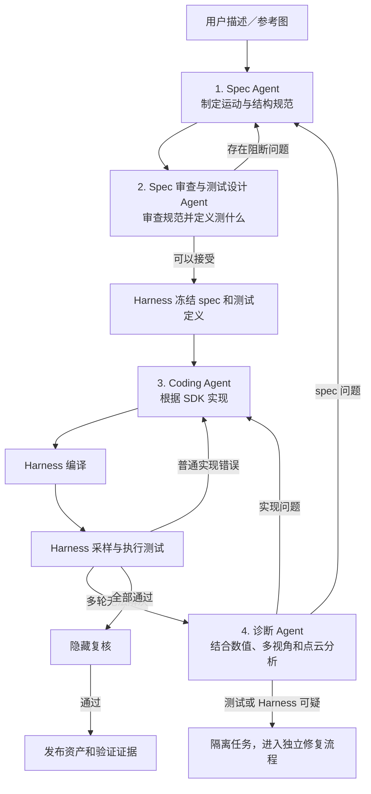

## 1. Spec Agent

相当于 Actor，负责提出和修改 spec：

- link 和 joint；
- 父子关系；
- joint 类型、轴和限位；
- 必须接触、保持连接或包含的区域；
- 禁止碰撞；
- 允许接触；
- 重力、摩擦、稳定性等要求；
- 硬性要求、推导要求、软性偏好和歧义。

它只写 spec 草案，不写代码和测试。

## 2. Spec 审查与测试设计 Agent

相当于 Critic，同时承担两个强相关任务：

1. 审查 spec 是否遗漏、冲突或不合理；
2. 把每条硬性要求转换成声明式测试定义。

例如：

```
requirement: C-017
description: 盖子在完整行程内保持与主体连接
pose_domain:
  joint: lid_hinge
  range: full
check:
  type: maximum_attachment_gap
  region_a: lid.hinge_pin
  region_b: body.hinge_socket
  tolerance_policy: default_hinge_attachment
severity: blocking
```

它定义“测什么”，但不能定义：

- 具体采多少姿态；
- 采哪些数值；
- 什么时候停止；
- 是否最终通过。

这些属于 Harness。

当以下条件满足时，可以进入冻结：

- 审查 Agent 没有阻断意见；
- 每条硬性约束至少对应一个可执行测试；
- 没有未解决的硬性歧义；
- Harness 完成格式、引用、图结构和测试模板校验。

这里的语义正确性来自审查 Agent或用户确认；Harness 只执行程序化冻结。

> Harness做一些程序上和规范上的检查工作。

## 3. Coding Agent

只读：

- 冻结 spec；
- 冻结测试定义；
- SDK；
- 编译和测试失败证据。

只写：

- 实现代码；
- 几何、joint、材料和碰撞结构。

它不能修改：

- spec；
- 测试；
- 采样策略；
- 阈值；
- 历史反例；
- 最终状态。

## 4. 诊断 Agent

只在普通修复循环无法收敛时调用。

它读取：

- 失败姿态；
- 数值测量；
- 多视角图片；
- 点云；
- 物理仿真轨迹；
- spec 和代码修改历史。

它只输出：

- 问题更可能属于 spec、实现还是测试系统；
- 判断依据；
- 建议修改；
- 置信度。

它不能直接修改任何内容，也不能宣布通过。

## 5. Harness

Harness 是唯一可信执行层，负责：

- Agent 权限和工作区隔离；
- 冻结及版本化 spec 和测试；
- 编译代码；
- 执行通用测试；
- 将声明式测试展开为具体姿态；
- 强制关键姿态和关节组合覆盖；
- 执行低差异采样和最坏姿态搜索；
- 执行连续运动碰撞检测；
- 执行 MuJoCo 物理测试；
- 保存不可删除的反例；
- 执行隐藏复核；
- 判断最终是否通过。

Harness 中由人预先实现两类内容：

- 通用验证能力，例如碰撞、间隙、接触、包含、方向、位移和物理稳定性；
- 从测试描述到具体检测过程的固定模板。

## 权限关系

| 对象         | Spec Agent | 审查/测试 Agent | Coding Agent | 诊断 Agent | Harness |
| ------------ | ---------- | --------------- | ------------ | ---------- | ------- |
| Spec 草案    | 写         | 审查            | 只读         | 只读       | 管理    |
| 冻结 Spec    | 只读       | 只读            | 只读         | 只读       | 写      |
| 测试定义     | 只读       | 写草案          | 只读         | 只读       | 冻结    |
| 实现代码     | 只读       | 不可见或只读    | 写           | 只读       | 编译    |
| 采样计划     | 无权       | 无权            | 无权         | 无权       | 写      |
| 失败证据     | 只读       | 只读            | 只读         | 只读       | 追加写  |
| 最终通过状态 | 无权       | 无权            | 无权         | 无权       | 写      |

## 最终循环

1. Spec Agent 生成 spec。
2. 审查/测试 Agent 提出意见并设计测试。
3. 两者循环，直到没有阻断问题。
4. Harness 做程序校验并冻结 spec 和测试。
5. Coding Agent 实现。
6. Harness 编译并执行通用测试和物体特有测试。
7. 普通错误直接返回 Coding Agent。
8. 多轮失败后调用诊断 Agent。
9. 实现问题返回 Coding Agent。
10. Spec 问题生成新 spec 版本，重新审查、冻结并完整重跑。
11. 测试或 Harness 可疑时隔离任务，不能在当前循环中放宽测试。
12. 公开测试通过后执行隐藏复核。
13. 只有 Harness 可以发布最终资产。

最关键的边界是：

> Spec Agent 决定物体应该满足什么；审查与测试设计 Agent 决定需要检查什么；Harness 决定怎样充分地检查；Coding Agent 只负责实现。

## 输入/输出

输入：文字

输出：

```
asset_bundle/
├── asset.urdf                 # link/joint tree、axis、limit、origin、inertial、mesh 引用
├── meshes/
│   ├── visual/                # 各 link 的视觉 mesh（OBJ / GLB / STL 等）
│   └── collision/             # 各 link 的碰撞 mesh，通常更简化
├── materials/                 # 材质、贴图（如任务需要）
└── manifest.json              # 单位、坐标系、版本、hash、文件映射
```

## Text-to-Mesh的路径

看实际效果而定。初步决定优先级从上往下：

- `CADQuery`/`Build123d`来画
- 对于复杂几何但是相对常见的link，使用现有的3D资产库
- 文生Mesh模型API
## "Grill me."（可选）
可以参考`grill-me`的skill，在输入prompt后，通过一系列问题向用户确认具体的需求和物理限制（轻量的语言模型即可）。
## DSL的接口/可动参数调整界面（可选）
留下DSL接口，让参数可视化；比如可以暴露CADQuery或者Build123d的代码界面，便于快速调试。

## 9. 技术栈、选型门槛与交付契约

### 9.1 分层责任：不要把工具层和模型层混在一起

```text
Spec / Review / Coding / Diagnosis Agents   负责规划、修改与裁决
                ↓
Harness（权限、运行、隔离、日志、重试）     负责可控执行
                ↓
建模 SDK（build123d / CadQuery / 平台 API）  负责表达和生成参数化几何
                ↓
几何内核（OCCT / 商业 CAD kernel）          负责 B-Rep、布尔与拓扑计算
                ↓
工件与交付（STEP、URDF、网格预览、tests）    负责互操作和验收
```

默认原型应选**高层参数化 SDK + OCCT 内核**：Agent 写受限的 `model.py`，SDK 生成 B-Rep，主工件保存为 STEP；关节语义以 URDF（或等价结构化 JSON）保存；GLB/USDZ/STL 只作为预览、仿真或制造的派生物，不应反过来成为唯一真源。这样既避免 Agent 直接触碰过低层的 OCCT，也不会把单纯的 viewer、CLI 或 MCP 误当成 CAD SDK。

### 9.2 选型门槛

| 条件 | 首选路径 | 方案中的含义 |
|---|---|---|
| 需要尺寸、特征与后续修改 | build123d / CadQuery → STEP | `model.py` 与参数/feature 名称是主真源 |
| 需要多个 link、joint 与模拟器 | 参数化 part + URDF + collision/limit tests | connector frame 和 joint contract 先于装配 |
| 已经在 Fusion、Onshape、FreeCAD、Rhino 工作 | 保留平台 API 作为执行后端 | Harness 仍统一 artifacts、日志与验收，不复制平台能力 |
| 从真实物体/扫描开始 | 重建模块产生 `part/joint plan` 后再交给 Harness | 不把视觉生成的 mesh 直接当作可制造 CAD |
| 只需快速视觉资产 | mesh-first 生成 + 必要的 retopo/转换 | 标注为视觉资产；若要工程编辑，必须另走 CAD 精修 |
| 需要标准件 | 先检索可追溯 STEP part，再写装配约束 | 不让 Agent 无依据重造已有零件 |

### 9.3 验证阶梯与最小交付物

每次迭代按由低到高的成本执行：

1. **语法/执行**：代码可运行、依赖和导出正常；
2. **几何**：B-Rep 合法、尺寸/体积/拓扑满足约束；
3. **装配**：connector frame 一致、无关键干涉、joint type/axis/limit 合法；
4. **运动与仿真**：关键状态可达、碰撞与稳定性可接受；
5. **视觉与任务审查**：render/motion sequence 与 Spec 一致，必要时交 VLM 或人工复核。

一个成功 run 至少交付：版本化 `model.py`、参数化 STEP、URDF/关节计划、预览网格或渲染、测试报告、失败与修复 trace。这样生成的数据可用于复现、检索、后训练和人工接手，而不只是一次性导出的模型文件。
