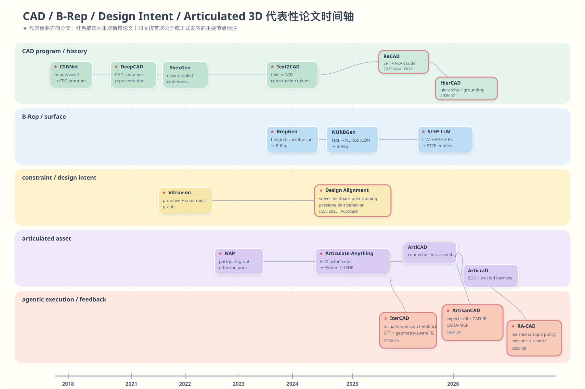

# 文生 CAD、曲面生成与 Articulated Object：统一时间轴与研究方向对比

> 整理日期：2026-08-20
> 资料范围：`3DItemGeneration` 文件夹中的文生 CAD、articulated object、CAD Agent/SDK，以及《曲面生成相关论文调研.md》。  
> 研究对象：静态 CAD、曲面/mesh 几何、articulated object 三条相关但不同的目标路线；Flow Matching、diffusion、LLM/agent 等仅作为跨路线方法标记。

---

## 1. 结论先行

这批工作的总体演化可以概括为：

```text
形状表示学习
    → CAD history / CSG / sketch-extrude
    → B-Rep / NURBS / 显式曲面生成
    → 文本、图像、点云条件生成
    → 可执行 CAD/URDF 程序
    → Agent + Kernel/Simulator + Hard Validation
```

当前最有可能成为主线的方向不是“更大的模型直接生成一个 mesh”，而是：

> **结构化、可执行、可验证的 3D 生成：语言/图像/点云 → typed program/schema → CAD/URDF kernel → 几何/运动/物理验证 → 局部修复。**

曲面生成在这个体系中的最佳位置，是一个高保真几何模块；它负责 NURBS、B-Rep faces、implicit surface 或 mesh 的表达与生成，但不应该独自承担设计意图、装配关系和运动学语义。

对于你的 articulated CAD 方向，最值得押注的组合是：

```text
Spec / Connector / Joint Schema
          ↓
Part Geometry Generator
  (Build123d / CadQuery / NURBS / B-Rep / mesh)
          ↓
Assembly + URDF
          ↓
CAD kernel / collision / motion / physics harness
          ↓
Agent diagnosis + local repair
```

### 1.1 代表性论文与技术分支时间轴

下图只保留会改变研究问题或系统形态的关键节点；它不是完整论文清单。红色描边标出本次新增的 Design Alignment、ReCAD、IterCAD、ArtisanCAD、HierCAD 与 RA-CAD。



*可编辑矢量源：[representative_paper_timeline_macaron.svg](../../attachments/3DItemGeneration/representative_paper_timeline_macaron.svg)。*

---

## 2. 文档口径与引用量说明

### 2.1 三条对象主线 + 一条横切子线

| 主线 | 典型输出 | 解决的问题 | 是否等同于 articulated object |
|---|---|---|---|
| 静态/非 articulated CAD | CSG、sketch-extrude、CAD history、B-Rep、STEP、Build123d/CadQuery | 生成一个静态、可编辑或可制造的 CAD 实体 | 否 |
| 曲面/mesh 几何生成 | SDF、显式 surface、B-spline、NURBS、B-Rep face、mesh、PBR asset | 表达或生成复杂、光滑、非规则的几何表面与静态视觉资产 | 否；它是几何表示/生成能力 |
| Articulated object | part/link、parent-child、joint type、axis、origin、limit、URDF | 生成可以运动、装配、仿真的对象 | 是 |
| **Constraint / design-intent（横切子线）** | sketch primitives、constraints、dimensions、feature dependency、editable parameters | 让参数修改后仍保持预期关系；决定“可编辑”是否真实成立 | 否；它横切 static CAD program/history，并可扩展到 articulated connector/joint contract |

### 2.2 时间和引用量口径

- 年份优先使用首次公开年份；正式会议年份不同的论文写成 `预印本/正式发表`。
- 三张主线论文表中的“发表（若有）”遵循**正式会议/期刊优先**：若当次核验未找到正式发表版本，才标 `arXiv（预印本）`；这不等同于“永远未接收”。
- 引用量是 2026-08-19 附近的公开索引快照，不同数据库会有显著差异；2026-08-20 新增论文未重新估算引用量，以“未重计/未稳定收录”标注。
- `≈` 表示近似值；`区间` 表示不同来源对同一论文的差异；`0/未稳定收录` 表示论文很新或没有可靠的学术索引记录。
- 旧论文引用量高，不能直接说明它比 2025/2026 年论文更适合当前任务；应同时看引用速度、输出表示和下游可用性。
- 作者机构按论文首页/项目页的 affiliation 集合归并，不重复列出每位作者的编号对应关系。论文标题均链接到论文、项目页或官方出版页面。

---

## 3. 主线 A：静态/非 articulated CAD 时间轴

| 时间 | 论文 | 发表（若有） | 作者机构 | 输入 → 输出 | 方法与表示 | 引用量快照 |
|---|---|---|---|---|---|---:|
| 2018 | [CSGNet](https://openaccess.thecvf.com/content_cvpr_2018/html/Sharma_CSGNet_Neural_Shape_CVPR_2018_paper.html) | CVPR 2018 | UMass Amherst | 图像/体素 → CSG program | CNN+RNN 自回归预测 primitive 与 Boolean 操作 | ≈217 |
| 2020 | [UCSG-Net](https://ucsgnet.github.io/) | NeurIPS 2020 | Wrocław University of Science and Technology、Tooploox | raster/voxel → CSG tree | 无监督、可微 CSG reconstruction | ≈101 |
| 2020 | [Sketch2CAD](https://geometry.cs.ucl.ac.uk/projects/2020/sketch2cad/) | ACM TOG / SIGGRAPH Asia 2020 | UCL、Microsoft Research Asia、Inria、Adobe Research | 草图/局部 CAD → CAD operation | 交互式草图识别、参数拟合、CAD 执行 | ≈65 |
| 2021 | [DeepCAD](https://www.cs.columbia.edu/cg/deepcad/) | ICCV 2021 | Columbia University | CAD sequence → latent/sequence | Transformer 表示 CAD construction sequence；发布大规模 CAD 数据集 | ≈262；部分索引约371 |
| 2022 | [Vitruvion](https://lips.cs.princeton.edu/vitruvion/) | ICLR 2022 | Princeton University | 草图/图像 → 参数化 2D sketch | primitive + geometric constraint graph + CAD solver | ≈69 |
| 2022 | [SkexGen](https://samxuxiang.github.io/skexgen/) | ICML 2022 | Simon Fraser University、Autodesk Research | codebooks → sketch-extrude sequence | topology、geometry、extrusion 解耦 codebook | ≈41 |
| 2023 | [SolidGen](https://www.research.autodesk.com/publications/solidgen/) | TMLR 2023 | Autodesk Research、University of Toronto、Vector Institute | noise/class/image/voxel → B-Rep | 分阶段自回归生成 vertices、edges、faces | 约26–109 |
| 2023 | [SECAD-Net](https://openaccess.thecvf.com/content/CVPR2023/html/Li_SECAD-Net_Self-Supervised_CAD_Reconstruction_by_Learning_Sketch-Extrude_Operations_CVPR2023_paper.html) | CVPR 2023 | 中国科学院自动化所、University of Chinese Academy of Sciences | occupancy/voxel → sketch-extrude | 不依赖 CAD history 标注的自监督重建 | ≈59；部分索引约96 |
| 2024 | [BrepGen](https://www.research.autodesk.com/publications/brepgen/) | ACM TOG / SIGGRAPH 2024 | Autodesk Research、Simon Fraser University | noise/partial B-Rep → watertight B-Rep | structured latent tree + hierarchical diffusion；包含 NURBS/Bezier 等面 | 约64–150 |
| 2024 | [TransCAD](https://cvi2snt.github.io/transcad/) | ECCV 2024 | University of Luxembourg、Artec 3D | point cloud → loop-extrusion sequence | hierarchical Transformer + loop refiner；点云逆向 CAD | ≈16 |
| 2024 | [Text2CAD](https://sadilkhan.github.io/text2cad-project/) | NeurIPS 2024 Spotlight | DFKI、RPTU、MindGarage、BITS Pilani | text → CAD command sequence | BERT + autoregressive Transformer；文本条件 CAD history | 约2–30 |
| 2025 | [Aligning Constraint Generation with Design Intent](https://www.research.autodesk.com/publications/aligning-constraint-generation-design-intent-parametric-cad/) | ICCV 2025 | Autodesk Research | unconstrained 2D sketch → constraints/dimensions | constraint solver feedback + alignment post-training；以 edit behavior 定义 design intent | —（本次未重计） |
| 2025/26 | [B-repLer](https://yilinliu77.github.io/brepler.github.io/) | SIGGRAPH 2026 | UCL、University of Edinburgh、Adobe Research | source B-Rep + text → edited B-Rep | mLLM/Transformer 规划 edit latent，Flow Matching 生成编辑后 B-Rep；**生成式编辑** | 0/未稳定收录 |
| 2025/26 | [NURBGen](https://arxiv.org/abs/2511.06194) | AAAI 2026 | DFKI、RPTU、MindGauge | text → NURBS/analytic JSON → B-Rep | Qwen3-4B LoRA；面级 NURBS 与 analytic primitive 混合表示 | 0/未稳定收录 |
| 2025/26 | [ReCAD](https://ojs.aaai.org/index.php/AAAI/article/view/37544) | AAAI 2026 | Fudan University | text/image → parameterized CAD code | hierarchical primitives + SFT + GRPO/RLVR；几何与语义联合 reward | —（本次未重计） |
| 2026 | [STEP-LLM](https://arxiv.org/abs/2601.12641) | DATE 2026 | Northwestern University | text → STEP entities | DFS reserialization、RAG-SFT、GRPO；直接生成工业交换格式 | 0 |
| 2026 | [Flatten The Complex](https://arxiv.org/abs/2601.17733) | SIGGRAPH 2026 | Nanjing University | noise/image/point cloud → B-Rep | k-cell particles + Rectified Flow Transformer 联合生成拓扑与几何 | 0/未稳定收录 |
| 2026 | [CADSmith](https://arxiv.org/abs/2603.26512) | arXiv 2026（预印本） | Carnegie Mellon University | text → CadQuery → CAD solid | Planner/Coder/Executor/Validator/Refiner；OpenCASCADE 几何验证 | 0 |
| 2026-06 | [IterCAD](https://arxiv.org/abs/2606.13368) | arXiv 2026（预印本） | 多机构联合团队（见论文首页） | drawing/text/source code + edit → multi-turn CadQuery | OCCT sandbox、visual/dimension feedback、geometry-aware RL、CD-TR | 0/未稳定收录 |
| 2026 | [Arko-T](https://arxiv.org/abs/2606.30429) | arXiv 2026（technical report） | BitInf、Wuhan University、Nanjing Tech | text → Build123d program → solid | 结构化 design state、执行过滤、参数化 construction intent | 0 |
| 2026 | [DualBrep](https://arxiv.org/abs/2606.31579) | SIGGRAPH 2026 | Autodesk Research | point cloud/image/noise → watertight B-Rep / STEP | SDF+UDF dual fields 的 latent Flow Matching；neural rebuilder 显式化 B-Rep | 0/未稳定收录 |
| 2026-07 | [ArtisanCAD](https://arxiv.org/abs/2607.05750) | arXiv 2026（预印本） | 多机构联合团队（见论文首页） | variant request + expert skill → CATIA-native B-Rep | expert skill distillation + CAD-IR + CATIA-MCP + multi-view rewrite | 0/未稳定收录 |
| 2026-07 | [HierCAD](https://arxiv.org/abs/2607.11339) | arXiv 2026（预印本） | 多机构联合团队（见论文首页） | text → hierarchical CAD sequence | part/face/loop reasoning + Structure Alignment and Parameter Grounding | 0/未稳定收录 |
| 2026-08 | [RA-CAD](https://arxiv.org/abs/2608.05714) | arXiv 2026（预印本） | 多机构联合团队（见论文首页） | text → code ↔ execution critique/rewrite | learned post-execution critique + trajectory-level GRPO | 0/未稳定收录 |

### 3.1 这条线的阶段性变化

#### 2018–2022：学习“可解释的形状程序”

CSGNet、UCSG-Net、Sketch2CAD、DeepCAD、Vitruvion 和 SkexGen 的共同问题是：

> 怎样将几何压缩成 primitive、Boolean、sketch、constraint 或 CAD construction sequence？

此时还没有真正成熟的文生 CAD，重点是表示学习、程序恢复和设计意图保留。

#### 2023–2024：直接进入工业 CAD 表示

SolidGen、SECAD-Net、BrepGen、TransCAD 和 Text2CAD 分别从 B-Rep、sketch-extrude、点云和语言条件切入。路线开始分成两种：

- **History-first**：生成 sketch、extrude、Boolean 等设计步骤，便于编辑和回放。
- **B-Rep-first**：直接生成 vertices、edges、faces 或曲面，几何表达更自由，但设计意图更弱。

#### 2025–2026：从“生成 CAD”变成“对齐、执行、批评并复用 CAD 程序”

NURBGen、STEP-LLM、Arko-T 继续扩展表示与程序能力；Design Alignment、ReCAD、CADSmith、IterCAD、ArtisanCAD、HierCAD 与 RA-CAD 又把问题推进到监督、反馈和工业知识层：

- NURBGen：面级 NURBS 表示；
- STEP-LLM：工业实体图与 STEP reference；
- Arko-T：通用参数化 Build123d program；
- Design Alignment：constraint solver feedback 对齐编辑行为；
- ReCAD：以 verifiable geometry/semantic reward 做 CAD RLVR；
- HierCAD：先对齐 construction topology，再 ground 数值参数；
- CADSmith / IterCAD / RA-CAD：从外部验证、多模态 sandbox 到可学习 critique policy；
- ArtisanCAD：把专家 feature history、macro 与 verification rules 蒸馏为可执行 CAD-IR skill。

这说明 static CAD 的竞争重点正在从“token vocabulary 设计”转向“结构监督、design intent、执行反馈、专家知识复用和可定位修复”。

---

## 4. 主线 B：Articulated object 时间轴

| 时间 | 论文 | 发表（若有） | 作者机构 | 输入 → 输出 | 方法与表示 | 引用量快照 |
|---|---|---|---|---|---|---:|
| 2023 | [NAP](https://proceedings.neurips.cc/paper_files/paper/2023/file/655846cc914cb7ff977a1ada40866441-Paper-Conference.pdf) | NeurIPS 2023 | University of Pennsylvania、Stanford University、Archimedes/Athena RC | graph/noise → articulated object | articulation graph/tree diffusion；联合生成 geometry 与 motion structure | ≈40 |
| 2024/25 | [Articulate-Anything](https://articulate-anything.github.io/) | ICLR 2025 | University of Pennsylvania | text/image/video → Python/URDF | mesh retrieval + link placement + joint prediction；VLM actor–critic | 0/未稳定收录 |
| 2024/25 | [ArtFormer](https://openaccess.thecvf.com/content/CVPR2025/papers/Su_ArtFormer_Controllable_Generation_of_Diverse_3D_Articulated_Objects_CVPR2025_paper.pdf) | CVPR 2025 | Xiamen University Malaysia、Renmin University、Tsinghua University、SUSTech、University of Minnesota | text/image → part tree + mesh | tree tokens + geometry latent + joint relation；Transformer+SDF prior | ≈4；部分索引约18 |
| 2025 | [ATOP](https://aditya-vora.github.io/atop/) | arXiv 2025（预印本） | Simon Fraser University、ShanghaiTech University | static segmented mesh + motion text → motion parameters | motion personalization + multi-view generation + differentiable rendering | 0 |
| 2025 | [FreeArt3D](https://czzzzh.github.io/FreeArt3D/) | SIGGRAPH Asia 2025 | UC San Diego、Hillbot | multi-state sparse RGB → textured articulated mesh | occupancy hash grids + frozen TRELLIS + per-instance optimization | ≈13，RG 快照 |
| 2025 | [URDF-Anything](https://proceedings.neurips.cc/paper_files/paper/2025/hash/88445acb45c922bdb06952e31f8a60ec-Abstract-Conference.html) | NeurIPS 2025 | Peking University、University of Washington | point cloud+text → segmentation + URDF | 3D MLLM 自回归生成 link-joint JSON；`[SEG]` token 得到 part masks | 0/未稳定收录 |
| 2025 | [ArtiWorld](https://arxiv.org/abs/2511.12977) | arXiv 2025（预印本） | SUSTech、SII、ETH Zürich、Spatialtemporal AI 等 | scene + rigid assets → articulated scene | scene selector + point-cloud Arti4URDF + URDF reinsertion；场景级工作 | 0 |
| 2025 | [ArticFlow](https://arxiv.org/abs/2511.17883) | arXiv 2025（预印本） | Columbia University / Creative Machines Lab | action+noise → mechanism point sets、形态与动作响应 | 两阶段 Flow Matching：latent flow 生成 shape prior，point flow 生成 action-conditioned points | 0/未稳定收录 |
| 2025/26 | [SPARK](https://openaccess.thecvf.com/content/CVPR2026/papers/He_SPARK_Sim-ready_Part-level_Articulated_Reconstruction_with_VLM_Knowledge_CVPR_2026_paper.pdf) | **CVPR 2026 Oral** | UCLA、USC、University of Utah | single RGB → part meshes + URDF | VLM 提供 part/joint guidance；Rectified Flow 共同生成 part mesh latents；FK/render refine | 0/未稳定收录 |
| 2026 | [ArtLLM](https://authoritywang.github.io/artllm/) | CVPR 2026 | ShanghaiTech University、Tencent Hunyuan、HKUST | point cloud → articulation blueprint → mesh | 3D LLM 预测 part/joint layout，再由 XPart 生成部件几何 | 0 |
| 2026 | [LAM](https://openaccess.thecvf.com/content/CVPR2026/html/Gao_LAM_Language_Articulated_Object_Modelers_CVPR_2026_paper.html) | CVPR 2026 | University of Southern California | text → link hierarchy + geometry/joint code | Link Designer、Geometry/Articulation Coder、VLM Checker/Fixer | 0 |
| 2026 | [ArtiCAD](https://arxiv.org/abs/2604.10992) | arXiv 2026（预印本） | Beihang University、Zhejiang University、University of Hong Kong | text/image → FreeCAD parts + typed joints + URDF | Design/Generation/Assembly/Review agents；Connector contract | 0 |
| 2026 | [Articraft](https://arxiv.org/abs/2605.15187) | arXiv 2026（预印本） | University of Cambridge、University of Oxford、NTU Singapore | text/image → model.py + mesh/URDF/tests | 受限 SDK + compile/probe/test harness + LLM repair | 0 |

### 4.1 这条线的阶段性变化

#### 2023：先学习 articulated object prior

NAP 的重要性不在于文生，而在于首次较系统地将 articulated object 表示成：

```text
part geometry nodes + joint kinematic edges
```

它证明几何和运动结构应该联合建模，而不能先生成静态物体、再事后猜关节。

#### 2024–2025：引入视觉语言和真实观测

Articulate-Anything、ArtFormer、ATOP、FreeArt3D、URDF-Anything 分别探索：

- text/image/video 作为运动和功能语义；
- part tree 作为生成序列；
- multi-view motion 作为关节证据；
- point cloud 作为几何和分割证据；
- URDF 作为最终仿真接口。

#### 2026：Agentic CAD 和可验证程序成为主线

LAM、ArtiCAD、Articraft 的共同趋势是：

> 不再只预测一个 mesh，而是生成一个可以被执行、检查、修复的程序系统。

其中三者的重点不同：

| 工作 | 主要反馈 | 优势 | 局限 |
|---|---|---|---|
| LAM | render、motion sequence、VLM critique | 文本到 geometry+articulation 的统一生成 | 视觉检查仍可能不够精确 |
| ArtiCAD | connector/frame、局部渲染、装配审查、rollback | 先规划装配关系，再生成零件 | 多 agent 流程复杂，验证粒度仍需工程化 |
| Articraft | compile、geometry probe、object-specific tests | 受限 SDK、低成本、容易批量生成 | 视觉反馈较弱，复杂自由曲面能力受 SDK 限制 |

---

## 5. 主线 C：曲面 / mesh 几何与自由曲面时间轴

这里的“曲面 / mesh 几何生成”不能简单等同于 CAD 生成。它覆盖四类问题：

1. **显式曲面生成**：直接生成 mesh、surface、B-spline 或 NURBS。
2. **隐式曲面生成**：用 SDF、occupancy 或 neural field 表达连续形状。
3. **曲面 CAD 重建**：从点云、图像或 B-Rep 恢复曲面及其拓扑。
4. **静态 mesh/PBR 资产生成**：生成视觉几何与材质，但通常不保留 CAD design intent。

| 时间 | 论文 | 发表（若有） | 作者机构 | 输入 → 输出 | 曲面路线 | 引用量快照 |
|---|---|---|---|---|---|---:|
| 2017 | [SurfNet](https://arxiv.org/abs/1703.04079) | CVPR 2017 | MIT、IIT Kanpur、UT Austin、Purdue | 3D shape → surface | 早期显式曲面生成 | 188 |
| 2019 | [DeepSDF](https://arxiv.org/abs/1901.05103) | CVPR 2019 | University of Washington、MIT、Facebook Reality Labs | shape → continuous SDF | 隐式连续曲面表示的奠基工作 | ≈4711 |
| 2020 | [ParSeNet](https://arxiv.org/abs/2003.12181) | CVPR 2020 | UMass Amherst、Adobe、IIT Bombay | point cloud → parametric surface | 平面、圆柱、B-spline 等参数面拟合 | 211 |
| 2021 | [Neural Splines](https://arxiv.org/abs/2006.13782) | CVPR 2021 | NYU/Courant、Amazon | point cloud → spline surface | 神经网络与样条曲面拟合结合 | 79 |
| 2021 | [NURBS-Diff](https://arxiv.org/abs/2104.14547) | *Computer-Aided Design* 2022 | Iowa State University 等 | NURBS → differentiable surface module | 为学习式 NURBS 优化提供可微模块 | 38 |
| 2022 | [ComplexGen](https://arxiv.org/abs/2205.14573) | ACM TOG / SIGGRAPH 2022 | Microsoft Research Asia、Tsinghua University、USTC | point cloud → B-Rep chain complex | 恢复边、面与拓扑链复形 | ≈102 |
| 2021/22 | [SurfGen](https://arxiv.org/abs/2201.00112) | ICCV 2021（arXiv 2022） | Carnegie Mellon University | noise → surface | 显式曲面判别器的对抗生成 | 37 |
| 2023 | [SolidGen](https://arxiv.org/abs/2203.13944) | TMLR 2023 | Autodesk Research、University of Toronto、Vector Institute | noise/image/voxel → B-Rep | B-Rep 面可包含参数曲面 | 约26–109 |
| 2024 | [Surf-D](https://arxiv.org/abs/2311.17050) | ECCV 2024 | Texas A&M、HKU、HKUST、MPI Informatics 等 | noise/text? → surface | 任意拓扑的曲面扩散生成 | 11 |
| 2024 | [BrepGen](https://arxiv.org/abs/2401.15563) | ACM TOG / SIGGRAPH 2024 | Simon Fraser University、Autodesk Research | noise/partial B-Rep → B-Rep | hierarchical diffusion；支持 plane/cylinder/cone/sphere/torus/Bezier/NURBS | 约64–150 |
| 2024 | [Point2CAD](https://arxiv.org/abs/2312.04962) | CVPR 2024 Spotlight | ETH Zürich | point cloud → B-Rep/CAD | 点云逆向工程，恢复带参数曲面的模型 | 51 |
| 2024/25 | [GenCAD](https://arxiv.org/abs/2409.16294) | TMLR 2025 | MIT Mechanical Engineering | image → CAD commands | 图像条件 CAD 程序，可表达扫掠、圆角等曲面特征 | 42 |
| 2024 | [Img2CAD](https://arxiv.org/abs/2410.03417) | arXiv 2024（预印本） | Zhejiang University、Huzhou University、SUTD 等 | image → 3D CAD | 结构化视觉几何与曲面 CAD 重建 | 42 |
| 2024 | [Text2CAD](https://arxiv.org/abs/2409.17106) | NeurIPS 2024 Spotlight | DFKI、RPTU、MindGauge、BITS Pilani | text → CAD commands | 以 sketch/extrude 为主，但可间接生成曲面特征 | 约2–30 |
| 2024 | [NeuroNURBS](https://arxiv.org/abs/2411.10848) | arXiv 2024（预印本） | BMW Group、LIACS Leiden University | B-Rep → NURBS representation | 专门学习 NURBS 曲面表示 | 9 |
| 2025 | [CADDreamer](https://arxiv.org/abs/2502.20732) | CVPR 2025 | UT Dallas、HKU、HKUST、Nanjing University、ByteDance、Texas A&M | single image → CAD/B-Rep | 单视图曲面 CAD 重建 | 28 |
| 2025 | [HoLa](https://arxiv.org/abs/2504.14257) | ACM TOG / SIGGRAPH 2025 | Shenzhen University、Simon Fraser University、Tel Aviv University 等 | text/image/point/sketch → B-Rep | holistic latent representation + diffusion | 45 |
| 2025 | [DTGBrepGen](https://arxiv.org/abs/2503.13110) | CVPR 2025 | USTC | noise → B-Rep | 拓扑与几何解耦生成 | 26 |
| 2025 | [BrepGPT](https://arxiv.org/abs/2511.22171) | arXiv 2025（预印本） | CAS/MAIS、UCAS、KAUST | noise → B-Rep | Voronoi half-patch 自回归 B-Rep | 16 |
| 2025 | [AutoBrep](https://arxiv.org/abs/2512.03018) | arXiv 2025（预印本） | Autodesk Research 等 | noise → B-Rep | 统一拓扑与几何的自回归生成 | 19 |
| 2025/26 | [CAD-Tokenizer](https://arxiv.org/abs/2509.21150) | ICLR 2026 | University of Toronto、MSRA、Fudan University | text → CAD tokens | 面向 CAD/曲面特征的 modality-specific tokenizer | 2 |
| 2025 | [TripoSG](https://arxiv.org/abs/2502.06608) | arXiv 2025（预印本） | Tripo / VAST AI Research | image（或 scribble+text）→ mesh | SDF-VAE latent 上的大规模 Rectified Flow Transformer；高保真通用 shape prior | ≈39 |
| 2025/26 | [TRELLIS.2](https://arxiv.org/abs/2512.14692) | CVPR 2026 | Tsinghua University、Microsoft Research、USTC、Microsoft AI | image → PBR-textured 3D asset | O-Voxel + compact VAE + 4B Conditional Flow Matching；支持任意拓扑与材料 | ≈3 |
| 2025/26 | [B-repLer](https://yilinliu77.github.io/brepler.github.io/) | SIGGRAPH 2026 | UCL、University of Edinburgh、Adobe Research | source B-Rep + text → edited B-Rep | Flow Matching 的 B-Rep latent 编辑；自由曲面 CAD 的生成式编辑 | 0/未稳定收录 |
| 2026 | [BrepGaussian](https://arxiv.org/abs/2602.21105) | arXiv 2026（预印本） | Nanjing University 等 | multi-view → CAD | Gaussian Splatting + B-Rep 曲面重建 | 0 |
| 2026 | [Flatten The Complex](https://arxiv.org/abs/2601.17733) | SIGGRAPH 2026 | Nanjing University | noise/image/point cloud → B-Rep | compositional k-cell particles + Rectified Flow；统一 vertices/edges/faces | 0/未稳定收录 |
| 2026 | [FutureCAD](https://arxiv.org/abs/2603.11831) | arXiv 2026（预印本） | Fudan University、Shanghai Jiao Tong University | text → CAD program + B-Rep primitive | LLM 程序生成与 B-Rep primitive grounding | 7 |
| 2026 | [Zero-to-CAD](https://arxiv.org/abs/2604.24479) | arXiv 2026（预印本） | Autodesk Research | text/image → CAD program | agentic 程序合成，覆盖丰富 CAD 操作 | 4 |
| 2026 | [DualBrep](https://arxiv.org/abs/2606.31579) | SIGGRAPH 2026 | Autodesk Research | point cloud/image/noise → watertight B-Rep / STEP | dual SDF/UDF fields + latent Flow Matching；neural rebuilder 还原自由曲面和拓扑 | 0/未稳定收录 |

### 5.1 曲面路线的阶段性变化

#### 2017–2021：曲面是表示问题

SurfNet、DeepSDF、ParSeNet、Neural Splines 和 NURBS-Diff 主要解决：

- 怎样表达连续曲面；
- 怎样从点云拟合参数面；
- 怎样让 NURBS/SDF 可以被神经网络优化；
- 怎样处理不规则、非 watertight 或任意拓扑的形状。

这阶段的成果通常不包含完整 CAD history、manufacturing intent 或 assembly semantics。

#### 2022–2024：曲面进入 B-Rep 和逆向 CAD

ComplexGen、Point2CAD、SolidGen、BrepGen、GenCAD、Img2CAD 和 Text2CAD 开始将曲面放进 CAD 实体结构中。研究重点变成：

```text
surface geometry + topology + entity references + CAD operation
```

这是曲面生成与 CAD 生成真正发生交叉的阶段。

#### 2025–2026：多模态曲面重建和程序生成并行发展

HoLa、DTGBrepGen、BrepGPT、AutoBrep、BrepGaussian、FutureCAD 和 Zero-to-CAD 展现出两种方向：

- **geometry-first**：继续提高 B-Rep、NURBS 和复杂曲面的保真度；
- **program-first**：让 LLM 先生成可解释程序，再通过 kernel 得到曲面实体。

后者更接近工程系统，前者更接近高保真几何生成器。未来更可能是二者组合，而不是二选一。

---

## 6. 统一总时间轴：所有物体生成工作放在同一条轴上

这张表不按学科分栏。每一行只问：**这一年，模型在生成哪一种“物体”，用什么表示，偏好什么生成范式？** 为便于横向阅读，正式会议/期刊或预印本状态也直接列在本表。

对象/表示标签：`[S]` 曲面/shape，`[C]` CAD history/program，`[B]` B-Rep/NURBS，`[A]` articulated，`[M]` mesh/PBR asset，`[E]` 编辑，`[2D]` 2D 上游子问题。方法标签：`[FM]` Flow Matching；它可以叠加在上述任何对象类型上，**不是第四条对象生成路线**。

| 时间 | 工作 | 发表（若有） | 物体输入 → 输出 | 该工作代表的生成偏好 |
|---|---|---|---|---|
| 2017 | [SurfNet](https://arxiv.org/abs/1703.04079) `[S]` | CVPR 2017 | 3D shape → surface | 直接学习显式表面 |
| 2018 | [CSGNet](https://openaccess.thecvf.com/content_cvpr_2018/html/Sharma_CSGNet_Neural_Shape_CVPR_2018_paper.html) `[C]` | CVPR 2018 | image/voxel → CSG program | 用可解释 Boolean 程序表示物体 |
| 2019 | [DeepSDF](https://arxiv.org/abs/1901.05103) `[S]` | CVPR 2019 | shape → continuous SDF | 连续隐式场优先于显式面 |
| 2020 | [ParSeNet](https://arxiv.org/abs/2003.12181) `[S][B]` | CVPR 2020 | point cloud → parametric surfaces | 点云拟合 analytic/B-spline 曲面 |
| 2020 | [UCSG-Net](https://ucsgnet.github.io/) `[C]` | NeurIPS 2020 | raster/voxel → CSG tree | 无监督地恢复构造程序 |
| 2020 | [Sketch2CAD](https://geometry.cs.ucl.ac.uk/projects/2020/sketch2cad/) `[C]` | ACM TOG / SIGGRAPH Asia 2020 | sketch/partial CAD → CAD operation | 人在环的 feature-level CAD 编辑 |
| 2021 | [Neural Splines](https://arxiv.org/abs/2006.13782) `[S]` | CVPR 2021 | point cloud → spline surface | 神经样条曲面拟合 |
| 2021 | [NURBS-Diff](https://arxiv.org/abs/2104.14547) `[S]` | *Computer-Aided Design* 2022 | NURBS → differentiable module | 让 NURBS 成为可学习的几何部件 |
| 2021 | [DeepCAD](https://www.cs.columbia.edu/cg/deepcad/) `[C]` | ICCV 2021 | CAD sequence ↔ latent | 大规模 CAD history representation learning |
| 2022 | [ComplexGen](https://arxiv.org/abs/2205.14573) `[B]` | ACM TOG / SIGGRAPH 2022 | point cloud → B-Rep chain complex | 同时恢复面、边和拓扑 |
| 2022 | [SurfGen](https://arxiv.org/abs/2201.00112) `[S]` | ICCV 2021（arXiv 2022） | noise → surface | 显式曲面质量的对抗生成 |
| 2022 | [Vitruvion](https://lips.cs.princeton.edu/vitruvion/) `[2D][C]` | ICLR 2022 | image/sketch → primitives + constraints | 把设计意图保留为约束图 |
| 2022 | [SkexGen](https://samxuxiang.github.io/skexgen/) `[C]` | ICML 2022 | codebooks → sketch-extrude | 解耦 topology、geometry、extrusion |
| 2023 | [SolidGen](https://arxiv.org/abs/2203.13944) `[B]` | TMLR 2023 | noise/image/voxel → B-Rep | 直接自回归实体图，不依赖 history |
| 2023 | [SECAD-Net](https://openaccess.thecvf.com/content/CVPR2023/html/Li_SECAD-Net_Self-Supervised_CAD_Reconstruction_by_Learning_Sketch-Extrude_Operations_CVPR2023_paper.html) `[C]` | CVPR 2023 | occupancy → sketch-extrude | 不用 CAD 标注的自监督 feature 恢复 |
| 2023 | [NAP](https://proceedings.neurips.cc/paper_files/paper/2023/file/655846cc914cb7ff977a1ada40866441-Paper-Conference.pdf) `[A]` | NeurIPS 2023 | noise/partial graph → parts+joints | 几何与运动学共同作为图先验生成 |
| 2024 | [Surf-D](https://arxiv.org/abs/2311.17050) `[S]` | ECCV 2024 | noise → arbitrary-topology surface | diffusion 直接生成复杂表面 |
| 2024 | [BrepGen](https://arxiv.org/abs/2401.15563) `[B]` | ACM TOG / SIGGRAPH 2024 | noise/partial B-Rep → B-Rep | hierarchy diffusion 生成 CAD topology+surfaces |
| 2024 | [Point2CAD](https://arxiv.org/abs/2312.04962) `[B]` | CVPR 2024 Spotlight | point cloud → CAD B-Rep | 真实扫描的逆向工程 |
| 2024 | [GenCAD](https://arxiv.org/abs/2409.16294) `[C]` | TMLR 2025 | image → CAD commands | 视觉条件的可执行 history |
| 2024 | [Img2CAD](https://arxiv.org/abs/2410.03417) `[C][B]` | arXiv 2024（预印本） | image → CAD | 结构化视觉几何到 CAD |
| 2024 | [Text2CAD](https://arxiv.org/abs/2409.17106) `[C]` | NeurIPS 2024 Spotlight | text → CAD commands | 语言成为 CAD history 条件 |
| 2024 | [NeuroNURBS](https://arxiv.org/abs/2411.10848) `[S][B]` | arXiv 2024（预印本） | B-Rep → NURBS representation | 原生 NURBS 曲面表示学习 |
| 2024/25 | [Articulate-Anything](https://articulate-anything.github.io/) `[A]` | ICLR 2025 | text/image/video → Python/URDF | VLM actor–critic + retrieval articulation |
| 2024/25 | [ArtFormer](https://arxiv.org/abs/2412.07237) `[A]` | CVPR 2025 | text/image → part tree + mesh | Transformer 生成 geometry latent 与 joint tree |
| 2024 | [TransCAD](https://arxiv.org/abs/2407.12702) `[C]` | ECCV 2024 | point cloud → loop-extrusion | 单阶段点云到 CAD history |
| 2025 | [TripoSG](https://arxiv.org/abs/2502.06608) `[M][S][FM]` | arXiv 2025（预印本） | image / scribble+text → mesh | 大模型 Rectified Flow 生成高保真形状 |
| 2025 | [ATOP](https://arxiv.org/abs/2502.07278) `[A]` | arXiv 2025（预印本） | segmented mesh + motion text → joint motion | 用多视图 motion evidence 把静态部件变可动 |
| 2025 | [CADDreamer](https://arxiv.org/abs/2502.20732) `[B]` | CVPR 2025 | single image → CAD/B-Rep | 单视图到可编辑曲面 CAD |
| 2025 | [DTGBrepGen](https://arxiv.org/abs/2503.13110) `[B]` | CVPR 2025 | noise → B-Rep | 拓扑和几何解耦 |
| 2025 | [HoLa](https://arxiv.org/abs/2504.14257) `[B]` | ACM TOG / SIGGRAPH 2025 | text/image/point/sketch → B-Rep | 多模态 condition + holistic latent |
| 2025 | [Design Alignment](https://arxiv.org/abs/2504.13178) `[2D][C]` | ICCV 2025 | unconstrained sketch → aligned constraints | constraint solver feedback 让编辑保持 design intent |
| 2025 | [FreeArt3D](https://czzzzh.github.io/FreeArt3D/) `[A][M]` | SIGGRAPH Asia 2025 | multi-state RGB → textured articulated mesh | 预训练 3D prior + per-instance joint optimization |
| 2025 | [CAD-Tokenizer](https://arxiv.org/abs/2509.21150) `[C]` | ICLR 2026 | text → CAD tokens | 为 CAD 设计专用语言单元 |
| 2025 | [NURBGen](https://arxiv.org/abs/2511.06194) `[B][C]` | AAAI 2026 | text → NURBS JSON → B-Rep | LLM 直接生成高保真曲面参数 |
| 2025 | [URDF-Anything](https://arxiv.org/abs/2511.00940) `[A]` | NeurIPS 2025 | point cloud+text → part masks + URDF | 3D MLLM 把观察转成运动学结构 |
| 2025 | [ArtiWorld](https://arxiv.org/abs/2511.12977) `[A]` | arXiv 2025（预印本） | scene/rigid assets → articulated assets/scene | 场景资产关节化；含 Arti4URDF object core |
| 2025 | [ArticFlow](https://arxiv.org/abs/2511.17883) `[A][FM]` | arXiv 2025（预印本） | action+noise → mechanism point sets | action-conditioned latent/point Flow Matching |
| 2025/26 | [SPARK](https://openaccess.thecvf.com/content/CVPR2026/papers/He_SPARK_Sim-ready_Part-level_Articulated_Reconstruction_with_VLM_Knowledge_CVPR_2026_paper.pdf) `[A][FM]` | **CVPR 2026 Oral** | RGB → part meshes + URDF | VLM structure guidance + Rectified Flow part synthesis |
| 2025 | [BrepGPT](https://arxiv.org/abs/2511.22171) `[B]` | arXiv 2025（预印本） | noise → B-Rep | Voronoi half-patch autoregression |
| 2025/26 | [TRELLIS.2](https://arxiv.org/abs/2512.14692) `[M][FM]` | CVPR 2026 | image → PBR 3D asset | O-Voxel structured latent + 4B Flow Matching |
| 2025 | [AutoBrep](https://arxiv.org/abs/2512.03018) `[B]` | arXiv 2025（预印本） | noise → B-Rep | 统一拓扑与几何的自回归 B-Rep |
| 2025/26 | [ReCAD](https://ojs.aaai.org/index.php/AAAI/article/view/37544) `[C]` | AAAI 2026 | text/image → parameterized CAD code | hierarchical primitive learning + SFT + RLVR |
| 2025/26 | [B-repLer](https://yilinliu77.github.io/brepler.github.io/) `[B][FM][E]` | SIGGRAPH 2026 | source B-Rep+text → edited B-Rep | language-guided freeform B-Rep latent editing |
| 2026 | [STEP-LLM](https://arxiv.org/abs/2601.12641) `[B]` | DATE 2026 | text → STEP | LLM+RAG+RL 直接生成工业实体图 |
| 2026 | [Flatten The Complex](https://arxiv.org/abs/2601.17733) `[B][FM]` | SIGGRAPH 2026 | noise/image/point → B-Rep | k-cell particle 的 geometry-topology joint flow |
| 2026 | [BrepGaussian](https://arxiv.org/abs/2602.21105) `[B]` | arXiv 2026（预印本） | multi-view → CAD | Gaussian Splatting 到 B-Rep 重建 |
| 2026 | [CADSmith](https://arxiv.org/abs/2603.26512) `[C]` | arXiv 2026（预印本） | text → CadQuery → solid | Agent + CAD kernel + programmatic validation |
| 2026 | [FutureCAD](https://arxiv.org/abs/2603.11831) `[C][B]` | arXiv 2026（预印本） | text → CAD program + B-Rep grounding | LLM 程序与 B-Rep primitive 的语义对齐 |
| 2026 | [ArtLLM](https://authoritywang.github.io/artllm/) `[A]` | CVPR 2026 | point cloud → part/joint blueprint → mesh | 3D LLM 先联合预测结构再生几何 |
| 2026 | [ArtiCAD](https://arxiv.org/abs/2604.10992) `[A][C]` | arXiv 2026（预印本） | text/image → FreeCAD parts + URDF | Connector-first multi-agent CAD assembly |
| 2026 | [Zero-to-CAD](https://arxiv.org/abs/2604.24479) `[C]` | arXiv 2026（预印本） | text/image → CAD program | 大规模 agentic CAD synthesis |
| 2026 | [Articraft](https://arxiv.org/abs/2605.15187) `[A][C]` | arXiv 2026（预印本） | text/image → code + mesh/URDF/tests | 受限 SDK + trusted compile/probe/test harness |
| 2026 | [LAM](https://openaccess.thecvf.com/content/CVPR2026/html/Gao_LAM_Language_Articulated_Object_Modelers_CVPR_2026_paper.html) `[A][C]` | CVPR 2026 | text → link/joint/geometry code + URDF | code-first articulation + visual self-repair |
| 2026-06 | [IterCAD](https://arxiv.org/abs/2606.13368) `[C][E]` | arXiv 2026（预印本） | drawing/text/edit → multi-turn CadQuery | executable sandbox + visual/dimension feedback + geometry-aware RL |
| 2026 | [DualBrep](https://arxiv.org/abs/2606.31579) `[B][FM]` | SIGGRAPH 2026 | point cloud/image/noise → watertight B-Rep/STEP | dual continuous fields 让 geometry+topology 联合 flow sampling |
| 2026 | [Arko-T](https://arxiv.org/abs/2606.30429) `[C]` | arXiv 2026（technical report） | text → Build123d program → solid | foundation model 保留参数、约束和 construction intent |
| 2026-07 | [ArtisanCAD](https://arxiv.org/abs/2607.05750) `[C][B]` | arXiv 2026（预印本） | variant request + expert skill → CATIA B-Rep | expert skill + CAD-IR + CATIA-MCP + visual refinement |
| 2026-07 | [HierCAD](https://arxiv.org/abs/2607.11339) `[C]` | arXiv 2026（预印本） | text → hierarchical CAD sequence | global procedure/local topology reasoning + parameter grounding |
| 2026-08 | [RA-CAD](https://arxiv.org/abs/2608.05714) `[C]` | arXiv 2026（预印本） | text → code ↔ critique/rewrite | post-execution critique 成为可学习的 agent policy |

### 6.1 从这条总时间轴看到的偏好迁移

| 阶段 | 研究最偏好的对象表示 | 主要输入 | 主导问题 | 观察到的变化 |
|---|---|---|---|---|
| 2017–2021 | surface、SDF、CSG、sketch、CAD sequence | shape/point cloud/sketch | 怎样表示一个形状 | **表示学习优先**，几乎没有语言和 agent |
| 2022–2024 | B-Rep、NURBS、CAD history、part-joint graph | point cloud、image，随后 text | 怎样同时恢复 geometry 与 topology/constraint | **结构化 CAD 与 articulated prior 出现** |
| 2025 | mesh/PBR latent、multi-modal B-Rep、URDF | image、text、video、point cloud | 怎样从真实或开放输入得到完整资产 | **多模态与高保真 geometry 优先**；Flow Matching 首先进入 mesh/part 生成 |
| 2026 | B-Rep particles/dual fields、CAD code/CAD-IR、connector/joint schema | text/image/drawing/point cloud/expert skill | 怎样让资产可编辑、可装配、可验证并保持设计意图 | **Flow Matching 进入 B-Rep；Agent + kernel/harness 进入工程闭环；critique、structure grounding 与 expert skill 开始被显式学习/复用** |

这张表给出的关键结论是：研究偏好不是从“diffusion 被 Flow Matching 完全替代”，而是从单一几何表示转向**分层系统**。连续生成器（diffusion 或 Flow Matching）负责复杂几何，离散 schema/program 负责设计和运动语义，agent/harness 负责执行、验证和修复。

---

## 7. 三条路线的横向比较

| 维度 | 静态 CAD | 曲面生成 | Articulated object |
|---|---|---|---|
| 核心对象 | feature、sketch、B-Rep、STEP | SDF、NURBS、surface、mesh、B-Rep face | part/link、joint、URDF、assembly |
| 最重要的约束 | 尺寸、拓扑、设计历史、可编辑性 | 光滑性、拟合误差、拓扑、曲面质量 | 父子关系、轴、限位、碰撞、物理稳定性 |
| 最强输入 | text、point cloud、image | point cloud、image、noise、partial surface | text、image、video、point cloud |
| 最常见生成方式 | autoregressive tokens、program synthesis、B-Rep diffusion | implicit field、surface diffusion、NURBS fitting、B-Rep diffusion | graph/tree generation、3D MLLM、code agent |
| Flow Matching 的归属（方法标签） | B-repLer、Flatten The Complex、DualBrep：B-Rep/CAD 目标 | TripoSG、TRELLIS.2：静态 mesh/PBR 与高保真几何目标 | ArticFlow、SPARK：part/mechanism 与 URDF 目标 |
| 可验证对象 | CAD kernel、尺寸、体积、拓扑 | surface deviation、watertightness、法向、曲率、拓扑 | URDF parse、collision、motion range、physics |
| 主要短板 | 自由曲面表达不足，token/程序复杂 | 缺少设计意图和语义结构 | 几何与运动学容易互相冲突 |
| 最适合的系统位置 | 主程序/设计状态 | 几何专家或高保真 decoder | 装配和物理语义层 |

### 7.1 表示层的关系

三条路线不是平行孤立的：

```text
CAD program / history
        ↓ kernel execution
B-Rep topology
        ↓ face geometry
NURBS / analytic surface / mesh
        ↓ assembly semantics
parts + connectors + joints + URDF
```

这说明：

- B-Rep 是 static CAD 与 surface generation 的交叉层；
- NURBS/implicit surface 是 geometry layer，不等于 CAD design intent；
- URDF/joint schema 是 articulated layer，不等于几何生成；
- Build123d/CadQuery/FreeCAD 可以作为程序层与几何层之间的执行接口。

### 7.2 端到端模型和 Agent 系统的差异

| 类型 | 代表 | 优势 | 不足 |
|---|---|---|---|
| 直接端到端模型 | Text2CAD、HierCAD、ReCAD、TransCAD、ArtFormer、URDF-Anything | 推理路径短，训练和 benchmark 清晰 | OOD 错误难解释，难以保证执行和物理正确 |
| 曲面/B-Rep 生成模型 | BrepGen、HoLa、AutoBrep、Surf-D | 几何质量和拓扑表达潜力高 | 输出未必保留 design intent，验证复杂 |
| Agentic code generation | CADSmith、IterCAD、ArtisanCAD、RA-CAD、LAM、ArtiCAD、Articraft、Zero-to-CAD | 可执行、可修复、可加入工具、专家 skill 和 hard tests | 系统复杂，效果依赖 SDK、harness、反馈粒度和测试设计 |
| 点云/图像重建 | Point2CAD、TransCAD、URDF-Anything、BrepGaussian | 适合真实物体和数字孪生 | 观测不完整，语义和结构存在歧义 |
| 多视角/扩散优化 | FreeArt3D、ATOP、CADDreamer | 视觉保真度和真实对象重建能力强 | 通常逐实例优化，难以直接编辑或批量验证 |

---

> 方法注：Flow Matching 横跨上表中的曲面/mesh、B-Rep/CAD 与 articulated 目标；它定义连续几何怎样采样，不定义最终要生成什么物体，因此不作为此表的一行对象类别。

## 8. 什么方法在变多，什么方法在变少？

### 8.1 正在变多

#### A. 结构化中间表示

从早期的 primitive、latent 和 mesh，逐渐变成：

- CAD construction sequence；
- STEP/B-Rep entity graph；
- NURBS/analytic JSON；
- Build123d/CadQuery/FreeCAD program；
- hierarchical construction tree / parameter grounding；
- CAD-IR（参数、工具、操作、实体依赖、verification rules）；
- part/link/joint schema；
- connector/frame contract；
- URDF 与测试定义。

结构化表示的共同价值是可以被执行、检查、编辑和复用。

#### B. Agentic generation + execution feedback

CADSmith、LAM、ArtiCAD、Articraft、Zero-to-CAD、IterCAD、ArtisanCAD、RA-CAD 表明，研究重心已经从“模型一次输出”转向：

```text
generate → compile/execute → measure/render/simulate → diagnose → repair
```

其中最有价值的不是 agent 数量，而是反馈是否可定位、不可被模型篡改、可以触发局部修复。IterCAD 进一步让 drawing/render/dimension feedback 进入多轮训练，RA-CAD 把 post-execution critique 本身变成可优化的策略动作，ArtisanCAD 则把专家 procedure 与 checks 固化进 CAD-IR skill。

#### C. Point cloud/vision 作为结构感知入口

点云和多视图输入越来越多，但它们的角色正在变化：

- 早期主要用于几何重建；
- 现在用于 part decomposition、joint inference、CAD history inference；
- 将来更可能作为程序生成的 perception adapter，而不是最终输出接口。

#### D. 曲面模型与工业 CAD 的结合

NURBS、SDF、B-Rep diffusion 和 Gaussian reconstruction 正逐渐进入统一 CAD pipeline。曲面模型的价值不只是“更好看”，而是解决：

- 自由曲面；
- 非规则拓扑；
- 高保真外观；
- 从真实扫描恢复 CAD；
- articulated link 的复杂几何。

#### E. Flow Matching 进入结构化几何，而非只做视觉 mesh

2025 年的 TripoSG、ArticFlow、SPARK 和 TRELLIS.2 先证明它能承担通用 mesh、材质资产与 joint-conditioned part geometry；2026 年的 Flatten The Complex 和 DualBrep 已将其推进到 B-Rep 的 geometry-topology 联合生成。增长的不是“所有生成都改用 Flow Matching”，而是将它作为**连续几何生成器**，与 schema/program、CAD kernel 和验证器组合。

#### F. Constraint / design-intent 从表示变成对齐目标

这条线的变化可概括为：

```text
Vitruvion：生成 primitive + constraint graph
    → Design Alignment：用 solver feedback 对齐“修改后的行为”
    → ReCAD / HierCAD：把结构、层级 primitive 与参数 grounding 加入 3D CAD code 学习
    → ArtisanCAD：把 feature dependency、参数范围与 verification rules 固化进 expert CAD-IR skill
```

关键变化是评测目标从“初始形状是否相似”变成“参数修改后，结构关系、可执行性和设计意图是否仍成立”。这条横切子线可以直接连接到 articulated CAD：connector、joint frame 和 motion limits 本质上也是需要在编辑与装配中保持的关系约束。

### 8.2 相对变少或被降级为组件

#### A. 纯 CSG/primitive 生成

它们不会消失，但更可能成为低层解析器、初始化器或 agent tool，而不是开放世界 CAD 系统的完整答案。

#### B. 只生成最终 mesh

mesh-first 方法仍然适合游戏、视觉原型和快速重建，但如果目标是制造、编辑或仿真，需要额外补上 program、B-Rep、part identity、joint interface 和验证。

#### C. 纯 retrieval-based articulation

检索仍然适合作为先验和初始化，但最终系统会越来越强调生成新几何、修复错配和验证运动学，而不是直接依赖固定资产库。

#### D. 没有验证器的 LLM CAD

“代码能执行”只说明语法和 kernel 没有立即报错，不说明尺寸、拓扑、装配、碰撞和物理正确。没有可信验证层的文生 CAD 很难成为生产系统。

---

## 9. 机构和研究力量的变化

早期曲面和 CAD 表示工作主要来自图形学、几何处理和 CAD 专门团队；近两年明显出现跨领域聚集：

- **成熟几何/CAD 团队**：Autodesk Research、Columbia、Princeton、UCL、MIT、ETH Zürich；Autodesk 的 DualBrep、UCL/Edinburgh/Adobe 的 B-repLer 已进入 Flow Matching B-Rep。
- **3D vision/graphics 大团队**：Stanford、Penn、UC San Diego、USC、ShanghaiTech、Tsinghua、USTC；Tsinghua/Microsoft 的 TRELLIS.2、Nanjing 的 Flatten The Complex 将 Flow Matching 推到高保真 PBR 与 B-Rep。
- **LLM/Agent/Embodied AI 团队**：CMU、Cambridge、Oxford、Beihang、Zhejiang、HKU，以及 Tencent Hunyuan。
- **工业与平台团队**：Autodesk、Artec 3D、BMW、ByteDance、Hillbot、DFKI。

最重要的信号是研究对象发生了变化：

```text
3D shape generation
        → CAD representation
        → CAD/URDF execution
        → simulation/manufacturing/robotics asset pipeline
```

这也是为什么 2026 年的新工作更强调 SDK、kernel、agent、connector、program 和 tests，而不只是网络结构。

---

## 10. 对你的研究方向的具体判断

### 10.1 最值得投入的方向

建议把研究问题定义为：

> **面向 articulated CAD 的可信程序生成与验证：从自然语言/图像生成 part geometry、connector 和 joint schema，经受限 SDK 编译为 CAD/URDF，再由不可篡改 harness 做几何、运动和物理验证。**

核心系统可以沿用你已有的最小可信 Harness 方案：

1. Spec Agent：定义 link、joint、connector、接触、包含、碰撞和运动要求。
2. Spec Review/Test Design Agent：把需求转成声明式测试。
3. Harness：冻结 spec、采样姿态、运行几何/碰撞/物理测试和隐藏复核。
4. Coding Agent：只修改实现代码，不允许修改 spec、测试、阈值和采样策略。
5. Diagnosis Agent：根据失败证据判断是 spec、实现还是 harness 问题。
6. Surface/Geometry Specialist：负责复杂 NURBS、自由曲面或 mesh link 的生成与修复。

### 10.2 曲面生成应该放在哪里

曲面路线不应被当成与你的 articulated agent 完全竞争的方向，更适合作为几何专家层：

```text
高层 Spec
  ├── part semantics
  ├── connectors
  ├── joints
  └── geometric requirements
          ↓
Geometry Specialist
  ├── primitive / Build123d
  ├── NURBS / B-Rep surface
  ├── implicit surface
  └── mesh reconstruction
          ↓
Assembly + URDF
          ↓
Hard validation
```

这样可以同时获得：

- program-first 的可编辑性；
- surface-first 的几何表达能力；
- articulated-first 的物理和运动语义；
- agent/harness 的可修复性和可扩展性。

### 10.3 最应该多读的方向

优先级建议如下：

1. **IterCAD / RA-CAD / ArtisanCAD / CADSmith**：比较 visual/dimension feedback、learned critique、expert skill/CAD-IR 与程序化验证。
2. **Design Alignment / HierCAD / ReCAD**：补齐 constraint/design intent、层级结构监督与 CAD RLVR。
3. **Articraft / ArtiCAD / LAM**：理解 agent、SDK、connector、joint program 和 articulated validation。
4. **NURBGen / BrepGen / HoLa / AutoBrep**：理解复杂曲面和 B-Rep 如何进入生成系统。
5. **Flatten The Complex / DualBrep / B-repLer / SPARK**：理解 Flow Matching 如何和 B-Rep、自由曲面、part/URDF 组合；把它们作为“几何生成器”阅读，而不是当作完整的 CAD/agent 系统。
6. **URDF-Anything / ArtLLM / Articulate-Anything**：理解点云、3D LLM、视觉和 articulation。
7. **DeepCAD / SkexGen / Text2CAD / TransCAD**：理解 CAD history、文本条件和点云逆向工程的基础表示。

最推荐的连续阅读顺序是：

```text
DeepCAD
  → SkexGen
  → Text2CAD
  → Design Alignment / HierCAD / ReCAD
  → TransCAD / Point2CAD
  → BrepGen / HoLa / NURBGen
  → TripoSG / SPARK / Flatten The Complex / DualBrep
  → NAP / ArtFormer
  → URDF-Anything / ArtLLM
  → CADSmith
  → IterCAD / RA-CAD / ArtisanCAD
  → LAM / ArtiCAD / Articraft
```

---

## 11. 最终判断

### 最有可能增长的方向

- 结构化 CAD/URDF program generation；
- agentic code generation；
- CAD kernel、simulator 和视觉审查联合验证；
- point cloud/image → part/joint/CAD schema；
- NURBS/B-Rep/surface generator 作为可插拔几何专家；
- 面向机器人、数字孪生和制造的可执行资产。

### 不太可能独立成为最终主线的方向

- 没有结构语义的裸 mesh generation；
- 只依赖固定资产库的 articulation；
- 没有验证闭环的 text-to-CAD LLM；
- 只优化 Chamfer Distance、却不检查拓扑、尺寸、碰撞和运动的系统。

### 对你的项目最直接的研究命题

> **把 articulated object generation 重新定义为“受约束的程序/结构生成问题”，把曲面生成作为 geometry backend，把 Harness 作为唯一可信的执行与验收层。**

这条路线同时连接了文生 CAD、自由曲面生成、3D 视觉、LLM Agent 和机器人仿真，研究空间比单独做 mesh generation 或单独做 joint prediction 更宽，也更容易形成可验证的系统性贡献。

---

## 12. 资料来源

- [关节3D资产生成与Agentic CAD：统一研究地图](./关节3D资产生成与Agentic_CAD_统一研究地图.md)
- [曲面生成相关论文调研](./曲面生成相关论文调研.md)
- [CAD Skill 与 CAD SDK/API 生态调研](./CAD_Skill_SDK_调研总结.md)
- [基于最小可信 Harness 的 Multi-Agent Articulated Assets 生成系统方案](./基于最小可信Harnes的Multi-Agent_Articulated_Assets生成系统方案-v1.md)
- [TripoSG / arXiv 2025](https://arxiv.org/abs/2502.06608)
- [ArticFlow / arXiv 2025](https://arxiv.org/abs/2511.17883)
- [SPARK / CVPR 2026 Oral](https://openaccess.thecvf.com/content/CVPR2026/papers/He_SPARK_Sim-ready_Part-level_Articulated_Reconstruction_with_VLM_Knowledge_CVPR_2026_paper.pdf)
- [TRELLIS.2 / CVPR 2026](https://openaccess.thecvf.com/content/CVPR2026/html/Xiang_Native_and_Compact_Structured_Latents_for_3D_Generation_CVPR_2026_paper.html)
- [Flatten The Complex / SIGGRAPH 2026](https://s2026.conference-schedule.org/organization/?inst=346272429785125037)
- [B-repLer / SIGGRAPH 2026](https://yilinliu77.github.io/brepler.github.io/)
- [DualBrep / SIGGRAPH 2026](https://s2026.conference-schedule.org/presentation/?id=papers_295&sess=sess142)
- [Aligning Constraint Generation with Design Intent / ICCV 2025](https://www.research.autodesk.com/publications/aligning-constraint-generation-design-intent-parametric-cad/)
- [ReCAD / AAAI 2026](https://ojs.aaai.org/index.php/AAAI/article/view/37544)
- [IterCAD / arXiv 2026](https://arxiv.org/abs/2606.13368)
- [ArtisanCAD / arXiv 2026](https://arxiv.org/abs/2607.05750)
- [HierCAD / arXiv 2026](https://arxiv.org/abs/2607.11339)
- [RA-CAD / arXiv 2026](https://arxiv.org/abs/2608.05714)
