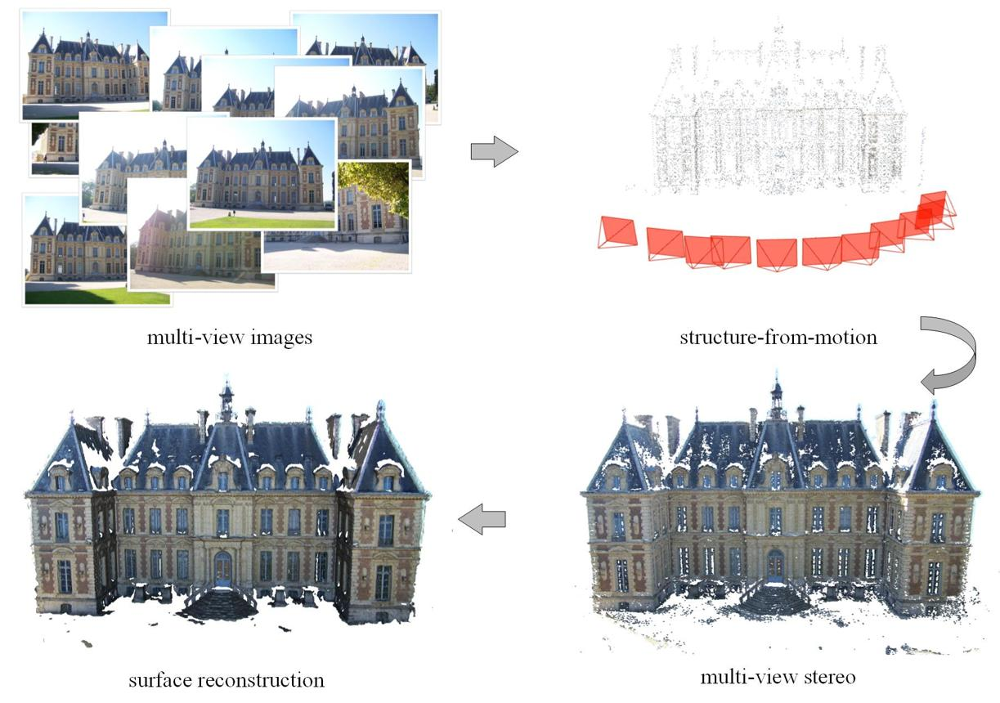

# 多视角图片生成点云与 3D 重建概要

## 1. 核心结论

多视角图片生成点云，本质上就是 **3D 重建（3D Reconstruction）问题**。

更准确地说，它属于：

> 基于多视角图像的三维重建（Multi-View 3D Reconstruction / Multi-View
> Stereo, MVS）

目标是：

    2D Images
        ↓
    3D Geometry
        ↓
    Point Cloud / Mesh / NeRF / 3D Gaussian

------------------------------------------------------------------------

# 2. 什么是 3D 重建？

3D Reconstruction 指：

> 从二维观测数据恢复真实世界三维结构。

输入：

-   RGB 图片
-   多视角图片
-   RGB-D 数据
-   视频
-   LiDAR

输出：

-   点云（Point Cloud）
-   三角网格（Mesh）
-   NeRF
-   3D Gaussian Splatting

------------------------------------------------------------------------

# 3. 多视角图片为什么可以恢复三维？

单张图片存在深度歧义：

          Camera
    
            |
            |
           Object

无法知道物体真实距离。

但是多个视角：

    Camera A             Camera B
    
         \                  /
          \                /
           \              /
              3D Point

同一个三维点在不同图片中的位置不同，这种偏移称为：

> 视差（Disparity）

通过三角测量恢复深度。

------------------------------------------------------------------------

# 4. 传统主流方法：SfM + MVS

经典流程：

    Multi-view Images
            |
            ↓
    Feature Extraction
            |
            ↓
    Feature Matching
            |
            ↓
    SfM
    (Structure from Motion)
            |
            ↓
    Camera Pose + Sparse Point Cloud
            |
            ↓
    MVS
    (Multi-View Stereo)
            |
            ↓
    Dense Depth Maps
            |
            ↓
    Depth Fusion
            |
            ↓
    Dense Point Cloud

------------------------------------------------------------------------

## 4.1 SfM

Structure from Motion 用于恢复：

-   相机位置
-   相机旋转
-   稀疏三维点

输出：

    Camera poses
    +
    Sparse point cloud

核心思想：

不同图片中匹配到的同一个特征点，通过三角化恢复三维位置。

------------------------------------------------------------------------

## 4.2 MVS

Multi-View Stereo 用于：

-   根据多视角一致性估计深度
-   生成稠密点云

流程：

    Reference Image
           |
           ↓
    Depth Estimation
           |
           ↓
    Depth Map
           |
           ↓
    Fusion
           |
           ↓
    Dense Point Cloud

------------------------------------------------------------------------

# 5. 已知深度和相机参数时：直接反投影

如果已有：

-   RGB
-   Depth
-   Camera Intrinsics K
-   Camera Extrinsics R,t

无需进行复杂重建。

像素：

    (u,v)

通过深度：

    z

恢复三维点：

    Pixel
     |
     ↓
    Depth
     |
     ↓
    3D Coordinate
     |
     ↓
    Point Cloud

这种方法在：

-   Blender渲染
-   合成数据
-   RGB-D相机

中最常用。

------------------------------------------------------------------------

# 6. 深度学习 MVS 方法

传统 MVS 的替代方案：

## MVSNet 系列

输入：

-   多视角图片
-   相机参数

预测：

-   深度图

代表：

-   MVSNet
-   R-MVSNet
-   CasMVSNet
-   UCSNet
-   PatchmatchNet

特点：

优点：

-   可以学习复杂纹理
-   特定数据集效果好

缺点：

-   通常需要已知相机参数
-   泛化能力有限

------------------------------------------------------------------------

# 7. 最近热门路线：DUSt3R / MASt3R / VGGT

新的趋势：

直接从图片预测三维结构。

------------------------------------------------------------------------

## DUSt3R

输入：

    Image A + Image B

输出：

    Point Map
    +
    Camera Geometry

特点：

不需要传统 SfM 流程。

------------------------------------------------------------------------

## MASt3R

DUSt3R 的增强版本：

-   更强匹配能力
-   更适合大视角变化
-   更适合真实场景重建

------------------------------------------------------------------------

## VGGT

更进一步：

输入：

    Multiple Images

输出：

-   Camera Parameters
-   Depth Maps
-   Point Maps
-   3D Tracks

属于目前非常热门的前馈式 3D 重建模型。

------------------------------------------------------------------------

# 8. 当前主流方法比较

  方法                    定位                 适合场景
----------------------- -------------------- --------------------
  COLMAP SfM + MVS        工业和科研经典方案   多图片、高精度
  学习型 MVS              深度估计增强         已知相机
  DUSt3R / MASt3R         新型重建             少量图片、未知相机
  VGGT                    前馈式基础模型       快速多视角重建
  Depth Back Projection   最准确               已知深度和相机

------------------------------------------------------------------------

# 9. 与 NeRF / 3D Gaussian 的关系

它们也属于广义 3D Reconstruction。

                    3D Reconstruction
    
                           |
            --------------------------------
    
            Classical              Neural
    
              |                      |
    
          COLMAP                 NeRF
    
          MVS                    3D Gaussian
    
          Point Cloud            Neural Representation

区别：

  方法                  三维表示
--------------------- ------------
  MVS                   点云
  Mesh Reconstruction   网格
  NeRF                  神经隐式场
  3DGS                  三维高斯

------------------------------------------------------------------------

# 10. 与 3D 人脸方向的关系

普通三维重建：

    Image
     ↓
    Generic 3D Geometry

3D 人脸重建：

    Face Image
          |
          ↓
    Face Model
          |
          ↓
    FLAME Parameters
    
    Identity β
    Expression ψ

代表：

-   DECA
-   EMOCA
-   RingNet
-   MICA

它们利用：

> 人脸先验

恢复更符合语义的人脸三维结构。

------------------------------------------------------------------------

# 11. 总结

一句话：

> 多视角图片生成点云，就是 3D 重建中的 Multi-View Stereo
> 问题。传统方法是 SfM + MVS（如 COLMAP），近几年主流研究方向逐渐转向
> DUSt3R、MASt3R、VGGT 等基于深度学习的多视角三维重建模型。

在 3D 人脸领域：

-   图片 → 点云：Generic 3D Reconstruction
-   图片 → FLAME：3D Face Reconstruction
-   ARKit → FLAME：Expression Retargeting / Facial Animation
