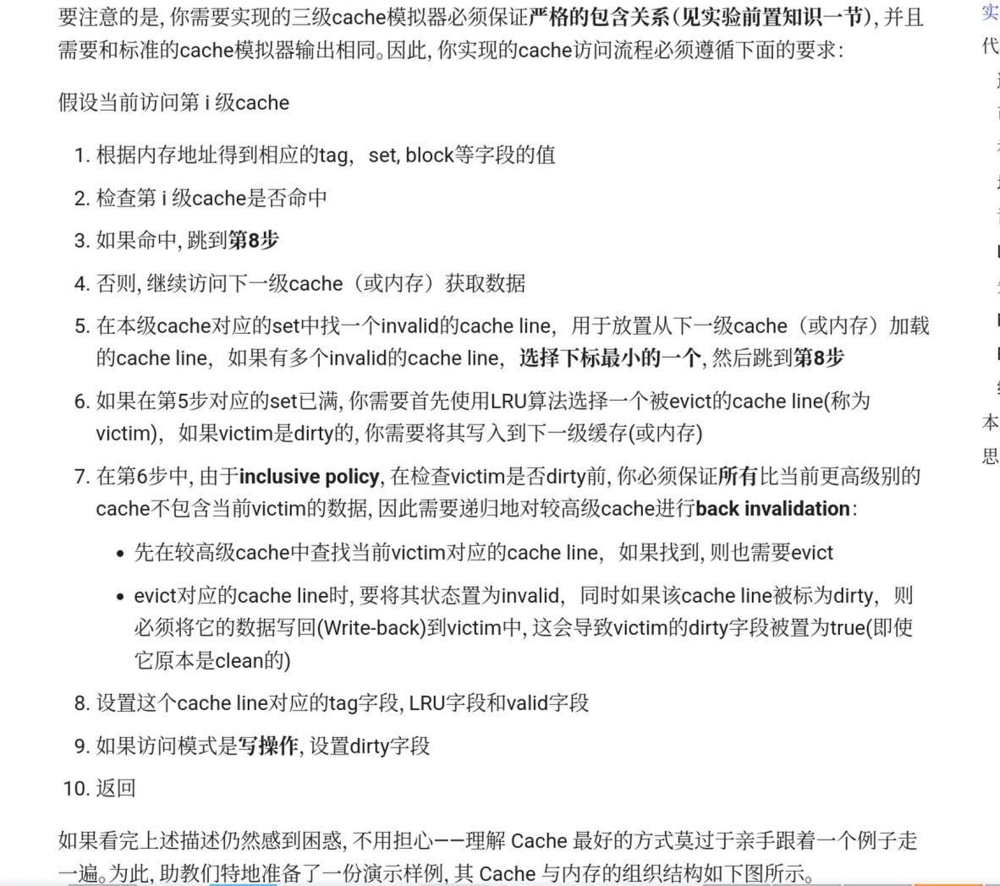
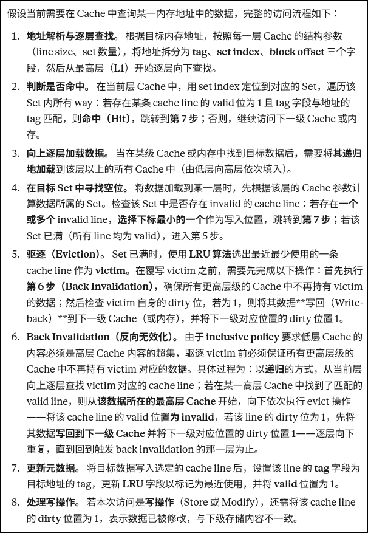

## `cache_trace`

第8个trace的第6步，应该是back invalidation过程中发现L1是dirty的，这样逻辑通顺一些。

## Part A文档

> [!TIP]
>
> 我觉得这部分有一点问题。从第四步到第五步，我个人阅读的时候感觉有点阻碍，然后第七步的描述也是让我感觉比较别扭。

我认为应该改成下文这样（简单改了一下）：

假设当前需要在Cache中查询某一内存地址中的数据：
1. 按照Cache的结构，逐层向下，根据内存地址得到地址在每一层对应的tag，set, block等字段的值，查询Cache是否命中
2. 如果当前层命中，跳到**第7步**；否则继续访问下一级Cache/内存；
3. 当在某级Cache或内存中找到地址对应的数据后，你需要将它递归地加载到这一级Cache/内存以上的Cache中；
4. 当向上加载这一数据的时候，你需要根据不同层的Cache设计，计算数据在每一层所属的位置；如果它所属的Set中有多个invalid的cache line，**选择下标最小的一个**，然后跳到**第7步**；
5. 如果在上一步中查询Set时，发现对应的Set已满，你需要使用**LRU算法**选择一个被evict的<u>cache line(称为victim)</u>，如果victim是dirty的，你需要将其写入到下一级缓存(或内存)
6. 在上一步中，由于**inclusive policy**，在检查victim是否dirty前，你必须保证**所有**比当前更高级别的cache不包含当前victim的数据，因此可以尝试***递归地***对较高级cache进行**back invalidation**：
   - 先在victim以上的各级cache中查找当前victim对应的cache line（这一查找策略可以从递归的思想出发设计），如果找到对应的valid的line，则从该地址所在的最高层Cache开始，向下执行evict操作；
   - evict对应的cache line时，需先将其状态置为invalid。如果该cache  line被标为dirty，那么在evict的时候，需要先将它的数据写回(Write-back)到操作发生时所在的位置的下一级Cache中，并设置下一级对应位置的dirty bit。
7. 设置这个cache line对应的tag字段，LRU字段和valid字段
8. 如果访问模式是**写操作**，设置dirty字段
>反馈：
>djn学长通过AI润色后，返回了更清晰的版本。
>