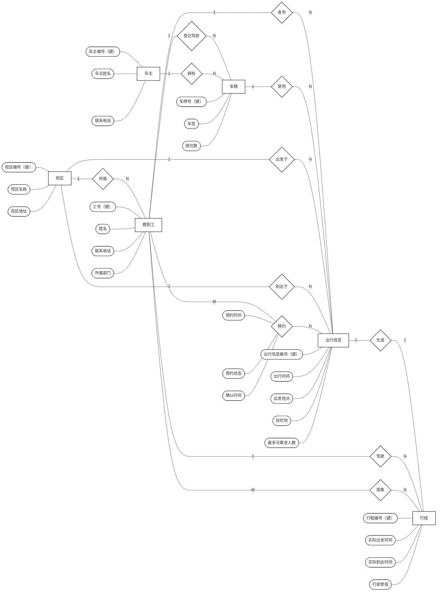

# 数据库 2024 年回忆版答案解析

说明：第 3 大题第 1 小题中，PDF 原式写作 `Π_{A,S,B,E,F}`，但给出的关系 `R(A,B,C)`、`S(B,C,D,E)`、`T(D,F,G)` 中没有名为 `S` 的属性。因此原式按严格关系代数语义是无定义的。下面按常见印刷错误处理，将 `S` 理解为 `C`，即按 `Π_{A,C,B,E,F}` 计算；若考试要求严格按原题，则应先指出“属性 `S` 不存在，表达式无定义”。

## 一、填空题

1. **人工管理阶段**  
   解析：基于计算机的数据管理通常经历人工管理阶段、文件系统阶段、数据库系统阶段。

2. **数据完整性约束**  
   解析：数据模型三要素是数据结构、数据操作、数据完整性约束。

3. **逻辑**  
   解析：外模式/模式映像保证逻辑独立性；模式/内模式映像保证物理独立性。

4. **元组；属性**  
   解析：关系模型中，二维表的行称为元组，列称为属性。

5. **事务故障**  
   解析：数据库运行中的常见故障包括事务故障、系统故障、介质故障。

6. **原子性、一致性**  
   解析：事务 ACID 四性质为原子性、一致性、隔离性、持久性。

7. **视图**  
   解析：若调度是冲突可串行化或视图可串行化的，则认为该调度是正确调度。

8. **显式封锁；隐式封锁**  
   解析：多粒度封锁中，一个数据对象可直接加显式锁，也可能因祖先/后代结点的锁而受到隐式封锁影响。

9. **投影，`Π`**  
   解析：最小完备集可取 `{∪, -, ×, σ, Π}`。

10. **触发器**  
    解析：触发器又称主动规则或 ECA 规则，是数据库发生特定事件且满足条件时自动执行的一组动作语句。

11. **读脏数据；不可重复读**  
    解析：写前加 X 锁可以避免丢失修改；但读不加锁时，仍可能读到未提交数据，也可能两次读同一数据得到不同结果。

## 二、选择题

答案速览：**1.B  2.B  3.B  4.C  5.A  6.D  7.D  8.D  9.B  10.B  11.A  12.D  13.A  14.B  15.D**

### 1. 答案：B

主键不能取空值属于**实体完整性**。

- A 数据完整性：范围太大，实体完整性、参照完整性、用户定义完整性都属于完整性规则。
- B 实体完整性：正确，要求主键唯一且非空。
- C 引用完整性：约束外键必须引用已有候选键值或取空值。
- D 用户定义完整性：是应用语义约束，如年龄范围、成绩范围等。

### 2. 答案：B

主键可以由多个属性组成，即复合主键。

- A 错：主键不一定只含一个属性。
- B 对：如选课表常用 `(学号, 课程号)` 作主键。
- C 错：候选键必须唯一，不同记录在同一候选键上的取值不能相同。
- D 错：主键任何组成属性都不能取空值。

### 3. 答案：B

投影对交运算一般不满足分配律。

- A 对：`Π_x(R1 ∪ R2) = Π_x(R1) ∪ Π_x(R2)`。
- B 错：例如 `R1={(a,b)}`、`R2={(a,c)}`，则 `R1∩R2=∅`，左边为空；但投影到 `A` 后两边都有 `{a}`，右边不为空。
- C 对：选择对并运算可分配。
- D 对：选择对交运算可分配。

### 4. 答案：C

`M:N` 联系转换为关系模式时，该联系关系的关键字通常是两端实体关键字的组合。

- A 错：只用 `M` 端关键字不能唯一标识一个联系。
- B 错：只用 `N` 端关键字也不能唯一标识一个联系。
- C 对：多对多联系由两端关键字组合标识。
- D 错：通常不需要重新选择其他属性作为关键字。

### 5. 答案：A

散列适合等值查找，不适合范围查找。

- A 错：散列会打散顺序，不能有效支持范围条件。
- B 对：散列属性上的等值查询可以快速定位桶。
- C 对：B+ 树等索引适合范围查询。
- D 对：索引也可提高等值查询速度。

### 6. 答案：D

事务故障恢复需要逆向扫描日志，对未完成事务执行 `UNDO`。

- A 错：介质故障通常需要装入备份并利用日志恢复，往往需要 DBA 参与。
- B 错：日志记录按事务实际执行更新的顺序写入，而不是按“请求时间”这种外部概念严格排序。
- C 错：检查点用于缩短恢复时扫描日志的范围，不表示检查点前数据库总是处于一致状态。
- D 对：事务故障的基本恢复操作就是反向撤销该事务的已做更新。

### 7. 答案：D

关系演算表达式若不受安全约束，可能出现无限关系或无穷验证问题；关系代数在有限关系上运算结果仍是有限关系。

- A 错：元组关系演算不能笼统说“不会产生无穷验证问题”，不安全表达式可能带来安全性问题。
- B 错：域关系演算也不能笼统说“不会产生无限关系”。
- C 错：关系代数本身在有限输入关系上不会产生无限关系或无穷验证问题。
- D 对：A、B、C 的说法都不准确。

### 8. 答案：D

自然连接结果个数取决于公共属性值是否匹配。

- A、B、C 都错：只知道 `R`、`S`、`W` 各有 10 个元组，不能确定自然连接结果是 10、30 还是 1000。
- D 对：若公共属性完全匹配、部分匹配或完全不匹配，结果规模都可能不同。

### 9. 答案：B

MAC 中高安全级别用户访问低敏感度对象时：**可读，不可更新**。

- A 错：高写低会把高密级信息泄漏到低密级对象，违反“禁止写下”。
- B 对：遵循“读下、禁止写下”。
- C 错：高安全级别用户可以读低级别对象。
- D 错：不可读不可更新过于严格。

### 10. 答案：B

高级别用户可以读低级别数据对象，但不能写入低级别数据对象。

- A 错：②不能。
- B 对：①可以，②不能。
- C 错：①可以。
- D 错：①可以。

### 11. 答案：A

日志恢复遵循先写日志原则。

- A 对：先把更新写入日志，再写入数据库文件。
- B 错：若先写数据库，故障后可能没有足够日志信息撤销或重做。
- C 错：写入顺序不能随意由并行性决定。
- D 错：A 正确。

### 12. 答案：D

时间戳并发控制中，事务 `T` 能读 `X` 的条件是 `ts(T) >= tw(X)`。

- A 错：`tr(X)` 是读时间戳，不是判断读操作是否过时的关键条件。
- B 错：若 `ts(T) <= tw(X)`，说明更“新”的事务已写过 `X`，旧事务读会破坏时间戳顺序。
- C 错：与 `tr(X)` 比较不是读规则的核心。
- D 对：只要 `T` 不早于最后写 `X` 的事务，就可以读。

### 13. 答案：A

意向锁相容矩阵中，`IX` 与 `IS` 相容，`IX` 与 `IX` 相容，`IX` 与 `SIX` 不相容，所以为 `Y Y N`。

- A 对：`Y Y N`。
- B 错：`IX` 与 `IX` 是相容的。
- C 错：`IX` 与 `IS` 相容，且 `IX` 与 `SIX` 不相容。
- D 错：`IX` 与 `IS`、`IX` 都相容。

### 14. 答案：B

数据库重组通常不改变原设计的数据逻辑结构，主要是重新组织存储、回收空间、改善性能。

- A 错：一般是重构更可能用于适应功能/需求变化，重组更偏性能和存储组织调整。
- B 对：重组不改变原设计的数据逻辑结构。
- C 错：重构可能涉及模式变化，进而影响应用程序。
- D 错：重构可能改变数据库原有模式或内模式。

### 15. 答案：D

两段锁协议保证冲突可串行化，可避免常见并发不一致；“不可重复写”不是常见并发不一致类型。

- A 错：丢失修改是两段锁/封锁协议要解决的问题之一。
- B 错：不可重复读属于并发不一致问题。
- C 错：读脏数据属于并发不一致问题。
- D 对：常见说法是丢失修改、读脏数据、不可重复读等，不包括“不可重复写”。

## 三、关系运算与并发调度

### 1. 关系代数与关系演算

给定关系：

`R(A,B,C)`：

| A | B | C |
|---|---|---|
| a1 | b2 | c1 |
| a1 | b2 | c2 |
| a2 | b2 | c1 |
| a2 | b2 | c2 |
| a2 | b3 | c1 |
| a3 | b1 | c2 |
| a3 | b2 | c4 |
| a3 | b3 | c4 |

`S(B,C,D,E)`：

| B | C | D | E |
|---|---|---|---|
| b2 | c2 | d1 | e1 |
| b2 | c2 | d2 | e1 |
| b2 | c1 | d2 | e2 |
| b2 | c1 | d3 | e3 |
| b3 | c4 | d1 | e1 |

`T(D,F,G)`：

| D | F | G |
|---|---|---|
| d1 | f1 | g1 |
| d1 | f2 | g2 |
| d2 | f1 | g3 |
| d2 | f3 | g4 |
| d3 | f1 | g5 |
| d3 | f2 | g6 |

#### （1）计算 `E1`

按 `Π_{A,C,B,E,F}` 理解：

`A='a2'` 时，`R` 中可参与 `E='e1'` 的自然连接的元组只有 `(a2,b2,c2)`；它与 `S` 中 `(b2,c2,d1,e1)`、`(b2,c2,d2,e1)` 连接，再与 `T` 中满足 `G<'g4'` 的 `d1,d2` 元组连接。

结果为：

| A | C | B | E | F |
|---|---|---|---|---|
| a2 | c2 | b2 | e1 | f1 |
| a2 | c2 | b2 | e1 | f2 |

解析：`d1` 可连接到 `f1,g1` 和 `f2,g2`；`d2` 可连接到 `f1,g3`，但投影后与第一行重复，所以关系结果去重后只剩两行。

#### （2）计算 `E2`

表达式：

```text
E2 = { xyz | (∃quvw)(
  R(wqx) ∧ S(qxyu) ∧ T(yvz)
  ∧ w>'a2' ∧ u<'e2' ∧ v='f1'
) }
```

变量对应关系：

- `R(w,q,x)` 对应 `R(A,B,C)`，所以 `w=A, q=B, x=C`。
- `S(q,x,y,u)` 对应 `S(B,C,D,E)`，所以 `y=D, u=E`。
- `T(y,v,z)` 对应 `T(D,F,G)`，所以 `v=F, z=G`。

条件 `w>'a2'` 只取 `A='a3'`；`u<'e2'` 只取 `E='e1'`；`v='f1'` 只取 `F='f1'`。唯一匹配链为：

`R(a3,b3,c4)`、`S(b3,c4,d1,e1)`、`T(d1,f1,g1)`。

因此：

| x | y | z |
|---|---|---|
| c4 | d1 | g1 |

#### （3）对 `E1` 进行代数优化

原式可按“选择下推、投影下推、先缩小中间结果再连接”优化为：

```text
Π_{A,C,B,E,F}(
  (Π_{A,B,C}(σ_{A='a2'}(R))
   ⋈
   Π_{B,C,D,E}(σ_{E='e1'}(S)))
  ⋈
  Π_{D,F}(σ_{G<'g4'}(T))
)
```

解析：

- `A='a2'` 只涉及 `R`，先下推到 `R`。
- `E='e1'` 只涉及 `S`，先下推到 `S`。
- `G<'g4'` 只涉及 `T`，先下推到 `T`。
- 投影时保留最终输出属性以及后续连接所需属性：`R` 保留 `A,B,C`，`S` 保留 `B,C,D,E`，`T` 保留 `D,F`。

### 2. 调度的前趋图与冲突可串行化

#### （1）调度 `S1` 的前趋图

冲突边为：

```text
T1 -> T2
T1 -> T3
T1 -> T4
T2 -> T3
T2 -> T4
T3 -> T2
T3 -> T4
```

前趋图中存在环：

```text
T2 -> T3 -> T2
```

所以 `S1` **不是冲突可串行化调度**。

#### （2）调度 `S2` 的前趋图

冲突边为：

```text
T1 -> T2
T1 -> T3
T1 -> T4
T2 -> T1
T2 -> T3
T2 -> T4
T3 -> T1
T3 -> T4
T4 -> T2
T4 -> T3
```

前趋图中存在多个环，例如：

```text
T1 -> T2 -> T1
T3 -> T4 -> T3
```

所以 `S2` **不是冲突可串行化调度**。

## 四、SQL 题

本题给定：

```text
S(SNO, SNAME, AGE, SEX, SDEPT)
C(CNO, CNAME, TNAME)
SC(SNO, CNO, GRADE)
```

考试写 SQL 时，`JOIN ... ON ...` 和“多表逗号 + `WHERE` 连接条件”通常都算对。下面每小题给多种写法，优先背不用 `JOIN` 的写法。

### （1）查询至少选修 “LIU” 老师所授课程中一门课程的女学生姓名

写法 1：显式 `JOIN`

```sql
SELECT DISTINCT S.SNAME
FROM S
JOIN SC ON S.SNO = SC.SNO
JOIN C ON SC.CNO = C.CNO
WHERE S.SEX = '女'
  AND C.TNAME = 'LIU';
```

写法 2：不用 `JOIN`，只用 `WHERE` 写连接条件

```sql
SELECT DISTINCT S.SNAME
FROM S, SC, C
WHERE S.SNO = SC.SNO
  AND SC.CNO = C.CNO
  AND S.SEX = '女'
  AND C.TNAME = 'LIU';
```

写法 3：嵌套 `IN`

```sql
SELECT SNAME
FROM S
WHERE SEX = '女'
  AND SNO IN (
    SELECT SNO
    FROM SC
    WHERE CNO IN (
      SELECT CNO
      FROM C
      WHERE TNAME = 'LIU'
    )
  );
```

写法 4：`EXISTS`

```sql
SELECT S.SNAME
FROM S
WHERE S.SEX = '女'
  AND EXISTS (
    SELECT *
    FROM SC, C
    WHERE SC.CNO = C.CNO
      AND SC.SNO = S.SNO
      AND C.TNAME = 'LIU'
  );
```

解析：题目说“至少选修一门”，所以只要存在一条选课记录满足课程教师为 `LIU` 即可。多表连接写法可能因一名学生选了多门 LIU 老师课程而重复，所以最好加 `DISTINCT`；`IN` 和 `EXISTS` 写法天然按学生表筛选，一般不会重复姓名记录，但若允许同名学生，最好按 `SNO` 理解。

### （2）查询有学生选修的课程门数

写法 1：最短写法，直接统计 `SC` 中出现过的不同课程号

```sql
SELECT COUNT(DISTINCT CNO) AS 课程门数
FROM SC;
```

写法 2：不用 `DISTINCT`，用 `GROUP BY` 后再计数

```sql
SELECT COUNT(*) AS 课程门数
FROM (
  SELECT CNO
  FROM SC
  GROUP BY CNO
) T;
```

写法 3：从课程表 `C` 出发，用 `IN`

```sql
SELECT COUNT(*) AS 课程门数
FROM C
WHERE CNO IN (
  SELECT CNO
  FROM SC
);
```

写法 4：从课程表 `C` 出发，用 `EXISTS`

```sql
SELECT COUNT(*) AS 课程门数
FROM C
WHERE EXISTS (
  SELECT *
  FROM SC
  WHERE SC.CNO = C.CNO
);
```

写法 5：如果想先列出每门有学生选修的课程及人数

```sql
SELECT CNO, COUNT(*) AS 选课人数
FROM SC
GROUP BY CNO;
```

解析：题目问“课程门数”，不是问每门课人数，所以最终答案应返回一个总数。`COUNT(DISTINCT CNO)` 最直接；`GROUP BY` 子查询的思路是先把有学生选修的课程分组，再数有多少组。

### （3）查询平均成绩超过 80 分的学生姓名

写法 1：显式 `JOIN`

```sql
SELECT S.SNAME
FROM S
JOIN SC ON S.SNO = SC.SNO
GROUP BY S.SNO, S.SNAME
HAVING AVG(SC.GRADE) > 80;
```

写法 2：不用 `JOIN`，只用 `WHERE + GROUP BY + HAVING`

```sql
SELECT S.SNAME
FROM S, SC
WHERE S.SNO = SC.SNO
GROUP BY S.SNO, S.SNAME
HAVING AVG(SC.GRADE) > 80;
```

写法 3：嵌套 `IN`

```sql
SELECT SNAME
FROM S
WHERE SNO IN (
  SELECT SNO
  FROM SC
  GROUP BY SNO
  HAVING AVG(GRADE) > 80
);
```

写法 4：相关子查询

```sql
SELECT S.SNAME
FROM S
WHERE (
  SELECT AVG(SC.GRADE)
  FROM SC
  WHERE SC.SNO = S.SNO
) > 80;
```

写法 5：先求平均成绩，再和学生表连接；不用 `JOIN` 的写法

```sql
SELECT S.SNAME
FROM S,
     (
       SELECT SNO, AVG(GRADE) AS AVG_GRADE
       FROM SC
       GROUP BY SNO
       HAVING AVG(GRADE) > 80
     ) T
WHERE S.SNO = T.SNO;
```

解析：平均成绩必须按学生分组，所以关键是 `GROUP BY SNO HAVING AVG(GRADE)>80`。如果直接在 `S, SC` 上分组，建议 `GROUP BY S.SNO, S.SNAME`，防止同名学生被合并；嵌套 `IN` 写法考试最稳。

### （4）删除所有有关 “LIU” 老师的 `C` 记录和对应的 `SC` 记录

写法 1：标准安全写法，先删 `SC`，再删 `C`

```sql
DELETE FROM SC
WHERE CNO IN (
  SELECT CNO
  FROM C
  WHERE TNAME = 'LIU'
);

DELETE FROM C
WHERE TNAME = 'LIU';
```

写法 2：`EXISTS` 写法，先删 `SC`，再删 `C`

```sql
DELETE FROM SC
WHERE EXISTS (
  SELECT *
  FROM C
  WHERE C.CNO = SC.CNO
    AND C.TNAME = 'LIU'
);

DELETE FROM C
WHERE TNAME = 'LIU';
```

写法 3：如果担心删除 `SC` 后查不到 LIU 的课程号，可先用临时表/中间结果保存课程号

```sql
CREATE TABLE LIU_COURSE AS
SELECT CNO
FROM C
WHERE TNAME = 'LIU';

DELETE FROM SC
WHERE CNO IN (
  SELECT CNO
  FROM LIU_COURSE
);

DELETE FROM C
WHERE CNO IN (
  SELECT CNO
  FROM LIU_COURSE
);
```

写法 4：若外键定义了级联删除，可以只删 `C`

```sql
DELETE FROM C
WHERE TNAME = 'LIU';
```

前提是 `SC(CNO)` 外键引用 `C(CNO)` 时定义了类似：

```sql
ON DELETE CASCADE
```

写法 5：部分数据库支持多表删除，比如 MySQL，可写成

```sql
DELETE SC
FROM SC, C
WHERE SC.CNO = C.CNO
  AND C.TNAME = 'LIU';

DELETE FROM C
WHERE TNAME = 'LIU';
```

解析：如果 `SC.CNO` 是引用 `C.CNO` 的外键，必须先删除 `SC` 中对应记录，再删除 `C` 中课程记录，否则会违反参照完整性。考试最推荐写法 1 或写法 2。

## 五、数据依赖与范式

### 1. 判断最高范式

#### `R1(ABCDE), F={DE->BC, B->DE, C->A}`

答案：**最高属于 2NF**。

解析：

- 候选键为 `B`、`DE`。
- 主属性为 `B,D,E`，非主属性为 `A,C`。
- `C->A` 中 `C` 不是超键，`A` 也不是主属性，违反 3NF。
- 对候选键 `DE` 来说，`D` 或 `E` 单独不能推出非主属性；候选键 `B` 是单属性键，不存在部分依赖。因此满足 2NF。

#### `R2(BCEG), F={C->E, BC->G}`

答案：**最高属于 1NF**。

解析：

- 候选键为 `BC`。
- 非主属性为 `E,G`。
- `C->E` 是候选键 `BC` 的真子集决定非主属性 `E`，存在部分函数依赖，违反 2NF。

#### `R3(ABCD), F={BCD->A, A->D, A->C}`

答案：**最高属于 3NF，但不属于 BCNF**。

解析：

- 候选键为 `AB`、`BCD`。
- 所有属性 `A,B,C,D` 都是主属性。
- `A->D`、`A->C` 中 `A` 不是超键，所以违反 BCNF。
- 但右部 `D,C` 都是主属性，满足 3NF 条件。

#### `R4(ABCDE), F={AE->C, C->D, D->C}`

答案：**最高属于 1NF**。

解析：

- 候选键为 `ABE`。
- 非主属性为 `C,D`。
- `AE->C` 是候选键 `ABE` 的真子集决定非主属性 `C`，存在部分函数依赖，违反 2NF。
- `C->D`、`D->C` 还体现了非键属性之间的依赖，因此更不满足 3NF/BCNF。

### 2. 关系模式 `R(A,B,C,D,E,G,H)`

函数依赖集：

```text
F = {
  EH -> G,
  DEH -> A,
  A -> G,
  G -> D,
  B -> ACD,
  C -> BD
}
```

#### （1）求最小函数依赖集 `Fmin`

先拆右部：

```text
EH -> G
DEH -> A
A -> G
G -> D
B -> A
B -> C
B -> D
C -> B
C -> D
```

化简：

- `DEH->A` 中 `D` 是多余属性，因为 `EH->G` 且 `G->D`，所以 `EH` 可推出 `D`，进而推出 `A`，化为 `EH->A`。
- `EH->G` 可由 `EH->A` 和 `A->G` 推出，删除。
- `B->D` 可由 `B->A`、`A->G`、`G->D` 推出，删除。
- `C->D` 可由 `C->B`、`B->A`、`A->G`、`G->D` 推出，删除。

可得一个最小覆盖：

```text
Fmin = {
  EH -> A,
  A -> G,
  G -> D,
  B -> A,
  B -> C,
  C -> B
}
```

等价写法：

```text
Fmin = {
  EH -> A,
  A -> G,
  G -> D,
  B -> AC,
  C -> B
}
```

#### （2）求所有候选关键字

求候选关键字的核心方法是：**先找必须出现的属性，再用属性闭包验证最小性**。

第一步，找“必须在候选键中出现”的属性。

观察 `Fmin`：

```text
Fmin = {
  EH -> A,
  A -> G,
  G -> D,
  B -> A,
  B -> C,
  C -> B
}
```

各依赖右部出现过的属性为：

```text
右部属性集合 = {A, G, D, C, B}
```

原关系总属性为：

```text
U = {A, B, C, D, E, G, H}
```

所以没有出现在任何右部的属性是：

```text
U - 右部属性集合 = {E, H}
```

因为 `E`、`H` 不能由任何其他属性推出，所以任何候选键都必须包含 `E,H`。

第二步，先算 `(EH)+`：

```text
(EH)+ = EH
      -> A        由 EH -> A
      -> G        由 A -> G
      -> D        由 G -> D
      = ADEGH
```

`(EH)+` 还缺少 `B,C`，所以 `EH` 不是候选键，还需要补能推出 `B,C` 的属性。

第三步，分析补什么属性。

从 `Fmin` 看：

```text
B -> C
C -> B
```

也就是说，只要在 `EH` 的基础上补 `B`，就能得到 `C`；补 `C`，也能得到 `B`。但补 `A`、`D`、`G` 都不能推出 `B` 或 `C`。

计算闭包：

```text
(BEH)+ = BEH
       -> A,C      由 B->A, B->C
       -> G        由 A->G
       -> D        由 G->D
       = ABCDEGH
```

所以 `BEH` 是超键。再检查最小性：

- 去掉 `B`，`(EH)+ = ADEGH`，不是全属性集。
- 去掉 `E`，因为 `E` 不能由其他属性推出，所以不可能是全属性集。
- 去掉 `H`，因为 `H` 不能由其他属性推出，所以不可能是全属性集。

因此 `BEH` 是候选键。

```text
(CEH)+ = CEH
       -> B        由 C->B
       -> A        由 B->A
       -> G        由 A->G
       -> D        由 G->D
       = ABCDEGH
```

所以 `CEH` 是超键。再检查最小性：

- 去掉 `C`，`(EH)+ = ADEGH`，不是全属性集。
- 去掉 `E`，无法推出 `E`。
- 去掉 `H`，无法推出 `H`。

因此 `CEH` 也是候选键。

第四步，说明没有其他候选键。

任何候选键都必须包含 `EH`。而 `EH` 本身不能推出 `B,C`，必须再补一个能得到 `B,C` 的属性：

- 补 `B` 得 `BEH`。
- 补 `C` 得 `CEH`。
- 补 `A`、`D`、`G` 都不能推出 `B,C`，所以不是键。
- 同时补 `B,C` 得 `BCEH` 虽然是超键，但包含候选键 `BEH` 或 `CEH`，不是最小的。

答案：

```text
候选关键字：BEH, CEH
```

#### （3）分解为既无损联结又保持函数依赖的 3NF

本题要求“既无损联结又保持函数依赖”的 3NF 分解，应使用 **3NF 合成算法**，也叫 **3NF 综合算法**。

不要优先用 BCNF 分解算法。原因是：BCNF 分解通常能保证无损联结，但不一定保持函数依赖；而题目明确要求保持函数依赖，所以应使用 3NF 合成算法。

3NF 合成算法步骤如下：

1. 求最小函数依赖集 `Fmin`。
2. 对 `Fmin` 中每个依赖 `X -> A`，建立关系模式 `XA`。
3. 如果有多个依赖左部相同，可以合并成一个关系模式。
4. 如果某个关系模式被另一个关系模式包含，可以删除较小的关系模式。
5. 如果得到的所有关系模式都不包含原关系的候选键，则补充一个包含候选键的关系模式，以保证无损联结。

第一步，使用上面得到的最小依赖集：

```text
Fmin = {
  EH -> A,
  A -> G,
  G -> D,
  B -> A,
  B -> C,
  C -> B
}
```

第二步，按每个函数依赖建立关系模式：

```text
EH -> A   生成 R1(E,H,A)
A  -> G   生成 R2(A,G)
G  -> D   生成 R3(G,D)
B  -> A   生成 R4(B,A)
B  -> C   生成 R5(B,C)
C  -> B   生成 R6(C,B)
```

第三步，合并或删除包含关系。

因为 `B -> A` 和 `B -> C` 左部相同，可以合并：

```text
R4(B,A) 和 R5(B,C) 合并为 R4(B,A,C)
```

而 `R6(C,B)` 的属性集合 `{C,B}` 被 `R4(B,A,C)` 包含，所以可以删除 `R6(C,B)`，但依赖 `C -> B` 仍可在 `R4(B,A,C)` 中保持。

此时得到：

```text
R1(E,H,A)
R2(A,G)
R3(G,D)
R4(B,A,C)
```

第四步，检查是否已经包含原关系的候选键。

原关系候选键为：

```text
BEH, CEH
```

上面四个关系模式中：

- `R1(E,H,A)` 不包含 `BEH` 或 `CEH`。
- `R2(A,G)` 不包含候选键。
- `R3(G,D)` 不包含候选键。
- `R4(B,A,C)` 不包含候选键，因为缺少 `E,H`。

所以需要额外加入一个包含候选键的关系模式。可选：

```text
R5(B,E,H)
```

或：

```text
R5(C,E,H)
```

两者都可以。这里选 `R5(B,E,H)`。

最终分解为：

```text
R1(E,H,A)
R2(A,G)
R3(G,D)
R4(B,A,C)
R5(B,E,H)
```

验证：

- `R1(E,H,A)` 保持 `EH->A`。
- `R2(A,G)` 保持 `A->G`。
- `R3(G,D)` 保持 `G->D`。
- `R4(B,A,C)` 保持 `B->A`、`B->C`、`C->B`。
- `R5(B,E,H)` 含有原关系的候选键 `BEH`，因此按 3NF 合成算法，该分解无损联结。

再看每个子模式是否满足 3NF：

- `R1(E,H,A)` 中 `EH` 是键，满足 3NF。
- `R2(A,G)` 中 `A` 是键，满足 3NF。
- `R3(G,D)` 中 `G` 是键，满足 3NF。
- `R4(B,A,C)` 中 `B` 和 `C` 都是键，因为 `B->AC` 且 `C->B->AC`，满足 3NF。
- `R5(B,E,H)` 主要用于包含原关系候选键，不引入违反 3NF 的非平凡依赖。

因此这组分解既保持函数依赖，又无损联结，并且每个关系模式满足 3NF。

## 六、数据库设计题

### （1）E-R 图

按课件里的考试画法：**实体画矩形，联系画菱形，属性画椭圆，候选键/主键属性加下划线，联系边标 `1:N` 或 `M:N`**。如果不能画图，可以按下面的文字版直接还原。

下面先给一个 Mermaid 示例，采用课程要求的画法：**实体用矩形，联系用菱形，属性用椭圆，两端用 `1`、`N`、`M` 标基数**。考试手画时可照这个结构画，主键属性在纸面上加下划线。



#### 实体及属性

1. 教职工  
   属性：<u>工号</u>，姓名，性别，联系电话，所属部门

2. 校区  
   属性：<u>校区编号</u>，校区名称，校区地址

3. 车主  
   属性：<u>车主编号</u>，车主姓名，联系电话

4. 车辆  
   属性：<u>车牌号</u>，车型，颜色，座位数

5. 出行信息  
   属性：<u>出行信息编号</u>，出行时间，最多可乘坐人数，发布时间，状态

6. 行程  
   属性：<u>行程编号</u>，实际出发时间，实际到达时间，行驶里程

#### 联系、基数和联系属性

画图时按以下菱形联系连接：

1. `校区 -- 1:N -- 教职工`，联系名：**所属**  
   含义：一个校区有多个教职工，一个教职工属于一个校区。

2. `教职工 -- 1:N -- 车辆`，联系名：**登记驾驶**  
   含义：一名教职工可登记多辆自己驾驶的汽车，一辆登记车辆对应一名登记驾驶员。

3. `车主 -- 1:N -- 车辆`，联系名：**拥有**  
   含义：一个车主可以拥有多辆车，一辆车对应一个登记车主。

4. `教职工 -- 1:N -- 出行信息`，联系名：**发布**  
   含义：一个教职工作为出行者可发布多条出行信息，一条出行信息由一个出行者发布。

5. `车辆 -- 1:N -- 出行信息`，联系名：**使用**  
   含义：一辆车可用于多条出行信息，一条出行信息使用一辆车。

6. `校区 -- 1:N -- 出行信息`，联系名：**出发于**  
   含义：一个校区可作为多条出行信息的出发地点，一条出行信息有一个出发校区。

7. `校区 -- 1:N -- 出行信息`，联系名：**到达于**  
   含义：一个校区可作为多条出行信息的目的地，一条出行信息有一个目的校区。

8. `教职工 -- M:N -- 出行信息`，联系名：**预约**  
   联系属性：预约时间，预约状态，确认时间  
   含义：一个教职工作为搭乘者可预约多条出行信息，一条出行信息也可被多个搭乘者预约。由 `(出行信息编号, 搭乘者工号)` 保证同一搭乘者对同一出行信息只预约一次。

9. `出行信息 -- 1:1 -- 行程`，联系名：**生成**  
   含义：一条实际发生的行程由一条出行信息生成；未成行的出行信息可以没有对应行程。

10. `教职工 -- 1:N -- 行程`，联系名：**驾驶**  
    含义：一个教职工作为出行者可驾驶多次行程，一次行程有一个出行者。

11. `教职工 -- M:N -- 行程`，联系名：**搭乘**  
    含义：一个教职工可作为搭乘者参加多次行程，一次行程可有多个搭乘者。

文字版 E-R 图可概括为：

```text
校区 1 —— N 教职工
教职工 1 —— N 车辆
车主 1 —— N 车辆
教职工 1 —— N 出行信息
车辆 1 —— N 出行信息
校区 1 —— N 出行信息   （角色：出发校区）
校区 1 —— N 出行信息   （角色：目的校区）
教职工 M —— N 出行信息 （联系：预约；属性：预约时间、预约状态、确认时间）
出行信息 1 —— 1 行程
教职工 1 —— N 行程     （角色：出行者/驾驶员）
教职工 M —— N 行程     （角色：搭乘者）
```

解析：

- “出行者/驾驶员”和“搭乘者/乘客”都是教职工在不同联系中的角色，不必画成两个独立实体。
- 题目明确要求另行登记车主信息，所以把车主作为单独实体。
- “预约”和“搭乘”都是 `M:N` 联系，因此转换关系模式时要单独成表。
- “GPS 具体轨迹”不需要建属性或实体；数据库只记录系统计算后的行驶里程。

### （2）转换为关系模式

按课件规则：实体各自成关系；`1:1`、`1:N` 联系并入某一端或 `N` 端；只有 `M:N` 联系额外转换成关系模式。

下面用 `<u>下划线</u>` 表示候选键/主键，用“外键：...”单独列出外键。若在纸面作答，应给外键属性加下波浪线。

#### 校区

校区(<u>校区编号</u>, 校区名称, 校区地址)

- 候选键：`校区编号`
- 外键：无

#### 教职工

教职工(<u>工号</u>, 姓名, 性别, 联系电话, 所属部门, 所属校区编号)

- 候选键：`工号`
- 外键：`所属校区编号 -> 校区(校区编号)`

#### 车主

车主(<u>车主编号</u>, 车主姓名, 联系电话)

- 候选键：`车主编号`
- 外键：无

#### 车辆

车辆(<u>车牌号</u>, 车型, 颜色, 座位数, 登记驾驶员工号, 车主编号)

- 候选键：`车牌号`
- 外键：`登记驾驶员工号 -> 教职工(工号)`，`车主编号 -> 车主(车主编号)`

#### 出行信息

出行信息(<u>出行信息编号</u>, 驾驶员工号, 车牌号, 出行时间, 出发校区编号, 目的校区编号, 最多可乘坐人数, 发布时间, 状态)

- 候选键：`出行信息编号`
- 外键：`驾驶员工号 -> 教职工(工号)`，`车牌号 -> 车辆(车牌号)`，`出发校区编号 -> 校区(校区编号)`，`目的校区编号 -> 校区(校区编号)`

#### 预约

预约(<u>出行信息编号, 搭乘者工号</u>, 预约时间, 预约状态, 确认时间)

- 候选键：`(出行信息编号, 搭乘者工号)`
- 外键：`出行信息编号 -> 出行信息(出行信息编号)`，`搭乘者工号 -> 教职工(工号)`

#### 行程

行程(<u>行程编号</u>, 出行信息编号, 出行者工号, 车牌号, 实际出发时间, 实际到达时间, 出发校区编号, 目的校区编号, 行驶里程)

- 候选键：`行程编号`；若规定一个出行信息最多生成一次行程，则 `出行信息编号` 也可作为候选键。
- 外键：`出行信息编号 -> 出行信息(出行信息编号)`，`出行者工号 -> 教职工(工号)`，`车牌号 -> 车辆(车牌号)`，`出发校区编号 -> 校区(校区编号)`，`目的校区编号 -> 校区(校区编号)`

#### 行程搭乘者

行程搭乘者(<u>行程编号, 搭乘者工号</u>)

- 候选键：`(行程编号, 搭乘者工号)`
- 外键：`行程编号 -> 行程(行程编号)`，`搭乘者工号 -> 教职工(工号)`

### （3）设计说明

- `预约` 表表示“申请搭乘”和“出行者确认”的过程；`行程搭乘者` 表表示实际行程中的搭乘者名单。
- “最多可乘坐人数”可作为业务约束：某条出行信息被确认的预约人数不能超过该值。
- 若简化作答，也可以不单独画 `行程搭乘者`，而把“实际搭乘者”理解为预约表中 `预约状态='已确认'` 的记录；但题目要求“记录每次行程的搭乘者”，单独列出 `行程搭乘者` 更清晰。
- 若认为同一车辆可由多个教职工登记驾驶，可把 `教职工 -- 车辆` 改成 `M:N` 联系并新增 `车辆登记(工号, 车牌号, 登记时间)`；本答案按考试常见简化，取一辆登记车辆对应一名登记驾驶员。
