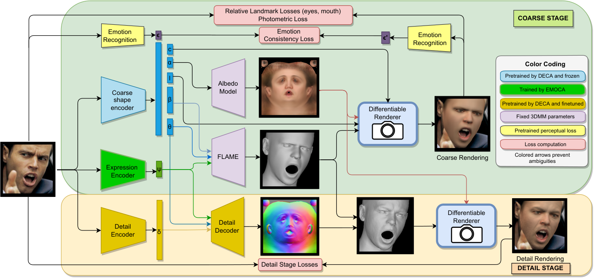

# EMOCA：情感驱动的单目人脸捕获与动画（EMOCA: Emotion Driven Monocular Face Capture and Animation）

> 原文：arXiv:2204.11312v1 [cs.CV]，2022 年 4 月 24 日
>
> 作者：Radek Daněček，Michael J. Black，Timo Bolkart
>
> 机构：德国蒂宾根马克斯·普朗克智能系统研究所（Max Planck Institute for Intelligent Systems, Tübingen, Germany）
>
> 本文为机器辅助翻译，仅供学习交流使用；公式保留 LaTeX 形式，专业术语在首次出现时保留英文。

## 摘要

随着 3D 面部虚拟形象越来越广泛地用于交流，它们能否忠实地传达情感变得至关重要。遗憾的是，目前最优秀的那些从单目图像回归参数化 3D 人脸模型的方法，仍然无法捕捉完整的表情光谱，例如细微的或极端的情感。

我们发现，用于训练的标准重建度量——包括**关键点重投影误差**、**光度误差**和**人脸识别损失**——不足以重建高保真表情。其结果是重建出的人脸几何形状与输入图像中的情感内容不匹配。

针对这一问题，我们提出了 **EMOCA**（**EMO**tion **C**apture and **A**nimation，情感捕获与动画），在训练中引入一种新的**深度感知情感一致性损失（deep perceptual emotion consistency loss）**，帮助确保重建的 3D 表情与输入图像中描绘的表情一致。

虽然 EMOCA 的 3D 重建误差与当前最佳方法相当，但在重建表情的质量和感知情感内容方面，它显著优于这些方法。我们还从估计出的 3D 人脸参数中直接回归效价（valence）和唤醒度（arousal），并对基本表情进行分类。

在真实场景（in-the-wild）情感识别任务上，我们这种纯几何方法的表现与最好的基于图像的方法相当，这突显了 3D 几何在分析人类行为中的价值。

模型和代码公开提供于：<https://emoca.is.tue.mpg.de>。

---

**图 1：** EMOCA 从图像回归 3D 人脸，其面部几何能够捕捉原始情感内容。上排：具有挑战性表情的人物图像；中排：粗略形状重建；下排：带细节位移的重建。

## 1 引言

教会计算机看见人类并理解他们的行为，是计算机视觉长期以来的目标。为此，计算机需要理解人类的外貌、动作以及感受。人脸及其情感表达是了解一个人内部情绪状态的重要信息来源。

为了支持情绪状态的自动分析，我们希望在**给定一张 RGB 图像**的情况下，捕获一个人的面部，包括其 3D 形状、姿态和面部表情。为此，我们超越了先前的工作，提取带有丰富情感内容的 3D 几何。

我们专注于**参数化方法**（即可动画的、基于模型的方法），因为它们在 3D 虚拟形象创建（Hu2017）、图像合成（Ghosh2020; Tewari2020）、视频编辑（Thies2016; Kim2018_DeepVideo）和人脸识别（Blanz2002; Romdhani2002）等方面具有广泛的适用性。

在过去二十年里，**3D 人脸重建领域**发展迅速；综述可参见 Egger 等人（Egger2020）。现有估计 3D 人脸模型的方法难以细致地捕捉面部表情，并且常常生成不携带输入图像情感内容的 3D 形状。这有几个原因：

1. 一些 3D 人脸模型缺乏足够的表达能力，无法捕捉细微或极端表情。
2. 重建度量，如关键点重投影损失（Blanz2003）、光度损失（BlanzVetter1999）、人脸识别损失（Genova2018）或多图像一致性损失（Sanyal2019_RingNet; Tewari2019_FML），要么不受面部表情影响，要么需要完美的图像对齐才能捕捉细微线索。

> [!Note]
>
> 就是说，要么3D模型表达能力不够，要么就是各种metrics对面部表情变化不敏感，要么就是对于图像对齐的要求太苛刻。

然而，几何上的细微变化可能导致感知情感的显著差异。我们认为，**要准确恢复 3D 表情，需要一种新的重建度量**，用于衡量 3D 重建与输入图像之间的表情差异。

为此，我们提出了 **EMOCA**（情感捕获与动画），这是一个**无需 3D 监督**、即可从真实场景图像中学习可动画人脸模型的神经网络。我们方法的设计受到面部情感识别领域进展的启发，该领域在从真实场景图像估计情感（或情绪）方面已经取得了巨大进步（Li2020）。具体而言，我们<u>训练了一个最先进的情感识别模型</u>，并<u>在 EMOCA 的训练过程中将其用作监督</u>。EMOCA 引入了一种新颖的**感知情感一致性损失**，鼓励输入图像与渲染重建之间的情感内容相似。

尽管新的情感一致性损失能改善重建情感，但仅靠它还不够。先前 3D 重建方法使用的大规模图像数据集虽然包含大量不同种族的人脸，但缺乏情感表现力（Klare2015_IJBA; Cao2018_VGGFace2; Wang_2019_ICCV; Chung2018_VoxCeleb2）。另一方面，包含面部表情、效价和唤醒度的真实场景大规模数据集虽然情感丰富，但并未提供每个对象在不同条件下的多张图像（AffectNet; BenitezQuiroz2016_EmotioNet; Aff-Wild2; AFEW-VA; SewaDB; kaisiyuan2020mead; cao14_crema）；而受控环境下的小数据集不适合深度学习（mmi_db; cohn10_ckplus; disfa; disfaplus; belfastemo）。然而，训练当前最先进的 3D 人脸重建方法需要同一个人的多张图像（Sanyal2019_RingNet; Feng2021_DECA; Deng2019）。

为了克服这一问题，EMOCA 建立在 **DECA**（Feng2021_DECA）之上。DECA 是一个公开可用的 3D 人脸重建框架，在身份形状重建精度上达到了最先进水平（Feng2018evaluation; Sanyal2019_RingNet）。具体而言，我们在 DECA 的架构上增加了一个额外可训练的面部表情预测分支，同时保持其他部分固定。这样，我们只需在情感丰富的图像数据（AffectNet）上训练 EMOCA 的表情部分，从而在保留 DECA 身份人脸形状质量的同时，提升情感重建性能。

训练完成后，EMOCA 可以从单张图像重建 3D 人脸（图 1）。它在重建表情质量方面显著优于之前的最先进方法，同时保持最先进的身份形状重建精度，并且重建出的人脸可以随时进行动画化。此外，EMOCA 回归出的表情参数携带了足够的信息，可用于真实场景情感识别，与最好的基于图像的方法（toisoul2021estimation）性能相当。

总之，我们的主要贡献如下：

1. 首次从真实场景图像重建可动画的 3D 人脸模型，并且能够恢复传达正确情绪状态的面部表情。
2. 一种新颖的感知情感一致性损失，用于奖励重建情感的准确性。
3. 第一个基于 3D 几何的真实场景情感识别框架，性能与当前最先进的基于图像的方法相当。
4. 代码和模型在研究用途下公开提供：<https://emoca.is.tue.mpg.de>。

---
## 2 相关工作

### 2.1 单目人脸重建

从图像重建 3D 人脸形状已经被广泛研究了二十多年（Egger2020; zollhoefer_survey_2018）。

**无模型方法（Model-free approaches）** 直接从图像回归 3D 网格（Deng2020_RetinaFace; Dou2017; Feng2018; Guler2017; Jung2021; Ruang2021_SADRNet; Sela2017; Szabo2019; Wei2019; Zeng2019_DF2Net; Wu2020）或体素（Jackson2017），或者优化一个有符号距离函数（SDF, Signed Distance Function）来拟合人脸图像（Park2019_DeepSDF）。这些方法大多在训练时需要显式的 3D 监督。虽然输出是无模型的，但获取训练数据通常依赖 3D 人脸模型（3D 形变模型，3DMM）。因此，它们重建表情面孔的能力可能受到以下因素限制：用于生成成对训练数据的 3DMM 重建（Deng2020_RetinaFace; Feng2018; Guler2017; Jackson2017; Jung2021; Ruang2021_SADRNet; Wei2019）、3DMM 合成训练数据与真实图像之间的域差距（Dou2017; Sela2017; Zeng2019_DF2Net），或对固定 3DMM 拟合结果的正则化（Chatziagapi2021_SIDER）。

相比之下，EMOCA 以自监督方式训练，不需要任何显式 3D 监督，因此能够捕捉约束更少的表情。其他自监督方法没有利用人脸领域的特定知识，因此虽然适用于一般物体，但也限制了重建质量（Szabo2019; Wu2020）。与 EMOCA 不同，这些无模型方法都没有将人脸身份与面部表情分离，因此不适合表情重定向或动画等应用。

还有一些工作重建固定统计模型（如 Basel Face Model, BFM：bfm09；FaceWarehouse：Cao2014_FaceWarehouse；或 FLAME：FLAME:SiggraphAsia2017）的参数，或者联合学习模型并从图像重建人脸（LuanTran2019; Tewari2019_FML; Tewari2018）。

现有方法可以分为**基于优化**（AldrianSmith2013; Bas2017fitting; Blanz2002; BlanzVetter1999; Gerig2018; Koizumi2020_UMDFA; Ploumpis2020; RomdhaniVetter2005; Thies2016; VetterBlanz1998）和**基于学习**两类。后者要么是**全监督**训练（AnhTran2017; AnhTran2018; Chang2018_ExpNet; Guo2020towards_3DDFA_V2; Kim2018_InverseFaceNet; Richardson2016; Zhu2016_3DDFA），要么是**自监督**训练，使用的监督信号包括：预测的 2D 关键点（Deng2019; Liu2017; Sanyal2019_RingNet; Tewari2017; Tewari2018; Tewari2019_FML; Feng2021_DECA; Shang2020_MGCNET; yang2020facescape）、2D 人脸轮廓（Liu2017）、光度约束（Deng2019; Genova2018; Tewari2017; Tewari2018; Tewari2019_FML; Feng2021_DECA; Shang2020_MGCNET; yang2020facescape）、人脸识别特征（Deng2019; Genova2018; Feng2021_DECA; Shang2020_MGCNET）、多视角约束（Shang2020_MGCNET）或多图像约束（Deng2019; Genova2018; Sanyal2019_RingNet; Feng2021_DECA; Tewari2019_FML）。

每种监督信号都会以不同方式影响重建出的 3D 人脸。显式的 3D 网格或模型参数监督会引入对用于生成伪真值（pseudo-ground truth）的方法的偏差。使用人脸识别特征或在训练中利用同一身份的多张图像，主要影响身份形状和外观。关键点损失会影响面部几何和图像对齐（全局变换、身份和表情形状参数），但预测的关键点通常稀疏（通常为 51–68 个点），而且经常不准确——尤其是在极端表情和头部姿态下——同时在模型表面找到对应关键点的最优嵌入也很困难。光度损失影响所有模型参数（全局变换、身份和表情形状、外观和光照），但与关键点损失一样，会强烈受到预测 3D 人脸与图像之间未对齐的影响。

虽然在训练中使用多视图数据有潜力重建更准确的 3D 人脸，但目前没有同时具备大量身份以及表情、种族、年龄、光照条件等方面高度多样性的数据集。因此，尽管单目真实场景人脸捕获领域已经取得了巨大进展，仍然存在限制，特别是重建表情的准确性，这限制了从重建 3D 形状中感知到的情感。EMOCA 则通过学习结合主要传播到重建表情的情感特征，并配合一个独特的自监督框架，从而能够利用大规模多样化表情数据集来重建富有表现力的人脸。

### 2.2 基于图像的情感分析

情感分析是计算机视觉及相关领域中一个长期存在的问题（综述见 oxfordHandbook; ALAMEDAPINEDA20191）。情绪状态通常表示为：

- **离散基本情绪**（Ekman1971constants; Ekman1992argument），例如快乐、惊讶等；
- **复合表情类别**（Du2014compound），例如“快乐地惊讶”；
- **连续的效价（valence，正/负）和唤醒度（arousal，放松/激烈）**（russell1980circumplex）；
- **面部动作单元（FACS）激活**（EkmanFriesen1978_FACS），其中每个动作单元（AU）对应一种特定的、与情绪相关的面部肌肉运动。

早期的表情识别工作提取几何特征（定义面部组件的位置和形状：Tian2001recognizing; PanticRothkrantz）、外观特征（Feng2005_LBP; Shan2009_LBP），或二者组合（Jain2011handbook 第 19 章）。在过去十年中，用于单图像表情分析（affectNet; BenitezQuiroz2016_EmotioNet）和音视频（Aff-Wild2; AFEW-VA; SewaDB）的大规模数据集的出现，使研究重点从手工设计特征转向端到端训练模型（Li2020）。

虽然早期工作如 Wen 和 Huang（WenHuang2003）使用 3D 非刚性表面跟踪来提取用于表情重建的特征，但大多数基于 3D 的方法侧重于从 3D 扫描中识别表情（Nonis2019_survey; Sandbach2012_survey）。其中与 EMOCA 最相关的是 Ramanathan2006，他们使用 3DMM 特征对三种表情进行分类（通过将 3DMM 拟合到扫描得到）；大多数其他方法使用从带纹理的 3D 扫描中提取的各种 2D 和 3D 特征。

基于 3DMM 的、从图像识别表情的方法很少。Bejaoui 等人（Bejaoui2017）将 3DMM 拟合到图像；Chang 等人（Chang2018_ExpNet）和 Koujan 等人（Koujan2020）训练 3DMM 参数回归器，使用通过将 3DMM 拟合到图像和视频获得的参数进行全监督训练，然后从 3DMM 表情参数学习分类不同表情。与 EMOCA 最相关的是 Shi 等人（Shi2020_3DMM_ExpRecon），他们在训练中使用表情识别损失，但目标是为了获得更有判别性的潜在表示。这些方法专注于识别表情，而不是改进 3D 重建。相比之下，EMOCA 利用情感识别的最新进展来重建更具表现力的 3D 人脸。

---
## 3 预备知识

### 3.1 人脸模型：FLAME

FLAME（FLAME:SiggraphAsia2017）是一个统计 3D 头部模型，其参数包括身份形状 $\boldsymbol{\beta}\in\mathbb{R}^{|\boldsymbol{\beta}|}$、面部表情 $\boldsymbol{\psi}\in\mathbb{R}^{|\boldsymbol{\psi}|}$ 以及姿态参数 $\boldsymbol{\theta}\in\mathbb{R}^{3k+3}$，其中 $k=4$ 个关节（颈部、下颌和眼球）以及全局旋转。

给定所有参数后，FLAME 输出具有 $n_v=5023$ 个顶点的网格。形式上，FLAME 可以写为：

$$M(\boldsymbol{\beta},\boldsymbol{\theta},\boldsymbol{\psi})\rightarrow(\mathbf{V},\mathbf{F}),$$

其中顶点 $\mathbf{V}\in\mathbb{R}^{n_v\times 3}$，面片 $n_f=9976$，$\mathbf{F}\in\mathbb{R}^{n_f\times 3}$。

FLAME 还附带一个外观模型，该模型从 Basel Face Model 的反照率空间（bfm09）转换到 FLAME 的 UV 布局（BFM_to_FLAME）。给定参数 $\boldsymbol{\alpha}\in\mathbb{R}^{|\boldsymbol{\alpha}|}$，该模型输出 FLAME 纹理图 $A(\boldsymbol{\alpha})\in\mathbb{R}^{d\times d\times 3}$。

### 3.2 人脸重建：DECA

DECA（Feng2021_DECA）是一个公开可用的框架，可以从单张图像重建带有细节、可动画的 3D 人脸模型。为简单起见，我们沿用 DECA 的记号。

给定图像 $I$，**粗略编码器（coarse encoder）**

$$E_c(I)\rightarrow(\boldsymbol{\beta},\boldsymbol{\theta},\boldsymbol{\psi},\boldsymbol{\alpha},\mathbf{l},\mathbf{c})$$

输出 FLAME 几何参数 $\boldsymbol{\beta},\boldsymbol{\theta},\boldsymbol{\psi}$、反照率 $\boldsymbol{\alpha}$、球谐光照（Spherical Harmonics, SH，Ramamoorthi2001_SH）$\mathbf{l}\in\mathbb{R}^{27}$ 以及相机参数 $\mathbf{c}\in\mathbb{R}^{3}$。其中 $\mathbf{c}$ 由各向同性缩放 $s\in\mathbb{R}$ 和平移 $\mathbf{t}\in\mathbb{R}^{2}$ 拼接而成。

**细节编码器（detail encoder）**

$$E_d(I)\rightarrow\boldsymbol{\delta}$$

将 $I$ 编码为特定于主体的细节向量 $\boldsymbol{\delta}\in\mathbb{R}^{128}$。

> 这个细节向量可以表示毛孔/痣/眉毛/皱纹/几何特征等和表情无关的特征。

为了重建动态表情皱纹，**细节解码器（detail decoder）**

$$F_d(\boldsymbol{\delta},\boldsymbol{\psi},\boldsymbol{\theta}_{jaw})\rightarrow D$$

使用 $\boldsymbol{\delta}$ 参数化静态的个人特定细节，并使用 FLAME 的表情参数 $\boldsymbol{\psi}$ 和下颌姿态参数 $\boldsymbol{\theta}_{jaw}$ 生成与表情相关的细节 UV 位移图 $D\in\mathbb{R}^{d\times d\times 3}$。

记渲染函数为 $R$（Ravi2020_PyTorch3D），粗略形状可以渲染为 2D 图像：

$$R(M(\boldsymbol{\beta},\boldsymbol{\theta},\boldsymbol{\psi}),\boldsymbol{\alpha},\mathbf{l},\mathbf{c})\rightarrow I_{Rc}.$$

要将带有表情相关细节的 FLAME 网格渲染为图像 $I_{Rd}$，需要将 $D$ 转换为细节法线图 $N_d$，并将其作为额外参数提供给 $R$；形式上为：

$$R(M(\boldsymbol{\beta},\boldsymbol{\theta},\boldsymbol{\psi}),\boldsymbol{\alpha},\mathbf{l},\mathbf{c},N_d)\rightarrow I_{Rd}.$$

### 3.3 相对关键点损失

给定 2D 人脸关键点 $\mathbf{k}_i\in\mathbb{R}^{2}$ 以及 FLAME 网格表面对应的关键点 $M_i\in\mathbb{R}^{3}$，相对关键点损失（Feng2021_DECA）计算 2D 关键点对之间的偏移向量与对应的投影模型关键点对之间的偏移向量，并对二者差异进行惩罚。形式上，该损失为：

$$L_{\mathit{rk}}^{E}=\sum_{(i,j)\in E}\left\lVert\mathbf{k}_i-\mathbf{k}_j-s\Pi(M_i-M_j)\right\rVert_1,$$

其中 $E$ 是一组关键点索引对，$\Pi\in\mathbb{R}^{2\times 3}$ 是正交 3D 到 2D 投影矩阵。

### 3.4 情感识别

对于情感网络，我们使用 ResNet-50 作为骨干网络，并带有一个全连接预测头，输出表情分类、效价和唤醒度。其他骨干网络的实验见附录。

该网络在 AffectNet（affectNet）上训练，这是一个大规模带标注的情感数据集。我们采用了 Toisoul 等人（toisoul2021estimation）的训练设置，并做了附录中描述的少量修改。损失函数包含多项，例如用于表情分类的类别交叉熵，以及用于效价和唤醒度的均方误差与相关系数损失；损失细节见附录。

网络训练完成后，丢弃预测头，骨干网络最后一层的特征作为我们的情感特征 $\boldsymbol{\epsilon}\in\mathbb{R}^{|\boldsymbol{\epsilon}|}$。我们将情感网络记为 $A(I)\rightarrow\boldsymbol{\epsilon}$。

> 用于做循环一致性的检查，也就是EMOCA嵌入后的特征经过render重建成一个人脸后，再次输入情感识别网络，比较得到的embedding结果和原图的embedding的差别；由此作为一项loss，就是consistency loss。

---
## 4 方法：EMOCA

EMOCA 的主要目标是解决先前技术的一个重要局限：**从单张图像恢复传达完整情感光谱的 3D 人脸形状**。我们的技术贡献有两方面：

1. 引入一种新的**情感一致性损失**，在训练监督中鼓励输入图像与输出渲染之间的情感相似性。
2. 利用 DECA（Feng2021_DECA）已训练模型中的部分组件，只在情感丰富的图像数据上训练 EMOCA 的表情部分，同时保留 DECA 的身份形状重建性能。

### 4.1 架构

EMOCA 的架构基于 DECA（Feng2021_DECA）。与许多最先进方法一样，DECA 接收输入**图像**，并使用多个神经网络将其分解为**形状**、**反照率**、**光照**等因子。给定这些因子后，可以通过可微渲染得到一个应当与输入相似的输出图像。我们在这里以一种新颖的方式利用这个输出图像：鼓励它与输入图像具有相同的表情。

在情感丰富的图像数据（AffectNet）上训练像 DECA 这样的模型是不可行的，因为 DECA 要求每个对象有多张训练图像，以对 $E_c$ 的身份形状重建训练进行正则化（式 2）。因此，我们在 DECA 的架构上增加一个额外的**表情编码器**：

$$E_e(I)\rightarrow\boldsymbol{\psi}_e,$$

**并在训练期间保持 $E_c$ 的权重固定。这样，我们保留 DECA 对 $\boldsymbol{\beta},\boldsymbol{\theta},\boldsymbol{\alpha},\mathbf{l}$ 和 $\mathbf{c}$ 的预测，但丢弃 DECA 预测的 $\boldsymbol{\psi}$。**

此外，令

$$R(M(\boldsymbol{\beta},\boldsymbol{\theta},\boldsymbol{\psi}_e),\boldsymbol{\alpha},\mathbf{l},\mathbf{c})\rightarrow I_{Re}$$

表示用输入图像的表情 $E_e(I)$ 渲染 $E_c$ 的输出。

模型架构总览见图 2。只训练 $E_e$ 有几个优点：

1. 训练数据集不要求每个对象包含多张图像。
2. 不训练身份预测，因此可以去掉人脸识别损失。
3. 姿态、形状和相机参数固定，因此可以去掉关键点重投影损失。
4. 由于训练参数更少，训练资源需求降低、训练时间更短、内存消耗更少。

**图 2：EMOCA 总览。** 在粗略训练阶段（绿色框），输入图像被送入粗略形状编码器（由 DECA 初始化并固定）和 EMOCA 可训练的表情形状编码器。随后，利用 FLAME 的几何和反照率模型作为固定解码器，从回归得到的身份形状、表情形状、姿态和反照率参数重建带纹理的 3D 网格。该带纹理网格由可微渲染器结合回归得到的相机和球谐光照进行渲染。我们提出的情感一致性损失（式 8）在将输入图像和渲染粗略形状都经过一个固定的情感识别网络后，惩罚两者情感特征之间的差异。在细节训练阶段（黄色框），EMOCA 的表情编码器固定，回归得到的表情（和下颌姿态）参数用于条件化细节解码器。

### 4.2 损失函数

总体上，我们优化：

$$L=\lambda_{emo}L_{\mathit{emo}}+\lambda_{pho}L_{\mathit{pho}}+\lambda_{eye}L_{\mathit{eye}}+\lambda_{mc}L_{\mathit{mc}}+\lambda_{lc}L_{\mathit{lc}}+\lambda_{\boldsymbol{\psi}}L_{\boldsymbol{\psi}},$$

其中包含情感一致性损失 $L_{\mathit{emo}}$、光度损失 $L_{\mathit{pho}}$、闭眼损失 $L_{\mathit{eye}}$、闭嘴损失 $L_{\mathit{mc}}$、嘴角损失 $L_{\mathit{lc}}$ 和表情正则项 $L_{\boldsymbol{\psi}}$，每一项由权重因子 $\lambda_x$ 加权。

#### 情感一致性损失

情感一致性损失计算输入图像的情感特征 $\boldsymbol{\epsilon}_I=A(I)$ 与渲染图像的情感特征 $\boldsymbol{\epsilon}_{Re}=A(I_{Re})$ 之间的差异：

$$L_{\mathit{emo}}=d(\boldsymbol{\epsilon}_I,\boldsymbol{\epsilon}_{Re}),$$

其中 $d(\boldsymbol{\epsilon}_1,\boldsymbol{\epsilon}_2)=\left\lVert\boldsymbol{\epsilon}_1-\boldsymbol{\epsilon}_2\right\rVert_2$。$L_{\mathit{emo}}$ 不是测量几何误差，而是计算输入图像与渲染图像之间的感知差异。在训练中优化该损失，可以确保重建出的 3D 人脸传达输入图像的情感内容。

#### 光度损失

光度损失计算输入图像 $I$ 与输出渲染 $I_{Re}$ 之间的像素误差：

$$L_{\mathit{pho}}=\left\lVert V_I\odot(I-I_{Re})\right\rVert_{1,1},$$

其中 $V_I$ 表示输出人脸形状的渲染掩膜，位于面部皮肤区域的每个像素等于 1，其他位置为 0；运算符 $\odot$ 表示 Hadamard 乘积。

#### 闭眼损失

闭眼损失计算为：

$$L_{\mathit{eye}}=L_{\mathit{rk}}^{E_{\mathit{eye}}},$$

其中 $E_{\mathit{eye}}$ 是一组上/下眼睑关键点对。由于图像关键点与投影的 3D 关键点之间存在轻微错位，直接使用标准关键点重投影损失会产生错误的预测。相反，使用（平移不变的）相对关键点损失（用于闭眼、闭嘴和嘴宽）对错位不那么敏感。

#### 闭嘴损失

该损失计算为：

$$L_{\mathit{mc}}=L_{\mathit{rk}}^{E_{\mathit{mc}}},$$

其中 $E_{\mathit{mc}}$ 是一组上/下唇关键点对。

#### 嘴角损失

嘴角损失计算为：

$$L_{\mathit{lc}}=L_{\mathit{rk}}^{E_{\mathit{lc}}},$$

其中 $E_{\mathit{lc}}$ 是左右嘴角构成的关键点对。

#### 表情正则化

表情正则项为：

$$L_{\boldsymbol{\psi}}=\left\lVert\boldsymbol{\psi}\right\rVert_2^2.$$

### 4.3 细节阶段

细节训练阶段添加可动画的皱纹细节。这里我们遵循 DECA 的设计，使用相同的架构和损失。

> 请参照[3.2](#3.2 人脸重建：DECA)。更详细的内容要读[DECA](https://arxiv.org/html/2012.04012v2)。

---
## 5 实验

**表 1：AffectNet 测试集上的情感识别性能（affectNet）。** EmoNet 的性能使用作者公开发布的模型测量。对于 EMOCA 和其他 3D 基线方法，我们按 5.2 节所述训练识别模块。DECA w/ detail 表示在回归器输入中除 3DMM 参数外还包含 DECA 的细节编码预测。请注意，EMOCA 的性能与 EmoNet 相当，并且优于所有其他基于 3D 重建的方法。

**图 3：粗略重建方法比较。** 从左到右：输入、3DDFA_V2（Guo2020towards_3DDFA_V2）、MGCNet（Shang2020_MGCNET）、Deng 等人（Deng2019）、DECA（Feng2021_DECA，coarse）和 EMOCA（coarse）。EMOCA 比其他方法更好地传达了输入图像的情感。

### 5.1 训练设置

EMOCA 的第一阶段（粗略部分）使用 AffectNet（affectNet）训练，最多 20 个 epoch，并采用早停（early stopping）、Adam 优化器（Kingma2015）和学习率 $5e-5$。我们使用 toisoul2021estimation 提出的相同训练/验证/测试划分。我们设置 $\lambda_{emo}=1$、$\lambda_{pho}=2$、$\lambda_{eye}=\lambda_{lc}=\lambda_{mc}=0.5$、$\lambda_{\boldsymbol{\psi}}=1e-4$。

EMOCA 的第二阶段（细节部分）训练与 DECA 的第二阶段训练类似。我们使用相同的训练数据（Chung2018_VoxCeleb2; Cao2018_VGGFace2）和相同设置进行训练。更多训练细节请参阅附录。

### 5.2 定量评估

对于 3D 人脸重建任务，已经有标准基准可以定量评估身份人脸形状（Feng2018evaluation; Sanyal2019_RingNet），但目前还没有用于评估重建表情准确性的同类基准。与身份形状基准不同，定量测量重建 3D 面部表情与真值扫描之间的差异意义不大：误差会被重建身份形状的误差主导，而且较低的几何误差并不一定对应人类感知情感差异较小。

因此，我们通过以下三种方式评估 EMOCA：

1. 定性评估；
2. 在真实场景情感识别任务上定量评估；
3. 在 Amazon Mechanical Turk（AMT）研究中进行感知评估。

#### 情感识别

我们的目标是**量化重建 3D 人脸中传达了多少输入情感**。为此，我们将 3D 人脸重建方法应用于真实场景情感人脸图像，并基于 3D 重建结果评估情感识别准确率。这里我们聚焦于重建参数化人脸模型（即 3DMM）的方法。

对每种 3D 人脸重建方法，我们训练一个带有批归一化（IoffeS15）和 LeakyReLU 的 4 层 MLP，直接从预测的 3DMM 参数回归效价和唤醒度水平，并分类表情标签。训练细节见附录。

我们在 AffectNet 测试集（affectNet）和 AFEW-VA 测试集（AFEW-VA）上评估情感识别。对于每种方法，我们在 toisoul2021estimation 定义的测试集上报告效价（V）和唤醒度（A）回归的一致性相关系数（CCC ↑）、皮尔逊相关系数（PCC ↑）、均方根误差（RMSE ↓）、符号一致性（SAGR ↑），以及表情（E）分类准确率。

EMOCA 优于所有 3D 人脸重建方法，并且与基于图像的最先进方法（toisoul2021estimation）相当。详情见表 1（AffectNet 数据集）和附录表 3（AFEW-VA 数据集）。

请注意，EMOCA 与 EmoNet（toisoul2021estimation）性能相当，后者是一种近期从图像估计情感的方法。这证实了情感内容确实存在于我们的 3D 重建中，并且 3D 形状足以理解情感。这对未来情感识别研究具有重要意义。

#### 感知研究

从图像重建出的 3D 几何必须传达输入图像的情感。由于域差距，直接将渲染几何与图像进行比较是困难的。因此，我们使用 AMT 进行了一项感知研究，以评估从渲染 3D 重建中感知到的表情。

具体来说，给定一张图像，我们要求参与者将感知到的表情归类为 7 种基本情绪之一（愤怒 Anger、厌恶 Disgust、恐惧 Fear、快乐 Happiness、悲伤 Sadness、惊讶 Surprise 和轻蔑 Contempt）或中性表情（无情绪）。

单个评估任务包含 75 张随机顺序的图像：35 张真实图像、对应的 35 张渲染重建（来自某一种方法）以及 5 个资格样本。这 5 个资格样本是从 35 张真实图像中重复采样的，并选择为容易识别的情绪。每项任务由 10 名参与者完成。

如果参与者至少 2 个（共 5 个）资格样本分类错误或对重复图像标注不一致，则从后续分析中剔除，以过滤不认真或不配合的参与者。对每种方法，我们测量每个参与者对渲染图像标签与对应真实图像标签之间的分类一致性。如果渲染的 3D 网格包含图像的情感内容，那么两者的评分应当一致。

我们从 AffectNet 测试集（affectNet）中选择 35 张情感内容均衡的图像（即每种基本情绪 5 张）。对每张图像，我们使用 EMOCA、DECA（Feng2021_DECA）、Deep3DFace（Deng2019）、MGCNet（Shang2020_MGCNET）和 3DDFA_V2（Guo2020towards_3DDFA_V2）重建 3D 人脸。各方法跨参与者平均的分类一致性为：

- EMOCA（coarse）：0.68
- EMOCA（detail）：0.65
- Deep3DFace：0.37
- DECA（coarse）：0.33
- DECA（detail）：0.31
- MGCNet：0.32
- 3DDFA_V2：0.31

总之，EMOCA 比其他方法更好地保留了图像的情感内容。值得注意的是，EMOCA/DECA 的粗略网格与细节网格之间的得分差异很小。尽管细节网格具有更多皱纹细节，但我们的感知实验表明，细节网格并没有传达更多情感内容。一个可能的解释是，除了添加有效的皱纹细节外，细节生成器有时会在唇部区域产生伪影（例如图 1 第 1 列和第 3 列），并在前额产生幻觉细节（例如图 1 第 8 列）。这些可能对参与者的感知产生负面影响。完整混淆矩阵见附录。

#### 情感识别与感知研究的差异

自动情感识别结果与感知研究结果之间存在相当大的差异，尤其是 Deep3DFace（Deng2019）。Deep3DFace 在情感识别任务上的表现远好于在感知研究中的表现（略低于 SOTA）。与 EMOCA 不同，它无法产生高度情感化的重建（见图 3）。我们假设自动预测器能够检测到比人类更细微的线索。

我们通过衡量方法分类器（基于重建人脸参数）与感知研究中参与者对输入图像标注之间的一致性（即匹配预测百分比）来研究这一点。结果为：EMOCA 62%，Deep3DFace 62%。这表明两种方法预测的参数与输入图像标注相比，包含相似数量的情感信息。

然而，方法分类器与参与者对渲染重建标注之间的一致性，EMOCA 为 48%，Deep3DFace 为 26%。换句话说，EMOCA 与人类感知的一致性显著更高。

### 5.3 定性评估

我们在图 3 中提供了粗略形状重建方法的视觉比较。可以观察到，在重建表情中捕捉原始图像情感内容方面，EMOCA 优于所有先前方法。在图 4 中，我们将细节重建与 DECA 的细节重建进行比较。与 DECA 相比，我们的细节位移更好地捕捉了高情感输入图像的精细细节。

**图 4：带细节位移的 3D 重建比较。** 上：输入；中：DECA（Feng2021_DECA）；下：EMOCA。EMOCA 结果包含更多与表情相关的细节，比 DECA 更好地传达输入图像的情感。

### 5.4 消融实验

**表 2：消融实验。** 在情感识别任务上，分别消融训练数据和情感一致性损失对 EMOCA 的影响。从上到下依次为：DECA、在 DECA 数据集上训练且不带情感损失的 EMOCA、不带情感损失的 EMOCA、在 DECA 数据集上训练的 EMOCA，以及 EMOCA。我们将 DECA 的训练数据称为 DECA 数据集（DS），它是 VGGFace2（Cao2018_VGGFace2）和 VoxCeleb2（Chung2018_VoxCeleb2）的组合。

关键发现是：新的情感一致性损失对该任务性能至关重要——加入情感损失后，EMOCA 的性能得到提升。在表情种类丰富得多的 AffectNet 上微调，相比在 DECA 原始训练数据（DS）上训练，性能仅小幅提升。

表 2 展示了消融训练数据和情感一致性损失的效果，总结了在有无情感一致性损失、以及使用 DECA 数据（Chung2018_VoxCeleb2; Cao2018_VGGFace2）而非 AffectNet 训练数据（affectNet）的情况下训练 EMOCA 的影响。

---
## 6 讨论与局限性

**基线（Baseline）。** EMOCA 建立在 DECA 之上，因为 DECA 具有最先进的身份形状重建性能。我们在实验中发现，最近发布的 Deep3DFaceRecon（Deep3DFaceRecon_PyTorch）比论文（Deng2019）中报告的结果能给出更好的 3D 人脸重建，在某些情况下，它在重建表情方面优于 DECA。将我们的情感一致性损失与 Deep3DFaceRecon 框架结合，以进一步改善其重建表情，值得进一步研究。

**图像对齐。** DECA 有时会预测出与输入图像轻微错位的 3D 人脸。由于我们固定了粗略形状编码器，EMOCA 继承了这一局限。此外，尽管 EMOCA 重建出更具表现力、更能传达输入图像情感的人脸，但表情有时也会错位。缓解这些伪影，并更好地平衡几何对齐与情感相似性之间的权衡，需要进一步的工作。

**情感嵌入分析。** 我们假设情感识别网络提取的情感嵌入具有理想的性质，能够指导 FLAME 表情参数的优化。我们发现，与先前工作中使用的身份识别损失（Deng2019; Feng2021_DECA; Genova2018）相比，情感识别损失更难优化，需要更仔细地设置损失权重。例如，直接使用预训练的 EmoNet（toisoul2021estimation）不能提供足够的监督。然而，我们的工作首次证明了如何使用情感识别特征来指导 3D 几何重建任务。除了使用情感一致性损失训练 EMOCA 之外，我们还实验了情感特征在情感检索和通过 FLAME 表情参数优化进行情感重定向任务中的适用性（见附录）。

**情感网络架构。** 使用预训练的最先进情感识别网络（toisoul2021estimation）在优化或训练过程中不能提供令人满意的监督，反而会在重建几何中产生严重伪影。为了克服这一点，我们研究了基于 ResNet（He2016_ResNet）和 Swin Transformer（Liu2021_SwinTransformer）的不同情感网络架构，并在附录中展示了不同网络的效果。基于这些分析，我们使用 ResNet-50 作为情感网络的骨干。

**下颌旋转。** 虽然 FLAME 的下颌旋转参数 $\boldsymbol{\theta}_{jaw}$ 对表情有贡献，但我们发现训练 EMOCA 时 $\boldsymbol{\theta}_{jaw}$ 的优化不稳定。我们推测这是因为缺乏良好的下颌旋转先验。然而，使用不同的简化下颌姿态先验（例如简单的 L2 正则化）并没有得到令人满意的结果。我们在附录中给出了更详细的讨论。在优化情感损失时，研究更先进的数据驱动下颌先验的影响是未来的工作。

**实现细节。** 所有超参数细节和设计选择的讨论见附录。

---

## 7 结论

我们提出了 EMOCA，一种从单张真实场景图像重建 3D 人脸的方法，重建结果具有足够的面部表情细节，能够传达输入图像的情绪状态。EMOCA 以自监督方式从大规模情感丰富的图像数据集中训练。一种新颖的情感相似性损失在训练过程中为重建表情提供监督。该情感相似性依赖于从一个用于真实场景单图像情感（情绪）识别的神经网络中提取的深度特征。

EMOCA 重建的 3D 人脸形状与当前最先进方法相当，但在重建表情质量上优于它们。此外，将重建的表情参数用于真实场景情感识别任务时，EMOCA 优于现有基于 3DMM 的人脸重建方法，并与最好的纯图像方法结果相当。

总之，这是**第一个在真实场景单目人脸重建工作中，明确强调表情的感知质量及其传达的情感，而非仅仅关注标准几何和光度损失的工作**。这为单目人脸重建社区提出了一个新方向。这项工作有潜力进一步结合单目 3D 人脸重建和情感分析两个领域。此外，本工作的下游应用可用于工业界，包括但不限于游戏、电影、AR/VR 和通信。

当然，对 3D 人脸采集和动画的任何改进也可能使“深度伪造（deep fakes）”更加逼真。细微的情感线索因人而异，复现这些线索可能使检测此类伪造变得更加困难。虽然我们认识到这些风险，但我们也意识到面部情感在人类交流中的重要性。游戏和交流中情感化虚拟形象的趋势是明确的。如果用于交流的虚拟形象不能恰当地传达情感，这本身就存在产生误解的风险。

**致谢。** 我们感谢 Y. Feng 和 H. Feng 对 DECA 的支持和有益讨论，T. Alexiadis 和 T. McConnell 对感知研究的帮助，S. Zuffi、S. Sanyal、O. Ben-Dov、N. Andreou、P. Patel 和 P. Forte 对校对的帮助，以及 A. Toisoul 关于 EmoNet 的讨论。本项目获得了欧盟 Horizon 2020 研究与创新计划的资助，Marie Skłodowska-Curie 资助协议号 No.860768（CLIPE 项目）。

**利益披露。** MJB 已收到 Adobe、Intel、Nvidia、Facebook 和 Amazon 的研究捐赠资金。MJB 在 Amazon、Datagen Technologies 和 Meshcapade GmbH 拥有经济利益。虽然 TB 是 Amazon 的兼职员工，但这项研究完全在 MPI 进行，并由 MPI 独家资助。

---
## 附录 A 附录

### A.1 关于新颖性的讨论

在补充材料中，我们旨在更清楚地说明最终促成 EMOCA 的过程以及必须克服的挑战。

使用深度感知损失来监督人脸重建的想法并不新鲜。批评者可能会认为，正是因为这个原因，EMOCA 的新颖性非常有限。然而，事实仍然是，之前的最先进方法在重建传达正确情感内容的人脸方面存在明显局限。正是基于对这一局限的认识，我们构想出利用情感识别的想法——此前没有任何人脸重建工作尝试过这一点。

EMOCA 的创新新颖性首先在于提出这个想法本身。这个想法一经解释就显得非常直观，可能会让读者认为它只是对一个已运行系统的简单改动。然而，这个想法虽然简单优雅，但要真正实现却绝非易事，这正是我们接下来要解释的。

### A.2 设计 EMOCA

我们的工作始于一个简单的想法：如何利用情感识别的发现来改进人脸重建？

借鉴人脸识别网络的使用方式，利用一个预训练的最先进情感识别网络似乎是自然的选择。然而，使用其最终输出（例如表情类别、效价和唤醒度水平）是不够的。显然，这些非常低维的标签虽然携带一些情感内容信息，但很可能存在大量歧义，不足以监督 3D 形状。例如，一个被分类为“快乐”的表情可以有许多不同的形状（微笑、张嘴大笑、“反向”微笑等），对任何其他表情以及任何效价和唤醒度水平也可以类推。因此，这些标签很可能不能为几何提供足够的监督信号。

下一个合理的设计选择是利用预训练情感识别网络中的高维深度特征。只有当所使用的情感特征处于一个“行为良好”的嵌入空间中时，这个选择才有意义。理想情况下，我们希望相似的特征表示相似表情的人脸，反之亦然。

因此，我们使用一个公开可用的预训练 EmoNet 模型（toisoul2021estimation）和最近邻搜索进行了情感检索实验。该实验在附录 H 中讨论。在验证了相似的情感特征能够检索到几何上和语义上相似表情的图像之后，接下来需要验证的是：情感特征是否携带足够强的信号，可用于 3D 重建。这一点特别具有挑战性，我们将在附录 D 中进一步讨论。

最后，在证明了情感识别特征确实携带足够信息来监督几何之后，我们终于可以将情感一致性损失纳入人脸重建框架，得到 EMOCA。除了主论文中列出的消融实验外，我们还在附录 F 中添加了不同架构和情感一致性损失权重的消融实验。

---
## 附录 B 实现细节

### B.1 情感识别指标

在主论文中，我们使用与 Toisoul 等人（toisoul2021estimation）相同的设置来评估情感指标。指标定义如下。

**RMSE**（均方根误差，root mean squared error）：

$$\operatorname{RMSE}(Y,\hat{Y})=\sqrt{\mathbb{E}[(Y-\hat{Y})^{2}]}.$$

**SAGR**（符号一致性，sign agreement），评估预测值与真值是否具有相同符号：

$$\operatorname{SAGR}(Y,\hat{Y})=\frac{1}{n}\sum_{i=1}^{n}\delta\left(\operatorname{sign}(y_i),\operatorname{sign}(\hat{y}_i)\right).$$

**PCC**（皮尔逊相关系数，Pearson correlation coefficient），衡量预测与真值之间的相关性：

$$\operatorname{PCC}(Y,\hat{Y})=\frac{\mathbb{E}[(Y-\mu_Y)(\hat{Y}-\mu_{\hat{Y}})]}{\sigma_Y\sigma_{\hat{Y}}}.$$

**CCC**（一致性相关系数，Concordance correlation coefficient），包含 PCC，但也会惩罚那些按 PCC 相关但仍具有不同均值的信号：

$$\operatorname{CCC}(Y,\hat{Y})=\frac{2\sigma_Y\sigma_{\hat{Y}}\operatorname{PCC}(Y,\hat{Y})}{\sigma_Y^2+\sigma_{\hat{Y}}^2+(\mu_Y-\mu_{\hat{Y}})^2}.$$

### B.2 情感识别损失函数

我们使用与 Toisoul 等人（toisoul2021estimation）相同的损失函数训练情感网络。

情感识别的完整损失函数定义为：

$$\mathcal{L}(Y,\hat{Y})=\mathcal{L}_{\text{categories}}(Y,\hat{Y})+\frac{\alpha}{\alpha+\beta+\gamma}\mathcal{L}_{\mathrm{MSE}}(Y,\hat{Y})+\frac{\beta}{\alpha+\beta+\gamma}\mathcal{L}_{\text{PCC}}(Y,\hat{Y})+\frac{\gamma}{\alpha+\beta+\gamma}\mathcal{L}_{\mathrm{CCC}}(Y,\hat{Y}),$$

其中：

$$\mathcal{L}_{\text{categories}}(Y,\hat{Y})=\text{Cross entropy}(Y,\hat{Y})=-\sum_{i=1}^{n}\hat{y}_i\log(y_i),$$

$$\mathcal{L}_{\mathrm{MSE}}(Y,\hat{Y})=\operatorname{MSE}_{\text{valence}}(Y,\hat{Y})+\operatorname{MSE}_{\text{arousal}}(Y,\hat{Y}),$$

$$\mathcal{L}_{\mathrm{PCC}}(Y,\hat{Y})=1-\frac{\mathrm{PCC}_{\text{valence}}(Y,\hat{Y})+\mathrm{PCC}_{\text{arousal}}(Y,\hat{Y})}{2},$$

$$\mathcal{L}_{\mathrm{CCC}}(Y,\hat{Y})=1-\frac{\mathrm{CCC}_{\text{valence}}(Y,\hat{Y})+\mathrm{CCC}_{\text{arousal}}(Y,\hat{Y})}{2}.$$

其中 $\alpha$、$\beta$ 和 $\gamma$ 是 shake-shake 正则化系数（shake_gastaldi17），对每个训练批次从区间 $[0,1]$ 中均匀采样。

与 Toisoul 等人（toisoul2021estimation）的工作不同，我们没有使用知识蒸馏，因为其改进很小，而且会使训练过程复杂得多。

### B.3 基于图像的情感识别

我们研究了基于不同架构的情感识别网络：ResNet-50（He2016_ResNet）、Swin Transformer（Liu2021_SwinTransformer）和 EmoNet（toisoul2021estimation）。我们使用 toisoul2021estimation 提出的训练/验证/测试划分，在 AffectNet（affectNet）上训练所有模型。其中 ResNet-50 和 Swin Transformer 模型在 ImageNet（Deng2009_ImageNet）上预训练。

训练时，对训练图像进行采样，使 7 种表情标签以相同频率出现。这一采样对最大化情感网络性能至关重要，因为 AffectNet 训练集是不平衡的。

我们使用 Adam 优化器，学习率为 0.0001，$\beta_1=0.9$，$\beta_2=0.999$。训练批大小为 64。每个模型最多训练 20 个 epoch 并采用早停，选择验证误差最低的模型。

### B.4 基于 3DMM 的情感识别

**图 5：基于 EMOCA 的情感识别架构。** 上：使用粗略参数的 EMOCA 情感识别。从预训练的粗略阶段提取形状参数 $\boldsymbol{\beta}$、表情参数 $\boldsymbol{\psi}$ 和下颌姿态 $\boldsymbol{\theta}_{jaw}$。基于 DECA 的识别采用类似方法，只是 DECA 没有专门的表情编码器。这些参数被输入 MLP 以回归效价和唤醒度并分类表情。下：包含细节编码的 EMOCA 重建方法的情感识别。

**图 6：其他情感识别网络的架构。** 上：其他基于 3DMM 的重建方法（Deep3DFace：Deng2019；3DDFA-V2：Guo2020towards_3DDFA_V2；MGCNet：Shang2020_MGCNET）的情感识别。这些方法有一个回归到 Basel Face Model（bfm09）参数空间的单一解码器，而 BFM 没有显式建模下颌姿态，因此只考虑 $\boldsymbol{\beta}$ 和 $\boldsymbol{\psi}$。下：用于情感识别的标准基于图像网络。两种类型的情感识别使用相同的监督进行训练。

在主论文第 5.2 节（表 1）和表 3 中，我们通过从回归的 3DMM 参数中识别情感来评估不同的人脸重建方法。具体来说，我们训练一个带有批归一化和 LeakyReLU 的 4 层 MLP，从回归得到的身份和表情参数输出效价、唤醒度水平和表情类别（细节见图 5 和图 6）。每个隐藏层大小为 2048。

我们像训练基于图像的情感识别一样，在 AffectNet 上训练基于 3DMM 的识别器。损失函数与基于图像的情感识别相同。训练批大小为 64，使用 Adam 优化器，学习率 0.0001，$\beta_1=0.9$，$\beta_2=0.999$。

### B.5 细节阶段训练

细节阶段训练遵循 DECA（Feng2021_DECA）的训练协议。粗略模型部分保持固定，同时训练细节编码器和解码器。由于需要每个身份有多张图像，该阶段使用 VGGFace2（Cao2018_VGGFace2）和 VoxCeleb2（Chung2018_VoxCeleb2）图像。

我们优化以下损失：光度损失、鼓励重建比粗略网格更高频细节的 ID-MRF 感知损失，以及软对称损失和位移正则化。此外，为了解耦与身份和表情相关的细节，我们采用 DECA 的细节一致性损失：每个批次包含每个对象 $k$ 张图像，并且每个身份预测之间的细节编码被随机交换。

在我们的训练中，设置 $k=3$，批大小为 4 个身份，即每批共 12 张输入图像。更多细节请参见 DECA 原始论文。

---
## 附录 C 定性评估

除了主论文中在 AffectNet 数据集上的情感分析性能外，我们还在 AFEW-VA（AFEW-VA）上测试了 EMOCA。结果见表 3。

**表 3：AFEW-VA（AFEW-VA）上的情感识别性能。** 所有情感回归器均在 AffectNet 上预训练，并使用 5 折交叉验证（CV）在 AFEW-VA 上微调。报告的数字是 5 折 CV 运行的平均值。EMOCA 表现最好，其次是 Deep3DFace。令人惊讶的是，这两种方法都优于 EmoNet。其他基于 3D 的方法随后。

---

## 附录 D 情感优化

我们可以将情感一致性损失用于其他任务。这里我们考虑表情重定向问题。

给定两张人脸图像：源身份图像 $I_S$ 和目标表情图像 $I_T$，它们可能来自两个不同的人，具有不同的表情、姿态、相机和光照。我们的目标是优化（未知的）目标表情 $\hat{\boldsymbol{\psi}}_T$。

形式上，我们推断两张图像的 FLAME 参数 $E_c(I_S)$ 和 $E_c(I_T)$。然后（略微滥用记号）渲染：

$$I_R(\boldsymbol{\psi})=R(M(\boldsymbol{\beta}_S,\boldsymbol{\theta}_T,\boldsymbol{\psi}),\boldsymbol{\alpha}_S,\mathbf{l}_T,\mathbf{c}_T),$$

即使用源身份形状 $\boldsymbol{\beta}_S$、源反照率 $\boldsymbol{\alpha}_S$、目标姿态 $\boldsymbol{\theta}_T$、目标相机 $\mathbf{c}_T$、目标光照 $\mathbf{l}_T$ 和待优化表情参数 $\boldsymbol{\psi}$ 的 FLAME 网格。然后我们提取渲染结果的情感特征 $\boldsymbol{\epsilon}_R(\boldsymbol{\psi})=A(I_R(\boldsymbol{\psi}))$ 和目标图像的情感特征 $\boldsymbol{\epsilon}_T=A(I_T)$，并优化：

$$\hat{\boldsymbol{\psi}}_T=\arg\min_{\boldsymbol{\psi}}d(\boldsymbol{\epsilon}_R(\boldsymbol{\psi}),\boldsymbol{\epsilon}_T)+\lambda_{\boldsymbol{\psi}}L_{\boldsymbol{\psi}},$$

其中 $d(\boldsymbol{\epsilon}_1,\boldsymbol{\epsilon}_2)=\left\lVert\boldsymbol{\epsilon}_1-\boldsymbol{\epsilon}_2\right\rVert_2$，表情正则项 $L_{\boldsymbol{\psi}}=\left\lVert\boldsymbol{\psi}\right\rVert_2^2$，正则权重 $\lambda_{\boldsymbol{\psi}}=1e-3$。我们使用梯度下降进行优化。下面展示优化结果，以及收敛性和对初始化敏感性的分析。

### D.1 关于情感网络架构

图 7 展示了使用不同情感识别网络的情感优化结果。这表明原始发布的 EmoNet 不适合情感优化。因此，我们使用 ResNet-50 架构作为默认模型。

### D.2 关于初始化

图 8 进一步展示了初始化对优化后情感的影响。这些结果表明，3DMM 在渲染后确实可以通过深度感知情感相似性损失进行动画化。

### D.3 关于下颌优化

细心的读者可能会问：为什么我们只优化表情参数 $\boldsymbol{\psi}$，而不同时优化下颌姿态 $\boldsymbol{\theta}_{jaw}$？毕竟下颌位置肯定会影响感知情感。

我们在下颌优化问题上挣扎了很长时间，一直无法获得可接受的结果，因为下颌姿态参数优化会使整个优化不稳定——下颌总是会被放到不真实或至少非常错误的姿态。然而，将下颌姿态固定到一个合理的估计值（例如 DECA 的预测）会使优化稳定并产生良好结果。我们推测这种不稳定性可能由以下原因引起：

**图 7：情感优化示例。** 第一行包含源图像、其 DECA 重建、目标图像、其 DECA 重建以及彩色重建。后续行包含：优化的初始化（无/有颜色，左侧）和优化结果（无/有颜色，右侧）。不同行使用不同的情感识别网络进行优化。第二行使用原始发布的 EmoNet，第三行使用自训练的 EmoNet，最下面一行使用我们的 ResNet-50 模型。虽然 EmoNet 在情感识别上达到 SOTA，但它不太适合我们这种情感驱动的表情优化或重建任务。

**图 8：情感优化对初始化的敏感性。** 第一行包含源图像、其 DECA 重建、目标图像、其 DECA 重建以及彩色重建。后续行包含：优化的初始化（无/有颜色，左侧）和优化结果（无/有颜色，右侧）。注意优化过程只修改表情系数 $\boldsymbol{\psi}$，而不修改下颌旋转 $\boldsymbol{\theta}_{jaw}$。虽然该过程通常会收敛到有意义的结果，但最有利的结果是在用目标表情系数 $\boldsymbol{\psi}$ 和姿态 $\boldsymbol{\theta}$ 初始化时获得的，即第二行。

---
## 附录 E 感知研究

论文第 5.2 节通过感知研究评估了重建 3D 几何所传达的情感量。

- 图 9 给出了参与者对真实图像标签（行）与重建标签（列）的完整混淆矩阵。
- 图 10 进一步将真实情感标签与参与者对重建的分类进行比较。
- 为完整起见，我们还在图 11 中给出了参与者对真实图像标注的混淆矩阵。

**图 9：** 该图包含每种方法下，参与者对真实图像标签和重建图像标签的混淆矩阵。每个单元格的 x 轴给出参与者重建标签与真实图像标签的比例，绝对数值写在每个条旁边。每种方法在特定表情类别上的准确率位于对角线上。可以看到，EMOCA 的两种变体（detail 和 coarse）都优于其他方法。此外，从非对角线可以看出，与其他方法相比，EMOCA 重建网格的标签在其他标签上混淆要少得多。最后，混淆矩阵突出表明，其他方法无法生成恐惧、厌恶和愤怒等表情，这些表情反而被混淆为惊讶。EMOCA 没有同样的局限。然而，参与者确实在区分厌恶和愤怒的重建时存在一些困难。请注意，第一行（中性）样本数量很少，这是因为我们的感知研究没有包含中性图像。

**图 10：** 该图包含参与者对重建标签相对于真实标签的混淆矩阵（与图 9 中的用户主观标签不同）。请注意，研究中没有给出中性表情，因此矩阵只有六行（不包括中性）。

**图 11：** 该图包含参与者对真实图像标签相对于真实标签的混淆矩阵。虽然该图不比较各方法性能，但它作为图 10 的基线对比。表情分类是主观的。虽然参与者大多与我们的真实标签一致，但在恐惧、厌恶、愤怒以及尤其是轻蔑这些负面情绪上存在分歧。

---

## 附录 F 情感一致性

### F.1 情感网络架构

用于情感监督的架构选择至关重要。虽然所有架构在情感识别任务上都表现相对良好，但它们并不都同样适合作为我们 3D 人脸重建任务的监督。

图 12 直观比较了使用不同情感识别网络作为监督训练的 EMOCA 模型。同样，SOTA 情感识别架构 EmoNet 并不合适，因为它会产生不可接受的伪影。此外，被认为优于 ResNet（He2016_ResNet）的 SWIN（Liu2021_SwinTransformer）Transformer 骨干也会产生一些不理想的伪影。因此，最终情感识别网络使用了 ResNet 骨干。

**图 12：不同 EMOCA 模型的比较，分别由不同情感网络监督。** 从上到下：ResNet-50（He2016_ResNet）、SWIN-B（Liu2021_SwinTransformer）、EmoNet（toisoul2021estimation）。这三个网络以不同方式影响重建。EMOCA-ResNet 产生最佳视觉效果，是我们的选择。EMOCA-SWIN 产生略低视觉质量的结果。最后，EMOCA-EmoNet 有时会产生不真实的表情，这使得 EmoNet 不太适合该任务。

### F.2 情感一致性权重

我们实验了情感一致性损失权重项 $\lambda_{emo}$ 的不同取值。这是成功训练 EMOCA 的关键因素。如果权重太小，情感不能被充分捕捉；同时，过高则会导致不自然的过度夸张表情。图 13 和图 14 分别展示了两种不同情感网络架构（ResNet-50 和 SWIN-B）下该现象的视觉消融。

**图 13：使用不同情感一致性损失权重 $\lambda_{emo}$ 训练的模型比较。** 所用情感网络为 ResNet-50（He2016_ResNet）。顶行是输入图像，随后是不同的 $\lambda_{emo}$ 值，从上到下为 0、0.1、0.5、1（最终 EMOCA）、5、10。

**图 14：使用不同情感一致性损失权重 $\lambda_{emo}$ 训练的模型比较。** 所用情感网络为 SWIN-B（Liu2021_SwinTransformer）。顶行是输入图像，随后是不同的 $\lambda_{emo}$ 值，从上到下为 0、0.1、0.5、1、5、10。虽然 SWIN-B 在改变权重时比 ResNet-50 产生的伪影更少，但我们认为 ResNet 监督的 EMOCA 产生的结果视觉质量略好，因此最终模型选择了 ResNet。

### F.3 额外消融

我们进一步评估了以下因素的影响：用于情感相似性的相似性度量、在损失函数中添加关键点重投影误差的效果，以及相对关键点损失（闭嘴、嘴角距离和闭眼）的效果。最后，我们分析了使用 DECA 训练数据而非 AffectNet 的效果。结果见图 15。

**图 15：不同改动模型的视觉比较。** 第一行是输入图像。接下来三行使用不同度量评估情感相似性——L2（EMOCA）、L1 和余弦相似度。可以观察到，度量选择对性能并不关键。下一行去掉了相对关键点损失（闭嘴、闭眼和嘴角距离）。可以看到这对样本有负面影响，尤其是嘴部区域。最后一行是在与 DECA 相同数据上训练、而非 AffectNet 的 EMOCA 模型。可以看到，它与在 AffectNet 上训练的 EMOCA 取得了非常相似的结果。这突出了一个有趣的发现：一旦情感识别网络训练完成，它甚至可以在不严格保证情绪状态平衡表示的数据集（例如人脸识别数据集）上用于监督。

---
## 附录 G 情感重定向

EMOCA 回归 FLAME（FLAME:SiggraphAsia2017）参数和与表情相关的几何细节。粗略身份与表情几何以及身份/表情相关细节的解耦，使我们能够对 EMOCA 的重建结果进行动画化。我们通过使用另一位演员的视频序列来动画化一个源 3D 人脸来演示这一点。

图 16 说明了两件事：第一，EMOCA 重建传达了源图像的情感；第二，其他对象的动画人脸传达了相同的情感。因此，情感保真度在另一对象的人脸动画中得以保留。

**图 16：情感重定向。** 从左到右：输入图像、粗略重建、细节重建、情感重定向到上方的粗略身份。可以观察到，虽然身份和个人特定细节位移随源演员而变化，但情感保真度得以保留。完整运动序列请参阅补充视频。

---

## 附录 H 情感检索

我们的工作依赖于以下关键假设：情感识别网络学习到了有用的情感嵌入。理想情况下应具有以下性质：

- 具有相似表情、传达相似情感的人脸图像，在该嵌入空间中距离较近。
- 具有不同表情/情感的人脸图像，在该空间中距离较远。
- 对姿态、身份、光照和背景具有不变性。

我们使用 EmoNet（toisoul2021estimation）公开发布的模型，并将其最后一个卷积层的 256 维特征输出作为情感嵌入。然后，我们提取 Aff-Wild2 视频数据集（Aff-Wild2）中人脸的情感嵌入。对于给定图像的情感检索，我们在数据集中按 L2 距离度量寻找最近邻。图 17 展示了多张图像的 10 个最近邻。作为比较，我们在图 18 中使用 Aff-Wild2 数据集标注的真值（GT）效价和唤醒度空间重复该过程。

**图 17：使用 EmoNet（toisoul2021estimation）特征进行最近邻检索的示例。** 我们搜索最多 100 个邻居，每个视频仅包含最多 1 个最近邻，以避免检索到连续帧。左：查询图像；右：来自不同片段的有序最近邻。可以观察到，所有检索到的人脸都传达了非常相似的情感内容。

**图 18：在 AffWild2（Aff-Wild2）数据集上使用真值标注的效价和唤醒度空间进行最近邻检索的示例。** 虽然检索到的人脸确实具有一定相似性，但与 EmoNet 特征相比，检索质量较低。

---

## 参考文献（References，保留原文）

1. (1) BFM_to_FLAME. https://github.com/TimoBolkart/BFM_to_FLAME , 2021.

2. (2) Deep3DFaceRecon_PyTorch. https://github.com/microsoft/Deep3DFaceReconstruction , 2021.

3. (3) Xavier Alameda-Pineda, Elisa Ricci, and Nicu Sebe. Multimodal behavior analysis in the wild: An introduction. In Xavier Alameda-Pineda, Elisa Ricci, and Nicu Sebe, editors, Multimodal Behavior Analysis in the Wild , Computer Vision and Pattern Recognition, pages 1–8. Academic Press, 2019.

4. (4) Oswald Aldrian and William AP Smith. Inverse rendering of faces with a 3D morphable model. Transactions on Pattern Analysis and Machine Intelligence (PAMI) , 35(5):1080–1093, 2013.

5. (5) Anil Bas, William A. P. Smith, Timo Bolkart, and Stefanie Wuhrer. Fitting a 3D morphable model to edges: A comparison between hard and soft correspondences. In Asian Conference on Computer Vision Workshops , pages 377–391, 2017.

6. (6) Hela Bejaoui, Haythem Ghazouani, and Walid Barhoumi. Fully automated facial expression recognition using 3D morphable model and mesh-local binary pattern. In Advanced Concepts for Intelligent Vision Systems , volume 10617, pages 39–50, 2017.

7. (7) Carlos Fabian Benitez-Quiroz, Ramprakash Srinivasan, and Aleix M. Martínez. EmotioNet: An accurate, real-time algorithm for the automatic annotation of a million facial expressions in the wild. In Conference on Computer Vision and Pattern Recognition (CVPR) , pages 5562–5570, 2016.

8. (8) Volker Blanz, Curzio Basso, Tomaso A. Poggio, and Thomas Vetter. Reanimating faces in images and video. Computer Graphics Forum (Proc. EUROGRAPHICS) , 22(3):641–650, 2003.

9. (9) Volker Blanz, Sami Romdhani, and Thomas Vetter. Face identification across different poses and illuminations with a 3D morphable model. In International Conference on Automatic Face & Gesture Recognition (FG) , pages 202–207, 2002.

10. (10) Volker Blanz and Thomas Vetter. A morphable model for the synthesis of 3D faces. In SIGGRAPH , pages 187–194, 1999.

11. (11) Rafael A. Calvo, Sidney D’Mello, Jonathan Gratch, and Arvid Kappas. The Oxford Handbook of Affective Computing . Oxford University Press, Inc., USA, 1st edition, 2014.

12. (12) Chen Cao, Yanlin Weng, Shun Zhou, Yiying Tong, and Keliang Zhou. FaceWarehouse: A 3D facial expression database for visual computing. Transactions on Visualization and Computer Graphics , 20:413–425, 2014.

13. (13) Houwei Cao, David Cooper, Michael Keutmann, Ruben Gur, Ani Nenkova, and Ragini Verma. Crema-d: Crowd-sourced emotional multimodal actors dataset. IEEE transactions on affective computing , 5:377–390, 10 2014.

14. (14) Qiong Cao, Li Shen, Weidi Xie, Omkar M Parkhi, and Andrew Zisserman. VGGFace2: A dataset for recognising faces across pose and age. In International Conference on Automatic Face & Gesture Recognition (FG) , pages 67–74, 2018.

15. (15) Feng-Ju Chang, Anh Tuan Tran, Tal Hassner, Iacopo Masi, Ram Nevatia, and Gerard Medioni. ExpNet: Landmark-free, deep, 3D facial expressions. In International Conference on Automatic Face & Gesture Recognition (FG) , pages 122–129, 2018.

16. (16) Aggelina Chatziagapi, ShahRukh Athar, Francesc Moreno-Noguer, and Dimitris Samaras. SIDER: single-image neural optimization for facial geometric detail recovery. In International Conference on 3D Vision (3DV) , pages 815–824, 2021.

17. (17) Joon Son Chung, Arsha Nagrani, and Andrew Zisserman. VoxCeleb2: Deep speaker recognition. In Conference of the International Speech Communication Association (INTERSPEECH) , pages 1086–1090, 2018.

18. (18) Jia Deng, Wei Dong, Richard Socher, Li-Jia Li, Kai Li, and Li Fei-Fei. ImageNet: A large-scale hierarchical image database. In Conference on Computer Vision and Pattern Recognition (CVPR) , pages 248–255, 2009.

19. (19) Jiankang Deng, Jia Guo, Evangelos Ververas, Irene Kotsia, and Stefanos Zafeiriou. RetinaFace: Single-shot multi-level face localisation in the wild. In Conference on Computer Vision and Pattern Recognition (CVPR) , pages 5202–5211, 2020.

20. (20) Yu Deng, Jiaolong Yang, Sicheng Xu, Dong Chen, Yunde Jia, and Xin Tong. Accurate 3D face reconstruction with weakly-supervised learning: From single image to image set. In Conference on Computer Vision and Pattern Recognition Workshops (CVPR-W) , pages 285–295, 2019.

21. (21) Pengfei Dou, Shishir K Shah, and Ioannis A Kakadiaris. End-to-end 3D face reconstruction with deep neural networks. In Conference on Computer Vision and Pattern Recognition (CVPR) , pages 5908–5917, 2017.

22. (22) Shichuan Du, Yong Tao, and Aleix M Martinez. Compound facial expressions of emotion. National Academy of Sciences , 111(15):E1454–E1462, 2014.

23. (23) Bernhard Egger, William A. P. Smith, Ayush Tewari, Stefanie Wuhrer, Michael Zollhöfer, Thabo Beeler, Florian Bernard, Timo Bolkart, Adam Kortylewski, Sami Romdhani, Christian Theobalt, Volker Blanz, and Thomas Vetter. 3D morphable face models - past, present, and future. Transactions on Graphics (TOG) , 39(5):157:1–157:38, 2020.

24. (24) Paul Ekman. An argument for basic emotions. Cognition and Emotion , 6(3-4):169–200, 1992.

25. (25) Paul Ekman and Wallace V Friesen. Constants across cultures in the face and emotion. Journal of personality and social psychology , 17(2):124, 1971.

26. (26) Paul Ekman and Wallace V. Friesen. Facial action coding system: A technique for the measurement of facial movement. Palo Alto: Consulting Psychologists Press , 1978.

27. (27) Xiaoyi Feng, M Pietikainen, and Abdenour Hadid. Facial expression recognition with local binary patterns and linear programming. Pattern Recognition And Image Analysis , 15(2):546, 2005.

28. (28) Yao Feng, Haiwen Feng, Michael J. Black, and Timo Bolkart. Learning an animatable detailed 3D face model from in-the-wild images. Transactions on Graphics, (Proc. SIGGRAPH) , 40(4):88:1–88:13, 2021.

29. (29) Yao Feng, Fan Wu, Xiaohu Shao, Yanfeng Wang, and Xi Zhou. Joint 3D face reconstruction and dense alignment with position map regression network. In European Conference on Computer Vision (ECCV) , pages 534–551, 2018.

30. (30) Zhen-Hua Feng, Patrik Huber, Josef Kittler, Peter Hancock, Xiao-Jun Wu, Qijun Zhao, Paul Koppen, and Matthias Rätsch. Evaluation of dense 3D reconstruction from 2D face images in the wild. In International Conference on Automatic Face & Gesture Recognition (FG) , pages 780–786, 2018.

31. (31) Xavier Gastaldi. Shake-shake regularization. CoRR , abs/1705.07485, 2017.

32. (32) Kyle Genova, Forrester Cole, Aaron Maschinot, Aaron Sarna, Daniel Vlasic, and William T. Freeman. Unsupervised training for 3D morphable model regression. In Conference on Computer Vision and Pattern Recognition (CVPR) , pages 8377–8386, 2018.

33. (33) Thomas Gerig, Andreas Morel-Forster, Clemens Blumer, Bernhard Egger, Marcel Luthi, Sandro Schönborn, and Thomas Vetter. Morphable face models-an open framework. In International Conference on Automatic Face & Gesture Recognition (FG) , pages 75–82, 2018.

34. (34) Partha Ghosh, Pravir Singh Gupta, Roy Uziel, Anurag Ranjan, Michael J. Black, and Timo Bolkart. GIF: Generative interpretable faces. In International Conference on 3D Vision (3DV) , pages 868–878, 2020.

35. (35) Riza Alp Güler, George Trigeorgis, Epameinondas Antonakos, Patrick Snape, Stefanos Zafeiriou, and Iasonas Kokkinos. DenseReg: Fully convolutional dense shape regression in-the-wild. In Conference on Computer Vision and Pattern Recognition (CVPR) , pages 6799–6808, 2017.

36. (36) Jianzhu Guo, Xiangyu Zhu, Yang Yang, Fan Yang, Zhen Lei, and Stan Z Li. Towards fast, accurate and stable 3D dense face alignment. In European Conference on Computer Vision (ECCV) , pages 152–168, 2020.

37. (37) Kaiming He, Xiangyu Zhang, Shaoqing Ren, and Jian Sun. Deep residual learning for image recognition. In Conference on Computer Vision and Pattern Recognition (CVPR) , pages 770–778, 2016.

38. (38) Liwen Hu, Shunsuke Saito, Lingyu Wei, Koki Nagano, Jaewoo Seo, Jens Fursund, Iman Sadeghi, Carrie Sun, Yen-Chun Chen, and Hao Li. Avatar digitization from a single image for real-time rendering. Transactions on Graphics (TOG) , 36(6):195:1–195:14, 2017.

39. (39) Sergey Ioffe and Christian Szegedy. Batch normalization: Accelerating deep network training by reducing internal covariate shift. In International Conference on Machine Learning (ICML) , volume 37, pages 448–456, 2015.

40. (40) Aaron S Jackson, Adrian Bulat, Vasileios Argyriou, and Georgios Tzimiropoulos. Large pose 3D face reconstruction from a single image via direct volumetric CNN regression. In International Conference on Computer Vision (ICCV) , pages 1031–1039, 2017.

41. (41) Anil K Jain and Stan Z Li. Handbook of face recognition , volume 1. Springer, 2011.

42. (42) Harim Jung, Myeong-Seok Oh, and Seong-Whan Lee. Learning free-form deformation for 3D face reconstruction from in-the-wild images. In International Conference on Systems, Man, and Cybernetics (SMC) , pages 2737–2742, 2021.

43. (43) Hyeongwoo Kim, Pablo Garrido, Ayush Tewari, Weipeng Xu, Justus Thies, Matthias Nießner, Patrick Pérez, Christian Richardt, Michael Zollhöfer, and Christian Theobalt. Deep video portraits. Transactions on Graphics (TOG) , 37(4):163:1–163:14, 2018.

44. (44) Hyeongwoo Kim, Michael Zollhöfer, Ayush Tewari, Justus Thies, Christian Richardt, and Christian Theobalt. InverseFaceNet: deep monocular inverse face rendering. In Conference on Computer Vision and Pattern Recognition (CVPR) , pages 4625–4634, 2018.

45. (45) Diederik P. Kingma and Jimmy Ba. Adam: A method for stochastic optimization. In International Conference on Learning Representations (ICLR) , 2015.

46. (46) Brendan F. Klare, Ben Klein, Emma Taborsky, Austin Blanton, Jordan Cheney, Kristen Allen, Patrick Grother, Alan Mah, Mark James Burge, and Anil K. Jain. Pushing the frontiers of unconstrained face detection and recognition: IARPA janus benchmark A. In Conference on Computer Vision and Pattern Recognition (CVPR) , pages 1931–1939, 2015.

47. (47) Tatsuro Koizumi and William A. P. Smith. ”look ma, no landmarks!” - unsupervised, model-based dense face alignment. In European Conference on Computer Vision (ECCV) , volume 12347, pages 690–706, 2020.

48. (48) Dimitrios Kollias and Stefanos Zafeiriou. Aff-Wild2: Extending the Aff-Wild database for affect recognition. CoRR , abs/1811.07770, 2018.

49. (49) Jean Kossaifi, Georgios Tzimiropoulos, Sinisa Todorovic, and Maja Pantic. Afew-va database for valence and arousal estimation in-the-wild. Image and Vision Computing , 65:23–36, 2017.

50. (50) Jean Kossaifi, Robert Walecki, Yannis Panagakis, Jie Shen, Maximilian Schmitt, Fabien Ringeval, Jing Han, Vedhas Pandit, Antoine Toisoul, Björn W. Schuller, Kam Star, Elnar Hajiyev, and Maja Pantic. SEWA DB: A rich database for audio-visual emotion and sentiment research in the wild. Transactions on Pattern Analysis and Machine Intelligence (PAMI) , 43(3):1022–1040, 2021.

51. (51) Mohammad Rami Koujan, Luma Alharbawee, Giorgos Giannakakis, Nicolas Pugeault, and Anastasios Roussos. Real-time facial expression recognition “in the wild” by disentangling 3d expression from identity. In International Conference on Automatic Face & Gesture Recognition (FG) , pages 24–31, 2020.

52. (52) Shan Li and Weihong Deng. Deep facial expression recognition: A survey. Transactions on Affective Computing , 2020.

53. (53) Tianye Li, Timo Bolkart, Michael. J. Black, Hao Li, and Javier Romero. Learning a model of facial shape and expression from 4D scans. Transactions on Graphics, (Proc. SIGGRAPH Asia) , 36(6):194:1–194:17, 2017.

54. (54) Yaojie Liu, Amin Jourabloo, William Ren, and Xiaoming Liu. Dense face alignment. In International Conference on Computer Vision Workshops (ICCV-W) , pages 1619–1628, 2017.

55. (55) Ze Liu, Yutong Lin, Yue Cao, Han Hu, Yixuan Wei, Zheng Zhang, Stephen Lin, and Baining Guo. Swin Transformer: Hierarchical vision transformer using shifted windows. In International Conference on Computer Vision (ICCV) , pages 9992–10002, 2021.

56. (56) Patrick Lucey, Jeffrey F. Cohn, Takeo Kanade, Jason Saragih, Zara Ambadar, and Iain Matthews. The extended cohn-kanade dataset (ck+): A complete dataset for action unit and emotion-specified expression. In Conference on Computer Vision and Pattern Recognition Workshops (CVPR-W) , pages 94–101, 2010.

57. (57) Mohammad Mavadati, Peyten Sanger, and Mohammad H. Mahoor. Extended DISFA dataset: Investigating posed and spontaneous facial expressions. In Conference on Computer Vision and Pattern Recognition Workshops (CVPR-W) , pages 1452–1459, 2016.

58. (58) S. Mohammad Mavadati, Mohammad H. Mahoor, Kevin Bartlett, Philip Trinh, and Jeffrey F. Cohn. Disfa: A spontaneous facial action intensity database. IEEE Transactions on Affective Computing , 4(2):151–160, 2013.

59. (59) Ali Mollahosseini, Behzad Hasani, and Mohammad H Mahoor. Affectnet: A database for facial expression, valence, and arousal computing in the wild. IEEE Transactions on Affective Computing , 10(1):18–31, 2017.

60. (60) Francesca Nonis, Nicole Dagnes, Federica Marcolin, and Enrico Vezzetti. 3D approaches and challenges in facial expression recognition algorithms — a literature review. Applied Sciences , 9(18):3904, 2019.

61. (61) Maja Pantic and Léon J. M. Rothkrantz. Expert system for automatic analysis of facial expressions. Image and Vision Computing , 18(11):881–905, 2000.

62. (62) M. Pantic, Michel Valstar, R. Rademaker, and L. Maat. Web-based database for facial expression analysis. In International Conference on Multimedia and Expo (ICME) , pages 317–321, 2005.

63. (63) Jeong Joon Park, Peter Florence, Julian Straub, Richard A. Newcombe, and Steven Lovegrove. DeepSDF: Learning continuous signed distance functions for shape representation. In Conference on Computer Vision and Pattern Recognition (CVPR) , pages 165–174, 2019.

64. (64) Pascal Paysan, Reinhard Knothe, Brian Amberg, Sami Romdhani, and Thomas Vetter. A 3D face model for pose and illumination invariant face recognition. In International Conference on Advanced Video and Signal based Surveillance (AAAI) , pages 296–301, 2009.

65. (65) Stylianos Ploumpis, Evangelos Ververas, Eimear O’ Sullivan, Stylianos Moschoglou, Haoyang Wang, Nick E. Pears, William A. P. Smith, Baris Gecer, and Stefanos Zafeiriou. Towards a complete 3D morphable model of the human head. Transactions on Pattern Analysis and Machine Intelligence (PAMI) , 43(11):4142–4160, 2021.

66. (66) Ravi Ramamoorthi and Pat Hanrahan. An efficient representation for irradiance environment maps. Annual Conference on Computer Graphics and Interactive Techniques , pages 497–500, 2001.

67. (67) Subramanian Ramanathan, Ashraf A. Kassim, Y. V. Venkatesh, and Wu Sin Wah. Human facial expression recognition using a 3D morphable model. In International Conference on Image Processing (ICIP) , pages 661–664, 2006.

68. (68) Nikhila Ravi, Jeremy Reizenstein, David Novotny, Taylor Gordon, Wan-Yen Lo, Justin Johnson, and Georgia Gkioxari. Accelerating 3D deep learning with pytorch3d. arXiv:2007.08501 , 2020.

69. (69) E. Richardson, M. Sela, and R. Kimmel. 3D face reconstruction by learning from synthetic data. In International Conference on 3D Vision (3DV) , pages 460–469, 2016.

70. (70) Sami Romdhani, Volker Blanz, and Thomas Vetter. Face identification by fitting a 3D morphable model using linear shape and texture error functions. In European Conference on Computer Vision (ECCV) , pages 3–19, 2002.

71. (71) S. Romdhani and T. Vetter. Estimating 3D shape and texture using pixel intensity, edges, specular highlights, texture constraints and a prior. In Conference on Computer Vision and Pattern Recognition (CVPR) , volume 2, pages 986–993, 2005.

72. (72) Zeyu Ruan, Changqing Zou, Longhai Wu, Gangshan Wu, and Limin Wang. SADRNet: Self-aligned dual face regression networks for robust 3D dense face alignment and reconstruction. Transactions on Image Processing , 30:5793–5806, 2021.

73. (73) James A Russell. A circumplex model of affect. Journal of personality and social psychology , 39(6):1161, 1980.

74. (74) Georgia Sandbach, Stefanos Zafeiriou, Maja Pantic, and Lijun Yin. Static and dynamic 3D facial expression recognition: A comprehensive survey. Image and Vision Computing , 30(10):683–697, 2012.

75. (75) Soubhik Sanyal, Timo Bolkart, Haiwen Feng, and Michael Black. Learning to regress 3D face shape and expression from an image without 3D supervision. In Conference on Computer Vision and Pattern Recognition (CVPR) , pages 7763–7772, 2019.

76. (76) Matan Sela, Elad Richardson, and Ron Kimmel. Unrestricted facial geometry reconstruction using image-to-image translation. In International Conference on Computer Vision (ICCV) , pages 1576–1585, 2017.

77. (77) Caifeng Shan, Shaogang Gong, and Peter W McOwan. Facial expression recognition based on local binary patterns: A comprehensive study. Image and vision Computing , 27(6):803–816, 2009.

78. (78) Jiaxiang Shang, Tianwei Shen, Shiwei Li, Lei Zhou, Mingmin Zhen, Tian Fang, and Long Quan. Self-supervised monocular 3D face reconstruction by occlusion-aware multi-view geometry consistency. In European Conference on Computer Vision (ECCV) , volume 12360, pages 53–70, 2020.

79. (79) Yingyan Shi, Qiaosha Zou, and Yiyun Zhang. Pose-robust facial expression recognition by 3D morphable model learning. In International Conference on Computer and Communications (ICCC) , pages 2458–2462, 2020.

80. (80) Ian Sneddon, Margaret McRorie, Gary Mckeown, and Jennifer Hanratty. The belfast induced natural emotion database. Transactions on Affective Computing , 3:32–41, 08 2013.

81. (81) Attila Szabó, Givi Meishvili, and Paolo Favaro. Unsupervised generative 3D shape learning from natural images. CoRR , abs/1910.00287, 2019.

82. (82) Ayush Tewari, Florian Bernard, Pablo Garrido, Gaurav Bharaj, Mohamed Elgharib, Hans-Peter Seidel, Patrick Pérez, Michael Zollhöfer, and Christian Theobalt. FML: face model learning from videos. In Conference on Computer Vision and Pattern Recognition (CVPR) , pages 10812–10822, 2019.

83. (83) Ayush Tewari, Mohamed Elgharib, Gaurav Bharaj, Florian Bernard, Hans-Peter Seidel, Patrick Pérez, Michael Zollhöfer, and Christian Theobalt. StyleRig: Rigging stylegan for 3D control over portrait images. In Conference on Computer Vision and Pattern Recognition (CVPR) , pages 6141–6150, 2020.

84. (84) Ayush Tewari, Michael Zollhöfer, Pablo Garrido, Florian Bernard, Hyeongwoo Kim, Patrick Pérez, and Christian Theobalt. Self-supervised multi-level face model learning for monocular reconstruction at over 250 Hz. In Conference on Computer Vision and Pattern Recognition (CVPR) , pages 2549–2559, 2018.

85. (85) Ayush Tewari, Michael Zollhöfer, Hyeongwoo Kim, Pablo Garrido, Florian Bernard, Patrick Perez, and Christian Theobalt. MoFA: model-based deep convolutional face autoencoder for unsupervised monocular reconstruction. In International Conference on Computer Vision (ICCV) , pages 1274–1283, 2017.

86. (86) Justus Thies, Michael Zollhöfer, Marc Stamminger, Christian Theobalt, and Matthias Nießner. Face2Face: Real-time face capture and reenactment of RGB videos. In Conference on Computer Vision and Pattern Recognition (CVPR) , pages 2387–2395, 2016.

87. (87) Ying-li Tian, Takeo Kanade, and Jeffrey F. Cohn. Recognizing action units for facial expression analysis. Transactions on Pattern Analysis and Machine Intelligence (PAMI) , 23(2):97–115, 2001.

88. (88) Antoine Toisoul, Jean Kossaifi, Adrian Bulat, Georgios Tzimiropoulos, and Maja Pantic. Estimation of continuous valence and arousal levels from faces in naturalistic conditions. Nature Machine Intelligence , 3(1):42–50, 2021.

89. (89) Anh Tuan Tran, Tal Hassner, Iacopo Masi, and Gerard Medioni. Regressing robust and discriminative 3D morphable models with a very deep neural network. In Conference on Computer Vision and Pattern Recognition (CVPR) , pages 1599–1608, 2017.

90. (90) Anh Tuan Tran, Tal Hassner, Iacopo Masi, Eran Paz, Yuval Nirkin, and Gérard Medioni. Extreme 3D face reconstruction: Seeing through occlusions. In Conference on Computer Vision and Pattern Recognition (CVPR) , pages 3935–3944, 2018.

91. (91) Luan Tran, Feng Liu, and Xiaoming Liu. Towards high-fidelity nonlinear 3D face morphable model. In Conference on Computer Vision and Pattern Recognition (CVPR) , pages 1126–1135, 2019.

92. (92) Thomas Vetter and Volker Blanz. Estimating coloured 3D face models from single images: An example based approach. In European Conference on Computer Vision (ECCV) , pages 499–513, 1998.

93. (93) Kaisiyuan Wang, Qianyi Wu, Linsen Song, Zhuoqian Yang, Wayne Wu, Chen Qian, Ran He, Yu Qiao, and Chen Change Loy. MEAD: A large-scale audio-visual dataset for emotional talking-face generation. In European Conference on Computer Vision (ECCV) , pages 700–717, 2020.

94. (94) Mei Wang, Weihong Deng, Jiani Hu, Xunqiang Tao, and Yaohai Huang. Racial faces in the wild: Reducing racial bias by information maximization adaptation network. In International Conference on Computer Vision (ICCV) , October 2019.

95. (95) Huawei Wei, Shuang Liang, and Yichen Wei. 3D dense face alignment via graph convolution networks. arXiv preprint arXiv:1904.05562 , 2019.

96. (96) Zhen Wen and Thomas S. Huang. Capturing subtle facial motions in 3D face tracking. In International Conference on Computer Vision (ICCV) , pages 1343–1350, 2003.

97. (97) Shangzhe Wu, Christian Rupprecht, and Andrea Vedaldi. Unsupervised learning of probably symmetric deformable 3D objects from images in the wild. In Conference on Computer Vision and Pattern Recognition (CVPR) , pages 1–10, 2020.

98. (98) Haotian Yang, Hao Zhu, Yanru Wang, Mingkai Huang, Qiu Shen, Ruigang Yang, and Xun Cao. FaceScape: a large-scale high quality 3D face dataset and detailed riggable 3D face prediction. In Conference on Computer Vision and Pattern Recognition (CVPR) , pages 601–610, 2020.

99. (99) Xiaoxing Zeng, Xiaojiang Peng, and Yu Qiao. DF2Net: A dense-fine-finer network for detailed 3D face reconstruction. In International Conference on Computer Vision (ICCV) , 2019.

100. (100) Xiangyu Zhu, Zhen Lei, Xiaoming Liu, Hailin Shi, and Stan Z. Li. Face alignment across large poses: A 3D solution. In Conference on Computer Vision and Pattern Recognition (CVPR) , pages 146–155, 2016.

101. (101) Michael Zollhöfer, Justus Thies, Pablo Garrido, Derek Bradley, Thabo Beeler, Patrick Pérez, Marc Stamminger, Matthias Nießner, and Christian Theobalt. State of the art on monocular 3D face reconstruction, tracking, and applications. Computer Graphics Forum , 2018.

