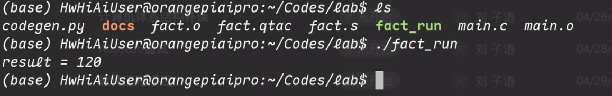
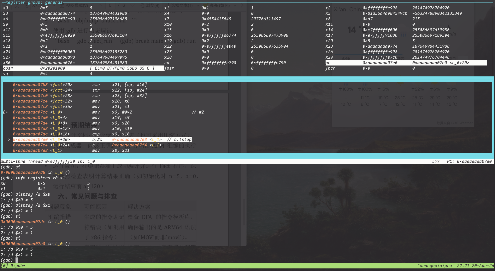
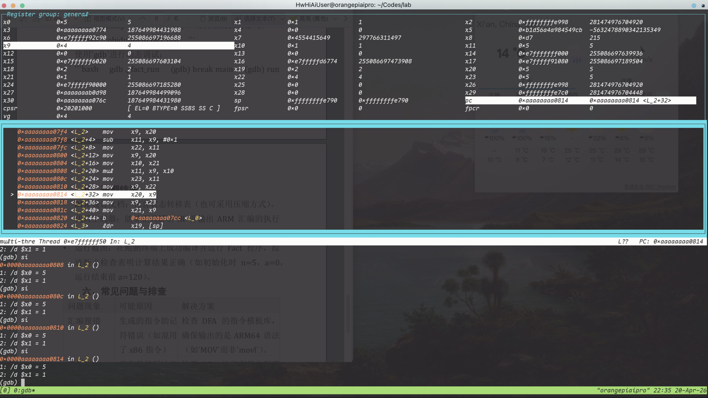
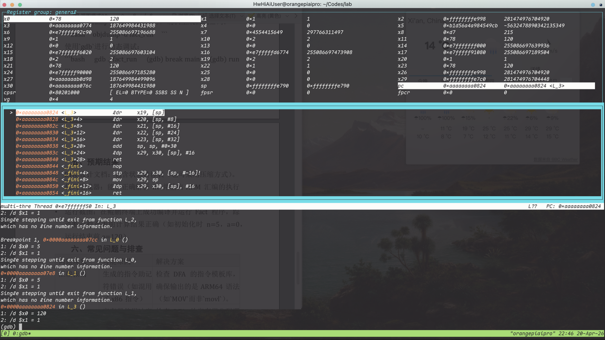

# 实验报告：基于中间语言与指令模板的多语言联合 DFA 构建及验证

## 1. 实验目的

本实验要求根据 QTAC 中间语言与 Q2ARM 指令模板，构建面向代码生成的 $\sigma$-DFA，并实现一个能够把 QTAC 程序翻译为 ARM64 汇编的代码生成器，最后在 ARM64 开发板环境中完成汇编、链接、运行与调试验证。

本报告严格按照实验指导书中的步骤 1、2、3、4、5 的顺序组织。

## 2. 实验环境

- 硬件平台：ARM64 开发板
- 操作系统：Linux ARM64
- 实现语言：Python 3
- 编译工具：GCC
- 调试工具：GDB

## 3. 实验原理概述

实验文档的核心思想是：

1. 根据 QTAC 模板构造一个正则语言簇 $\mathcal{L}$
2. 对该语言簇建立 $\sigma$-DFA
3. 第一遍先识别和记录模板及其附加信息
4. 第二遍根据模板记录输出 ARM64 指令

本次实现遵循这一思想：

- 第一遍：词法分析 + $\sigma$-DFA 模板识别
- 第二遍：模板到 ARM64 的代码生成

---

## 4. 实验步骤

### 4.1 步骤 1：设计正则语言簇 $\mathcal{L}$

#### 4.1.1 输入符号集合 $\Sigma$

按照实验文档“IR 操作码 + 操作数类型”的思路，本实现不直接以字符作为 DFA 输入，而是先把 QTAC 语句词法化，再将 token 映射为 $\Sigma$ 中的符号。

本实现使用的输入符号集合如下：

| 符号 | 含义 |
| --- | --- |
| `KW_LABEL` | 关键字 `LABEL` |
| `KW_GOTO` | 关键字 `GOTO` |
| `KW_IF` | 关键字 `IF` |
| `KW_THEN` | 关键字 `THEN` |
| `KW_ELSE` | 关键字 `ELSE` |
| `KW_RETURN` | 关键字 `RETURN` |
| `KW_PAR` | 关键字 `PAR` |
| `KW_CALL` | 关键字 `CALL` |
| `KW_NOP` | 关键字 `NOP` |
| `KW_CONVERT` | 关键字 `CONVERT` |
| `KW_M` | 内存关键字 `M` |
| `TYPE` | `INT` / `FLOAT` |
| `VAR` | 变量或临时变量 |
| `LABEL_REF` | 标签名 |
| `NUM` | 立即数 |
| `EQ` | `=` |
| `AOP` | `+ - * /` |
| `ROP` | `< <= > >= == !=` |
| `COMMA` | `,` |
| `LBRACK` | `[` |
| `RBRACK` | `]` |
| `AMP` | `&` |

#### 4.1.2 语言簇 $\mathcal{L}$ 的设计

根据 QTAC 文法和 Q2ARM 左列模板，本实现选取如下语句模板子集构成语言簇 $\mathcal{L}$：

$$
\begin{aligned}
L_{\mathrm{LABEL}}   &= \{\text{LABEL } l\} \\
L_{\mathrm{GOTO}}    &= \{\text{GOTO } b\} \\
L_{\mathrm{RETURN}}  &= \{\text{RETURN } a\} \\
L_{\mathrm{PAR}}     &= \{\text{PAR } a\} \\
L_{\mathrm{IF}}      &= \{\text{IF } q\ \mathrm{rop}\ a\ \text{THEN } l\ \text{ELSE } l\} \\
L_{\mathrm{MOVE}}    &= \{q = a\} \\
L_{\mathrm{AOP}}     &= \{q = q\ \mathrm{aop}\ a\} \\
L_{\mathrm{CALL}}    &= \{q = \text{CALL } d, k\} \\
L_{\mathrm{LDR0}}    &= \{q = M[b]\} \\
L_{\mathrm{STR0}}    &= \{M[b] = q\} \\
L_{\mathrm{ADDR}}    &= \{q = \&b\} \\
L_{\mathrm{CONVERT}} &= \{q = \text{CONVERT } q, t\} \\
L_{\mathrm{NOP}}     &= \{\text{NOP}\}
\end{aligned}
$$

其中：

- `q` 为变量或临时变量
- `a` 为变量或立即数
- `b` 为变量或标签
- `l` 为标签
- `d` 为函数名
- `t` 为类型 `INT` 或 `FLOAT`

#### 4.1.3 两两不相交的处理

实验文档要求语言簇中的语言尽量两两不相交。本实现通过“词法记号 + 前最大化原则 + 模板分类”保证可区分性：

1. 以关键字开头的语句，如 `LABEL`、`GOTO`、`RETURN`、`IF`、`PAR`、`NOP`，首记号不同，天然可区分。
2. 以变量开头的语句统一先经过 `q = ...` 路径，再根据 `=` 右侧的第一个记号细分为：
   - `q = a` 对应 `L_MOVE`
   - `q = q aop a` 对应 `L_AOP`
   - `q = CALL d, k` 对应 `L_CALL`
   - `q = M[b]` 对应 `L_LDR0`
   - `q = &b` 对应 `L_ADDR`
   - `q = CONVERT q, t` 对应 `L_CONVERT`
3. `M[b] = q` 单独从关键字 `M` 进入 `L_STR0`。

因此，在词法层归一化后，这一组模板语言可通过有限状态识别过程进行区分。

---

### 4.2 步骤 2：构建 $\sigma$-DFA（设计与建模）

#### 4.2.1 状态集合 Q

本实验的 $\sigma$-DFA 以“一条 QTAC 语句”为识别单位，初始状态为 `S0`，识别结束后停在某个接受态，并由接受态标签决定模板类型。

状态集合 $Q$ 定义为：

$$
\begin{aligned}
Q = \{&
\text{S0}, \\
&\text{S\_LABEL\_1}, \text{S\_GOTO\_1}, \text{S\_RETURN\_1}, \text{S\_PAR\_1}, \\
&\text{S\_IF\_1}, \text{S\_IF\_2}, \text{S\_IF\_3}, \text{S\_IF\_4}, \text{S\_IF\_5}, \text{S\_IF\_5\_TRUE}, \text{S\_IF\_5\_ELSE}, \\
&\text{S\_ASSIGN\_1}, \text{S\_ASSIGN\_2}, \text{S\_ASSIGN\_3}, \\
&\text{S\_CALL\_1}, \text{S\_CALL\_2}, \text{S\_CALL\_3}, \\
&\text{S\_AOP\_1}, \\
&\text{S\_LOAD\_1}, \text{S\_LOAD\_2}, \text{S\_LOAD\_3}, \\
&\text{S\_STORE\_1}, \text{S\_STORE\_2}, \text{S\_STORE\_3}, \text{S\_STORE\_4}, \text{S\_STORE\_5}, \\
&\text{S\_ADDR\_1}, \\
&\text{S\_CONV\_1}, \text{S\_CONV\_2}, \text{S\_CONV\_3}, \\
&\text{ACC\_LABEL}, \text{ACC\_GOTO}, \text{ACC\_RETURN}, \text{ACC\_PAR}, \text{ACC\_IF}, \\
&\text{ACC\_MOVE}, \text{ACC\_AOP}, \text{ACC\_CALL}, \text{ACC\_LOAD0}, \text{ACC\_STORE0}, \\
&\text{ACC\_ADDR}, \text{ACC\_CONVERT}, \text{ACC\_NOP}
\}
\end{aligned}
$$

其中：

- `S0` 是初始状态
- `ACC_*` 是接受状态
- 其余 `S_*` 是中间识别状态

#### 4.2.2 接受态及其标签

接受态与模板标签的对应关系如下：

| 接受态 | 标签 |
| --- | --- |
| `ACC_LABEL` | `T_LABEL` |
| `ACC_GOTO` | `T_GOTO` |
| `ACC_RETURN` | `T_RETURN` |
| `ACC_PAR` | `T_PAR` |
| `ACC_IF` | `T_IF` |
| `ACC_MOVE` | `T_MOVE` |
| `ACC_AOP` | `T_AOP` |
| `ACC_CALL` | `T_CALL` |
| `ACC_LOAD0` | `T_LDR0` |
| `ACC_STORE0` | `T_STR0` |
| `ACC_ADDR` | `T_ADDR` |
| `ACC_CONVERT` | `T_CONVERT` |
| `ACC_NOP` | `T_NOP` |

#### 4.2.3 状态转移函数 $\delta$

状态转移函数定义为：

$$
\delta: Q \times \Sigma \rightarrow Q
$$

其意义是：当前状态读入一个输入符号后，转移到下一个状态。

例如对于条件语句：

$$
IF \,\, n < T_1\,\, THEN\,\, L_1\,\, ELSE\,\, L_2
$$

其状态转移过程为：

$$
\begin{aligned}
\delta(\text{S0}, \text{KW\_IF}) &= \text{S\_IF\_1} \\
\delta(\text{S\_IF\_1}, \text{VAR}) &= \text{S\_IF\_2} \\
\delta(\text{S\_IF\_2}, \text{ROP}) &= \text{S\_IF\_3} \\
\delta(\text{S\_IF\_3}, \text{VAR}) &= \text{S\_IF\_4} \\
\delta(\text{S\_IF\_4}, \text{KW\_THEN}) &= \text{S\_IF\_5} \\
\delta(\text{S\_IF\_5}, \text{LABEL\_REF}) &= \text{S\_IF\_5\_TRUE} \\
\delta(\text{S\_IF\_5\_TRUE}, \text{KW\_ELSE}) &= \text{S\_IF\_5\_ELSE} \\
\delta(\text{S\_IF\_5\_ELSE}, \text{LABEL\_REF}) &= \text{ACC\_IF}
\end{aligned}
$$

因此该语句会被识别为 `T_IF`。

#### 4.2.4 DELTA[][] 转移表

实验文档要求构建 `DELTA[][]`。本实现将其编码为 `codegen.py` 中的 `DELTA` 字典。其核心转移表如下：

| 当前状态 | 输入符号 | 下一状态 |
| --- | --- | --- |
| `S0` | `KW_LABEL` | `S_LABEL_1` |
| `S0` | `KW_GOTO` | `S_GOTO_1` |
| `S0` | `KW_RETURN` | `S_RETURN_1` |
| `S0` | `KW_IF` | `S_IF_1` |
| `S0` | `VAR` | `S_ASSIGN_1` |
| `S0` | `KW_PAR` | `S_PAR_1` |
| `S0` | `KW_M` | `S_STORE_1` |
| `S0` | `KW_NOP` | `ACC_NOP` |
| `S_LABEL_1` | `LABEL_REF` | `ACC_LABEL` |
| `S_GOTO_1` | `LABEL_REF` / `VAR` | `ACC_GOTO` |
| `S_RETURN_1` | `VAR` / `NUM` | `ACC_RETURN` |
| `S_PAR_1` | `VAR` / `NUM` | `ACC_PAR` |
| `S_IF_1` | `VAR` | `S_IF_2` |
| `S_IF_2` | `ROP` | `S_IF_3` |
| `S_IF_3` | `VAR` / `NUM` | `S_IF_4` |
| `S_IF_4` | `KW_THEN` | `S_IF_5` |
| `S_IF_5` | `LABEL_REF` | `S_IF_5_TRUE` |
| `S_IF_5_TRUE` | `KW_ELSE` | `S_IF_5_ELSE` |
| `S_IF_5_ELSE` | `LABEL_REF` | `ACC_IF` |
| `S_ASSIGN_1` | `EQ` | `S_ASSIGN_2` |
| `S_ASSIGN_2` | `VAR` | `S_ASSIGN_3` |
| `S_ASSIGN_2` | `NUM` | `ACC_MOVE` |
| `S_ASSIGN_2` | `KW_CALL` | `S_CALL_1` |
| `S_ASSIGN_2` | `KW_M` | `S_LOAD_1` |
| `S_ASSIGN_2` | `AMP` | `S_ADDR_1` |
| `S_ASSIGN_2` | `KW_CONVERT` | `S_CONV_1` |
| `S_ASSIGN_3` | `AOP` | `S_AOP_1` |
| `S_AOP_1` | `VAR` / `NUM` | `ACC_AOP` |
| `S_CALL_1` | `VAR` | `S_CALL_2` |
| `S_CALL_2` | `COMMA` | `S_CALL_3` |
| `S_CALL_3` | `NUM` | `ACC_CALL` |
| `S_LOAD_1` | `LBRACK` | `S_LOAD_2` |
| `S_LOAD_2` | `VAR` / `LABEL_REF` | `S_LOAD_3` |
| `S_LOAD_3` | `RBRACK` | `ACC_LOAD0` |
| `S_STORE_1` | `LBRACK` | `S_STORE_2` |
| `S_STORE_2` | `VAR` / `LABEL_REF` | `S_STORE_3` |
| `S_STORE_3` | `RBRACK` | `S_STORE_4` |
| `S_STORE_4` | `EQ` | `S_STORE_5` |
| `S_STORE_5` | `VAR` | `ACC_STORE0` |
| `S_ADDR_1` | `VAR` / `LABEL_REF` | `ACC_ADDR` |
| `S_CONV_1` | `VAR` | `S_CONV_2` |
| `S_CONV_2` | `COMMA` | `S_CONV_3` |
| `S_CONV_3` | `TYPE` | `ACC_CONVERT` |

补充说明：

- 对于 `q = a` 形式，语句扫描结束时如果停在 `S_ASSIGN_3` 且未继续读到 `AOP`，则按 `T_MOVE` 接受。
- 若查表时无对应转移，则说明该语句不属于当前支持的模板集合。

#### 4.2.5 附加信息管理方式

文档要求考虑词法单元的附加信息。本实现采用“DFA 识别模板 + 独立保存参数”的方式：

1. $\sigma$-DFA 只决定语句属于哪个模板。
2. 一旦到达接受态，再根据模板与 token 序列抽取参数。

例如：

```text
T_AOP(dst=T_2, left=n, op=-, right=1)
T_IF(left=n, op=<, right=T_1, true_label=L_1, false_label=L_2)
```

这些附加信息由 `Statement(template, data)` 保存，供第二遍代码生成使用。

---

### 4.3 步骤 3：程序实现代码生成器

#### 4.3.1 实现方式

实验文档允许使用硬编码、表驱动或自动生成三种方式之一。本次实现选择**表驱动**方式。

其基本流程如下：

1. 读取 `.qtac` 文件或标准输入
2. 解析外层 `d@code=[...]`
3. 将程序按 `;` 拆分为一条条语句
4. 对每条语句词法分析并映射到 $\Sigma$
5. 使用 `DELTA` 表驱动识别模板
6. 抽取模板附加信息
7. 第二遍将模板记录映射成 ARM64 汇编
8. 输出 `.s` 文件

#### 4.3.2 表驱动体现

本实现的“表驱动”主要体现为：

1. 使用 `DELTA` 表完成 DFA 状态转移。
2. 使用 `ACCEPT_LABELS` 表完成“接受态 -> 模板标签”的映射。
3. 第一遍输出的不是 ARM 指令，而是模板记录。
4. 第二遍再根据模板记录生成汇编，避免识别与输出紧耦合。

#### 4.3.3 代码结构

```python
#!/usr/bin/env python3
from __future__ import annotations

from dataclasses import dataclass
from pathlib import Path
import math
import re
import sys


OUTER_RE = re.compile(
    r"\s*([A-Za-z_][A-Za-z0-9_]*)\s*@\s*code\s*=\s*\[(.*)\]\s*\Z",
    re.S,
)

TOKEN_RE = re.compile(
    r"""
    (?P<WS>\s+)
  | (?P<ROP><=|>=|==|!=|<|>)
  | (?P<SYM>[\[\],;=&+\-*/])
  | (?P<LABEL>L_[0-9]+)
  | (?P<TEMP>T_[0-9]+)
  | (?P<NUMBER>[0-9]+)
  | (?P<IDENT>[A-Za-z_][A-Za-z0-9_]*)
    """,
    re.VERBOSE,
)

KEYWORDS = {
    "LABEL",
    "GOTO",
    "IF",
    "THEN",
    "ELSE",
    "PAR",
    "CALL",
    "RETURN",
    "NOP",
    "CONVERT",
    "INT",
    "FLOAT",
    "M",
}

SIGMA = {
    "KW_LABEL",
    "KW_GOTO",
    "KW_IF",
    "KW_THEN",
    "KW_ELSE",
    "KW_RETURN",
    "KW_PAR",
    "KW_CALL",
    "KW_NOP",
    "KW_CONVERT",
    "KW_M",
    "TYPE",
    "VAR",
    "LABEL_REF",
    "NUM",
    "EQ",
    "AOP",
    "ROP",
    "COMMA",
    "LBRACK",
    "RBRACK",
    "AMP",
}

STATES = {
    "S0",
    "S_LABEL_1",
    "S_GOTO_1",
    "S_RETURN_1",
    "S_PAR_1",
    "S_IF_1",
    "S_IF_2",
    "S_IF_3",
    "S_IF_4",
    "S_IF_5",
    "S_ASSIGN_1",
    "S_ASSIGN_2",
    "S_ASSIGN_3",
    "S_CALL_1",
    "S_CALL_2",
    "S_CALL_3",
    "S_AOP_1",
    "S_LOAD_1",
    "S_LOAD_2",
    "S_LOAD_3",
    "S_STORE_1",
    "S_STORE_2",
    "S_STORE_3",
    "S_STORE_4",
    "S_ADDR_1",
    "S_CONV_1",
    "S_CONV_2",
    "S_CONV_3",
    "ACC_LABEL",
    "ACC_GOTO",
    "ACC_RETURN",
    "ACC_PAR",
    "ACC_IF",
    "ACC_MOVE",
    "ACC_AOP",
    "ACC_CALL",
    "ACC_LOAD0",
    "ACC_STORE0",
    "ACC_ADDR",
    "ACC_CONVERT",
    "ACC_NOP",
}

ACCEPT_LABELS = {
    "ACC_LABEL": "T_LABEL",
    "ACC_GOTO": "T_GOTO",
    "ACC_RETURN": "T_RETURN",
    "ACC_PAR": "T_PAR",
    "ACC_IF": "T_IF",
    "ACC_MOVE": "T_MOVE",
    "ACC_AOP": "T_AOP",
    "ACC_CALL": "T_CALL",
    "ACC_LOAD0": "T_LDR0",
    "ACC_STORE0": "T_STR0",
    "ACC_ADDR": "T_ADDR",
    "ACC_CONVERT": "T_CONVERT",
    "ACC_NOP": "T_NOP",
}

DELTA: dict[str, dict[str, str]] = {
    "S0": {
        "KW_LABEL": "S_LABEL_1",
        "KW_GOTO": "S_GOTO_1",
        "KW_RETURN": "S_RETURN_1",
        "KW_IF": "S_IF_1",
        "VAR": "S_ASSIGN_1",
        "KW_PAR": "S_PAR_1",
        "KW_M": "S_STORE_1",
        "KW_NOP": "ACC_NOP",
    },
    "S_LABEL_1": {
        "LABEL_REF": "ACC_LABEL",
    },
    "S_GOTO_1": {
        "LABEL_REF": "ACC_GOTO",
        "VAR": "ACC_GOTO",
    },
    "S_RETURN_1": {
        "VAR": "ACC_RETURN",
        "NUM": "ACC_RETURN",
    },
    "S_PAR_1": {
        "VAR": "ACC_PAR",
        "NUM": "ACC_PAR",
    },
    "S_IF_1": {
        "VAR": "S_IF_2",
    },
    "S_IF_2": {
        "ROP": "S_IF_3",
    },
    "S_IF_3": {
        "VAR": "S_IF_4",
        "NUM": "S_IF_4",
    },
    "S_IF_4": {
        "KW_THEN": "S_IF_5",
    },
    "S_IF_5": {
        "LABEL_REF": "S_IF_5_TRUE",
    },
    "S_IF_5_TRUE": {
        "KW_ELSE": "S_IF_5_ELSE",
    },
    "S_IF_5_ELSE": {
        "LABEL_REF": "ACC_IF",
    },
    "S_ASSIGN_1": {
        "EQ": "S_ASSIGN_2",
    },
    "S_ASSIGN_2": {
        "VAR": "S_ASSIGN_3",
        "NUM": "ACC_MOVE",
        "KW_CALL": "S_CALL_1",
        "KW_M": "S_LOAD_1",
        "AMP": "S_ADDR_1",
        "KW_CONVERT": "S_CONV_1",
    },
    "S_ASSIGN_3": {
        "AOP": "S_AOP_1",
    },
    "S_CALL_1": {
        "VAR": "S_CALL_2",
    },
    "S_CALL_2": {
        "COMMA": "S_CALL_3",
    },
    "S_CALL_3": {
        "NUM": "ACC_CALL",
    },
    "S_AOP_1": {
        "VAR": "ACC_AOP",
        "NUM": "ACC_AOP",
    },
    "S_LOAD_1": {
        "LBRACK": "S_LOAD_2",
    },
    "S_LOAD_2": {
        "VAR": "S_LOAD_3",
        "LABEL_REF": "S_LOAD_3",
    },
    "S_LOAD_3": {
        "RBRACK": "ACC_LOAD0",
    },
    "S_STORE_1": {
        "LBRACK": "S_STORE_2",
    },
    "S_STORE_2": {
        "VAR": "S_STORE_3",
        "LABEL_REF": "S_STORE_3",
    },
    "S_STORE_3": {
        "RBRACK": "S_STORE_4",
    },
    "S_STORE_4": {
        "EQ": "S_STORE_5",
    },
    "S_STORE_5": {
        "VAR": "ACC_STORE0",
    },
    "S_ADDR_1": {
        "VAR": "ACC_ADDR",
        "LABEL_REF": "ACC_ADDR",
    },
    "S_CONV_1": {
        "VAR": "S_CONV_2",
    },
    "S_CONV_2": {
        "COMMA": "S_CONV_3",
    },
    "S_CONV_3": {
        "TYPE": "ACC_CONVERT",
    },
}

ARG_REGS = [f"X{i}" for i in range(8)]
CALLEE_SAVED = [f"X{i}" for i in range(19, 29)]
SCRATCH = ["X9", "X10", "X11", "X12", "X13", "X14", "X15"]

BRANCH_MAP = {
    "<": "B.LT",
    "<=": "B.LE",
    ">": "B.GT",
    ">=": "B.GE",
    "==": "B.EQ",
    "!=": "B.NE",
}

AOP_INSTR = {
    "+": "ADD",
    "-": "SUB",
    "*": "MUL",
    "/": "SDIV",
}


@dataclass(frozen=True)
class Token:
    kind: str
    text: str


@dataclass(frozen=True)
class Operand:
    kind: str
    value: str


@dataclass(frozen=True)
class Statement:
    template: str
    data: dict


@dataclass(frozen=True)
class Location:
    kind: str
    value: str | int


def tokenize(text: str) -> list[Token]:
    pos = 0
    tokens: list[Token] = []
    while pos < len(text):
        match = TOKEN_RE.match(text, pos)
        if not match:
            raise ValueError(f"无法识别的输入片段: {text[pos:pos + 30]!r}")
        pos = match.end()
        kind = match.lastgroup
        value = match.group()
        if kind == "WS":
            continue
        if kind == "IDENT" and value in KEYWORDS:
            tokens.append(Token("KEYWORD", value))
        elif kind == "SYM":
            tokens.append(Token(value, value))
        else:
            tokens.append(Token(kind, value))
    return tokens


def sigma_of(token: Token) -> str:
    if token.kind == "KEYWORD":
        mapping = {
            "LABEL": "KW_LABEL",
            "GOTO": "KW_GOTO",
            "IF": "KW_IF",
            "THEN": "KW_THEN",
            "ELSE": "KW_ELSE",
            "RETURN": "KW_RETURN",
            "PAR": "KW_PAR",
            "CALL": "KW_CALL",
            "NOP": "KW_NOP",
            "CONVERT": "KW_CONVERT",
            "M": "KW_M",
            "INT": "TYPE",
            "FLOAT": "TYPE",
        }
        return mapping[token.text]
    if token.kind in {"IDENT", "TEMP"}:
        return "VAR"
    if token.kind == "LABEL":
        return "LABEL_REF"
    if token.kind == "NUMBER":
        return "NUM"
    if token.kind == "ROP":
        return "ROP"
    if token.text == "=":
        return "EQ"
    if token.text in {"+", "-", "*", "/"}:
        return "AOP"
    if token.text == ",":
        return "COMMA"
    if token.text == "[":
        return "LBRACK"
    if token.text == "]":
        return "RBRACK"
    if token.text == "&":
        return "AMP"
    raise ValueError(f"无法映射到字母表的 token: {token}")


def split_outer(text: str) -> tuple[str, str]:
    match = OUTER_RE.match(text)
    if not match:
        raise ValueError("输入不是合法的 d@code=[...] 格式")
    return match.group(1), match.group(2)


def classify_statement(tokens: list[Token]) -> str:
    state = "S0"
    for token in tokens:
        sigma = sigma_of(token)
        trans = DELTA.get(state, {})
        if sigma not in trans:
            token_text = " ".join(tok.text for tok in tokens)
            raise ValueError(f"语句无法被 DFA 接受: {token_text}，状态 {state} 遇到符号 {sigma}")
        state = trans[sigma]
    if state == "S_ASSIGN_3":
        state = "ACC_MOVE"
    if state not in ACCEPT_LABELS:
        token_text = " ".join(tok.text for tok in tokens)
        raise ValueError(f"语句未停在接受态: {token_text}，结束状态 {state}")
    return ACCEPT_LABELS[state]


def parse_operand(token: Token) -> Operand:
    sigma = sigma_of(token)
    if sigma == "VAR":
        return Operand("var", token.text)
    if sigma == "NUM":
        return Operand("imm", token.text)
    if sigma == "LABEL_REF":
        return Operand("label", token.text)
    raise ValueError(f"无法解析为操作数: {token.text}")


def statement_from_tokens(template: str, tokens: list[Token]) -> Statement:
    if template == "T_LABEL":
        return Statement(template, {"label": tokens[1].text})
    if template == "T_GOTO":
        return Statement(template, {"target": parse_operand(tokens[1])})
    if template == "T_RETURN":
        return Statement(template, {"value": parse_operand(tokens[1])})
    if template == "T_PAR":
        return Statement(template, {"value": parse_operand(tokens[1])})
    if template == "T_IF":
        return Statement(
            template,
            {
                "left": parse_operand(tokens[1]),
                "op": tokens[2].text,
                "right": parse_operand(tokens[3]),
                "true_label": tokens[5].text,
                "false_label": tokens[7].text,
            },
        )
    if template == "T_MOVE":
        return Statement(
            template,
            {"dst": parse_operand(tokens[0]), "src": parse_operand(tokens[2])},
        )
    if template == "T_AOP":
        return Statement(
            template,
            {
                "dst": parse_operand(tokens[0]),
                "left": parse_operand(tokens[2]),
                "op": tokens[3].text,
                "right": parse_operand(tokens[4]),
            },
        )
    if template == "T_CALL":
        return Statement(
            template,
            {
                "dst": parse_operand(tokens[0]),
                "func": tokens[3].text,
                "argc": int(tokens[5].text),
            },
        )
    if template == "T_LDR0":
        return Statement(
            template,
            {
                "dst": parse_operand(tokens[0]),
                "base": parse_operand(tokens[4]),
            },
        )
    if template == "T_STR0":
        return Statement(
            template,
            {
                "base": parse_operand(tokens[2]),
                "src": parse_operand(tokens[5]),
            },
        )
    if template == "T_ADDR":
        return Statement(
            template,
            {
                "dst": parse_operand(tokens[0]),
                "base": parse_operand(tokens[3]),
            },
        )
    if template == "T_CONVERT":
        return Statement(
            template,
            {
                "dst": parse_operand(tokens[0]),
                "src": parse_operand(tokens[3]),
                "type": tokens[5].text,
            },
        )
    if template == "T_NOP":
        return Statement(template, {})
    raise ValueError(f"未实现的模板解析: {template}")


def parse_program(text: str) -> tuple[str, list[Statement]]:
    func_name, body = split_outer(text)
    raw_statements = [part.strip() for part in body.split(";") if part.strip()]
    statements: list[Statement] = []
    for stmt_text in raw_statements:
        tokens = tokenize(stmt_text)
        template = classify_statement(tokens)
        statements.append(statement_from_tokens(template, tokens))
    return func_name, statements


def stmt_reads_writes(stmt: Statement) -> tuple[list[str], list[str]]:
    reads: list[str] = []
    writes: list[str] = []
    data = stmt.data

    def read_operand(op: Operand) -> None:
        if op.kind == "var":
            reads.append(op.value)

    if stmt.template == "T_MOVE":
        writes.append(data["dst"].value)
        read_operand(data["src"])
    elif stmt.template == "T_AOP":
        writes.append(data["dst"].value)
        read_operand(data["left"])
        read_operand(data["right"])
    elif stmt.template == "T_IF":
        read_operand(data["left"])
        read_operand(data["right"])
    elif stmt.template == "T_RETURN":
        read_operand(data["value"])
    elif stmt.template == "T_PAR":
        read_operand(data["value"])
    elif stmt.template == "T_CALL":
        writes.append(data["dst"].value)
    elif stmt.template == "T_LDR0":
        writes.append(data["dst"].value)
        read_operand(data["base"])
    elif stmt.template == "T_STR0":
        read_operand(data["base"])
        read_operand(data["src"])
    elif stmt.template == "T_ADDR":
        writes.append(data["dst"].value)
        read_operand(data["base"])
    elif stmt.template == "T_CONVERT":
        writes.append(data["dst"].value)
        read_operand(data["src"])
    elif stmt.template == "T_GOTO":
        read_operand(data["target"])

    return dedupe(reads), dedupe(writes)


def dedupe(items: list[str]) -> list[str]:
    seen: set[str] = set()
    out: list[str] = []
    for item in items:
        if item not in seen:
            seen.add(item)
            out.append(item)
    return out


def collect_symbols(statements: list[Statement]) -> tuple[list[str], list[str]]:
    symbols: list[str] = []
    symbol_set: set[str] = set()
    params: list[str] = []
    param_set: set[str] = set()
    defined: set[str] = set()

    for stmt in statements:
        reads, writes = stmt_reads_writes(stmt)
        for sym in reads:
            if sym not in symbol_set:
                symbol_set.add(sym)
                symbols.append(sym)
            if sym not in defined and sym not in param_set:
                param_set.add(sym)
                params.append(sym)
        for sym in writes:
            if sym not in symbol_set:
                symbol_set.add(sym)
                symbols.append(sym)
            defined.add(sym)
    return symbols, params


def assign_locations(symbols: list[str]) -> dict[str, Location]:
    locations: dict[str, Location] = {}
    stack_index = 0
    for idx, sym in enumerate(symbols):
        if idx < len(CALLEE_SAVED):
            locations[sym] = Location("reg", CALLEE_SAVED[idx])
        else:
            locations[sym] = Location("stack", stack_index * 8)
            stack_index += 1
    return locations


class CodegenContext:
    def __init__(self, func_name: str, statements: list[Statement]):
        self.func_name = func_name
        self.statements = statements
        self.symbols, self.params = collect_symbols(statements)
        if len(self.params) > len(ARG_REGS):
            raise ValueError("当前版本最多支持 8 个入口参数")
        self.locations = assign_locations(self.symbols)
        self.used_callee = dedupe(
            [loc.value for loc in self.locations.values() if loc.kind == "reg"]
        )
        self.stack_slots = sum(1 for loc in self.locations.values() if loc.kind == "stack")
        self.save_area = len(self.used_callee) * 8
        self.local_area = self.stack_slots * 8
        raw_frame = self.save_area + self.local_area
        self.frame_size = int(math.ceil(raw_frame / 16.0) * 16)
        self.return_label = f".L_return_{func_name}"
        self.pending_args: list[Operand] = []
        self.out: list[str] = []

    def emit(self, line: str) -> None:
        self.out.append(line)

    def save_offset(self, idx: int) -> int:
        return idx * 8

    def symbol_offset(self, name: str) -> int:
        loc = self.locations[name]
        if loc.kind != "stack":
            raise ValueError(f"{name} 不在栈上")
        return self.save_area + int(loc.value)

    def load_symbol(self, name: str, reg: str) -> str:
        loc = self.locations[name]
        if loc.kind == "reg":
            phys = str(loc.value)
            if phys != reg:
                self.emit(f"    MOV {reg}, {phys}")
            return reg
        self.emit(f"    LDR {reg}, [SP, #{self.symbol_offset(name)}]")
        return reg

    def store_symbol(self, name: str, reg: str) -> None:
        loc = self.locations[name]
        if loc.kind == "reg":
            phys = str(loc.value)
            if phys != reg:
                self.emit(f"    MOV {phys}, {reg}")
            return
        self.emit(f"    STR {reg}, [SP, #{self.symbol_offset(name)}]")

    def load_operand(self, operand: Operand, reg: str) -> str:
        if operand.kind == "imm":
            self.emit(f"    MOV {reg}, #{operand.value}")
            return reg
        if operand.kind == "var":
            return self.load_symbol(operand.value, reg)
        raise ValueError(f"当前不支持直接加载操作数 {operand.kind}")

    def emit_prologue(self) -> None:
        self.emit(".text")
        self.emit(f".global {self.func_name}")
        self.emit(f"{self.func_name}:")
        self.emit("    STP X29, X30, [SP, #-16]!")
        self.emit("    MOV X29, SP")
        if self.frame_size:
            self.emit(f"    SUB SP, SP, #{self.frame_size}")
        for idx, reg in enumerate(self.used_callee):
            self.emit(f"    STR {reg}, [SP, #{self.save_offset(idx)}]")
        for idx, param in enumerate(self.params):
            self.store_symbol(param, ARG_REGS[idx])

    def emit_epilogue(self) -> None:
        self.emit(f"{self.return_label}:")
        for idx, reg in enumerate(self.used_callee):
            self.emit(f"    LDR {reg}, [SP, #{self.save_offset(idx)}]")
        if self.frame_size:
            self.emit(f"    ADD SP, SP, #{self.frame_size}")
        self.emit("    LDP X29, X30, [SP], #16")
        self.emit("    RET")

    def emit_stmt(self, stmt: Statement) -> None:
        data = stmt.data
        tpl = stmt.template

        if tpl == "T_LABEL":
            self.emit(f"{data['label']}:")
            return

        if tpl == "T_GOTO":
            target = data["target"]
            if target.kind == "label":
                self.emit(f"    B {target.value}")
            else:
                reg = self.load_symbol(target.value, SCRATCH[0])
                self.emit(f"    BR {reg}")
            return

        if tpl == "T_RETURN":
            value = data["value"]
            if value.kind == "imm":
                self.emit(f"    MOV X0, #{value.value}")
            else:
                self.load_symbol(value.value, "X0")
            self.emit(f"    B {self.return_label}")
            return

        if tpl == "T_PAR":
            self.pending_args.append(data["value"])
            return

        if tpl == "T_CALL":
            argc = data["argc"]
            if argc != len(self.pending_args):
                raise ValueError(f"CALL 需要 {argc} 个 PAR，当前为 {len(self.pending_args)}")
            for idx, operand in enumerate(self.pending_args):
                target = ARG_REGS[idx]
                if operand.kind == "imm":
                    self.emit(f"    MOV {target}, #{operand.value}")
                else:
                    self.load_symbol(operand.value, target)
            self.emit(f"    BL {data['func']}")
            self.store_symbol(data["dst"].value, "X0")
            self.pending_args.clear()
            return

        if tpl == "T_MOVE":
            src = data["src"]
            if src.kind == "imm":
                self.emit(f"    MOV {SCRATCH[0]}, #{src.value}")
            else:
                self.load_symbol(src.value, SCRATCH[0])
            self.store_symbol(data["dst"].value, SCRATCH[0])
            return

        if tpl == "T_AOP":
            left = self.load_operand(data["left"], SCRATCH[0])
            result = SCRATCH[2]
            op = data["op"]
            right = data["right"]
            if op in {"+", "-"} and right.kind == "imm":
                self.emit(f"    {AOP_INSTR[op]} {result}, {left}, #{right.value}")
            else:
                right_reg = self.load_operand(right, SCRATCH[1])
                self.emit(f"    {AOP_INSTR[op]} {result}, {left}, {right_reg}")
            self.store_symbol(data["dst"].value, result)
            return

        if tpl == "T_IF":
            left = self.load_operand(data["left"], SCRATCH[0])
            right = data["right"]
            if right.kind == "imm":
                self.emit(f"    MOV {SCRATCH[1]}, #{right.value}")
            else:
                self.load_symbol(right.value, SCRATCH[1])
            self.emit(f"    CMP {left}, {SCRATCH[1]}")
            self.emit(f"    {BRANCH_MAP[data['op']]} {data['true_label']}")
            self.emit(f"    B {data['false_label']}")
            return

        if tpl == "T_LDR0":
            base = data["base"]
            if base.kind == "label":
                self.emit(f"    ADR {SCRATCH[0]}, {base.value}")
            else:
                self.load_symbol(base.value, SCRATCH[0])
            self.emit(f"    LDR {SCRATCH[1]}, [{SCRATCH[0]}]")
            self.store_symbol(data["dst"].value, SCRATCH[1])
            return

        if tpl == "T_STR0":
            base = data["base"]
            if base.kind == "label":
                self.emit(f"    ADR {SCRATCH[0]}, {base.value}")
            else:
                self.load_symbol(base.value, SCRATCH[0])
            self.load_symbol(data["src"].value, SCRATCH[1])
            self.emit(f"    STR {SCRATCH[1]}, [{SCRATCH[0]}]")
            return

        if tpl == "T_ADDR":
            base = data["base"]
            if base.kind == "label":
                self.emit(f"    ADR {SCRATCH[0]}, {base.value}")
            else:
                self.load_symbol(base.value, SCRATCH[0])
            self.store_symbol(data["dst"].value, SCRATCH[0])
            return

        if tpl == "T_CONVERT":
            self.load_symbol(data["src"].value, SCRATCH[0])
            self.store_symbol(data["dst"].value, SCRATCH[0])
            return

        if tpl == "T_NOP":
            self.emit("    NOP")
            return

        raise ValueError(f"未实现的模板生成: {tpl}")

    def generate(self) -> str:
        self.emit_prologue()
        for stmt in self.statements:
            self.emit_stmt(stmt)
        self.emit_epilogue()
        return "\n".join(self.out) + "\n"


def generate_asm(text: str) -> str:
    func_name, statements = parse_program(text)
    return CodegenContext(func_name, statements).generate()


def process_file(path_str: str) -> None:
    path = Path(path_str)
    asm = generate_asm(path.read_text(encoding="utf-8"))
    output = path.with_suffix(".s")
    output.write_text(asm, encoding="utf-8")
    print(f"generated {output}")


def main() -> None:
    if len(sys.argv) > 1:
        for arg in sys.argv[1:]:
            process_file(arg)
        return
    print(generate_asm(sys.stdin.read()), end="")


if __name__ == "__main__":
    main()

```

程序中几个关键部分如下：

- `tokenize()`：把 QTAC 语句拆成 token
- `sigma_of()`：把 token 映射到 $\Sigma$
- `classify_statement()`：用 `DELTA` 表执行 $\sigma$-DFA
- `statement_from_tokens()`：提取附加信息并构造模板记录
- `CodegenContext.generate()`：第二遍输出 ARM64 汇编

#### 4.3.4 当前支持的 IR 子集

当前表驱动生成器支持以下 QTAC 子集：

- `LABEL l`
- `GOTO l`
- `GOTO q`
- `RETURN a`
- `PAR a`
- `IF q rop a THEN l ELSE l`
- `q = a`
- `q = q aop a`
- `q = CALL d, k`
- `q = M[b]`
- `M[b] = q`
- `q = &b`
- `q = CONVERT q, t`
- `NOP`


这一程序的两遍处理可以这样总结：

1. 第 1 遍：词法 tokenize + 模板分类 + 参数提取
2. 第 2 遍：从模板到 ARM64

<!-- 在工程结构上，这已经满足实验文档所强调的“不要把识别和输出写死在一起”的要求。 -->

---

### 4.4 步骤 4：利用 fact 程序进行测试与生成

#### 4.4.1 fact 源程序

为了满足实验文档“准备测试源”的要求，我们给出一个示例性质的 fact 源程序 `fact_source.c`：

```c
#include <stdio.h>

long fact_source(long n) {
    long a = 1;
    while (n >= 2) {
        a = n * a;
        n = n - 1;
    }
    return a;
}

int main(void) {
    long result = fact_source(5);
    printf("fact_source(5) = %ld\n", result);
    return 0;
}
```
但是应该说明，这与`.qtac`文件没有关系，`.qtac`文件是单独设计的。

#### 4.4.2 fact 的 QTAC 中间代码

根据实验指导书给出的迭代版本示例，编写如下 `fact.qtac`：
```text
fact@code=[
    LABEL L_0;
    T_1 = 2;
    IF n < T_1 THEN L_1 ELSE L_2;
    LABEL L_1;
    RETURN a;
    GOTO L_3;
    LABEL L_2;
    T_2 = n - 1;
    T_3 = n * a;
    n = T_2;
    a = T_3;
    GOTO L_0;
    LABEL L_3;
]
```

它表达的语义是：

1. 若 `n < 2`，返回 `a`
2. 否则计算 `T_2 = n - 1` 与 `T_3 = n * a`
3. 更新 `n = T_2`、`a = T_3`
4. 回到循环开始位置

#### 4.4.3 运行生成器

生成汇编文件的命令如下：

```bash
python3 codegen_table.py fact.qtac
```

执行后得到 `fact.s`。

本次生成得到的核心汇编片段如下：

```asm
.text
.global fact
fact:
    STP X29, X30, [SP, #-16]!
    MOV X29, SP
    SUB SP, SP, #48
    STR X19, [SP, #0]
    STR X20, [SP, #8]
    STR X21, [SP, #16]
    STR X22, [SP, #24]
    STR X23, [SP, #32]
    MOV X20, X0
    MOV X21, X1
L_0:
    MOV X9, #2
    MOV X19, X9
    MOV X9, X20
    MOV X10, X19
    CMP X9, X10
    B.LT L_1
    B L_2
L_1:
    MOV X0, X21
    B .L_return_fact
    B L_3
L_2:
    MOV X9, X20
    SUB X11, X9, #1
    MOV X22, X11
    MOV X9, X20
    MOV X10, X21
    MUL X11, X9, X10
    MOV X23, X11
    MOV X9, X22
    MOV X20, X9
    MOV X9, X23
    MOV X21, X9
    B L_0
L_3:
.L_return_fact:
    LDR X19, [SP, #0]
    LDR X20, [SP, #8]
    LDR X21, [SP, #16]
    LDR X22, [SP, #24]
    LDR X23, [SP, #32]
    ADD SP, SP, #48
    LDP X29, X30, [SP], #16
    RET

```

可以看到，生成器已经能够把 QTAC 中的变量、条件跳转和算术运算正确翻译成 ARM64 指令。

---

### 4.5 步骤 5：在鲲鹏环境下汇编、运行、调试与优化

#### 4.5.1 C 驱动文件

实验文档允许“编写 C 语言驱动文件调用它”。本实验使用 `main.c`作为驱动：

```c
#include <stdio.h>

long fact(long n, long a);

long fact_entry(long n){
    return fact(n, 1);
}

int main(){
    long result = fact_entry(5);
    printf("result = %ld\n", result);
    return 0;
}
```

这里：

- `fact_entry(5)` 对应数学上的 `5!`
- 底层实际调用的是 `fact(5, 1)`，其中 `a` 是累积结果的初值

#### 4.5.2 汇编、链接与运行

在 ARM64 开发板上执行如下命令：

```bash
gcc -c fact.s -o fact.o
gcc -c main.c -o main.o
gcc main.o fact.o -o fact_run
./fact_run
```

运行结果为：

```text
result = 120
```


这说明：

1. 生成器输出的 `fact.s` 语法正确
2. 生成出的汇编可以被 GCC 汇编并参与链接
3. 最终程序运行结果与 `5! = 120` 一致

#### 4.5.3 调试与优化

进行目标程序调试。命令如下：

```bash
objdump -d fact_run > fact_run.s
gdb ./fact_run
```

下为反汇编得到的汇编代码文件：

```asm

fact_run:     file format elf64-littleaarch64


Disassembly of section .init:

00000000000005b8 <_init>:
 5b8:	d503201f 	nop
 5bc:	a9bf7bfd 	stp	x29, x30, [sp, #-16]!
 5c0:	910003fd 	mov	x29, sp
 5c4:	9400002c 	bl	674 <call_weak_fn>
 5c8:	a8c17bfd 	ldp	x29, x30, [sp], #16
 5cc:	d65f03c0 	ret

Disassembly of section .plt:

00000000000005d0 <.plt>:
 5d0:	a9bf7bf0 	stp	x16, x30, [sp, #-16]!
 5d4:	90000090 	adrp	x16, 10000 <__FRAME_END__+0xf680>
 5d8:	f947d211 	ldr	x17, [x16, #4000]
 5dc:	913e8210 	add	x16, x16, #0xfa0
 5e0:	d61f0220 	br	x17
 5e4:	d503201f 	nop
 5e8:	d503201f 	nop
 5ec:	d503201f 	nop

00000000000005f0 <__libc_start_main@plt>:
 5f0:	90000090 	adrp	x16, 10000 <__FRAME_END__+0xf680>
 5f4:	f947d611 	ldr	x17, [x16, #4008]
 5f8:	913ea210 	add	x16, x16, #0xfa8
 5fc:	d61f0220 	br	x17

0000000000000600 <__cxa_finalize@plt>:
 600:	90000090 	adrp	x16, 10000 <__FRAME_END__+0xf680>
 604:	f947da11 	ldr	x17, [x16, #4016]
 608:	913ec210 	add	x16, x16, #0xfb0
 60c:	d61f0220 	br	x17

0000000000000610 <__gmon_start__@plt>:
 610:	90000090 	adrp	x16, 10000 <__FRAME_END__+0xf680>
 614:	f947de11 	ldr	x17, [x16, #4024]
 618:	913ee210 	add	x16, x16, #0xfb8
 61c:	d61f0220 	br	x17

0000000000000620 <abort@plt>:
 620:	90000090 	adrp	x16, 10000 <__FRAME_END__+0xf680>
 624:	f947e211 	ldr	x17, [x16, #4032]
 628:	913f0210 	add	x16, x16, #0xfc0
 62c:	d61f0220 	br	x17

0000000000000630 <printf@plt>:
 630:	90000090 	adrp	x16, 10000 <__FRAME_END__+0xf680>
 634:	f947e611 	ldr	x17, [x16, #4040]
 638:	913f2210 	add	x16, x16, #0xfc8
 63c:	d61f0220 	br	x17

Disassembly of section .text:

0000000000000640 <_start>:
 640:	d503201f 	nop
 644:	d280001d 	mov	x29, #0x0                   	// #0
 648:	d280001e 	mov	x30, #0x0                   	// #0
 64c:	aa0003e5 	mov	x5, x0
 650:	f94003e1 	ldr	x1, [sp]
 654:	910023e2 	add	x2, sp, #0x8
 658:	910003e6 	mov	x6, sp
 65c:	90000080 	adrp	x0, 10000 <__FRAME_END__+0xf680>
 660:	f947f800 	ldr	x0, [x0, #4080]
 664:	d2800003 	mov	x3, #0x0                   	// #0
 668:	d2800004 	mov	x4, #0x0                   	// #0
 66c:	97ffffe1 	bl	5f0 <__libc_start_main@plt>
 670:	97ffffec 	bl	620 <abort@plt>

0000000000000674 <call_weak_fn>:
 674:	90000080 	adrp	x0, 10000 <__FRAME_END__+0xf680>
 678:	f947f400 	ldr	x0, [x0, #4072]
 67c:	b4000040 	cbz	x0, 684 <call_weak_fn+0x10>
 680:	17ffffe4 	b	610 <__gmon_start__@plt>
 684:	d65f03c0 	ret
 688:	d503201f 	nop
 68c:	d503201f 	nop

0000000000000690 <deregister_tm_clones>:
 690:	b0000080 	adrp	x0, 11000 <__data_start>
 694:	91004000 	add	x0, x0, #0x10
 698:	b0000081 	adrp	x1, 11000 <__data_start>
 69c:	91004021 	add	x1, x1, #0x10
 6a0:	eb00003f 	cmp	x1, x0
 6a4:	540000c0 	b.eq	6bc <deregister_tm_clones+0x2c>  // b.none
 6a8:	90000081 	adrp	x1, 10000 <__FRAME_END__+0xf680>
 6ac:	f947ec21 	ldr	x1, [x1, #4056]
 6b0:	b4000061 	cbz	x1, 6bc <deregister_tm_clones+0x2c>
 6b4:	aa0103f0 	mov	x16, x1
 6b8:	d61f0200 	br	x16
 6bc:	d65f03c0 	ret

00000000000006c0 <register_tm_clones>:
 6c0:	b0000080 	adrp	x0, 11000 <__data_start>
 6c4:	91004000 	add	x0, x0, #0x10
 6c8:	b0000081 	adrp	x1, 11000 <__data_start>
 6cc:	91004021 	add	x1, x1, #0x10
 6d0:	cb000021 	sub	x1, x1, x0
 6d4:	d37ffc22 	lsr	x2, x1, #63
 6d8:	8b810c41 	add	x1, x2, x1, asr #3
 6dc:	9341fc21 	asr	x1, x1, #1
 6e0:	b40000c1 	cbz	x1, 6f8 <register_tm_clones+0x38>
 6e4:	90000082 	adrp	x2, 10000 <__FRAME_END__+0xf680>
 6e8:	f947fc42 	ldr	x2, [x2, #4088]
 6ec:	b4000062 	cbz	x2, 6f8 <register_tm_clones+0x38>
 6f0:	aa0203f0 	mov	x16, x2
 6f4:	d61f0200 	br	x16
 6f8:	d65f03c0 	ret
 6fc:	d503201f 	nop

0000000000000700 <__do_global_dtors_aux>:
 700:	a9be7bfd 	stp	x29, x30, [sp, #-32]!
 704:	910003fd 	mov	x29, sp
 708:	f9000bf3 	str	x19, [sp, #16]
 70c:	b0000093 	adrp	x19, 11000 <__data_start>
 710:	39404260 	ldrb	w0, [x19, #16]
 714:	35000140 	cbnz	w0, 73c <__do_global_dtors_aux+0x3c>
 718:	90000080 	adrp	x0, 10000 <__FRAME_END__+0xf680>
 71c:	f947f000 	ldr	x0, [x0, #4064]
 720:	b4000080 	cbz	x0, 730 <__do_global_dtors_aux+0x30>
 724:	b0000080 	adrp	x0, 11000 <__data_start>
 728:	f9400400 	ldr	x0, [x0, #8]
 72c:	97ffffb5 	bl	600 <__cxa_finalize@plt>
 730:	97ffffd8 	bl	690 <deregister_tm_clones>
 734:	52800020 	mov	w0, #0x1                   	// #1
 738:	39004260 	strb	w0, [x19, #16]
 73c:	f9400bf3 	ldr	x19, [sp, #16]
 740:	a8c27bfd 	ldp	x29, x30, [sp], #32
 744:	d65f03c0 	ret
 748:	d503201f 	nop
 74c:	d503201f 	nop

0000000000000750 <frame_dummy>:
 750:	17ffffdc 	b	6c0 <register_tm_clones>

0000000000000754 <fact_entry>:
 754:	a9be7bfd 	stp	x29, x30, [sp, #-32]!
 758:	910003fd 	mov	x29, sp
 75c:	f9000fe0 	str	x0, [sp, #24]
 760:	d2800021 	mov	x1, #0x1                   	// #1
 764:	f9400fe0 	ldr	x0, [sp, #24]
 768:	9400000f 	bl	7a4 <fact>
 76c:	a8c27bfd 	ldp	x29, x30, [sp], #32
 770:	d65f03c0 	ret

0000000000000774 <main>:
 774:	a9be7bfd 	stp	x29, x30, [sp, #-32]!
 778:	910003fd 	mov	x29, sp
 77c:	d28000a0 	mov	x0, #0x5                   	// #5
 780:	97fffff5 	bl	754 <fact_entry>
 784:	f9000fe0 	str	x0, [sp, #24]
 788:	f9400fe1 	ldr	x1, [sp, #24]
 78c:	90000000 	adrp	x0, 0 <__abi_tag-0x278>
 790:	91218000 	add	x0, x0, #0x860
 794:	97ffffa7 	bl	630 <printf@plt>
 798:	52800000 	mov	w0, #0x0                   	// #0
 79c:	a8c27bfd 	ldp	x29, x30, [sp], #32
 7a0:	d65f03c0 	ret

00000000000007a4 <fact>:
 7a4:	a9bf7bfd 	stp	x29, x30, [sp, #-16]!
 7a8:	910003fd 	mov	x29, sp
 7ac:	d100c3ff 	sub	sp, sp, #0x30
 7b0:	f90003f3 	str	x19, [sp]
 7b4:	f90007f4 	str	x20, [sp, #8]
 7b8:	f9000bf5 	str	x21, [sp, #16]
 7bc:	f9000ff6 	str	x22, [sp, #24]
 7c0:	f90013f7 	str	x23, [sp, #32]
 7c4:	aa0003f4 	mov	x20, x0
 7c8:	aa0103f5 	mov	x21, x1

00000000000007cc <L_0>:
 7cc:	d2800049 	mov	x9, #0x2                   	// #2
 7d0:	aa0903f3 	mov	x19, x9
 7d4:	aa1403e9 	mov	x9, x20
 7d8:	aa1303ea 	mov	x10, x19
 7dc:	eb0a013f 	cmp	x9, x10
 7e0:	5400004b 	b.lt	7e8 <L_1>  // b.tstop
 7e4:	14000004 	b	7f4 <L_2>

00000000000007e8 <L_1>:
 7e8:	aa1503e0 	mov	x0, x21
 7ec:	1400000e 	b	824 <L_3>
 7f0:	1400000d 	b	824 <L_3>

00000000000007f4 <L_2>:
 7f4:	aa1403e9 	mov	x9, x20
 7f8:	d100052b 	sub	x11, x9, #0x1
 7fc:	aa0b03f6 	mov	x22, x11
 800:	aa1403e9 	mov	x9, x20
 804:	aa1503ea 	mov	x10, x21
 808:	9b0a7d2b 	mul	x11, x9, x10
 80c:	aa0b03f7 	mov	x23, x11
 810:	aa1603e9 	mov	x9, x22
 814:	aa0903f4 	mov	x20, x9
 818:	aa1703e9 	mov	x9, x23
 81c:	aa0903f5 	mov	x21, x9
 820:	17ffffeb 	b	7cc <L_0>

0000000000000824 <L_3>:
 824:	f94003f3 	ldr	x19, [sp]
 828:	f94007f4 	ldr	x20, [sp, #8]
 82c:	f9400bf5 	ldr	x21, [sp, #16]
 830:	f9400ff6 	ldr	x22, [sp, #24]
 834:	f94013f7 	ldr	x23, [sp, #32]
 838:	9100c3ff 	add	sp, sp, #0x30
 83c:	a8c17bfd 	ldp	x29, x30, [sp], #16
 840:	d65f03c0 	ret

Disassembly of section .fini:

0000000000000844 <_fini>:
 844:	d503201f 	nop
 848:	a9bf7bfd 	stp	x29, x30, [sp, #-16]!
 84c:	910003fd 	mov	x29, sp
 850:	a8c17bfd 	ldp	x29, x30, [sp], #16
 854:	d65f03c0 	ret

```

在 `gdb` 中，监视`x0`与`x1`的值：

```gdb
break fact
run
info registers x0 x1
display /d $x0
display /d $x1
```



可以看到：
- `x0` 正确传入了 `n`（也就是5）
- `x1` 正确传入 `a = 1`



- 可以看到，每一个循环执行后，当前的乘积被放到`x11`,最后被放到`x21`；最后返回`L0`继续循环。



- 返回前 `x0` 为 `120`，说明程序整体逻辑正确。

当前版本仍存在可继续优化之处：

1. 有些 `MOV` 指令是为了保证通用性插入的，后续可进一步优化。
2. 当前重点实现了 `fact` 所需路径和常用模板，复杂寻址模板如 `T_LDR2`、`T_STR2` 还可以继续扩展。
3. 死代码消除和寄存器分配优化尚可进一步加强。

---

## 5. 实验结果与结论

结合步骤 1 到步骤 5，可以得到以下结论：

1. 我们构造了面向 QTAC 语句模板识别的 $\sigma$-DFA，并明确给出了 $\Sigma$、$Q$、$\delta$、`DELTA[][]`、接受态标签和附加信息管理方式。
2. 已经实现了基于表驱动方法的 QTAC 到 ARM64 代码生成器 `codegen_table.py`。
3. 已经准备了 `fact` 源程序 `fact_source.c`、中间代码 `fact.qtac` 和生成结果 `fact.s`。
4. 已经在 ARM64 环境中完成编译、链接和运行验证，得到结果：

```text
result = 120
```
