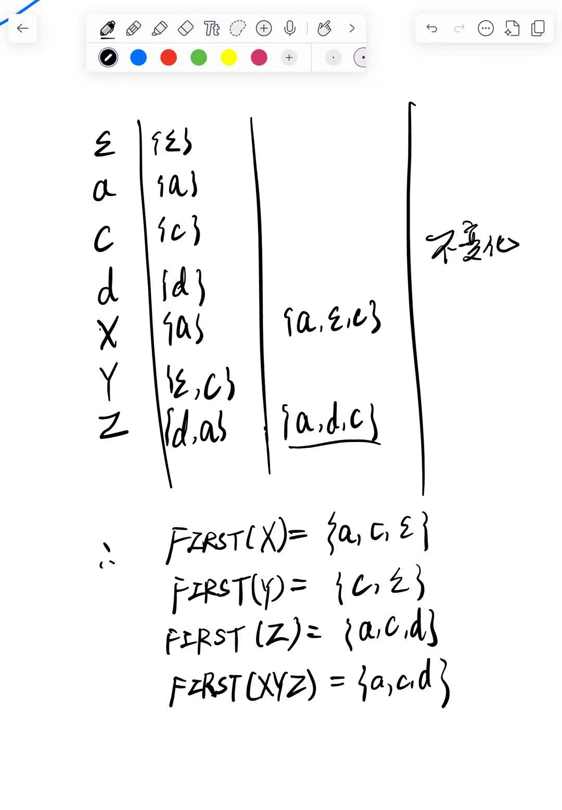
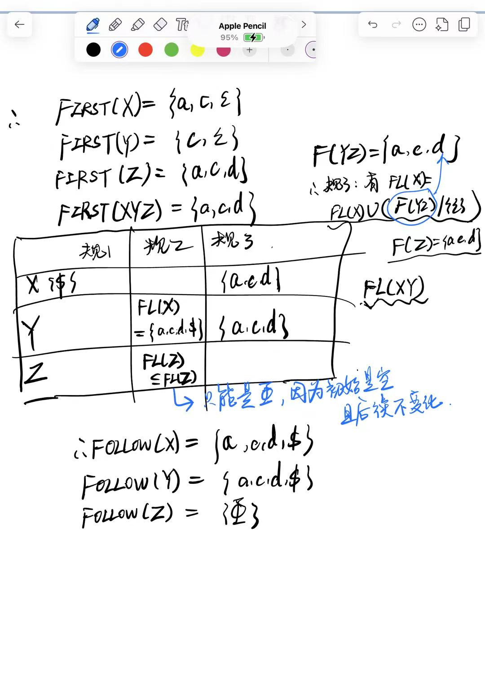
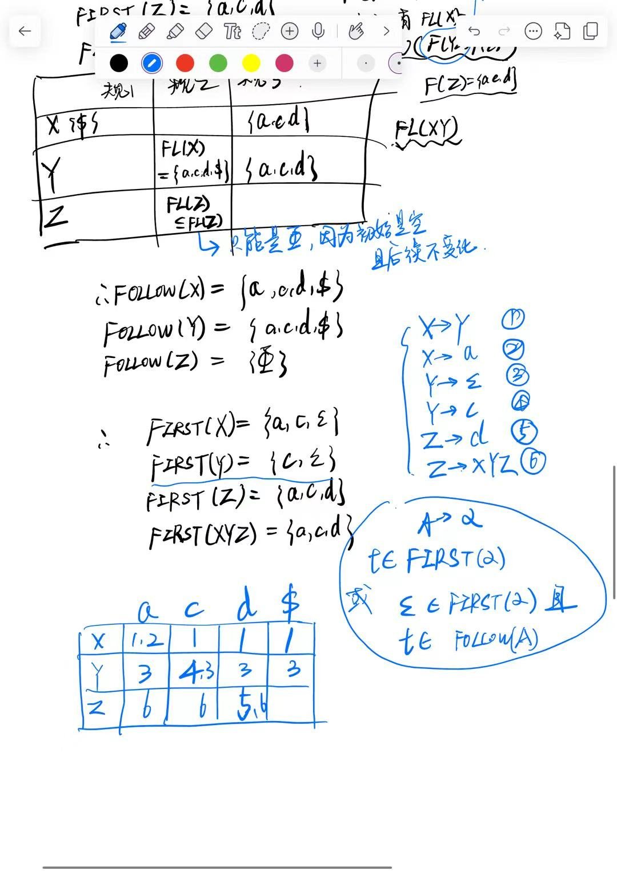

## 语法分析器（Parser）
>[!Important]
>需要注意，为什么要引入CFG？因为在语法分析的阶段，我们发现正则表达式的表达能力不够用，而CFG的表达能力是**严格强于**正则表达式的。在本课中会对这个事情给出证明。
### ANTLR v4语法分析器
#### 基本任务

>略。
### 上下文无关文法 CFG
#### 导入

- 产生式：如上每一条类似的“规则”都称为**产生式**
- Head：产生式的左侧，由一个**非终结符**构成；
- Body：产生式的右侧，是一个终结符和非终结符构成的**串**；
- 非终结符：用来表示一类结构的“中间变量”，还能继续展开。也叫变元、非终结符号。
- 终结符：最后真正出现在句子里的符号。它们不能再继续展开。
以上这种文法被称为**上下文无关文法（Context-free Grammar）**。
##### 其他
- 左递归：`A` 展开以后，最左边又是 `A` 自己，这叫**直接左递归**。天然表达左结合。如果表面上不是直接左递归，但是经过若干步推导后Body的最左边又是自己，那就是**间接左递归**。
- 右递归：`A` 展开以后，最右边又是 `A` 自己，这叫 **（直接）右递归**。天然表达右结合。

#### 正式定义

> 示例代码中的那个`prog`就属于开始符号。

##### 例子
$$
E \rightarrow E+E\, |\, E*E \,|\, (E) \,|\, -E \,|\, \mathbf{id}
$$
这是一个最直观的**左递归**的文法，表示表达式可以加、乘、加括号、取负、取一个标识符。
但是它具有**二义性**，并且左递归不适合递归下降分析。
>二义性体现：`id + id * id`没法确定运算顺序，有两种理解方式。

> 右递归的例子。

#### Extended BNF（Backus-Naur Form）

上面的CFG定义严格意义上不包含以上这三种符号的，而这就是拓展BNF范式所做的。
#### 上下文相关文法（Context-sensitive Grammar）

> 比如上例，B的取值和前面是什么有关。

#### 推导 Derivation
CFG $G$ 定义了一个语言$L(G)$。
推导就是将某个产生式的左边**替换**成右边。从开始符号 `E` 出发，每一步选中当前串里的某一个非终结符 `E`，然后用产生式右边的某个候选式去替换它。

> 题意就是，给定一个目标字符串`-(id+id)`，如何通过推导从CFG得到这个串。
- Leftmost：每次都替换最左的非终结符
- Rightmost：每次都替换最右的非终结符
- 从头到尾的每一个表达，都称为句型
#### 句型 Sentential Form

>因为进行0次推导就是$E$本身，所以从头到尾每一个（中间）表示都是一个句型，包括`-(id+id)`。
#### 句子 Sentence

#### 语言 L(G)

>这是最重要的一个定义
#### 基本问题

>类似讲RE时候考察的问题。

##### L(G)是什么
给出几个例子。
1:

> 这三条产生式就决定了除了括号无法出现任何终结符。那么问题就是括号以什么形式出现。可以看到这样的一个句子的左右两端必定是一个括号，那么递归地想象一下，里面的所有括号肯定是可以匹配的。

2:

3:

> 递归思想来思考。

4:

$$
\begin{aligned}
S\rightarrow \varepsilon \\
S \rightarrow a S b \\
S \rightarrow b S a
\end{aligned}
$$
所以答案是：

**错误！！！这个只能得出完全对称的。**
反例：`aabaab`
一个解法是可以在上面并上一个$VV$ ；另一个方法，是这么表示：
 
5:

  > 补充上下文相关文法的例子：
  > 
  
#### CFG表达能力严格强于RE

> 因为$a^m$一定对应着`m+1`种输入，那么其中一定有重复的状态，因为m不小于k。所以此时设这两个相同的状态是在$a^i$和$a^{i+j}$处出现的，那么就意味着$a^{i+j}b^i$也是状态了，显然这不符合文法要求。

#### 泵引理

> 让条件1和条件2成立，证明条件3不成立。$p^2$后面下一个合法的长度就是$(p+1)^2$，而显然$|xy^2z|<(p+1)^2$，所以证明这个第三条是不成立的，因此证明这个语言不正则。

#### CFG的表达边界

边界就是在CSG可以表达而CFG无法表达的地方。

### 构建语法分析树

- 左边红框是**自顶向下**方法构建；
- 右边蓝框是**自底向上**方法，难度更大。
> 课纲里要求掌握的应该是有`LR(0)` `SLR(1)` `LL(1)`
#### LL(1)语法分析
##### 定语

##### 自顶向下
根节点是文法的起始符号S，叶节点是Token Flow $w\$$，仅仅包含终结符和$\$$（就是EOF）；每个**中间节点**表示*对某个非终结符（变元）应用某个产生式的推导*，所以关键就是***选择哪个变元，选择哪个产生式***。`LL(1)`总是选择最左的变元展开。
> `LL(1)`中，第一个“L”表示“从左向右读入token”，第二个代表“leftmost”，就是最左边，每次选择最左的变元展开。

##### 递归下降
描述LL(1)的实现方式。

###### 例题

##### 预测分析表
每次替换非终结符的时候，**选择**哪一个备选**产生式**？
因为每个变元面对的当前词法单元/文件结束符不同，就决定了要使用的产生式不同，所以用一个**预测分析表**来记录这个配套选择关系。

>如果要展开非终结符的时候，遇到的token是无法通过展开得到的（也就是查表发现对应是空的单元格），那就说明报错了。

##### LL(1)文法

无冲突的意思就是说，表格里每个格子最多只对应一个产生式。

下面是一些非LL(1)文法的例子：下图上面的产生式需要看三个token，所以是LL(3)；而下面那个`ANTLR v4`的表达式，需要完整看`expr`的具体表达，所以根本无法决定选用哪个产生式，是要录取任意个token。

##### 程序样例

> `S()`和`F()`是针对两个非终结符对应的递归函数，然后各自函数内部按照预测分析表的规定来写。
> 以S为例，当遇到符号为“(”和“a”的时候可以根据对应的产生式编号进行S的解析，所以函数里针对两个情况写了`if`语句。解析内部，对应产生式中终结符的位置，就用`MATCH()`直接解析；如果对应非终结符的位置，就递归调用对应的递归函数解析这个token。

##### FIRST集
如果一个非终结符在解析展开的过程中，某一步的结果的最左端是一个终结符$t$，就说这个终结符是属于该非终结符的FIRST集里。形式化定义如下：
$\text{FIRST}(\alpha)$是可从$\alpha$推导得到的句型的首终结符号的集合。

###### 有什么用？

如板书，我们对一个变元对应的三条可能的产生式求FIRST集，这样如果当前指向的一个token只属于其中的一个FIRST集，那么就决定了只能用这一条产生式来展开。

###### 伪码逻辑
>对于单个符号的FIRST集：

>有了单个符号，就可以求符号串，注意是从左到右。

##### FOLLOW集合

>$\beta$ / $\gamma$ 都是非终结符和终结符组成的串，也都可有可无；主要就是这个$At$。
###### 有什么用？

> 就是说，如果现在在解析变元S的过程中吗，解析到一个变元A，因为是LL(1)推导，所以目前这个A就是最左的一个需要展开的非终结符；假设现在指向一个token $t$。如果要用到$A\rightarrow \alpha$这个展开，有可能会出现空串。所以如果这个$t \notin \text{FOLLOW}(A)$，那么就根本无法继续，***因为t就不可能出现在A的后面***，就是ERROR情况。
> 所以这是一个**必要条件**。
###### 伪码逻辑

>开始符号，是指产生式左边的那个符号。
##### FIRST/FOLLOW 计算例题

1. 计算FIRST集
> 解题格式参考下图。

下面是自做解题步骤：

2. 计算FOLLOW集
>解题格式如下

姑且认为X是开始符号，那么上面的例题的FOLLOW集计算结果如下：

##### 构建预测分析表

这样填表后，如果文法$G$的预测分析表是无冲突的，那么$G$是LL(1)文法。
或者换一个更整齐的表达：

此时选出来的一个产生式，并不意味着顺着这个一定能解析成功，只是说只有这个可以选。

###### 例题
所以接上例，构建预测分析表为：

##### 补充

> 如果对于每一个非终结符只有一个产生式，当然不需要参考FIRST和FOLLOW，所以这就是LL(0)。

要自己维护一个栈。

#### LR(0)语法分析
##### 为什么要用LR？

>而上图这个操作，称为**归约**。

##### 定语

##### 自底向上
从语法分析树的叶节点，不断向上构建出起始符号S为止。
##### 句柄
>[!Note]
>直观理解：找到**文法**中一个**完整产生式的*右部***，进行规约。这个完整的右部称为**句柄（Handle）**。

##### 归约（Reduce）
用这个句柄的头部替换其右部，即往上归约一层。
用**句柄识别自动机**寻找句柄。
##### 句型
**某个合法串的当前状态**称为句型。在对一个原始的句子（也就是合法的输入串）进行归约的时候，它的每一步中间结果都是一个句型，包括其输入时的原始状态。
##### LR文法

下面这个红色的路线是上面蓝色的过程的倒转。
>为什么要用最右推导而不是最左推导？因为**好的扫描算法应该是线性的**，也就是扫描一遍就能搞完；如果最左推导，那么最左推导反向展开就是先读入最末的终结符，需要每次先把所有输入扫完再读最后的符号，而且每次都要重新扫一遍全部的符号（也就是“最右规约”）。

##### 构成句型
任意时刻，语法分析数的**上边缘**和**剩余的输入**构成当前句型。

>红框就是每次归约后的上边缘；剩余输入就是那个蓝色框。上边缘用**栈**存储。
##### 栈存储的上边缘

> **栈上初始不留任何符号**，然后读入句子的最左符号（终结/非终结）。后续只有两种操作：
> - 归约：从栈顶向下看，看到有合适的产生式直接归约，pop掉匹配右部的符号，然后push入对应替换的产生式左部（head）
> - 继续读入输入：比如上面走到将`id`归约成`T`的那一步后，没有选择继续应用产生规则替换单符号，而是选择继续读入输入，对`T*F`整体做归约。
> 所以
> - 这两种操作的**选择时机**
> - 归约使用的产生式**怎么选择**
> 是很重要的问题，需要有成熟的策略。
> **成功停止的标志：最后栈里只剩下起始符号，本例中是$E$。**

所以，面对这两个问题，使用**ACTION/GOTO**表来记录栈状态，决定下一步执行什么操作！

##### 以ACTION/GOTO表完成归约

- 状态：语法分析器的状态。也就是**语法分析树的上边缘**，初始处于0号
- ACTION：看到当前的**尚未被压入**的最左终结符（对应每一列）应该采取的操作；
- GOTO：GOTO中存储的都是`g`操作，就是跳转到某某状态，但是上图省略了`g`。**专门为归约过程设计**，每一列都对应一个归约对应产生式的左部。
	>某时刻如果查表在状态5时得到操作`r6`，就是利用k号产生式进行归约，先移除匹配产生式右部的符号；然后查看此时栈顶元素对应的状态，以及要压入栈内的非终结符，寻找GOTO表对应行中的匹配，决定接下来转到哪个状态中。
- 此时，栈中存储的元素变了，不是各个符号，而是符号+存储状态（编号）。
###### 例

##### 句柄识别有穷状态自动机

###### 状态
状态刻画了**当前观察到的、针对所有产生式的右部前缀**。
###### LR(0)项

例子：

>上面这个产生式对应了四种可能的项，比如说$\cdot XYZ$就是表示刚刚看到最左边，还没观察到后面的XYZ；如果点在X后面，就表明已经观察到了产生式的前缀X。
###### 项集和项集族
- 项集是若干项组成的集合
- 项集族是若干项集构成的集合
- 句柄识别自动机的一个状态就是一个项集
- 句柄识别自动机的状态集合就是一个项集族

###### 增广文法

>结合栈来思考，加上这个产生式就是为了清空最底部的起始符号，表示输入符号串被接受。

###### 状态构建

>点就是当前看到的位置；
>初始是从一个$E'$开始，但是实际上它期望看到所有能归约成$E$的产生式，所以实际上是做了一个类似闭包的操作，如上图中下面的表示。

然后根据点后面的第一个符号，决定跳转到哪个状态。

>[!Note]
>几个地方需要注意：
>- 什么时候accept整个符号串：已经观察到了目前符号串是$E'\leftarrow E\cdot$（读到最右端，即“右部已经完整”），且下一个符号是结束符$\$$（输入完毕）。
>- 某个状态接受非终结符也是要进行状态变化的。
>- 红框框住的状态的共性：句柄识别自动机的**接受状态**。状态中至少存在一个产生式的**右部已经完整/已经被跟踪记录完全**。这就表示***此时我们识别到了一个句柄！***
>	
>	- 有些LR算法看到句柄会直接开始归约，而有些可能需要再判断一些条件才会拿来去归约。

***根据归约的条件规定不同，分出了不同的LR分析算法，也就对应了不同的ACTION/GOTO分析表。***
###### ⚠️⚠️GOTO函数
上图自动机中，所有的边都称为**GOTO函数**。在分析表中，被拆分成**ACTION（针对终结符）/GOTO（针对非终结符）表**。

###### LR(0)分析表构建规则

###### LR(0)文法
**如果文法的LR(0)分析表是无冲突的，那么该文法是LR(0)文法。**
所以下图肯定不是LR(0)文法。

###### LR(0)分析表特征
表中每一行（状态）**选用的归约产生式是相同的**。归约的时候**不需要“向前”（后面未被读入的token）看字符**。这就是“0”的含义。
自动机和栈之间存在某些等价的操作：
- 向前走$\Leftrightarrow$移入
- 回溯$\Leftrightarrow$归约
**自动机是本质，而栈是一种记录/实现方式**。
