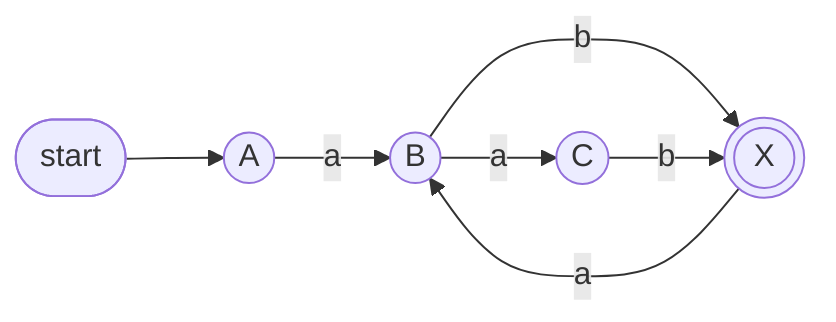
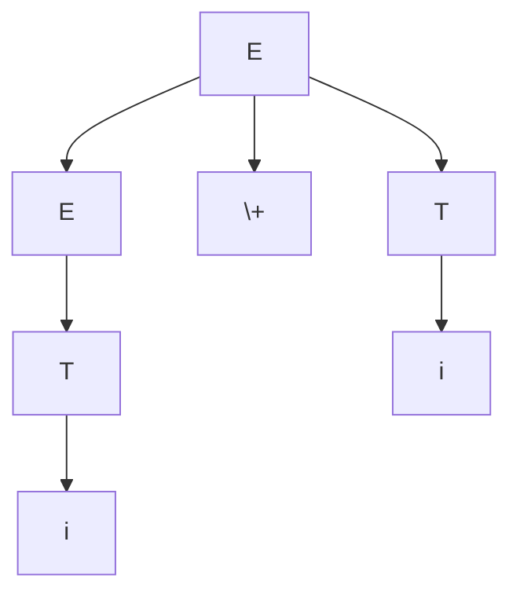
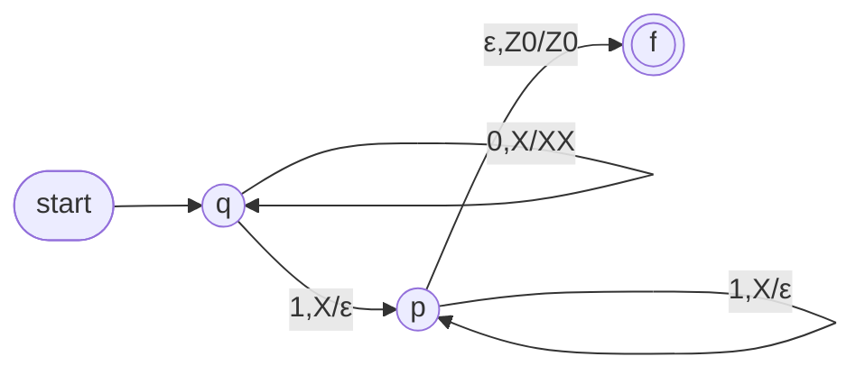
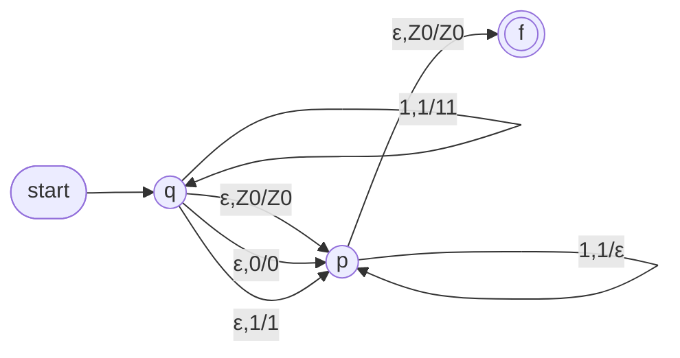
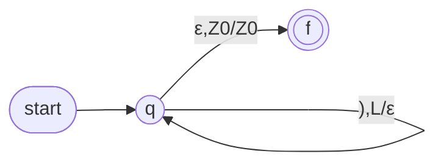
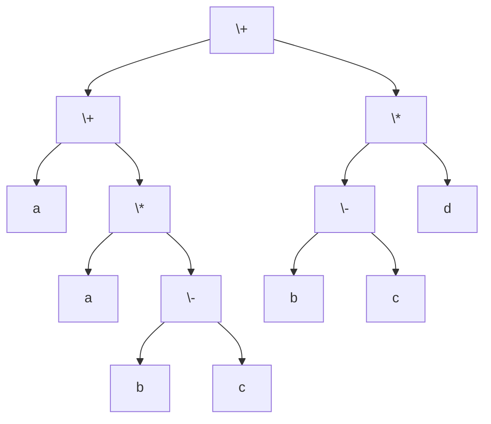
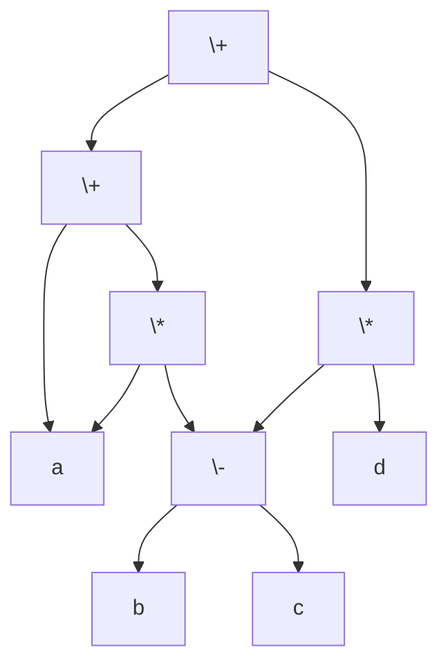
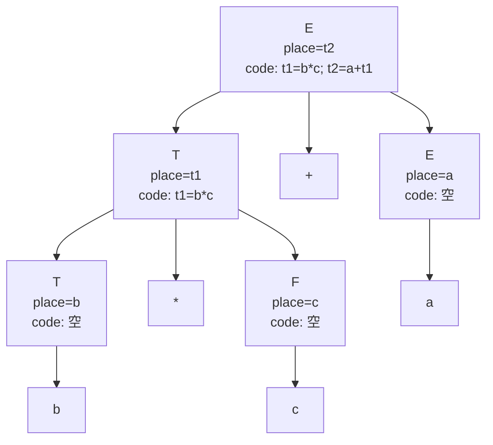

# 形式语言与编译：知识点总结

> 依据：`Slides/课程总结与知识梳理2026.docx`、`Slides/*.pdf`、`Reference/Material/2024形编考试题回忆版.docx`、`Reference/Material/exam_17/exam_17.tex`。  
> 这份笔记按“能不能做题”组织：每章先列核心概念，再给手算步骤、易错点和小例子。较长完整推导放在 [例题详解.md](例题详解.md)。

## 0. 考前优先级与使用方法

### A 档：必须会手算

| 模块         | 必会题型                                            | 做题时最重要的动作                         |
| ---------- | ----------------------------------------------- | --------------------------------- |
| DFA/NFA/RE | NFA 或 $\epsilon$-NFA 转 DFA，DFA 最小化，DFA/NFA 转 RE | 先列状态集合表，再命名；最小化前先补全和去不可达          |
| 文法与 LL(1)  | 文法化简、消左递归、消左公因子、FIRST/FOLLOW/SELECT、预测分析表       | 每一步都写集合，避免凭直觉填表                   |
| PDA        | 写瞬时描述移动序列，设计 $PDA_N/PDA_F$，判定 DPDA              | 每步同时检查“读入符号、栈顶、替换串”               |
| LR/SLR     | 规范归约、短语/句柄、itemDFA、SLR(1) 表                     | 先增广文法，再 closure/goto；归约项只填 FOLLOW |
| 属性文法与符号表   | 属性方程求值 `Eval()`，声明语义分析，画符号表                     | 类型、宽度、偏移、作用域、参数表逐项登记              |
| 中间代码/IR | AST、DAG、三地址码、四元式、布尔短路、if/while、数组、函数调用              | 先分配标签和临时变量，再写反填链或显式跳转             |
| 运行时环境      | 栈快照、活动树、访问链/控制链、调用序列/返回序列                       | 控制链按调用关系，访问链按词法嵌套关系               |
| 寄存器分配      | 活跃变量、web、干涉图、图着色、溢出改写                           | 从后往前求 live，再画干涉图，最后按 $k$ 色着色      |

### B 档：客观题和小题常考

- 编译阶段顺序、前端/后端接口、中间语言。
- 符号、字母表、符号串、语言、文法、自动机的定义。
- DFA/NFA/$\epsilon$-NFA/RE/RG 的等价关系。
- 正则语言的封闭性、空性、有限性、泵引理。
- 词法记号、词法单元、$\sigma$-DFA、最大前缀、事实优先级。
- CFG、CFL、PDA、DPDA、二义性、语法树。
- 属性文法中的综合属性、继承属性、S 属性、L 属性。
- 内存映像：代码区、静态区、堆区、栈区。

### 往年题型对照

| 来源        | 明确出现的主观题                                                                                                     |
| --------- | ------------------------------------------------------------------------------------------------------------ |
| 2017      | 正则表达式、文法化简、NFA $\to$ DFA、itemDFA/冲突、运行栈、if/while/or 四元式                                                      |
| 2024 回忆   | NFA $\to$ 最小 DFA $\to$ RE、词法 DFA 输出、文法修剪 + FIRST/FOLLOW + LL(1)、规范归约/句柄/二义性、itemDFA 冲突、声明语义分析 + 四元式/三地址码、运行栈 |
| 2026 课程总结 | §1，§2&3，§5，§6，§7，§8，§9，§10，§11，§12 都列入主观题范围                                                                  |

### 一张图式复习路线

```text
语言/文法
  -> RL: DFA/NFA/epsilon-NFA/RE/RG
  -> CFL: CFG/PDA
  -> 语法分析: LL(1) 自顶向下，SLR(1) 自底向上
  -> 语义分析: 属性文法 + 符号表
  -> 中间代码: AST/DAG/TAC/四元式/LLVM-IR
  -> 运行时: 栈帧、调用序列、参数传递
  -> 优化: CFG、数据流、活跃变量、寄存器分配
```

这门课的主线不是背概念，而是“形式系统如何变成编译器算法”。考试主观题大多是把定义机械执行出来：集合、表格、栈、链、图。

---

## 1. 第一章：中心概念与编译过程

### 基本概念

| 概念 | 记号 | 含义 | 易错点 |
| --- | --- | --- | --- |
| 字母表 | $\Sigma$ | 符号的有限非空集合 | $\epsilon$ 通常不是字母表中的符号 |
| 符号串 | $w\in\Sigma^*$ | 由 $\Sigma$ 中符号组成的有限序列 | 空串 $\epsilon$ 是任意 $\Sigma^*$ 的元素 |
| 空串 | $\epsilon$ | 长度为 0 的符号串 | 不等于空集 $\emptyset$ |
| 语言 | $L\subseteq\Sigma^*$ | 某字母表上符号串的集合 | 语言可以为空语言 $\emptyset$ |
| 问题 | $w\in L?$ | 判断一个串是否属于语言 | 自动机本质上就是这类判定器 |

例子：

- $\Sigma=\{0,1\}$，则 `0101` 是符号串，$\epsilon$ 也是符号串。
- $L=\{w\mid w\text{ 中 1 的个数为偶数}\}$ 是 $\Sigma$ 上的语言。
- $\emptyset$ 是没有任何串的语言，$\{\epsilon\}$ 是只含空串的语言，两者不同。

### 编译过程

| 阶段 | 输入 | 输出 | 本课程对应工具 |
| --- | --- | --- | --- |
| 词法分析 | 源程序字符流 | 词法记号串、错误信息 | $\sigma$-DFA、scanner |
| 语法分析 | 词法记号串 | 语法树或 AST | LL(1)、LR(0)、SLR(1) |
| 语义分析 | AST/语法树 | 符号表、带类型信息的 AST | 属性文法、SDT、Visitor |
| 中间代码生成 | AST + 符号表 | TAC/四元式/LLVM-IR，也可能仍是 AST/DAG | 语法制导翻译 |
| 代码优化 | 中间表示 | 优化后的中间表示 | CFG、数据流分析 |
| 目标代码生成 | 中间表示 | 汇编/机器码 | 指令选择、寄存器分配、运行时 |

容易混淆：

- 词法分析关心“一个 token 是什么”，语法分析关心“token 串是否符合文法”。
- 语义分析关心“类型、作用域、声明、调用是否合法”。
- 中间代码生成关心“如何把语义动作落成可执行的中间指令”。
- 前端/后端的接口通常是中间表示，例如 AST、DAG、TAC/四元式、LLVM-IR。

### 编译器相关术语

| 术语 | 解释 |
| --- | --- |
| 源语言 | 被编译的语言，例如 C、Q 语言 |
| 目标语言 | 编译输出语言，例如 ARM 汇编、MIPS 汇编、LLVM-IR |
| 实现语言 | 写编译器本身用的语言，例如 C++、Java、Python |
| 交叉编译 | 编译器运行平台和目标代码运行平台不同 |
| 前端 | 词法、语法、语义、中间代码生成 |
| 后端 | 优化、指令选择、寄存器分配、目标代码生成 |

注意：编译器源语言和目标语言可以相同。例如一个 C 编译器可以把 C 编译成另一种 C 形式。

### 形式语言层次

| 语言类 | 识别器 | 生成器 | 本课常见内容 |
| --- | --- | --- | --- |
| 正则语言 `RL` | DFA/NFA/$\epsilon$-NFA | RE/RG | 词法分析 |
| 上下文无关语言 `CFL` | PDA | CFG | 语法分析 |
| 上下文有关语言 | 线性有界自动机 | CSG | 了解 |
| 递归可枚举语言 | 图灵机 | 0 型文法 | 了解 |

包含关系：

$$
RL\subset CFL\subset CSL\subset REL
$$

例子：

- $\{0^n1^m\mid n,m\ge0\}$ 是正则语言。
- $\{0^n1^n\mid n\ge0\}$ 是上下文无关语言，但不是正则语言。
- $\{0^n1^n2^n\mid n\ge0\}$ 不是上下文无关语言。

### 可能题型

- 判断 $\epsilon$ 是否是某字母表上的符号串。
- 判断 $\emptyset$、$\epsilon$、$\{\epsilon\}$ 的区别。
- 写编译阶段顺序和每阶段输入输出。
- 判断某个结构属于前端还是后端。
- 判断一个语言可能属于正则语言还是上下文无关语言。

### 小例题

**判断：$\epsilon$ 是字母表 $\{a,d\}$ 上的符号串。**

答：对。$\{a,d\}^*$ 包含空串 $\epsilon$；但 $\epsilon\notin\{a,d\}$，所以它不是该字母表中的符号。

**判断：“由 0 和 1 组成且 0、1 个数相等”的语言是正则语言。**

答：错。这个语言需要无界计数匹配，不是正则语言；可用泵引理证明。

---

## 2. 第二章：DFA、NFA、$\epsilon$-NFA

### DFA 定义

DFA 是五元组：

$$
A=(Q,\Sigma,\delta,q_0,F)
$$

| 分量 | 含义 |
| --- | --- |
| $Q$ | 有限状态集 |
| $\Sigma$ | 输入字母表 |
| $\delta:Q\times\Sigma\to Q$ | 转移函数 |
| $q_0\in Q$ | 初始状态 |
| $F\subseteq Q$ | 接受状态集 |

DFA 的特点是确定性：给定当前状态 $q$ 和输入符号 $a$，下一状态唯一。

扩展转移函数：

$$
\hat{\delta}(q,\epsilon)=q
$$

$$
\hat{\delta}(q,wa)=\delta(\hat{\delta}(q,w),a)
$$

接受语言：

$$
L(A)=\{w\in\Sigma^*\mid \hat{\delta}(q_0,w)\in F\}
$$

### DFA 的三种表示

| 表示 | 内容 | 做题用途 |
| --- | --- | --- |
| 代数表示 | 五元组 $A=(Q,\Sigma,\delta,q_0,F)$ | 定义题、证明题 |
| 转移图 | 状态结点 + 带标记边 | 画自动机、直观看路径 |
| 转移表 | 行为状态，列为输入符号 | 手算判定、子集法、最小化 |

三种表示等价。考试如果给图，通常先转成表再算。

### 完全形、最简形、最小形

| 形式 | 含义 |
| --- | --- |
| 完全形 DFA | 对每个 $q\in Q$、$a\in\Sigma$，$\delta(q,a)$ 都有定义 |
| 最简形 DFA | 删除了不可达状态或无效状态后的 DFA |
| 最小形 DFA | 与原 DFA 等价且状态数最少的 DFA |

补陷阱状态的原则：

- 若某个状态对某输入没有出边，为了变成完全形，补一个陷阱状态 $d$。
- 陷阱状态对所有输入都回到自身。
- 做补语言、交并乘积、最小化时，通常先补成完全形。

### NFA 定义

NFA 也是五元组：

$$
N=(Q,\Sigma,\delta,q_0,F)
$$

但转移函数为：

$$
\delta:Q\times\Sigma\to 2^Q
$$

也就是说，一个状态读一个符号后可能进入多个状态，也可能没有下一状态。

NFA 扩展转移：

$$
\hat{\delta}(q,\epsilon)=\{q\}
$$

$$
\hat{\delta}(q,wa)=\bigcup_{p\in\hat{\delta}(q,w)}\delta(p,a)
$$

接受条件：

$$
w\in L(N)\iff \hat{\delta}(q_0,w)\cap F\ne\emptyset
$$

直观理解：NFA 同时维护一组“线索”；只要有一条线索到达接受态，输入就被接受。

### $\epsilon$-NFA

$\epsilon$-NFA 允许不消耗输入符号的 $\epsilon$ 转移：

$$
\delta:Q\times(\Sigma\cup\{\epsilon\})\to2^Q
$$

$\epsilon$-闭包：

$$
\epsilon\text{-closure}(S)=\{p\mid \exists q\in S,\ q\overset{\epsilon^*}{\to}p\}
$$

闭包一定包含自身：

$$
S\subseteq \epsilon\text{-closure}(S)
$$

易错点：

- 每次读输入符号前后都要考虑 $\epsilon$ 可达。
- $\epsilon$ 转移不消耗输入，不要把它当作普通字符。
- $S$ 是状态集合时，闭包是对集合中每个状态闭包取并。

### “闭包”到底是什么意思

本课里“闭包”不是只有一个意思。它们的共同直觉是：**从一个起点出发，按照某种允许的操作，不断把能得到的东西都加进来，直到不能再加为止。**

| 场景 | 记号 | 起点是什么 | 允许反复做什么 | 结果是什么 |
| --- | --- | --- | --- | --- |
| 语言运算 | $L^*$ | 一个语言 $L$ | 从 $L$ 中取串，连接 0 次、1 次、2 次、... | 一个新语言 |
| 正则表达式 | $R^*$ | 一个正则表达式 $R$ | 把 $R$ 所表示的语言重复连接任意多次 | 一个新正则表达式 |
| 正闭包 | $R^+$ 或 $L^+$ | 一个 RE/语言 | 重复 1 次或多次 | 不含“重复 0 次”那部分 |
| $\epsilon$-NFA | $\epsilon\text{-closure}(S)$ 或 $\omega(S)$ | 一个状态集合 $S$ | 沿 $\epsilon$ 边走 0 步或多步 | 一个状态集合 |
| LR 项目集 | $closure(I)$ | 一个项目集 $I$ | 若点后是变元，就加入该变元所有产生式的点在最前项目 | 一个更大的项目集 |

#### 1. 语言/正则表达式里的 Kleene 闭包

若 $L$ 是语言，则：

$$
L^*=L^0\cup L^1\cup L^2\cup\cdots
$$

其中：

$$
L^0=\{\epsilon\},\qquad L^1=L,\qquad L^2=LL
$$

例子：

$$
L=\{a,b\}
$$

则：

$$
L^*=\{\epsilon,a,b,aa,ab,ba,bb,aaa,\ldots\}
$$

这就是正则表达式里 `R*` 的语义：

$$
L(R^*)=L(R)^*
$$

所以 `[0-9]*` 可以匹配空串，因为重复 0 次也是允许的；若要至少一个数字，应写 `[0-9]+` 或 `[0-9][0-9]*`。

#### 2. $\epsilon$-NFA 里的 $\epsilon$-闭包

若自动机有 $\epsilon$ 边：

```text
q0 --ε--> q1 --ε--> q2
q1 --a--> q3
```

则：

$$
\epsilon\text{-closure}(\{q_0\})=\{q_0,q_1,q_2\}
$$

原因：

- 走 0 步也算，所以一定包含 $q_0$。
- 从 $q_0$ 沿 $\epsilon$ 到 $q_1$。
- 从 $q_1$ 沿 $\epsilon$ 到 $q_2$。
- $q_1\to q_3$ 是读入 `a` 的边，不是 $\epsilon$ 边，所以 $q_3$ 不在这个闭包里。

在 $\epsilon$-NFA 转 DFA 时：

$$
S_0=\epsilon\text{-closure}(\{q_0\})
$$

读一个输入符号 $a$ 后：

$$
T=\epsilon\text{-closure}\left(\bigcup_{q\in S}\delta(q,a)\right)
$$

也就是说：**先读一个真正输入符号，再把所有不消耗输入能走到的状态补全。**

#### 3. DFA 里有没有闭包

普通 DFA 本身没有 $\epsilon$ 边，所以通常不需要算 $\epsilon$-闭包。DFA 读入一个符号后，状态唯一确定：

$$
\delta(q,a)=p
$$

如果题目说“NFA 转 DFA 的闭包”，通常指的是：

- 普通 NFA 转 DFA：DFA 状态是 NFA 状态的**子集**，一般只算 $\bigcup_{q\in S}\delta(q,a)$。
- $\epsilon$-NFA 转 DFA：还要在每一步外面套 $\epsilon$-closure。

#### 4. LR/itemDFA 里的 closure

第八章的 `closure(I)` 不是状态 $\epsilon$-闭包，也不是 Kleene 闭包。它的意思是：若项目集中出现点后面是某个变元：

$$
A\to\alpha\cdot B\beta
$$

就必须把 $B$ 的所有产生式都展开成：

$$
B\to\cdot\gamma
$$

并反复做，直到不再新增项目。它的共同点仍然是“把隐含能推出/需要考虑的东西补全”。

易混总结：

| 看到什么 | 应该想到 |
| --- | --- |
| `R*`、`L*` | 串的任意次连接，包括 0 次，所以含 $\epsilon$ |
| `R+`、`L+` | 串的至少 1 次连接，一般不自动含 $\epsilon$ |
| `ε-closure(S)` | 沿 $\epsilon$ 边不消耗输入地走到的所有状态 |
| `closure(I)` | LR 项目集中展开点后变元 |

### DFA/NFA/$\epsilon$-NFA 的关系

$$
DFA\equiv NFA\equiv \epsilon\text{-NFA}
$$

它们识别的都是正则语言。区别在于描述方便程度，不在于语言能力。

### NFA 到 DFA：子集构造法

输入：$N=(Q,\Sigma,\delta,q_0,F)$。  
输出：$D=(\mathcal Q,\Sigma,\text{move},\{q_0\},F_D)$。

算法步骤：

1. 初始 DFA 状态为 $\{q_0\}$。
2. 维护一个“未标记”的 DFA 状态集合队列。
3. 取出一个未标记集合 $S$，对每个 $a\in\Sigma$ 计算：

$$
T=\bigcup_{q\in S}\delta(q,a)
$$

4. 若 $T$ 未出现过，把它加入 DFA 状态集。
5. 填转移：

$$
\text{move}[S,a]=T
$$

6. 所有包含 NFA 接受态的集合都是 DFA 接受态：

$$
F_D=\{S\in\mathcal Q\mid S\cap F\ne\emptyset\}
$$

7. 最后给集合状态命名，例如 $A,B,C,\ldots$。

考试表格模板：

| DFA 状态名 | NFA 状态集合 | 读 0 | 读 1 | 是否接受 |
| --- | --- | --- | --- | --- |
| A | $\{q_0\}$ | ... | ... | 否 |
| B | ... | ... | ... | 是/否 |

### $\epsilon$-NFA 到 DFA：通用子集法

输入：$\epsilon$-NFA。  
核心公式：

$$
T=\epsilon\text{-closure}\left(\bigcup_{q\in S}\delta(q,a)\right)
$$

步骤：

1. 初态不是 $\{q_0\}$，而是：

$$
S_0=\epsilon\text{-closure}(\{q_0\})
$$

2. 对每个未标记集合 $S$ 和输入 $a$：

$$
\text{move}[S,a]=\epsilon\text{-closure}(\text{move without }\epsilon)
$$

3. 接受态仍然是包含原 NFA 接受态的状态集合。

易错点：

- 不能先去掉 $\epsilon$ 转移再忘记闭包。最稳妥是每一步都写 $\epsilon\text{-closure}$。
- 空集 $\emptyset$ 也可以作为 DFA 状态，尤其在完全形 DFA 中它就是死状态。
- 如果题目最后要求“最简形”，要去掉不可达状态；如果要求“完全形”，空集状态不能随便删。

### 给 DFA/NFA 判断输入串是否接受

DFA 做法：

1. 从 $q_0$ 出发。
2. 按输入串从左到右逐符号走唯一边。
3. 输入读完后看状态是否在 $F$。

NFA 做法：

1. 维护当前状态集合 $S$。
2. 读一个字符后，把所有可能下一状态取并。
3. $\epsilon$-NFA 每步后再取闭包。
4. 最后看 $S\cap F$ 是否非空。

小例子：

若 $2\xrightarrow{\epsilon}\{3,4\}$，且 3、4 无 $\epsilon$ 出边，则：

$$
\epsilon\text{-closure}(2)=\{2,3,4\}
$$

### DFA 设计题套路

常见语言与状态含义：

| 语言要求 | 状态设计 |
| --- | --- |
| 包含某子串，例如包含 `101` | 状态表示“当前已经匹配到目标串的最长前缀” |
| 以某串结尾，例如以 `101` 结尾 | 状态同上，接受态为完整匹配 |
| 某符号个数模 $k$ | 状态表示余数 $0,1,\ldots,k-1$ |
| 最多/至少出现 $k$ 次 | 状态表示已出现次数，超过后进入稳定状态 |
| 不包含某模式 | 先设计包含该模式 DFA，再对完全形 DFA 取补 |

例子：设计“0、1 串中 1 的个数为偶数”的 DFA。

- $q_e$：目前 1 的个数为偶数，初态、接受态。
- $q_o$：目前 1 的个数为奇数。
- 读 0 不改变奇偶性，读 1 在两状态间切换。

### 可能题型

- 给 DFA/NFA 表，问某输入串是否接受。
- 求 $\epsilon$-闭包。
- NFA/$\epsilon$-NFA 转 DFA。
- 给语言描述，设计 DFA/NFA。
- 判断 DFA、NFA、$\epsilon$-NFA 是否等价。
- 判断一个状态是否死状态、不可达状态、无效状态。

完整 NFA 转 DFA 推导见 [例题详解.md#1-nfa--dfa2017-题型](例题详解.md#1-nfa--dfa2017-题型)。

---

## 3. 第三章：正则表达式与正则语言

### 正则表达式定义

字母表 $\Sigma$ 上的正则表达式由以下规则递归定义：

1. $\emptyset$ 是正则表达式，表示空语言。
2. $\epsilon$ 是正则表达式，表示只含空串的语言。
3. 对每个 $a\in\Sigma$，$a$ 是正则表达式，表示语言 $\{a\}$。
4. 若 $R,S$ 是正则表达式，则 $R+S$、$RS$、$R^*$ 也是正则表达式。
5. 括号只改变结合方式，不改变语言。

运算优先级：

$$
* \quad > \quad \text{连接} \quad > \quad +
$$

例子：

$$
01^*+10^*
$$

表示：

$$
\{0,01,011,\ldots\}\cup\{1,10,100,\ldots\}
$$

### 正则表达式的语言语义

$$
L(\emptyset)=\emptyset
$$

$$
L(\epsilon)=\{\epsilon\}
$$

$$
L(a)=\{a\}
$$

$$
L(R+S)=L(R)\cup L(S)
$$

$$
L(RS)=L(R)L(S)
$$

$$
L(R^*)=L(R)^*
$$

常用恒等式：

| 公式 | 含义 |
| --- | --- |
| $R+\emptyset=R$ | 空语言并不增加串 |
| $R\epsilon=\epsilon R=R$ | 空串是连接单位元 |
| $R\emptyset=\emptyset R=\emptyset$ | 与空语言连接为空 |
| $(R^*)^*=R^*$ | 闭包的闭包不变 |
| $R^*=\epsilon+RR^*$ | Kleene 闭包可展开 |
| $(R+S)^*=(R^*S^*)^*$ | 常见但不必死记，按语言理解 |

### 写正则表达式的套路

1. 先判断语言是“结构约束”还是“计数约束”。
2. 对简单结构，直接拆成前缀、中段、后缀。
3. 对“包含/不包含/以某串结尾”，可先设计 DFA，再转 RE。
4. 对“或者”，用 $+$。
5. 对“若干次重复”，用 $*$。
6. 对“至少一次”，用 $RR^*$ 或 $R^+$，但课堂正则式里最好写成 $RR^*$。

常见模板：

| 语言 | 正则表达式 |
| --- | --- |
| 任意 0/1 串 | $(0+1)^*$ |
| 至少一个 1 | $(0+1)^*1(0+1)^*$ |
| 以 101 结尾 | $(0+1)^*101$ |
| 不含 1 的串 | $0^*$ |
| 所有偶数个 0 的串 | $1^*(01^*01^*)^*$ |
| 形如若干个 `ab` | $(ab)^*$ |

注意：正则表达式不能直接写“0 和 1 个数相等”这类需要无界配对的语言。

### RE 到 $\epsilon$-NFA

Thompson 构造的思想：每个正则表达式片段都有一个入口和一个出口。

基本构造：

- $\emptyset$：入口和出口之间没有路径。
- $\epsilon$：入口到出口连一条 $\epsilon$ 边。
- $a$：入口到出口连一条 $a$ 边。

递归构造：

| 表达式 | 构造思路 |
| --- | --- |
| $R+S$ | 新入口用 $\epsilon$ 分别连到 $R,S$ 入口；$R,S$ 出口用 $\epsilon$ 连到新出口 |
| $RS$ | $R$ 的出口用 $\epsilon$ 连到 $S$ 的入口 |
| $R^*$ | 新入口可 $\epsilon$ 到 $R$ 入口或新出口；$R$ 出口可 $\epsilon$ 回 $R$ 入口或到新出口 |

答题时不必画得极度漂亮，但入口、出口、$\epsilon$ 边要清楚。

### DFA/NFA 转 RE

最稳妥方法：**g-NFA 状态约简法**，也常叫**状态消除法**。

Slides 位置：第三章 `第三章RE2026.pdf`，对应“DFA 到 RE”“通用 NFA（g-NFA）”“g-NFA 的状态约简”。

#### 什么是 g-NFA

g-NFA 是 generalized NFA，中文常写作**通用 NFA**。它和普通 NFA 的核心区别是：

| 项目    | 普通 NFA             | g-NFA                 |
| ----- | ------------------ | --------------------- |
| 边标记   | 单个输入符号或 $\epsilon$ | 一个正则表达式               |
| 缺失边   | 可以不画               | 可看作标记为 $\emptyset$ 的边 |
| 多条同向边 | 可以多条               | 合并成一条，标记用 $+$ 连接      |
| 初态    | 一个初态               | 唯一初态，且没有任何边射入初态       |
| 终态    | 可有多个终态             | 唯一接受态，且没有任何边从接受态射出    |

所以 g-NFA 可以把普通边看成特殊正则表达式：

- 标记为 $a$ 的边：看成正则表达式 $a$；
- 标记为 $\epsilon$ 的边：看成正则表达式 $\epsilon$；
- 没有边：看成正则表达式 $\emptyset$；
- 两条同向边 $R,S$：合并成一条边 $R+S$。

g-NFA 的意义：它允许边上写复杂正则表达式，因此每消除一个状态，就可以把“经过该状态的所有路径”压缩成一条正则表达式边。最后只剩初态和终态时，初态到终态的边标记就是整个自动机的正则表达式。

#### DFA/NFA 转 RE 的完整步骤

给定一个 DFA 或 NFA：

1. 若是 DFA，先把它当作 NFA；若题目要求“从最小 DFA 转 RE”，先做 DFA 最小化。
2. 新增唯一初态 $s$，加边 $s\xrightarrow{\epsilon}q_0$，其中 $q_0$ 是原初态。
3. 新增唯一接受态 $f$，对原来每个接受态 $q\in F$，加边 $q\xrightarrow{\epsilon}f$。
4. 保证没有边射入新初态 $s$，没有边从新接受态 $f$ 射出。
5. 把所有边标记都看成正则表达式；没有边记作 $\emptyset$。
6. 如果两个状态之间有多条同向边，用 $+$ 合并。
7. 从此时开始做**状态消除**：每次选一个除 $s,f$ 之外的状态 $k$ 删除。
8. 删除 $k$ 之前，先把所有“进入 $k$，在 $k$ 上绕若干圈，再从 $k$ 离开”的路径补到保留状态之间。
9. 补边完成后，删除状态 $k$ 以及所有与 $k$ 相连的边。
10. 重复第 7--9 步，直到只剩新初态 $s$ 和新接受态 $f$。
11. 最后 $s\to f$ 这条边上的正则表达式，就是原 DFA/NFA 对应的 RE。

什么时候开始消除状态？**把自动机改造成 g-NFA 之后立刻开始。**

消除哪些状态？**只消除中间状态，也就是除了新初态 $s$ 和新接受态 $f$ 以外的所有状态。** 原来的初态、原来的接受态都可以被消除，因为此时已经有新的 $s$ 和 $f$ 接管了“开始”和“接受”的角色。

消除顺序怎么选？理论上任意顺序都可以，结果可能长得不同但语言等价。做题时优先消除“入边少、出边少、自环少”的状态，式子会短一些。

#### 怎么消除一个状态

假设要消除中间状态 $k$。对任意两个仍然保留的状态 $i,j$，更新 $i\to j$ 的边：

$$
R_{ij}:=R_{ij}+R_{ik}(R_{kk})^*R_{kj}
$$
> `i==j`的情况也可以成立，这个时候就是如果某个状态经过一个别的状态又能回到本状态，这个时候就要去掉这个中间转移状态。最后写成一个自反弧。

含义是：

- $R_{ij}$：原来不经过 $k$，直接从 $i$ 到 $j$ 的路径；
- $R_{ik}$：从 $i$ 进入 $k$；
- $(R_{kk})^*$：在 $k$ 上绕自环任意多次；
- $R_{kj}$：从 $k$ 离开到 $j$；
- 二者用 $+$ 合并，表示“原路径或经过 $k$ 的新路径”。

课件里也用 $\lambda(k)$ 和 $\mu(k)$ 记消除状态时要检查的状态集合：

- $\lambda(k)$：能进入 $k$ 的状态集合；
- $\mu(k)$：能从 $k$ 到达的状态集合；
- 对每个 $i\in\lambda(k)$、$j\in\mu(k)$，都要更新 $R_{ij}$。

做题时可以不用显式写 $\lambda,\mu$，但要保证所有“进入 $k$ 再离开 $k$”的组合都没有漏。更机械地说，消除 $k$ 时按下面做：

1. 找所有进入 $k$ 的状态 $i$，包括可能的 $s$ 或其他中间状态。
2. 找所有从 $k$ 出去的状态 $j$，包括可能的 $f$ 或其他中间状态。
3. 看 $k$ 有没有自环 $R_{kk}$；没有自环就把 $R_{kk}$ 当作 $\emptyset$，此时 $(R_{kk})^*=(\emptyset)^*=\epsilon$。
4. 对每一组 $(i,j)$，都加上经过 $k$ 的新边：

   $$
   R_{ik}(R_{kk})^*R_{kj}.
   $$

5. 如果原来已经有 $i\to j$ 的边 $R_{ij}$，就合并成：

   $$
   R_{ij}+R_{ik}(R_{kk})^*R_{kj}.
   $$

6. 所有相关新边都处理完后，才真正删除状态 $k$。

简单例子：如果有

$$
i\xrightarrow{a}k,\qquad k\xrightarrow{b}k,\qquad k\xrightarrow{c}j,\qquad i\xrightarrow{d}j,
$$

那么消除 $k$ 后，$i\to j$ 的边变成：

$$
d+ab^*c.
$$

这就是公式

$$
R_{ij}+R_{ik}(R_{kk})^*R_{kj}
$$

的具体含义。

#### 完整例题：DFA 转 RE

题目：把 `exam_17` 第 5 题最后化简出来的最小 DFA 转成正则表达式。

该题最小 DFA 为：



其中 $A$ 是初态，$X=\{D,E\}$ 是接受态。上图用 `X(((X)))` 把 $X$ 画成双圈；不要再额外画 $X\to[*]$，否则容易误以为还有一个新的接受态。这里沿用前面 exam 解答的约定：没有画出 $\emptyset$ 死状态及其相关边。

**第一步：改造成 g-NFA。**

新增初态 $s$ 和接受态 $f$：

$$
s\xrightarrow{\epsilon}A,\qquad X\xrightarrow{\epsilon}f.
$$

其余边为：

$$
A\xrightarrow{a}B,\quad
B\xrightarrow{a}C,\quad
B\xrightarrow{b}X,\quad
C\xrightarrow{b}X,\quad
X\xrightarrow{a}B.
$$

**第二步：消除 $A$。**

因为只有 $s\xrightarrow{\epsilon}A$ 和 $A\xrightarrow{a}B$，所以消除 $A$ 后得到：

$$
R_{sB}
=R_{sB}+R_{sA}(R_{AA})^*R_{AB}
=\emptyset+\epsilon(\emptyset)^*a
=a.
$$

**第三步：消除 $C$。**

消除 $C$ 时，只会影响 $B\to X$：

$$
R_{BX}
=R_{BX}+R_{BC}(R_{CC})^*R_{CX}
=b+a(\emptyset)^*b
=b+ab.
$$

此时关键边是：

$$
s\xrightarrow{a}B,\qquad
B\xrightarrow{b+ab}X,\qquad
X\xrightarrow{a}B,\qquad
X\xrightarrow{\epsilon}f.
$$

**第四步：消除 $B$。**

消除 $B$ 时，需要更新 $s\to X$ 和 $X\to X$。

先更新 $s\to X$：

$$
R_{sX}
=R_{sX}+R_{sB}(R_{BB})^*R_{BX}
=\emptyset+a(\emptyset)^*(b+ab)
=a(b+ab).
$$

再更新 $X\to X$：

$$
R_{XX}
=R_{XX}+R_{XB}(R_{BB})^*R_{BX}
=\emptyset+a(\emptyset)^*(b+ab)
=a(b+ab).
$$

此时只剩：

$$
s\xrightarrow{a(b+ab)}X,\qquad
X\xrightarrow{a(b+ab)}X,\qquad
X\xrightarrow{\epsilon}f.
$$

**第五步：消除 $X$。**

$$
R_{sf}
=R_{sf}+R_{sX}(R_{XX})^*R_{Xf}
=\emptyset+a(b+ab)\bigl(a(b+ab)\bigr)^*\epsilon.
$$

所以得到：

$$
R=a(b+ab)\bigl(a(b+ab)\bigr)^*.
$$

也可以写成：

$$
R=a(\epsilon+a)b\bigl(a(\epsilon+a)b\bigr)^*.
$$

解释一下这个结果：从初态到接受态必须先读一个 $a$，然后读 $b$ 或 $ab$ 到达接受态；每次从接受态继续读入时，也必须再读一个 $a$ 回到中间状态，再读 $b$ 或 $ab$ 回到接受态。

状态消除顺序不同，得到的正则表达式可能长得不同，但只要语言等价就是正确的。

#### 考试答题模板

1. 先画或写出原 DFA/NFA。
2. 加新初态 $s$ 和新终态 $f$，说明这是 g-NFA。
3. 把缺失边视为 $\emptyset$，多条边用 $+$ 合并。
4. 选一个中间状态 $k$ 消除，写公式：

   $$
   R_{ij}:=R_{ij}+R_{ik}(R_{kk})^*R_{kj}.
   $$

5. 重复消除，直到只剩 $s,f$。
6. 最后 $s\to f$ 的边标记就是 RE。

易错点：

- 不要消除新初态 $s$ 和新终态 $f$。
- 多个原接受态必须都用 $\epsilon$ 连到新终态 $f$。
- 原初态如果有射入边，不能直接拿它当 g-NFA 初态，必须新建 $s$。
- 原接受态如果有射出边，不能直接拿它当 g-NFA 终态，必须新建 $f$。
- 多条边要用 $+$ 合并。
- 自环要写 $(R_{kk})^*$。
- 删除状态顺序不同，结果可能长得不一样，但语言等价即可。
- 如果题目要求从最小 DFA 转 RE，不要跳过最小化。

### 正则语言封闭性

正则语言对以下运算封闭：

- 并：$L\cup M$
- 连接：$LM$
- 闭包：$L^*$
- 补：$\Sigma^*-L$
- 交：$L\cap M$
- 差：$L-M$
- 反转：$L^R$

证明思路：

| 运算 | 常用证明 |
| --- | --- |
| 并、连接、闭包 | 由 RE 构造或 NFA 构造 |
| 补 | 完全形 DFA 把接受态和非接受态互换 |
| 交 | 乘积 DFA，接受态为 $F_L\times F_M$ |
| 差 | $L-M=L\cap \overline M$ |

补运算易错点：必须对完全形 DFA 取补。如果 DFA 缺失边，先补陷阱状态。

### 正则语言判定性质

| 问题 | 判定方法 |
| --- | --- |
| 成员性：$w\in L?$ | 跑 DFA/NFA |
| 空性：$L=\emptyset?$ | 从初态是否可达某接受态 |
| 有限性：$L$ 是否有限 | 从初态可达且能到达接受态的子图中是否有环 |
| 等价性：$L(A)=L(B)?$ | 最小化后同构，或检查对称差是否为空 |

有限性做题步骤：

1. 删除从初态不可达的状态。
2. 删除无法到达接受态的状态。
3. 在剩余图中找环。
4. 有环则语言无限，无环则有限。

### DFA 最小化

最小化前置步骤：

1. 确认 DFA 是完全形；缺边则补陷阱状态。
2. 删除不可达状态。
3. 用填表法或划分法合并等价状态。

#### 填表法

目标：判断状态对是否可区分。

步骤：

1. 列所有无序状态对 $(p,q)$。
2. 初始标记“一个接受、一个非接受”的状态对，因为它们可由 $\epsilon$ 区分。
3. 反复扫描未标记状态对 $(p,q)$：
   若存在 $a\in\Sigma$，使得 $(\delta(p,a),\delta(q,a))$ 已标记，则标记 $(p,q)$。
4. 直到不再新增标记。
5. 未标记状态对等价，可以合并。

写答案时最好给出“区分串”或说明由哪个已标记对推出。

#### 划分法

步骤：

1. 初始划分：

$$
\mathcal P=\{F,Q-F\}
$$

2. 对每个分组 $G$，检查组内状态在每个输入符号下是否都转到同一类分组。
3. 若不一致，就按“转移目标分组向量”拆分。
4. 重复直到所有分组稳定。
5. 每个分组合成最小 DFA 的一个状态。

例子：若 $p,q$ 都非终态，但 $p$ 读 0 到接受态，$q$ 读 0 到非接受态，则 $p,q$ 应拆开。

### 泵引理

正则语言泵引理：

若 $L$ 是正则语言，则存在泵长 $p$，使得任意 $w\in L$ 且 $|w|\ge p$，都可分解为：

$$
w=xyz
$$

满足：

$$
|xy|\le p,\quad |y|>0,\quad \forall i\ge0,\ xy^iz\in L
$$

用泵引理证明非正则的步骤：

1. 反设 $L$ 正则，设泵长为 $p$。
2. 选一个长串 $w\in L$，通常带 $p$。
3. 由于 $|xy|\le p$，锁定 $y$ 的形状。
4. 选 $i=0$ 或 $i=2$ 泵掉/泵多。
5. 证明 $xy^iz\notin L$，矛盾。

经典例子：

证明 $\{0^n1^n\mid n\ge0\}$ 不是正则语言。

取 $w=0^p1^p$。任意分解满足 $|xy|\le p$ 且 $|y|>0$，所以 $y$ 只含 0。取 $i=0$ 后，0 的个数减少，1 的个数不变，不在语言中，矛盾。

易错点：

- 泵引理只能用于证明“不是正则”的常见方法，不能用“可泵”直接证明正则。
- 你不能自己挑 $x,y,z$；必须说明任意合法分解都会失败。
- 选串时要让 $|xy|\le p$ 锁住关键区域。


### 正则文法 `RG`

右线性文法常见形式：

$$
A\to aB\mid a\mid \epsilon
$$

左线性文法常见形式：

$$
A\to Ba\mid a\mid \epsilon
$$

正规文法与正则语言等价：

$$
RG\equiv RE\equiv DFA\equiv NFA
$$

如果题目要求文法和自动机互转：

- 右线性文法 $A\to aB$ 对应自动机边 $A\xrightarrow{a}B$。
- $A\to a$ 对应 $A\xrightarrow{a}F$。
- $A\to\epsilon$ 表示 $A$ 可作为接受态。

### 可能题型

- 写某语言的正则表达式。
- 分析一个正则表达式表示什么语言。
- RE 转 $\epsilon$-NFA。
- DFA/NFA 转 RE。
- DFA 最小化。
- 用泵引理证明非正则。
- 用封闭性证明某语言正则或非正则。
- 判断正则语言空性、有限性、等价性。

---

## 4. 第四章：词法分析与 $\sigma$-DFA

### 词法分析的任务

词法分析输入源程序字符流，输出词法记号串和错误信息。

核心任务：

1. 从源程序中切分出一个个词法单元 `lexeme`。
2. 判断每个词法单元属于哪个词法种属 `kind`。
3. 输出词法记号 `token`。
4. 跳过空白、注释，维护行号。
5. 遇到非法字符或非法前缀时报告词法错误。

### 词法单元、词法种属、词法记号

| 概念 | 英文 | 例子 |
| --- | --- | --- |
| 词法单元 | lexeme | `while`、`x`、`123`、`+` |
| 词法种属 | token kind | `WHILE`、`ID`、`NUM`、`ADD` |
| 词法记号 | token | `(ID, x)`、`(NUM, 123)` |

记号设计有两种风格：

- 一符一种：每个关键字、运算符都有独立种属，如 `IF`、`WHILE`、`ADD`。
- 全体一种：同类词法单元共用种属，如 `(ID, x)`、`(NUM, 123)`。

关键字处理方式：

1. 关键字单独作为语言，放入 $\sigma$-DFA，并给比 `ID` 更高优先级。
2. 先按 `ID` 识别，再查关键字表，把 `while` 改成 `WHILE`。

### 正则定义、字符类与词法规则写法

在词法分析里，经常把一个词法种属命名为一个正则语言，例如：

```text
ID = [A-Za-z][A-Za-z0-9]*
```

这种写法可以叫作**正则定义**、**词法规则**，或者**命名的正则表达式**。它不是纯数学定义中最原始的正则表达式写法，而是工程和课件中常用的正则表达式简记法。

逐段读：

- `ID = ...`：把右边这个正则表达式定义成词法种属 `ID`，也就是“标识符”这一类词法单元。
- `[A-Za-z]`：字符类，表示匹配一个大写或小写英文字母。它是 `A|B|...|Z|a|b|...|z` 的简写。
- `[A-Za-z0-9]`：字符类，表示匹配一个英文字母或数字。它是所有字母和数字的并集简写。
- `*`：Kleene 闭包，表示前面的字符类可以重复 0 次或多次。

所以 `ID = [A-Za-z][A-Za-z0-9]*` 的意思是：

> 标识符必须以字母开头，后面可以接任意多个字母或数字。

常见符号速查：

*来源说明：下表中“理论 RE”部分来自第三章 `第三章RE2026.pdf` 对正则表达式构成的定义；“工程扩展”部分主要来自第三章末尾“部分常见的正则表达式元符号扩充”和第四章 `第四章2026.pdf` 的词法分析/Lex 示例；`[^...]` 是常见正则工具里的补充写法，本课件当前页里没有明确列出，考试若只按课件答题，不必优先使用它。*

| 写法           | 名称         | 含义                  | 例子                                |
| ------------ | ---------- | ------------------- | --------------------------------- |
| `∅`          | 空语言        | 不匹配任何串              | `L(∅)=∅`                          |
| `ε`          | 空串         | 匹配长度为 0 的串          | `L(ε)={ε}`                        |
| `a`          | 字母表符号      | 匹配单个符号 `a`          | `L(a)={a}`                        |
| `RS` 或 `R·S` | 连接         | 先匹配 `R`，再匹配 `S`     | `ab` 匹配 `ab`                      |
| `R+S`        | 并，理论 RE 写法 | 匹配 `R` 或 `S`        | `0+1` 匹配 `0` 或 `1`                |
| `R\|S`       | 并，工程写法     | 匹配 `R` 或 `S`        | `cat\|dog`                        |
| `R*`         | Kleene 闭包  | 匹配 `R` 重复 0 次或多次    | `[0-9]*` 可匹配空串、`7`、`123`          |
| `R+`         | 正闭包，工程扩展写法 | 匹配 `R` 重复 1 次或多次    | `[0-9]+` 匹配一个或多个数字                |
| `R?`         | 可选         | 匹配 `R` 重复 0 次或 1 次  | `[-+]?` 表示可有可无的正负号                |
| `(R)`        | 分组         | 改变结合范围或优先级          | `([0-9]+\|[A-Za-z]+)`             |
| `[abc]`      | 字符类        | 匹配其中任意一个字符          | `[abc]` 匹配 `a`、`b`、`c`            |
| `[a-z]`      | 字符范围       | 匹配从 `a` 到 `z` 的任意字符 | `[A-Za-z]` 匹配英文字母                 |
| `[^abc]`     | 取反字符类      | 匹配不在集合中的任意一个字符      | `[^0-9]` 匹配非数字字符                  |
| `.`          | 通配符        | 匹配任意单个字符，通常不含换行     | `a.c` 可匹配 `abc`、`a1c`             |
| `\`          | 转义         | 把元符号当普通字符，或引入特殊字符   | `\.` 匹配小数点，`\*` 匹配星号              |
| `{n}`        | 次数限定       | 前一项正好重复 `n` 次       | `[0-9]{8}` 匹配 8 位数字               |
| `{n,}`       | 次数限定       | 前一项至少重复 `n` 次       | `a{3,}` 匹配 `aaa`、`aaaa`           |
| `{n,m}`      | 次数限定       | 前一项重复 `n` 到 `m` 次   | `[0-9]{1,3}` 匹配 1 到 3 位数字         |
| `{name}`     | Lex 中的命名引用 | 引用前面定义过的正则定义        | `id {letter}({letter}\|{digit})*` |
| `[ \t\n]`    | 空白字符类      | 匹配空格、制表符、换行符        | `delim [ \t\n]`                   |

注意两个最容易混的地方：

1. 第三章理论正则表达式里，`+` 常表示**并**，例如 `0+1`；工程扩展正则里，`+` 常表示**1 次或多次**，例如 `[0-9]+`。课件两种写法都出现过，要看上下文。
2. `*` 可以匹配 0 次，所以 `[0-9]*` 能匹配空串；若题目要求“至少一个数字”，应写 `[0-9]+` 或 `[0-9][0-9]*`。

例子：

| 串 | 是否属于 `ID` | 原因 |
| --- | --- | --- |
| `x` | 是 | 第一个字符是字母，后面重复 0 次 |
| `x12` | 是 | 字母开头，后面是数字 |
| `Abc9` | 是 | 字母开头，后面都是字母或数字 |
| `9abc` | 否 | 第一个字符不是字母 |
| `_x` | 否 | 这个定义没有把 `_` 放进字符类 |

Slides 定位：

- 第三章 `第三章RE2026.pdf`：正则表达式的基本构成、闭包 `*`、连接、并，以及字符类、数量限定等简记法。
- 第四章 `第四章2026.pdf`：词法分析中用正则语言定义词法种属，`ID` 作为标识符记号；课件“常见记号的类别”里出现 `ID [a-zA-Z_][a-zA-Z_0-9]*`，后面“例：标识符与关键字”和 Lex 源程序示例也继续使用 `ID`/`id` 的定义。

### 最大前缀原则

词法分析要读出从当前位置开始的最长可接受前缀。

例子：

记号：

```text
ADD = +
INC = ++
ID  = [A-Za-z][A-Za-z0-9]*
```

输入：

```text
x+++y
```

输出：

```text
(ID,x) (INC,++) (ADD,+) (ID,y)
```

原因：从第一个 `+` 开始，最长可接受前缀是 `++`，不是 `+`。

### 事实优先级

若同一个最长前缀属于多个词法种属，用优先级决定输出。

例子：

```text
if
```

既可看成关键字 `IF`，也可看成标识符 `ID`。若关键字优先级高，则输出 `(IF, if)`。

易错点：

- 先比长度，再比优先级。
- 不能为了关键字优先级而牺牲最大前缀。例如 `ifx` 通常应识别为 `ID(ifx)`，不是 `IF(if)` + `ID(x)`。

### $\sigma$-DFA

$\sigma$-DFA 是多个词法语言的联合识别器。

直观构造：

1. 每个 token kind 有一个正则语言 $L_i$。
2. 为每个 $L_i$ 构造 NFA。
3. 新建总初态，用 $\epsilon$ 边连到各 NFA 初态。
4. 子集法确定化，得到联合 DFA。
5. 对接受态标注所属种属；若多个种属同时接受，用事实优先级函数 $\psi$ 决定。

做题时可把 $\sigma$-DFA 理解为：

```text
读字符 -> 转状态 -> 记录最近接受态和位置 -> 失败时回退到最近接受位置 -> 输出 token
```

### 表驱动扫描器

表驱动扫描器常见数组：

| 表 | 作用 |
| --- | --- |
| `Delta[state, char]` | 转移表 |
| `Accept[state]` | 当前状态是否接受，接受什么 kind |
| `Advance[state]` | 是否消耗当前字符 |
| `Error[state]` | 进入错误处理还是继续 |

最大前缀扫描框架：

1. 从当前位置 `begin` 开始。
2. 状态置为初态，`lastAccept = none`。
3. 逐字符按 `Delta` 转移。
4. 每到接受态，记录 `lastAccept` 和位置。
5. 若下一步无转移：
   - 若有 `lastAccept`，回退到它，输出对应 token。
   - 若没有，报词法错误。
6. 从回退后的位置继续扫描。

### 词法错误常见情形

| 错误 | 例子 | 处理 |
| --- | --- | --- |
| 非法字符 | `@` 不在字母表 | 报错并跳过 |
| 非法数字 | `12.3.4` | 取最长合法前缀或整体报错，按题意 |
| 未闭合注释/字符串 | `"abc` | 报错到行末或文件末 |
| 最大前缀导致的切分 | `+15.07` | 取决于 token 设计，可能是 `(ADD,+)(FLO,15.07)` |

### 做输出 token 序列题的步骤

1. 从输入左端开始。
2. 忽略空白和注释，但维护位置。
3. 对当前前缀沿 DFA 走，记录最近接受态。
4. 走不下去时回退到最近接受位置。
5. 若多个种属接受，按优先级选。
6. 写出 `<种属, 单元>` 或题目指定格式。
7. 重复直到 `<EOF>`。

例子：

```text
int x=12+3
```

可能输出：

```text
(INT,int) (ID,x) (ASSIGN,=) (NUM,12) (ADD,+) (NUM,3) (EOF,_)
```

### 可能题型

- 给词法规则和输入串，写 token 序列。
- 给 $\sigma$-DFA，模拟扫描过程。
- 判断最大前缀和优先级冲突。
- 说明关键字和标识符如何区分。
- 选择题：词法单元、词法种属、词法记号的区别。
- 判断扫描器表中 `Accept/Delta/Advance/Error` 的作用。

---

## 5. 第五章：CFG、推导、语法树、文法化简

### CFG 定义

上下文无关文法：

$$
G=(V,T,P,S)
$$

| 分量        | 含义        |
| --------- | --------- |
| $V$       | 文法符号集     |
| $T$       | 终结符集合     |
| $V_N=V-T$ | 变元/非终结符集合 |
| $P$       | 产生式集合     |
| $S$       | 开始符号      |

产生式形式：

$$
A\to\alpha
$$

其中 $A$ 是变元，$\alpha\in V^*$。

### 推导、归约、句型、句子

先给一版**可以直接背的定义**。设 CFG 为：

$$
G=(V_N,V_T,P,S)
$$

其中：

- $V_N$：变元集合，也叫非终结符集合。
- $V_T$：终结符集合。
- $P$：产生式集合。
- $S$：开始符号。
- $V=V_N\cup V_T$：全体文法符号集合。

#### 严格定义

**定义 1：文法符号**

文法符号是变元或终结符。也就是：

$$
X\in V_N\cup V_T
$$

例如表达式文法中，$E,T$ 是变元，$i,+$ 是终结符；它们都叫文法符号。

**定义 2：文法符号串**

由若干个文法符号连接成的串，叫文法符号串。形式上：

$$
\alpha\in V^*
$$

例如 $E+T$、$E+i$、$i+i$ 都是文法符号串。

**定义 3：一步推导**

如果产生式集合中有：

$$
A\to\gamma
$$

那么在任意上下文 $\alpha,\beta$ 中，都可以把 $A$ 替换成 $\gamma$：

$$
\alpha A\beta\Rightarrow\alpha\gamma\beta
$$

这叫一步推导。

**定义 4：多步推导**

如果从 $\alpha$ 经过零步或多步推导能得到 $\beta$，记为：

$$
\alpha\Rightarrow^*\beta
$$

如果至少经过一步推导，记为：

$$
\alpha\Rightarrow^+\beta
$$

注意：$\Rightarrow^*$ 包含“零步”，所以永远有 $\alpha\Rightarrow^*\alpha$。

**定义 5：归约**

归约是推导的逆过程。如果有：

$$
\alpha A\beta\Rightarrow\alpha\gamma\beta
$$

那么反过来把 $\gamma$ 换回 $A$：

$$
\alpha\gamma\beta\Leftarrow\alpha A\beta
$$

就叫归约。

**定义 6：句型**

如果从开始符号 $S$ 出发，经过零步或多步推导得到 $\alpha$：

$$
S\Rightarrow^*\alpha
$$

那么 $\alpha$ 就叫该文法的一个句型。

关键点：句型里面可以有变元，也可以有终结符。

**定义 7：句子**

如果 $w$ 是一个句型，并且 $w$ 只由终结符组成：

$$
S\Rightarrow^*w,\qquad w\in V_T^*
$$

那么 $w$ 就叫该文法的一个句子。

关键点：句子一定是句型；但句型不一定是句子。

**定义 8：最左推导**

如果一个推导过程中，每一步都替换当前句型中**最左边的变元**，这个推导就叫最左推导，记为：

$$
\Rightarrow_{\mathrm{lm}}
$$

**定义 9：最右推导**

如果一个推导过程中，每一步都替换当前句型中**最右边的变元**，这个推导就叫最右推导，记为：

$$
\Rightarrow_{\mathrm{rm}}
$$

**定义 10：规范归约**

规范归约是最右推导的逆过程。换句话说，若：

$$
S\Rightarrow^*_{\mathrm{rm}}w
$$

那么从 $w$ 反过来一步步归约回 $S$ 的过程，就是规范归约。

先把这一组词放在同一条线上看：

```text
开始符号 S
  通过若干步推导
  得到某个文法符号串 alpha
```

只要这个串 `alpha` 是从开始符号推出来的，它就是**句型**。如果这个句型里面已经没有变元、只剩终结符，那么它就是**句子**。

| 概念 | 人话定义 | 形式定义 | 例子 |
| --- | --- | --- | --- |
| 文法符号串 | 由终结符和变元混在一起组成的串 | $\alpha\in V^*$ | $E+i$、$i+i$ |
| 推导 | 把某个变元换成它的产生式右部 | $\alpha A\beta\Rightarrow\alpha\gamma\beta$ | $E+T\Rightarrow E+i$ |
| 归约 | 推导的逆过程，把产生式右部换回左部变元 | $\alpha\gamma\beta\Leftarrow\alpha A\beta$ | $E+i\Leftarrow E+T$ |
| 句型 | 从开始符号推导出来的任意文法符号串 | $S\Rightarrow^*\alpha$ | $E$、$E+T$、$E+i$、$i+i$ |
| 句子 | 只含终结符的句型 | $S\Rightarrow^*w,\ w\in V_T^*$ | $i+i$ |
| 最左推导 | 每一步替换最左边的变元 | $\Rightarrow_{lm}$ | 先处理最左边的 $E$ |
| 最右推导 | 每一步替换最右边的变元 | $\Rightarrow_{rm}$ | 先处理最右边的 $T$ |

最容易混的一句话：

> 句型可以含变元；句子不能含变元。句子是句型的特例。

比如文法：

$$
E\to E+T\mid T,\qquad T\to i
$$

推导：

$$
E\Rightarrow E+T\Rightarrow E+i\Rightarrow T+i\Rightarrow i+i
$$

这一路上：

- $E$ 是句型。
- $E+T$ 是句型。
- $E+i$ 是句型。
- $T+i$ 是句型。
- $i+i$ 是句型，也是句子。

为什么只有 $i+i$ 是句子？因为它只含终结符 $i,+$，不含变元 $E,T$。

形式化：

$$
\alpha A\beta\Rightarrow\alpha\gamma\beta
$$

当且仅当：

$$
A\to\gamma\in P
$$

语言：

$$
L(G)=\{w\in T^*\mid S\Rightarrow^*w\}
$$

### 语法树

语法树规则：

- 根结点是开始符号 $S$。
- 内部结点是变元。
- 叶子结点是终结符或 $\epsilon$。
- 如果某结点 $A$ 的孩子从左到右是 $X_1,\ldots,X_k$，则有产生式：

$$
A\to X_1\cdots X_k
$$

语法树产物是叶子从左到右连接得到的串。

### 短语、直接短语、句柄

这一组三个概念必须依赖**某个句型的某棵语法树**来看。不要只盯着字符串表面看。

仍然设文法为：

$$
G=(V_N,V_T,P,S)
$$

下面给严格定义。这里的 $\alpha,\beta,\gamma$ 都表示文法符号串。

读这些定义时要注意：

- $\alpha\beta\gamma$ 表示**当前正在讨论的整个句型**。
- $\beta$ 是当前要判断的那一段子串。
- $\alpha$ 是 $\beta$ 左边的上下文。
- $\gamma$ 是 $\beta$ 右边的上下文。
- $A$ 是推出 $\beta$ 的那个变元。

#### 严格定义

**定义 1：短语**

设 $\alpha\beta\gamma$ 是一个句型。如果存在某个变元 $A$，使得：

$$
S\Rightarrow^*\alpha A\gamma
$$

并且：

$$
A\Rightarrow^+\beta
$$

那么 $\beta$ 就叫句型 $\alpha\beta\gamma$ 相对于变元 $A$ 的一个短语。

人话翻译：

```text
短语 = 某个变元 A 最终能推出的一段子串 beta
```

放到语法树里看：

```text
短语 = 某棵子树的叶子串
```

注意：这里是 $A\Rightarrow^+\beta$，至少一步，所以一个变元不能靠“零步推导”说自己是自己的短语。

**定义 2：直接短语**

设 $\alpha\beta\gamma$ 是一个句型。如果存在某个变元 $A$，使得：

$$
S\Rightarrow^*\alpha A\gamma
$$

并且 $A$ 一步推出 $\beta$：

$$
A\Rightarrow\beta
$$

也就是产生式中有：

$$
A\to\beta
$$

那么 $\beta$ 就叫句型 $\alpha\beta\gamma$ 相对于变元 $A$ 的一个直接短语。

人话翻译：

```text
直接短语 = 某个变元 A 用一步产生式直接推出的一段子串
```

放到语法树里看：

```text
直接短语 = 高度为 1 的子树的叶子串
```

因此：

```text
直接短语一定是短语，但短语不一定是直接短语。
```

**定义 3：规范句型**

通过最右推导得到的句型叫规范句型，也常叫右句型。形式上，如果：

$$
S\Rightarrow^*_{\mathrm{rm}}\alpha
$$

那么 $\alpha$ 是规范句型。

这里 $\Rightarrow_{\mathrm{rm}}$ 表示每一步都替换当前最右边的变元。

**定义 4：句柄**

设 $\alpha\beta\gamma$ 是一个规范句型。如果存在产生式：

$$
A\to\beta
$$

并且在某个最右推导中有：

$$
S\Rightarrow^*_{\mathrm{rm}}\alpha A\gamma\Rightarrow_{\mathrm{rm}}\alpha\beta\gamma
$$

那么 $\beta$ 就叫这个规范句型 $\alpha\beta\gamma$ 的句柄。

人话翻译：

```text
句柄 = 规范归约时，当前这一步应该归约的那个直接短语
```

所以句柄一定是直接短语；但直接短语不一定是句柄。因为当前句型里可能有多个直接短语，规范归约只会选择其中一个作为下一步归约对象。

#### 直觉版

如果上面的定义一眼看不进去，先记这个：

```text
短语       = 某棵子树的叶子串
直接短语   = 高度为 1 的子树的叶子串，也就是一步产生式直接推出的叶子串
句柄       = 规范归约当前真正应该归约的那个直接短语
```

更正式一点：

| 概念 | 看哪里 | 定义 | 关键词 |
| --- | --- | --- | --- |
| 短语 | 看子树 | 如果某个子树根为 $A$，它的叶子从左到右连成 $\gamma$，那么 $\gamma$ 是当前句型的短语 | 子树产物 |
| 直接短语 | 看高度为 1 的子树 | 如果某个子树只用一步产生式 $A\to\gamma$ 展开，那么 $\gamma$ 是直接短语 | 一步产生 |
| 句柄 | 看规范归约 | 当前规范归约下一步要归约的那个直接短语 | 下一步该归约谁 |

课件里的形式化说法可以这样翻译：

若有句型：

$$
\delta\gamma\beta
$$

并且它来自：

$$
S\Rightarrow^*\delta A\beta,\qquad A\Rightarrow^+\gamma
$$

那么 $\gamma$ 是这个句型里的一个**短语**。如果更强一点：

$$
A\Rightarrow\gamma
$$

只用一步就推出 $\gamma$，那么 $\gamma$ 是**直接短语**。

易错点：

- 所有直接短语都是短语，但短语不一定是直接短语。
- 句柄是相对于某个规范句型和规范归约过程的，不是任意直接短语。
- 自底向上分析每一步就是找句柄并归约。
- 同一个“表面字符串”可能因为对应不同子树而同时是短语、直接短语，或对应不同变元的短语；考试最好写清位置。

#### 怎么判断短语、直接短语、句柄

拿到题时按这个顺序：

1. 先确定当前句型和它对应的语法树。
2. 找所有以变元为根的子树。
3. 每棵子树的叶子串都是短语。
4. 如果这棵子树高度为 1，也就是根一步就推出这些叶子，那么它还是直接短语。
5. 若题目问句柄，就看规范归约下一步应该归约哪个直接短语；不是把所有直接短语都叫句柄。

### 例子：用 `i+i` 从零理解这五个词

$$
\begin{aligned}
E&\to E+T\mid T\\
T&\to i
\end{aligned}
$$

开始符号是 $E$，终结符是 $i,+$，变元是 $E,T$。

#### 1. 先看句型和句子

一个推导过程：

$$
E\Rightarrow E+T\Rightarrow E+i\Rightarrow T+i\Rightarrow i+i
$$

这里每一步得到的串都是**句型**：

$$
E,\quad E+T,\quad E+i,\quad T+i,\quad i+i
$$

其中只有 $i+i$ 是**句子**，因为它只含终结符；$E+T$、$E+i$、$T+i$ 都还含有变元，所以只是句型，不是句子。

#### 2. 再看语法树

对应语法树可以画成：



语法树从左到右读叶子，得到句子：

$$
i+i
$$

#### 3. 从子树找短语

对句子 $i+i$ 来说，每棵子树的叶子串都是短语：

| 子树位置 | 子树根 | 子树产物 | 为什么是短语 |
| --- | --- | --- | --- |
| 左边最下面 | $T$ | 左边的 $i$ | 子树 $T\to i$ 的产物 |
| 左边中间 | $E$ | 左边的 $i$ | 子树 $E\to T\to i$ 的产物 |
| 右边 | $T$ | 右边的 $i$ | 子树 $T\to i$ 的产物 |
| 整棵树 | $E$ | $i+i$ | 根结点整棵树的产物 |

为什么“左边的 $i$”既可以来自 $T$，又可以来自 $E$？

- 因为左边 $T$ 有一步推导 $T\Rightarrow i$，所以它是直接短语。
- 左边 $E$ 需要两步 $E\Rightarrow T\Rightarrow i$，所以它是短语，但不是直接短语。

#### 4. 从高度为 1 的子树找直接短语

直接短语看“一步能不能推出”。在这棵树里，高度为 1 的子树有两个：

$$
T\to i
$$

所以两个位置上的 $i$ 都是直接短语：

- 左边的 $i$：来自左边 $T\to i$。
- 右边的 $i$：来自右边 $T\to i$。

注意：根结点对应的 $i+i$ 是短语，但不是直接短语，因为根 $E$ 不是一步推出 $i+i$，而是经过好几步才推出。

#### 5. 句柄：当前规范归约下一步该归约谁

看一个最右推导：

$$
E\Rightarrow E+T\Rightarrow E+i\Rightarrow T+i\Rightarrow i+i
$$

规范归约就是“最右推导的逆过程”。也就是说，不要重新猜归约顺序，而是把上面这个最右推导从最后的句子往回收：

$$
i+i\ \Longrightarrow_{\text{归约}}\ T+i\ \Longrightarrow_{\text{归约}}\ E+i\ \Longrightarrow_{\text{归约}}\ E+T\ \Longrightarrow_{\text{归约}}\ E
$$

所以在句子 $i+i$ 中，第一步要归约的是**左边的 $i$**：

$$
i+i\Longrightarrow_{\text{归约}}T+i
$$

因此此时的句柄是左边的 $i$，不是右边的 $i$。  
下一步在句型 $T+i$ 中，句柄变成 $T$：

$$
T+i\Longrightarrow_{\text{归约}}E+i
$$

再下一步在句型 $E+i$ 中，句柄才是右边的 $i$：

$$
E+i\Longrightarrow_{\text{归约}}E+T
$$

最后在句型 $E+T$ 中，句柄是整个 $E+T$：

$$
E+T\Longrightarrow_{\text{归约}}E
$$

总结一下：

| 概念   | 在这个例子里的判断                                 |
| ---- | ----------------------------------------- |
| 句型   | $E$、$E+T$、$E+i$、$T+i$、$i+i$ 都是            |
| 句子   | 只有 $i+i$ 是，因为它全是终结符                       |
| 短语   | 看语法树中某个子树的叶子串，如左 $i$、右 $i$、整个 $i+i$       |
| 直接短语 | 一步产生的短语，如两个 $T\to i$ 产生的 $i$              |
| 句柄   | 规范归约当前应该归约的直接短语；对最终句子 $i+i$，第一步句柄是左边的 $i$ |

#### 一句话救命版

```text
句型：S 推出来的任何串，可以有变元。
句子：全是终结符的句型。
短语：语法树某棵子树的叶子串。
直接短语：一步产生的短语，也就是高度为 1 的子树叶子串。
句柄：规范归约当前要归约的那个直接短语。
```

### 二义文法

文法二义性的等价判断：

- 存在某个句子有两棵不同语法树。
- 存在某个句子有两个不同最左推导。
- 存在某个句子有两个不同最右推导。

常见二义来源：

- 表达式没有规定优先级和结合性，例如 $E\to E+E\mid E*E\mid i$。
- 悬空 `else`。
- 不同结构共享同一前缀且未消除歧义。

证明文法二义：

1. 找一个具体句子。
2. 写出两棵语法树，或两个不同最左推导。
3. 指出它们对应结构不同。

### 文法化简总览

文法化简不是为了“改变语言”，而是为了在**保持语言等价或几乎等价**的前提下，让文法更适合后续语法分析、证明和构造算法。课件里的核心说法是：第五章的 CFG 化简是为语法分析做准备；第六章进一步把它用于修剪文法，使自顶向下分析尽量确定化。

常见化简任务：

| 任务 | 消除对象 | 为什么要消除 |
| --- | --- | --- |
| 消除无用符号 | 无产出符号、不可达符号 | 它们不可能出现在任何成功句子的推导中，只会干扰判断、FIRST/FOLLOW、LL/LR 分析表构造 |
| 消除 $\epsilon$ 产生式 | $A\to\epsilon$ | 空串选择会让“这个变元到底消失还是展开”为真选择，增加分析不确定性；清理后更容易计算和构造分析器 |
| 消除单位产生式 | $A\to B$ | 单位链只是在变元之间转手，不直接产生终结符；删除后可缩短推导链，减少分析表和推导中的中间跳转 |
| 消除左递归 | $A\Rightarrow^+A\alpha$ | 自顶向下分析会在不消耗输入的情况下反复展开同一个变元，导致死循环 |
| 提取左公因子 | 多个候选式公共前缀 | 当前输入相同时无法立刻决定选哪个候选式，会导致回溯；提取后把公共部分先匹配，再决定后续分支 |

做题顺序要看题目目标：

若题目单独要求“消除无用符号”，通常先删无产出，再删不可达：

```text
无产出 -> 不可达
```

原因是：先删不可达可能留下“可达但无产出”的残余结构；先保证都能产出终结符串，再从开始符号找可达，结果最干净。

若题目要求“清理文法”或“为 LL(1) 分析修剪文法”，课件更常用的链路是：

```text
epsilon -> 单位产生式 -> 无产出 -> 不可达 -> 左递归 -> 左公因子
```

但题目若指定顺序，按题目来。

### 消除无用符号

为什么要做：

- **无产出符号**永远推不出终结符串。只要一个推导走进它，就不可能得到句子。
- **不可达符号**从开始符号 $S$ 出发永远用不到。它即使本身能产出终结符串，也不属于这个文法从 $S$ 定义的语言。
- 删除它们不改变从开始符号能生成的语言，却能让后续文法化简、FIRST/FOLLOW、分析表构造少处理很多“假分支”。

无用符号分两类：

| 类型 | 含义 |
| --- | --- |
| 无产出符号 | 不能推导出终结符串 |
| 不可达符号 | 从开始符号出发到不了 |

步骤：

1. 找有产出变元。
   - 若 $A\to w$ 且 $w\in T^*$，则 $A$ 有产出。
   - 若 $A\to\alpha$ 且 $\alpha$ 中所有变元都有产出，则 $A$ 有产出。
   - 反复直到不变。
2. 删除所有含无产出符号的产生式。
3. 从 $S$ 出发找可达符号。
4. 删除不可达符号及其产生式。

例子：

$$
\begin{aligned}
S&\to Aa\mid\epsilon\\
A&\to Aa\\
B&\to Bc\mid d
\end{aligned}
$$

$A$ 无产出，删去 $S\to Aa$ 和 $A$ 的产生式；$B$ 虽有产出但从 $S$ 不可达。最终：

$$
S\to\epsilon
$$

### 消除 $\epsilon$ 产生式

为什么要做：

- $\epsilon$ 产生式表示某个变元可以“凭空消失”。这在定义语言时很方便，但在语法分析时会带来选择：当前变元是展开成其他串，还是直接消失？
- 对自顶向下分析来说，$\epsilon$ 候选式必须结合 FOLLOW 集才能决定是否使用；若处理不好，就会造成预测分析表冲突或错误选择。
- 消除 $\epsilon$ 产生式的思想是：把“某个可空变元可以消失”的效果提前复制到包含它的产生式里。例如 $S\to AB$，若 $A$ 可空，就补出 $S\to B$。
- 注意：如果原语言本来包含空串 $\epsilon$，通常要用新开始符号 $S'\to S\mid\epsilon$ 保留这个能力；否则消除后语言会变成 $L(G)-\{\epsilon\}$。

可空变元：

$$
A\Rightarrow^*\epsilon
$$

步骤：

1. 求可空变元集合 `Nullable`。
   - 若 $A\to\epsilon$，则 $A$ 可空。
   - 若 $A\to X_1\cdots X_k$ 且所有 $X_i$ 都可空，则 $A$ 可空。
2. 对每个产生式 $A\to\alpha$，检查右部 $\alpha$ 里哪些变元可空。每个可空变元都可以选择“保留”或“删掉”，把这些选择形成的新右部都加入文法；但右部不能整个删成空串，除非是为了保留开始符号推出 $\epsilon$ 的能力。
3. 删除原来的 $\epsilon$ 产生式。
4. 如果原开始符号可空，通常引入新开始符号：

$$
S'\to S\mid\epsilon
$$

易错点：

- 不要生成重复产生式。
- 只有开始符号需要保留空串语言时才保留 $\epsilon$。
- 删除可空符号时不能删除终结符。

例子：

$$
\begin{aligned}
S&\to ABC\mid\epsilon\\
A&\to Bb\mid a\\
B&\to Cb\mid\epsilon\\
C&\to\epsilon
\end{aligned}
$$

先求可空变元：

- $C$ 可空，因为 $C\to\epsilon$。
- $B$ 可空，因为 $B\to\epsilon$。
- $S$ 可空，因为 $S\to\epsilon$。
- $A$ 不可空。虽然 $A\to Bb$ 中 $B$ 可空，但右边还有终结符 $b$，不能消失；$A\to a$ 也不能推出空串。

对每条非 $\epsilon$ 产生式做“保留/删除可空变元”：

$$
\begin{aligned}
S\to ABC &: ABC,\ AB,\ AC,\ A\\
A\to Bb &: Bb,\ b\\
B\to Cb &: Cb,\ b
\end{aligned}
$$

所以删除原来的 $\epsilon$ 产生式后，若暂时不保留空串，得到：

$$
\begin{aligned}
S&\to ABC\mid AB\mid AC\mid A\\
A&\to Bb\mid b\mid a\\
B&\to Cb\mid b
\end{aligned}
$$

因为原开始符号 $S$ 可空，若要保持原语言中的空串，需要引入新开始符号：

$$
S_0\to S\mid\epsilon
$$

最终可写为：

$$
\begin{aligned}
S_0&\to S\mid\epsilon\\
S&\to ABC\mid AB\mid AC\mid A\\
A&\to Bb\mid b\mid a\\
B&\to Cb\mid b
\end{aligned}
$$

注意：这里不能把 $A\to Bb$ 变成 $A\to\epsilon$，因为即使 $B$ 消失，终结符 $b$ 仍然存在。

### 消除单位产生式

为什么要做：

- 单位产生式 $A\to B$ 不直接产生任何终结符，只是把“生成任务”从 $A$ 转交给 $B$。
- 多个单位产生式会形成单位链，例如 $E\Rightarrow T\Rightarrow F$。分析时如果保留这些链，会让推导步骤变长，也让分析表里出现很多间接选择。
- 消除单位产生式的思想是：如果 $A$ 能通过单位链到达 $B$，而 $B$ 有非单位产生式 $B\to\alpha$，就直接给 $A$ 加上 $A\to\alpha$，然后删除中间的单位链。

单位产生式：

$$
A\to B
$$

其中 $A,B$ 都是变元。

步骤：

1. 求每个变元 $A$ 的单位闭包：

$$
Unit(A)=\{B\mid A\Rightarrow^*B\text{ using only unit productions}\}
$$

2. 对每个 $B\in Unit(A)$，把 $B$ 的所有非单位产生式 $B\to\alpha$ 加给 $A$。
3. 删除所有单位产生式。

例子：

$$
\begin{aligned}
E&\to T\mid E+T\\
T&\to F\mid T*F\\
F&\to i\mid(E)
\end{aligned}
$$

单位链有 $E\Rightarrow T\Rightarrow F$，所以 $E$ 要继承 $T$、$F$ 的非单位产生式。

完整解答：

先找单位产生式：

$$
E\to T,\qquad T\to F.
$$

所以单位闭包为：

$$
\begin{aligned}
Unit(E)&=\{E,T,F\},\\
Unit(T)&=\{T,F\},\\
Unit(F)&=\{F\}.
\end{aligned}
$$

再列出每个变元原本的非单位产生式：

$$
\begin{aligned}
E&\to E+T,\\
T&\to T*F,\\
F&\to i\mid(E).
\end{aligned}
$$

根据单位闭包继承非单位产生式：

- $E$ 能通过单位链到达 $E,T,F$，所以 $E$ 继承 $E,T,F$ 的非单位产生式：

  $$
  E\to E+T\mid T*F\mid i\mid(E).
  $$

- $T$ 能通过单位链到达 $T,F$，所以 $T$ 继承 $T,F$ 的非单位产生式：

  $$
  T\to T*F\mid i\mid(E).
  $$

- $F$ 只能到达 $F$，所以 $F$ 保留自己的非单位产生式：

  $$
  F\to i\mid(E).
  $$

删除原来的单位产生式 $E\to T$ 和 $T\to F$，得到：

$$
\boxed{
\begin{aligned}
E&\to E+T\mid T*F\mid i\mid(E),\\
T&\to T*F\mid i\mid(E),\\
F&\to i\mid(E).
\end{aligned}}
$$

检查：结果中已经没有形如“变元 $\to$ 变元”的单位产生式。

### 消除左递归

为什么要做：

- 左递归指某个变元能推导回以自己开头的句型，例如 $A\Rightarrow^+A\alpha$。
- 对递归下降/LL(1) 这类自顶向下分析器来说，若看到 $A$ 就先用 $A\to A\alpha$，会再次要求分析 $A$，输入还一个符号都没消耗，于是可能无限递归。
- 消除左递归不是说这个语言“不允许左结合”，而是把“左递归形式”改写成“先生成基本项，再用新变元表示后续重复”。例如 $E\to E+T\mid T$ 改成 $E\to TE'$，$E'\to +TE'\mid\epsilon$。

直接左递归形式：

$$
A\to A\alpha_1\mid\cdots\mid A\alpha_m\mid\beta_1\mid\cdots\mid\beta_n
$$

其中每个 $\beta_i$ 不以 $A$ 开头。

改写：

$$
A\to \beta_1A'\mid\cdots\mid\beta_nA'
$$

$$
A'\to \alpha_1A'\mid\cdots\mid\alpha_mA'\mid\epsilon
$$

例子：

$$
E\to E+T\mid T
$$

改为：

$$
E\to TE'
$$

$$
E'\to +TE'\mid\epsilon
$$

间接左递归处理：

1. 给变元排序 $A_1,\ldots,A_n$。
2. 对 $i=1$ 到 $n$：
   - 对 $j=1$ 到 $i-1$，把 $A_i\to A_j\gamma$ 用 $A_j$ 的候选式替换。
   - 再消除 $A_i$ 的直接左递归。

综合例题：同时包含直接左递归和间接左递归。

原文法：

$$
\begin{aligned}
A&\to Bb\mid Ac\mid c\\
B&\to Ba\mid Ad\mid d
\end{aligned}
$$

按变元顺序 $A,B$ 处理。

第 1 步：处理 $A$。

$A\to Ac$ 是直接左递归，$A\to Bb$ 和 $A\to c$ 是非左递归候选式。套公式：

$$
\begin{aligned}
A&\to BbA'\mid cA'\\
A'&\to cA'\mid\epsilon
\end{aligned}
$$

这一步只消除了 $A$ 的直接左递归。

第 2 步：处理 $B$。

此时 $B$ 的产生式仍是：

$$
B\to Ba\mid Ad\mid d
$$

其中 $B\to Ba$ 是直接左递归；但 $B\to Ad$ 还会通过 $A$ 间接回到 $B$：

$$
B\Rightarrow Ad\Rightarrow BbA'd
$$

所以先把 $A$ 的候选式代入 $B\to Ad$：

$$
B\to Ba\mid BbA'd\mid cA'd\mid d
$$

现在 $B\to Ba$ 和 $B\to BbA'd$ 都是直接左递归。令

$$
\alpha_1=a,\qquad \alpha_2=bA'd,\qquad \beta_1=cA'd,\qquad \beta_2=d
$$

套直接左递归公式，得到：

$$
\begin{aligned}
B&\to cA'dB'\mid dB'\\
B'&\to aB'\mid bA'dB'\mid\epsilon
\end{aligned}
$$

最终结果：

$$
\boxed{
\begin{aligned}
A&\to BbA'\mid cA'\\
A'&\to cA'\mid\epsilon\\
B&\to cA'dB'\mid dB'\\
B'&\to aB'\mid bA'dB'\mid\epsilon
\end{aligned}}
$$

检查思路：

- $A$ 的候选式不再以 $A$ 开头。
- $B$ 的候选式不再以 $B$ 开头。
- 间接左递归通过“先代入，再消直接左递归”被处理掉。

### 提取左公因子

为什么要做：

- 若同一个变元的多个候选式有公共前缀，例如 $A\to\alpha\beta_1\mid\alpha\beta_2$，自顶向下分析器看到当前输入属于 $\alpha$ 时，不知道该选哪一个候选式。
- 如果不提取左公因子，分析器往往要先试一个分支，失败再回溯；这会降低效率，也让错误处理复杂。
- 提取左公因子就是把公共前缀 $\alpha$ 先提出来，等真的读完公共部分后，再由新变元 $A'$ 决定走 $\beta_1$ 还是 $\beta_2$。

形式：

$$
A\to \alpha\beta_1\mid\alpha\beta_2
$$

改为：

$$
A\to\alpha A'
$$

$$
A'\to\beta_1\mid\beta_2
$$

目的：让自顶向下分析看到一个输入符号时能决定选择哪个产生式。

### 可能题型

- 写最左/最右推导。
- 根据语法树判断句子、句型、短语、直接短语、句柄。
- 判断文法是否二义，给出两个推导或两棵树。
- 消除无用符号、$\epsilon$ 产生式、单位产生式。
- 消除左递归，提取左公因子。
- 把化简后的文法用于 LL(1) 判定。

更多文法化简例题见 [例题详解.md#3-文法化简与-ll1](例题详解.md#3-文法化简与-ll1)。

---

## 6. 第六章：LL(1)、FIRST、FOLLOW、预测分析

### LL(1) 的含义

`LL(1)`：

- 第一个 `L`：从左到右扫描输入。
- 第二个 `L`：产生最左推导。
- `1`：向前看一个输入符号。

LL(1) 文法要求：当栈顶是变元 $A$、当前输入是 $a$ 时，最多只有一个产生式可选。

### 快速判断：什么时候可以直接说“不是 LL(1)”

课件第六章的思路是：为了得到 LL(1) 文法，要消除左递归和会导致回溯的候选式；最终判定条件是同一变元各候选式的 SELECT 集两两不相交。

因此考试里可以先做“快速否定”：

| 看到什么 | 能不能直接判不是 LL(1) | 原因 |
| --- | --- | --- |
| 直接左递归，如 $A\to A\alpha\mid\beta$ | 能 | 自顶向下分析会在不读输入的情况下反复展开 $A$ |
| 间接左递归，如 $A\Rightarrow^+A\alpha$ | 能 | LL(1) 文法不允许左递归，直接/间接都不行 |
| 同一左部两个候选式有相同首符号，如 $A\to ab\mid ac$ | 通常能 | 看见输入 `a` 时无法只看 1 个符号决定选哪个候选式 |
| 已知文法二义 | 能 | LL(1) 文法一定是无二义的 |
| 预测分析表某格要填多个产生式 | 能 | 同一“栈顶变元 + 当前输入”下有多个动作 |

但是注意：

- 有 $\epsilon$ 产生式不等于不是 LL(1)。关键看 $\epsilon$ 候选式的 SELECT 是否和其它候选式冲突。
- 没有左递归、没有明显公共前缀，也不保证一定是 LL(1)，还要算 FIRST/FOLLOW/SELECT。
- 若原文法有左递归或公共前缀，只能说明“原文法不是 LL(1)”。它可能经过消左递归、提左公因子后变成等价的 LL(1) 文法。

最可靠的最终判定仍然是：

$$
SELECT(A\to\alpha_i)\cap SELECT(A\to\alpha_j)=\emptyset
\qquad (i\ne j)
$$

### FIRST 集

定义：

$$
FIRST(\alpha)=\{a\in T\mid \alpha\Rightarrow^*a\beta\}\cup\{\epsilon\mid \alpha\Rightarrow^*\epsilon\}
$$

计算单个符号：

- 若 $X$ 是终结符，则 $FIRST(X)=\{X\}$。
- 若 $X\to\epsilon$，则 $\epsilon\in FIRST(X)$。
- 若 $X\to Y_1Y_2\cdots Y_k$，从左到右加入：
  - 加 $FIRST(Y_1)-\{\epsilon\}$。
  - 若 $Y_1$ 可空，再看 $Y_2$。
  - 直到遇到不可空符号。
  - 若全部可空，则加入 $\epsilon$。

计算串 $\alpha=X_1X_2\cdots X_k$：

1. 从 $X_1$ 开始。
2. 加入 $FIRST(X_i)-\{\epsilon\}$。
3. 只有当前面所有符号都可空时才继续看下一个。
4. 若所有 $X_i$ 都可空，则 $\epsilon\in FIRST(\alpha)$。

### FOLLOW 集

定义：

$$
FOLLOW(A)=\{a\in T\mid S\Rightarrow^*\alpha Aa\beta\}
$$

若 $A$ 可以出现在句型末尾，则 $\#$ 在 $FOLLOW(A)$ 中。

计算规则：

1. 开始符号：

$$
\#\in FOLLOW(S)
$$

2. 对产生式 $A\to\alpha B\beta$：

$$
FIRST(\beta)-\{\epsilon\}\subseteq FOLLOW(B)
$$

3. 若 $\beta\Rightarrow^*\epsilon$，或产生式形如 $A\to\alpha B$：

$$
FOLLOW(A)\subseteq FOLLOW(B)
$$

4. 反复迭代直到不再变化。

易错点：

- FOLLOW 集中不能出现 $\epsilon$。
- `#` 只从开始符号开始传播，不是每个非终结符都有。
- 若 $B$ 后面是串 $\beta$，要看 $FIRST(\beta)$，不是只看第一个符号。

### SELECT 集

对产生式 $A\to\alpha$：

若 $\epsilon\notin FIRST(\alpha)$：

$$
SELECT(A\to\alpha)=FIRST(\alpha)
$$

若 $\epsilon\in FIRST(\alpha)$：

$$
SELECT(A\to\alpha)=(FIRST(\alpha)-\{\epsilon\})\cup FOLLOW(A)
$$

### LL(1) 判定

文法是 LL(1) 当且仅当同一左部的任意两个不同候选式 SELECT 集不相交：

$$
SELECT(A\to\alpha_i)\cap SELECT(A\to\alpha_j)=\emptyset
$$

> 体现为，预测分析表里，一个格子里最多只有一个产生式（或者编号）

做题步骤：

1. 如有明显左递归，先消除。
2. 如有公共前缀，先提取左公因子。
3. 求 FIRST。
4. 求 FOLLOW。
5. 求 SELECT。
6. 对每个左部检查 SELECT 是否两两不交。

### 预测分析表

构造规则：

对每个产生式 $A\to\alpha$，对每个：

$$
a\in SELECT(A\to\alpha)
$$

填：

$$
M[A,a]=A\to\alpha
$$

若同一表项要填多个产生式，则不是 LL(1)。

表格模板：

| 非终结符 | `id` | `+` | `*` | `(` | `)` | `#` |
| --- | --- | --- | --- | --- | --- | --- |
| $E$ | $E\to TE'$ |  |  | $E\to TE'$ |  |  |
| $E'$ |  | $E'\to +TE'$ |  |  | $E'\to\epsilon$ | $E'\to\epsilon$ |

### LL(1) 栈分析

初始化：

```text
栈: # S
输入: w #
```

步骤：

1. 若栈顶是终结符且等于当前输入符号，弹栈并读入下一个符号。
2. 若栈顶是终结符但不匹配，报错。
3. 若栈顶是变元 $A$，当前输入是 $a$：
   - 查 $M[A,a]$。
   - 若为空，报错。
   - 若为 $A\to X_1X_2\cdots X_k$，弹出 $A$，把 $X_k,\ldots,X_1$ 逆序压栈。
   - 若右部为 $\epsilon$，只弹出 $A$。
4. 栈顶和输入都为 `#` 时接受。

答题表格：

| 步骤 | 分析栈 | 剩余输入 | 动作 |
| --- | --- | --- | --- |
| 1 | `# E` | `i+i#` | 用 $E\to TE'$ |
| 2 | `# E' T` | `i+i#` | 用 $T\to FT'$ |

### 表达式文法标准 LL(1) 化

原文法：

$$
\begin{aligned}
E&\to E+T\mid T\\
T&\to T*F\mid F\\
F&\to (E)\mid i
\end{aligned}
$$

消除左递归：

$$
\begin{aligned}
E&\to TE'\\
E'&\to +TE'\mid\epsilon\\
T&\to FT'\\
T'&\to *FT'\mid\epsilon\\
F&\to (E)\mid i
\end{aligned}
$$

FIRST：

$$
\begin{aligned}
FIRST(E)&=FIRST(T)=FIRST(F)=\{(,i\}\\
FIRST(E')&=\{+,\epsilon\}\\
FIRST(T')&=\{*,\epsilon\}
\end{aligned}
$$

FOLLOW：

$$
\begin{aligned}
FOLLOW(E)&=FOLLOW(E')=\{),\#\}\\
FOLLOW(T)&=FOLLOW(T')=\{+,),\#\}\\
FOLLOW(F)&=\{*,+,),\#\}
\end{aligned}
$$

该文法是 LL(1)，因为同一左部的 SELECT 集两两不交。

### 错误恢复小知识

如果题目涉及预测分析错误处理：

- 表项为空表示当前输入不可能由栈顶变元推出。
- 可用 FOLLOW 集作为同步集合：若当前输入在 $FOLLOW(A)$ 中，可弹出 $A$ 尝试恢复。
- 若栈顶终结符不匹配，通常丢弃输入或弹栈，按题目指定策略。

### 可能题型

- 求 FIRST/FOLLOW/SELECT。
- 判断文法是否 LL(1)。
- 构造预测分析表。
- 给输入串，写 LL(1) 分析栈过程。
- 消除左递归、消除回溯/左公因子。
- 比较 LL(1) 与 SLR(1)。

---

## 第 7 章冲刺优先级：PDA 与 DPDA

> 按 `exam_17` 和 `2024形编考试题回忆版.docx` 看，第 7 章不像第 8-11 章那样稳定出大题；但 2024 回忆版明确提到“PDA 的状态转移”“PDA 有关选择题不少于 2 道”。所以第 7 章不能完全跳，但复习策略应是：会读转移、会写一步 ID、会判断接受/拒绝、会判断 DPDA，少花时间深挖 CFG/PDA 互造证明。

| 优先级 | 小节                     | 现在怎么复习                                      |
| --- | ---------------------- | ------------------------------------------- |
| 高   | PDA 转移形式、状态转移图、瞬时描述 ID | 必须看懂 `a,X/β` 是读输入、看栈顶、替换栈顶；会写一步移动           |
| 高   | 例题 $\{0^n1^n\}$        | 最典型，重点掌握 `0,Z0/XZ0`、`0,X/XX`、`1,X/ε`        |
| 中   | PDA 接受方式、PDA 移动题步骤     | 会区分终态接受和空栈接受；会判断某串是否被接受                     |
| 中   | DPDA 判定                | 会查同一状态/栈顶下有没有多个选择，尤其 $\epsilon$ 转移和普通输入转移冲突 |
| 中低  | 括号匹配 PDA               | 作为读图练习看，掌握“左括号压栈、右括号弹栈”                     |
| 低   | 回文 PDA                 | 知道需要非确定猜中点即可；来不及不必熟练画                       |
| 低   | CFG 与 PDA 等价构造         | 会认 `CFG≡PDA`，细节构造先跳过                        |

## 7. 第七章：PDA 与 DPDA

### PDA 定义【高优先级：会读转移】

PDA 是七元组：

$$
P=(Q,\Sigma,\Gamma,\delta,q_0,Z_0,F)
$$

| 分量 | 含义 |
| --- | --- |
| $Q$ | 有限状态集 |
| $\Sigma$ | 输入字母表 |
| $\Gamma$ | 栈符号集 |
| $\delta$ | 转移函数 |
| $q_0$ | 初始状态 |
| $Z_0$ | 栈底符号 |
| $F$ | 接受状态集 |

转移形式：

$$
(p,\beta)\in\delta(q,a,X)
$$

含义：

- 当前状态 $q$。
- 当前输入读 $a$，其中 $a$ 可以是 $\epsilon$。
- 栈顶为 $X$。
- 转到状态 $p$。
- 用字符串 $\beta$ 替换栈顶 $X$。

若 $\beta=\epsilon$，表示弹栈；若 $\beta=YX$，表示压入若干符号。

### 瞬时描述 `ID`【高优先级】

瞬时描述：

$$
(q,w,\gamma)
$$

表示：

- 当前状态 $q$。
- 剩余输入 $w$。
- 当前栈内容 $\gamma$，通常左端写栈顶。

一步移动：

若：

$$
(p,\beta)\in\delta(q,a,X)
$$

则：

$$
(q,ay,X\eta)\vdash(p,y,\beta\eta)
$$
>这个公式是在解释 **PDA 的一步移动**，也就是从一个瞬时描述 ID 走到下一个瞬时描述 ID。也就是，接受了当前输入字符$a$，栈上用$beta$替换栈顶$X$，并从$q$跳转到状态$p$。

若是 $\epsilon$ 转移：

$$
(q,y,X\eta)\vdash(p,y,\beta\eta)
$$

易错点：

- 读普通输入符号时，剩余输入要少一个字符。
- 读 $\epsilon$ 时，剩余输入不变。
- 栈顶在左还是右要和题目一致；本笔记默认左端为栈顶。

### PDA 接受方式【中优先级】

两种常见接受方式：

| 方式 | 记号 | 接受条件 |
| --- | --- | --- |
| 空栈接受 | $PDA_N$ | 输入读完且栈空 |
| 终态接受 | $PDA_F$ | 输入读完且状态在 $F$ |

一般 PDA 的两种接受方式等价，都识别 CFL。

注意：DPDA 题目通常按给定接受方式判断，不要擅自换接受定义。

### PDA 设计模板【中优先级】

#### 识别 $\{0^n1^n\mid n\ge1\}$【高优先级】

思路：

1. 读 0 时压栈 `X`。
2. 第一次读 1 后进入弹栈状态。
3. 每读一个 1 弹一个 `X`。
4. 输入结束且栈底符号出现时接受。

这个 PDA 可以完整表示为下面三种形式。

**表示 1：状态转移图**

边标记格式为：

$$
\text{输入符号},\text{栈顶}/\text{替换栈顶的串}
$$



图中：

- $q$：读 $0$ 并压栈的阶段；
- $p$：读 $1$ 并弹栈的阶段；
- $f$：终态，双圈表示接受状态；
- $Z_0$：栈底符号；
- $X$：用来记录读过多少个 $0$ 的栈符号。

注意第一条读 $0$ 的边必须单独写成 $0,Z_0/XZ_0$。因为一开始栈里只有栈底符号 $Z_0$，读入第一个 $0$ 时要在 $Z_0$ 上方压入一个 $X$，同时保留 $Z_0$ 作为之后判断“所有 $X$ 都弹完了”的标记。

如果误写成 $0,Z_0/X$，就等于把 $Z_0$ 弹掉后只压入 $X$，栈底标记丢失，最后无法用 $\epsilon,Z_0/Z_0$ 判断回到栈底。后续再读 $0$ 时，栈顶已经是 $X$，所以才用 $0,X/XX$：把原来的栈顶 $X$ 替换成两个 $X$，相当于多压入一个 $X$。

**表示 2：七元组**

采用终态接受方式：

$$
P=(Q,\Sigma,\Gamma,\delta,q,Z_0,F)
$$

其中：

$$
Q=\{q,p,f\},\qquad
\Sigma=\{0,1\},\qquad
\Gamma=\{Z_0,X\},\qquad
F=\{f\}.
$$

初态是 $q$，初始栈底符号是 $Z_0$。

**表示 3：转移函数/转移表**

核心转移为：

$$
\begin{aligned}
\delta(q,0,Z_0)&=(q,XZ_0)\\
\delta(q,0,X)&=(q,XX)\\
\delta(q,1,X)&=(p,\epsilon)\\
\delta(p,1,X)&=(p,\epsilon)\\
\delta(p,\epsilon,Z_0)&=(f,Z_0)
\end{aligned}
$$

也可以写成表：

| 当前状态 | 输入符号 | 栈顶 | 下一状态 | 替换栈顶 |
| --- | --- | --- | --- | --- |
| $q$ | $0$ | $Z_0$ | $q$ | $XZ_0$ |
| $q$ | $0$ | $X$ | $q$ | $XX$ |
| $q$ | $1$ | $X$ | $p$ | $\epsilon$ |
| $p$ | $1$ | $X$ | $p$ | $\epsilon$ |
| $p$ | $\epsilon$ | $Z_0$ | $f$ | $Z_0$ |

没有列出的情况表示无转移，即该路径失败。

这张表和上面的图是同一个 PDA：每一行就是图上的一条边。

完整解答示例：判断 `0011` 是否被接受。

初始 ID 为：

$$
(q,0011,Z_0)
$$

按“读 $0$ 压 $X$，读 $1$ 弹 $X$”运行：

$$
\begin{aligned}
(q,0011,Z_0)
&\vdash(q,011,XZ_0)\\
&\vdash(q,11,XXZ_0)\\
&\vdash(p,1,XZ_0)\\
&\vdash(p,\epsilon,Z_0)\\
&\vdash(f,\epsilon,Z_0).
\end{aligned}
$$

解释每一步：

| 步骤 | 用到的转移 | 含义 |
| --- | --- | --- |
| $(q,0011,Z_0)\vdash(q,011,XZ_0)$ | $\delta(q,0,Z_0)=(q,XZ_0)$ | 读第一个 0，压入一个 $X$ |
| $(q,011,XZ_0)\vdash(q,11,XXZ_0)$ | $\delta(q,0,X)=(q,XX)$ | 读第二个 0，再压入一个 $X$ |
| $(q,11,XXZ_0)\vdash(p,1,XZ_0)$ | $\delta(q,1,X)=(p,\epsilon)$ | 第一次读 1，切到弹栈状态并弹一个 $X$ |
| $(p,1,XZ_0)\vdash(p,\epsilon,Z_0)$ | $\delta(p,1,X)=(p,\epsilon)$ | 再读一个 1，再弹一个 $X$ |
| $(p,\epsilon,Z_0)\vdash(f,\epsilon,Z_0)$ | $\delta(p,\epsilon,Z_0)=(f,Z_0)$ | 输入读完，栈回到栈底，进入终态 |

所以 `0011` 被接受。

再看一个失败例子：`00111`。

$$
(q,00111,Z_0)
\vdash(q,0111,XZ_0)
\vdash(q,111,XXZ_0)
\vdash(p,11,XZ_0)
\vdash(p,1,Z_0)
$$

此时剩余输入还有 `1`，但栈顶已经是 $Z_0$，没有规则读 `1` 并弹 $X$。因此失败。

若要求 $n\ge0$，还要接受空串。

#### 识别回文【低优先级】

> 这个例子主要体现 NPDA 的非确定性。按两份考试材料看，它不像 `0^n1^n` 和括号匹配那样适合快速考状态转移；时间紧时知道“猜中点”即可。

如 $\{ww^R\mid w\in\{0,1\}^*\}$：

1. 前半段压栈。
2. 非确定地猜中点。
3. 后半段逐个与栈顶匹配并弹栈。
4. 输入读完且栈空/终态接受。

这里需要 NFA 式非确定性，一般不是 DPDA。

完整解答示例：设计接受偶数长度回文

$$
L=\{ww^R\mid w\in\{0,1\}^*\}.
$$

设状态：

- $q$：压栈阶段，读前半段；
- $p$：弹栈匹配阶段，读后半段；
- $f$：接受状态。

栈符号：

$$
\Gamma=\{Z_0,0,1\}.
$$

状态转移图：



图中从 $q$ 到 $p$ 的三条 $\epsilon$ 边表示“猜这里是中点”：不读输入，也不改变栈顶，只从压栈阶段切换到匹配阶段。

核心转移：

压入前半段：

$$
\begin{aligned}
\delta(q,0,Z_0)&=(q,0Z_0),&
\delta(q,1,Z_0)&=(q,1Z_0),\\
\delta(q,0,0)&=(q,00),&
\delta(q,1,0)&=(q,10),\\
\delta(q,0,1)&=(q,01),&
\delta(q,1,1)&=(q,11).
\end{aligned}
$$

非确定地猜中点，不读输入，只切换状态：

$$
\delta(q,\epsilon,Z_0)=(p,Z_0),\qquad
\delta(q,\epsilon,0)=(p,0),\qquad
\delta(q,\epsilon,1)=(p,1).
$$

后半段匹配并弹栈：

$$
\delta(p,0,0)=(p,\epsilon),\qquad
\delta(p,1,1)=(p,\epsilon).
$$

输入读完且回到栈底，接受：

$$
\delta(p,\epsilon,Z_0)=(f,Z_0).
$$

判断 `0110`：

一种成功路径是先把前半段 `01` 压栈，然后猜中点：

$$
\begin{aligned}
(q,0110,Z_0)
&\vdash(q,110,0Z_0)\\
&\vdash(q,10,10Z_0)\\
&\vdash(p,10,10Z_0)\\
&\vdash(p,0,0Z_0)\\
&\vdash(p,\epsilon,Z_0)\\
&\vdash(f,\epsilon,Z_0).
\end{aligned}
$$

所以 `0110` 被接受。

为什么说它是非确定的？因为在状态 $q$ 时，机器并不知道哪里是中点。比如读到第一个 `0` 后也可以猜中点，但那条路径后面会匹配失败；只要存在一条成功路径，NPDA 就接受。

#### 识别括号匹配【中低优先级】

> 可作为状态转移图读法练习：左括号压栈，右括号弹栈，栈回到底再接受。

1. 读左括号压栈。
2. 读右括号弹一个左括号。
3. 如果右括号时栈顶不是左括号，拒绝。
4. 输入结束栈回到栈底，接受。

完整解答示例：识别平衡括号。

语言：

$$
L=\{w\in\{\mathtt{(},\mathtt{)}\}^*\mid w\text{ 是平衡括号串}\}.
$$

设状态：

- $q$：正常扫描；
- $f$：接受状态。

栈符号：

$$
\Gamma=\{Z_0,L\}
$$

其中 $L$ 表示一个尚未匹配的左括号。

状态转移图：



核心转移：

读左括号，压入 $L$：

$$
\delta(q,\mathtt{(},Z_0)=(q,LZ_0),\qquad
\delta(q,\mathtt{(},L)=(q,LL).
$$

读右括号，必须弹出一个 $L$：

$$
\delta(q,\mathtt{)},L)=(q,\epsilon).
$$

输入读完且栈回到底，接受：

$$
\delta(q,\epsilon,Z_0)=(f,Z_0).
$$

判断 `(())`：

$$
\begin{aligned}
(q,\mathtt{(())},Z_0)
&\vdash(q,\mathtt{())},LZ_0)\\
&\vdash(q,\mathtt{))},LLZ_0)\\
&\vdash(q,\mathtt{)},LZ_0)\\
&\vdash(q,\epsilon,Z_0)\\
&\vdash(f,\epsilon,Z_0).
\end{aligned}
$$

所以 `(())` 被接受。

判断 `(()`：

$$
(q,\mathtt{(()},Z_0)
\vdash(q,\mathtt{()},LZ_0)
\vdash(q,\mathtt{)},LLZ_0)
\vdash(q,\epsilon,LZ_0)
$$

输入已经读完，但栈里还有一个 $L$，说明还有一个左括号没匹配，因此不接受。

判断 `())`：

$$
(q,\mathtt{())},Z_0)
\vdash(q,\mathtt{))},LZ_0)
\vdash(q,\mathtt{)},Z_0)
$$

此时剩余输入还有 `)`，但栈顶是 $Z_0$，没有左括号可弹，因此不接受。

### PDA 题怎么写答案【中优先级】

遇到“设计 PDA”或“判断串是否接受”，按这个模板写：

1. 说明栈用来记什么。
2. 给状态含义，例如压栈状态、弹栈状态、接受状态。
3. 写关键转移 $\delta(q,a,X)=(p,\beta)$。
4. 对目标串写 ID 序列：

   $$
   (q_0,w,Z_0)\vdash\cdots
   $$

5. 若最后是终态接受，就检查是否到达 $(f,\epsilon,\gamma)$。
6. 若最后是空栈接受，就检查是否到达 $(q,\epsilon,\epsilon)$。

最常见失误：

- 忘记输入读普通符号时会减少一个字符。
- 忘记 $\epsilon$ 转移不消耗输入。
- 把栈顶方向写反。本笔记默认左端是栈顶。
- 终态接受和空栈接受混用。题目说哪一种，就按哪一种判断。

### DPDA 判定【中优先级】

DPDA 是确定下推自动机。确定性要求：

1. 对任意 $(q,a,X)$，最多有一个转移。
2. 若 $\delta(q,\epsilon,X)$ 有定义，则对任意输入符号 $a\in\Sigma$，$\delta(q,a,X)$ 不能同时有定义。

直观：不能在“读输入”和“不读输入”之间产生竞争。

判断步骤：

1. 按状态 $q$ 和栈顶 $X$ 分组。
2. 检查同一输入符号是否有多个选择。
3. 检查同一 $(q,X)$ 下是否同时存在 $\epsilon$ 转移和普通输入转移。
4. 若有任一竞争，则不是 DPDA。

### CFG 与 PDA 的关系【低优先级】

> 两份考试材料没有直接考 CFG 到 PDA 或 PDA 到 CFG 的完整构造。先记住二者等价、都对应 CFL；具体构造来不及时跳过。

$$
CFG\equiv PDA
$$

也就是说：

- 每个 CFG 都能构造等价 PDA。
- 每个 PDA 都能构造等价 CFG。
- 二者识别/生成的都是上下文无关语言。

CFG 到 PDA 的直观构造：

1. 初始把开始符号压栈。
2. 栈顶是变元 $A$ 时，非确定选择产生式 $A\to\alpha$，用 $\alpha$ 替换 $A$。
3. 栈顶是终结符 $a$ 时，若输入也是 $a$，则匹配并弹栈。
4. 输入和栈都空则接受。

### 做 PDA 移动题的步骤【高优先级】

1. 写初始 ID：

$$
(q_0,w,Z_0)
$$

2. 每一步检查转移函数左侧：

$$
\delta(q,a,X)
$$

3. 写出新状态、剩余输入、新栈。
4. 最后按题目接受方式判断。

答题模板：

$$
(q,0011,Z_0)\vdash(q,011,XZ_0)\vdash(q,11,XXZ_0)\vdash(p,1,XZ_0)\vdash(p,\epsilon,Z_0)\vdash(f,\epsilon,Z_0)
$$

### 可能题型

- 给 PDA 转移，写移动序列。
- 判断某输入串是否接受。
- 设计 PDA 接受某 CFL。【中优先级，先掌握 $0^n1^n$ 和括号匹配】
- 把 CFG 思想解释成 PDA。【低优先级】
- 判定是否 DPDA。
- 比较 DFA/NFA/PDA 的能力。

---

## 1-8 章真题跟做清单

下面只列 `exam_17` 和 `2024形编考试题回忆版.docx` 中对应第 1-8 章的题目。这里的“2017”指 `Reference/Material/exam_17/exam_17.tex`。

### 第 1 章：中心概念、语言、编译过程

| 来源 | 位置 | 题目内容 | 跟做目标 |
| --- | --- | --- | --- |
| 2017 | 判断题 (1)(1) | $\epsilon$ 是不是字母表 `{a,d}` 上的符号串 | 区分“符号”和“符号串”；空串是串，不是字母表符号 |
| 2017 | 判断题 (1)(9) | 编译器的源语言与目标语言是否可以相同 | 会区分源语言、目标语言、实现语言 |
| 2017 | 填空题 (2)(1) | 若 $s$ 是语言 $S$ 中的句子，$s\cdot s$ 属于哪个语言 | 会用语言连接/幂运算理解 $S^2$ |
| 2024 回忆 | 选择题 | 编译的几个步骤，前后端接口 | 会按阶段说词法、语法、语义、中间代码、优化、目标代码 |
| 2024 回忆 | 选择题 | 一个字母表不能组成哪个字符串 | 会判断符号串是否属于 $\Sigma^*$ |

跟做顺序：

1. 先做 2017 判断 (1)(1)(9) 和填空 (1)，把符号、串、语言、编译器术语过一遍。
2. 再做 2024 选择题，练“编译阶段/前后端接口”的快速判断。

### 第 2 章：DFA、NFA、$\epsilon$-NFA

| 来源 | 位置 | 题目内容 | 跟做目标 |
| --- | --- | --- | --- |
| 2017 | 判断题 (1)(2) | DFA 消耗输入串 $x$ 后到达 $\hat{\delta}(q_0,x)$ | 会用扩展转移函数 $\hat{\delta}$ 表示读完整个串后的状态 |
| 2017 | 填空题 (2)(2) | NFA 开始状态不是结束状态时，不接受哪个串 | 会判断空串 $\epsilon$ 是否被接受 |
| 2017 | 大题 5 | 给 NFA 迁移表，填 $\epsilon$-闭包，并转换为 DFA 迁移表 | 会算 $\epsilon$-closure 和子集构造法 |
| 2024 回忆 | 大题 2 | NFA 转最小 DFA 再转 RE | 先完成 NFA 到 DFA，再接第 3 章最小化和转 RE |

跟做顺序：

1. 先做 2017 判断 (2) 和填空 (2)，确认 DFA/NFA 接受条件。
2. 再做 2017 大题 5，只做到 NFA 转 DFA。
3. 最后做 2024 大题 2 的 NFA 转 DFA 部分。

### 第 3 章：正则表达式、正则语言、DFA 最小化、DFA/NFA 转 RE

| 来源 | 位置 | 题目内容 | 跟做目标 |
| --- | --- | --- | --- |
| 2017 | 判断题 (1)(3) | 若 $n$ 状态 DFA 语言无穷，是否存在长度大于 $n$ 的串 | 会用 DFA 有穷状态和环理解无限语言 |
| 2017 | 判断题 (1)(4) | `{0,1}` 串中 0 和 1 个数相等是否为正则语言 | 会识别典型非正则语言 |
| 2017 | 大题 3 | 写 $-127$ 到 $+127$ 的两位十六进制整数正则表达式 | 会按范围拆分正则表达式 |
| 2024 回忆 | 选择题 | 下面哪个不能识别正则语言 | 会比较 DFA/NFA/RE/RG 与 PDA 等模型能力 |
| 2024 回忆 | 大题 2 | NFA 转最小 DFA 再转 RE | 会做 DFA 最小化和状态消除/g-NFA 转 RE |

跟做顺序：

1. 先做 2017 大题 3，练正则表达式分情况写法。
2. 再做 2024 大题 2 的“最小 DFA”和“转 RE”部分。
3. 最后做 2017 判断 (3)(4)，用来巩固正则语言性质。

### 第 4 章：词法分析、正规定义、$\sigma$-DFA、优先级

| 来源 | 位置 | 题目内容 | 跟做目标 |
| --- | --- | --- | --- |
| 2017 | 判断题 (1)(10) | 设计词法分析器时，实数这个词法单位是否适合采用全体一种表示 | 会理解词法单位/词法记号的规格化表示 |
| 2017 | 大题 3 | 用正则表达式定义十六进制小整数 | 也可按词法规则题训练：符号、数字范围、可选正负号 |
| 2024 回忆 | 大题 3 | 给词法分析 DFA，根据输入串写输出，并判断事实优先级 AAA 和 ADD | 会按最长匹配、事实优先级、DFA 运行输出 token |

跟做顺序：

1. 先复用 2017 大题 3，把它当作“词法规则/正规定义”练习。
2. 再做 2024 大题 3，这是第 4 章最像考试实战的题。
3. 最后看 2017 判断 (10)，练概念判断。

### 第 5 章：CFG、语法树、文法化简、二义性

| 来源 | 位置 | 题目内容 | 跟做目标 |
| --- | --- | --- | --- |
| 2017 | 判断题 (1)(5) | CFG 的变元集合是否可以为空 | 会按 CFG 四元组定义判断 |
| 2017 | 判断题 (1)(6) | 句子的句柄是否也是直接短语 | 会区分短语、直接短语、句柄 |
| 2017 | 大题 4(1) | 消除文法中的无用符号 | 会找无产出符号、不可达符号 |
| 2017 | 大题 4(2) | 消除 $\epsilon$-产生式 | 会找可空变元，并补全保留/删除组合 |
| 2017 | 大题 4(3) | 消除单位产生式 | 会求单位闭包并替换为非单位产生式 |
| 2017 | 大题 4(4) | 消除左递归 | 会处理直接左递归和间接左递归 |
| 2017 | 大题 4(6) | 对 `i/i&i` 写所有最左推导、语法树，并判断二义性 | 会用多个最左推导/多棵语法树证明二义 |
| 2024 回忆 | 大题 4(1)(2) | 文法修剪：消除无效符号、消除左递归 | 会做文法化简基础题 |
| 2024 回忆 | 大题 5 | 已知 `+2++3*(+4)` 和语法树，做规范归约，写直接短语、句柄，判断二义性 | 第 5 章短语/句柄 + 第 8 章规范归约的交叉题 |

跟做顺序：

1. 先做 2017 大题 4(1)(2)(3)(4)，文法化简四件套。
2. 再做 2017 判断 (5)(6)，确认定义不混。
3. 再做 2017 大题 4(6)，练最左推导、语法树、二义性。
4. 最后做 2024 大题 5，因为它把第 5 章和第 8 章混在一起考。

### 第 6 章：LL(1)、FIRST、FOLLOW、SELECT、预测分析

| 来源 | 位置 | 题目内容 | 跟做目标 |
| --- | --- | --- | --- |
| 2017 | 判断题 (1)(7) | 预测分析表 $M[N,c]=N\to\alpha$ 时，是否一定有 $c\in FIRST(\alpha)$ | 会处理 $\epsilon$ 候选式和 FOLLOW 的例外情况 |
| 2017 | 大题 4(5) | 给文法，求 $S,F$ 的 FIRST 集和 $F,B$ 的 FOLLOW 集 | 会手算 FIRST/FOLLOW |
| 2024 回忆 | 选择题 | 递归下降分析表的生成 | 会理解递归下降/预测分析的表驱动思想 |
| 2024 回忆 | 大题 4(3) | 求某文法 FIRST、FOLLOW，并判断是否为 LL(1) 文法 | 会算 SELECT，并检查同一左部候选式是否冲突 |

跟做顺序：

1. 先做 2017 大题 4(5)，只练 FIRST/FOLLOW。
2. 再做 2024 大题 4(3)，完整走 FIRST -> FOLLOW -> SELECT -> LL(1) 判定。
3. 最后做 2017 判断 (7)，专门检查 $\epsilon$ 与 FOLLOW 细节。

### 第 7 章：PDA 与 DPDA

| 来源 | 位置 | 题目内容 | 跟做目标 |
| --- | --- | --- | --- |
| 2017 | 未见明确大题 | `exam_17` 中没有明显 PDA 大题 | 不作为 2017 大题主线 |
| 2024 回忆 | 选择题 | PDA 的状态转移；回忆版说 PDA 有关选择题不少于 2 道 | 会读 `a,X/β` 边标、写一步 ID、判断接受/拒绝 |

跟做顺序：

1. 先看本总结里的 `0^n1^n` PDA 图和 ID 序列。
2. 再看括号匹配 PDA 图，练读状态转移。
3. 最后看 DPDA 判定：同一状态/栈顶下是否有多个选择，尤其 $\epsilon$ 转移和普通输入转移冲突。

### 第 8 章：规范归约、LR(0)、SLR(1)、itemDFA

| 来源      | 位置   | 题目内容                                | 跟做目标                                       |
| ------- | ---- | ----------------------------------- | ------------------------------------------ |
| 2017    | 大题 6 | 根据文法构造识别活前缀的 DFA，并判断是否有冲突；若有说明如何消解  | 会构造 LR(0) itemDFA、找移进-归约冲突、用 FOLLOW/SLR 消解 |
| 2024 回忆 | 大题 5 | 对 `+2++3*(+4)` 做规范归约，写直接短语、句柄，判断二义性 | 会把语法树、句柄、规范归约联系起来                          |
| 2024 回忆 | 大题 6 | 写 itemDFA，判断所有冲突，并任意消除其中一个          | 会构造项目集族，定位冲突，说明一个消冲突办法                     |

跟做顺序：

1. 先做 2017 大题 6，因为文法短，适合练 itemDFA 基本流程。
2. 再做 2024 大题 6，练更复杂的 itemDFA 和冲突判断。
3. 最后做 2024 大题 5，把第 5 章短语/句柄和第 8 章规范归约连起来。

---

## 8-12 章冲刺优先级：按 exam_17 与 2024 回忆版

> 标记说明：`【低优先级】` 表示来不及时先跳过；`【只需会认】` 表示偏客观题或概念题，先不要深挖推导；没标低优先级的小节默认仍要优先看。

依据：

- `exam_17`：第 6 题考第 8 章 itemDFA/活前缀/冲突消解；第 7 题考第 11 章运行时栈快照；第 8 题考第 9+10 章属性文法、语法树属性值、四元式与反填。
- `2024形编考试题回忆版.docx`：第 5 题考规范归约、直接短语、句柄、二义性；第 6 题考 itemDFA 与冲突；第 7 题考函数声明语义分析、数组/函数调用/短路控制流三地址码或四元式；第 8 题考运行时栈快照。
- 两份材料里第 12 章没有明确大题；若时间很紧，第 12 章排在第 8-11 章之后。

冲刺顺序：

| 优先级 | 章节     | 必看内容                                        |
| --- | ------ | ------------------------------------------- |
| 最高  | 第 8 章  | 规范归约、句柄、itemDFA、LR(0) 冲突、SLR/FOLLOW 或优先级消冲突 |
| 最高  | 第 9 章  | 属性值计算、语义动作、符号表、函数/数组声明、类型宽度和偏移              |
| 最高  | 第 10 章 | 三地址码/四元式、短路求值、反填、if/while、数组访问、函数调用         |
| 最高  | 第 11 章 | 活动记录、控制链、访问链、过程参数携带环境、栈快照                   |
| 较低  | 第 12 章 | 若还有时间，只看 CFG、succ/use/def、活跃变量、干涉图、图着色      |

### 9-12 章真题跟做清单

下面只列 `exam_17` 和 `2024形编考试题回忆版.docx` 中对应第 9-12 章的题目，方便直接按章节刷。

#### 第 9 章：属性文法、符号表、声明语义分析

| 来源      | 位置            | 题目内容                                                      | 跟做目标                                      |
| ------- | ------------- | --------------------------------------------------------- | ----------------------------------------- |
| 2017    | 判断题 (1)(8)    | 不允许过程递归调用时，同一个过程活动生命周期是否会相交                               | 这题更偏第 11 章，但要理解“过程活动/活动记录”的语义概念           |
| 2017    | 填空题 (2)(3)(4) | 从 `int a[2]` 获得的信息：维数、维长、元素类型                             | 会从声明中提取数组语义信息                             |
| 2017    | 填空题 (2)(5)    | 语法树结点综合属性值依赖于谁的属性值                                        | 会判断综合属性依赖方向：子结点到父结点                       |
| 2017    | 大题 8(1)       | 对 `if x<>y then while x<y or x=a do y:=a+b` 画语法树，并标内结点属性值 | 会按题给属性文法计算 `tc/fc/chain/quad` 等属性         |
| 2024 回忆 | 大题 7(1)       | `int a[2,3]; void f(int b(), int k){...}`，对 `f` 函数声明做语义分析 | 会写全局表/函数表/参数表；会登记数组 `a`、函数形参 `b`、整型形参 `k` |

跟做顺序：

1. 先做 2017 填空 (3)(4)(5)，确认声明信息和综合属性方向。
2. 再做 2024 大题 7(1)，练符号表/自然语言语义分析。
3. 最后做 2017 大题 8(1)，练属性文法在语法树上的属性值传递。

#### 第 10 章：中间表示、三地址码、四元式、反填

| 来源 | 位置 | 题目内容 | 跟做目标 |
| --- | --- | --- | --- |
| 2017 | 填空题 (2)(8) | 写表达式 `x-(b+c)*a` 的逆波兰式 | 会按优先级/括号生成后缀式 |
| 2017 | 填空题 (2)(9) | 写表达式 `x-(b+c)*a` 的三地址码 | 会从内到外生成临时变量 |
| 2017 | 大题 8(2) | 根据题给属性文法和 `nxq=100`，写输出四元式；若四元式某元变化要按次序列出 | 会生成跳转四元式、做 `bp/merge` 反填、处理 `if/while/or` |
| 2024 回忆 | 选择题 | 控制流代码翻译，考了 `and` | 会判断 `&&` 的短路翻译逻辑 |
| 2024 回忆 | 选择题 | 编译器前后端中间组件；什么不属于中间语言，选项含 `sw`、三元式、四元式 | 会识别 AST/TAC/三元式/四元式/LLVM-IR 是 IR，机器指令不是中间语言 |
| 2024 回忆 | 大题 7(2) | 对 `if(k > 0 && k < 3) a[k-1,k] = b(k,1) else print 0;` 写三地址码/四元式 | 会处理 `&&` 短路、if-else、二维数组地址/下标、函数调用参数 |

跟做顺序：

1. 先做 2017 填空 (8)(9)，练表达式翻译基本功。
2. 再做 2024 大题 7(2)，因为它是没有给语义动作的综合翻译题。
3. 最后做 2017 大题 8(2)，因为它要求严格跟随题给属性文法和反填过程。

#### 第 11 章：运行时环境、活动记录、栈快照

| 来源 | 位置 | 题目内容 | 跟做目标 |
| --- | --- | --- | --- |
| 2017 | 判断题 (1)(8) | 不允许过程递归调用时，同一个过程活动生命周期是否相交 | 会理解递归和活动记录生命周期的关系 |
| 2017 | 填空题 (2)(6)(7) | `void f(int x, float y){...}`，访问 `f` 活动记录中 `x` 单元，写基址和偏移 | 会看活动记录中参数位置，理解 fp/base 和 offset |
| 2017 | 填空题 (2)(10) | 程序代码存放在运行时存储空间哪个区 | 会区分代码区、静态区、堆区、栈区 |
| 2017 | 大题 7 | 类 Pascal 程序 `test -> hool -> bar(foo,x) -> foo(x)`，填写运行时栈 20 个问号、`fp/sp` | 会画活动树、词法嵌套、访问链、控制链、过程参数携带环境、var 参数地址 |
| 2024 回忆 | 大题 8 | `foo(6)` 调用嵌套过程 `bar`、`row`，执行到 `return y;` 时画栈快照 | 会自己画栈结构，处理递归调用、访问链、控制链、非局部变量和函数/过程参数 |

跟做顺序：

1. 先做 2017 填空 (6)(7)(10)，确认活动记录和存储区概念。
2. 再做 2017 大题 7，因为题目给了栈框架，适合照着填。
3. 最后做 2024 大题 8，因为它没有 2017 那样详细的表格，需要自己画栈快照。

#### 第 12 章：代码优化与寄存器分配

| 来源 | 位置 | 题目内容 | 跟做目标 |
| --- | --- | --- | --- |
| 2017 | 未见明确题目 | 试卷中没有明确考活跃变量、干涉图、寄存器分配 | 若时间紧，可不作为真题主线 |
| 2024 回忆 | 未见明确题目 | 回忆版没有明确第 12 章大题 | 若还有时间，只按课程总结看 CFG、use/def、live-in/live-out、干涉图、图着色 |

跟做顺序：

1. 如果第 9-11 章还没做完，先跳过第 12 章。
2. 如果有余力，只刷一条线：中间代码编号 -> `succ/pred` -> `use/def` -> 活跃变量 -> 干涉图 -> 图着色。

## 8. 第八章：规范归约、LR(0)、SLR(1)

| 优先级 | 小节                         | 现在怎么复习                          |
| --- | -------------------------- | ------------------------------- |
| 高   | 自底向上分析、规范归约做题步骤            | 会从句子反向归约到开始符号；会指出句柄             |
| 高   | 增广文法、LR(0) 项目、closure、goto | itemDFA 的地基，必须能机械展开             |
| 高   | 构造 itemDFA / LR(0) 规范簇     | exam_17 和 2024 都明确考             |
| 高   | LR(0) 冲突、SLR(1) 思想         | 会判断移进-归约/归约-归约冲突，并用 FOLLOW 限制归约 |
| 中   | 结合性和优先级消冲突                 | 2024 要“任意消除一个冲突”，这里可作为补充办法      |
| 中   | SLR(1) ACTION/GOTO 表       | 会读会补即可，完整跑表不是第一优先               |
| 低   | SLR 分析栈过程                  | 两份材料没有明确考完整栈过程，来不及时跳过           |

### 自底向上分析

自底向上分析从输入串开始，不断找句柄并归约，直到归约成开始符号。

它对应：

$$
\text{最右推导的逆过程}
$$

常见术语：

| 概念   | 含义                 |
| ---- | ------------------ |
| 规范句型 | 最右推导过程中出现的句型       |
| 规范归约 | 最右推导的逆过程           |
| 句柄   | 当前规范句型中下一步应归约的直接短语 |
| 活前缀  | 不超过句柄右端的前缀         |

### 规范归约和最左归约不是一个东西

> **规范归约不是最左归约**。

Slides 里的关键说法：

- 规范归约：最右推导的逆过程。
- 最左归约：把当前串中的某个“最左可归约串”替换成对应变元。
- Slides 明确写了：最左归约虽然与规范归约不相同，但可发展为移进-归约框架 `SRF`，并在 `SRF` 上模拟规范归约。

为什么不相同？

| 概念 | 看什么 | 归约谁 |
| --- | --- | --- |
| 最左归约 | 当前符号串里最左边能匹配某个产生式右部的子串 | 最左可归约串 |
| 规范归约 | 当前规范句型在最右推导逆过程中的句柄 | 句柄 |

关键区别：

- “可归约串”只是某个产生式右部在当前串中出现了。
- “句柄”是当前规范句型里**真正应该归约**的那个直接短语。
- 最左可归约串不一定就是句柄；有时最左可归约串有多个，选错会走到死路。

Slides 里容易混的一句话是：

> 一个句型中的最左直接短语就是该句型的句柄。

这句话的前提是：你已经在看一个**规范句型的语法树**，并且说的是树上的**直接短语**。它不能理解成“随便在字符串里找最左边能匹配产生式右部的东西就一定是规范归约下一步”。

所以考试时这样记：

```text
规范归约 = 最右推导的逆 = 每步归约句柄
最左归约 = 每步归约最左可归约串
二者不是同义词
LR/SLR 要模拟的是规范归约，不是普通最左归约
```

### 规范归约做题步骤

1. 从输入串开始。
2. 找当前句型的句柄。
3. 用对应产生式左部替换句柄。
4. 重复直到开始符号。
5. 若无法继续归约，则串不属于文法语言。

答题格式：

$$
w=\gamma_0\Leftarrow \gamma_1\Leftarrow\cdots\Leftarrow S
$$

或者从 $S$ 写最右推导，再反过来说明归约。

### 增广文法

LR/SLR 分析前先增广：

$$
S'\to S
$$

目的：

- 保证接受动作唯一。
- 当项目 $S'\to S\cdot$ 且输入为 `#` 时接受。

### LR(0) 项目

LR 项目是在产生式右部加一个点：

$$
A\to\alpha\cdot\beta
$$

点表示已经识别了 $\alpha$，接下来期待 $\beta$。

项目类型：

| 项目 | 含义 |
| --- | --- |
| $A\to\cdot\alpha$ | 准备识别该产生式右部 |
| $A\to\alpha\cdot a\beta$ | 下一个符号是终结符，可移进 |
| $A\to\alpha\cdot B\beta$ | 下一个符号是变元，要展开 B |
| $A\to\alpha\cdot$ | 可归约项目 |

### closure

若项目集中有：

$$
A\to\alpha\cdot B\beta
$$

且 $B$ 是变元，则对每个产生式：

$$
B\to\gamma
$$

加入：

$$
B\to\cdot\gamma
$$

反复直到不再新增项目。

注意：看的是“点后面”是否是变元。

### goto

$$
goto(I,X)=closure(\{A\to\alpha X\cdot\beta\mid A\to\alpha\cdot X\beta\in I\})
$$

直观：项目集 $I$ 识别一个文法符号 $X$ 后到达的新项目集。

### 构造 itemDFA / LR(0) 规范簇

步骤：

1. 写增广文法。
2. 初始项目集：

$$
I_0=closure(\{S'\to\cdot S\})
$$

3. 对每个项目集 $I$ 和每个点后符号 $X$，求 $goto(I,X)$。
4. 新项目集若未出现，则加入。
5. 重复直到不再新增。
6. 项目集就是 DFA 状态，goto 边就是 DFA 转移。

答题表格模板：

| 状态 | 项目集 | on 符号 | goto |
| --- | --- | --- | --- |
| $I_0$ | $S'\to\cdot S,\ldots$ | $S$ | $I_1$ |
| $I_0$ | ... | `id` | $I_2$ |

### LR(0) 冲突

LR(0) 不看向前符号，一个状态内只要动作不唯一就冲突。

| 冲突 | 形态 |
| --- | --- |
| 移进-归约冲突 `sr` | 同一项目集中既有 $A\to\alpha\cdot a\beta$，又有 $B\to\gamma\cdot$ |
| 归约-归约冲突 `rr` | 同一项目集中有两个或多个归约项目 |

如果 itemDFA 中没有冲突，则文法是 LR(0) 文法。

### SLR(1) 思想

SLR(1) 用 FOLLOW 集限制归约动作。

对于归约项目：

$$
A\to\alpha\cdot
$$

只在：

$$
a\in FOLLOW(A)
$$

的输入符号列上填归约。

因此，有些 LR(0) 冲突可被 FOLLOW 集消解。

### SLR(1) 分析表【中优先级：会读会补即可】

> exam_17 与 2024 回忆版都更直接考 itemDFA 和冲突判断；完整 ACTION/GOTO 表不是第一优先级，但会帮助你解释 SLR 如何消冲突。

ACTION/GOTO 表构造：

1. 若 $goto(I_i,a)=I_j$，且 $a$ 是终结符，则：

$$
ACTION[i,a]=s_j
$$

2. 若 $goto(I_i,A)=I_j$，且 $A$ 是变元，则：

$$
GOTO[i,A]=j
$$

3. 若 $A\to\alpha\cdot\in I_i$，且 $A\ne S'$，则对每个 $a\in FOLLOW(A)$：

$$
ACTION[i,a]=r(A\to\alpha)
$$

4. 若 $S'\to S\cdot\in I_i$，则：

$$
ACTION[i,\#]=acc
$$

若某个表项出现多个动作，则不是 SLR(1)。

### SLR 分析栈过程【低优先级】

> 这两份材料没有明确把“给输入串跑完整 SLR 栈”作为第 8 章大题。时间紧时先保证会构造 itemDFA、找冲突、说明如何消冲突。

栈通常同时存状态和文法符号：

```text
状态栈: 0
符号栈: #
输入: w#
```

动作：

- `shift s`：移进当前输入符号，并压入新状态。
- `reduce A -> beta`：弹出 $|\beta|$ 个符号和状态，再压入 $A$，查 GOTO。
- `acc`：接受。
- 空表项：出错。

答题模板：

| 步骤 | 状态栈 | 符号栈 | 剩余输入 | 动作 |
| --- | --- | --- | --- | --- |
| 1 | `0` | `#` | `id+id#` | `s5` |
| 2 | `0 5` | `# id` | `+id#` | `r F->id` |

### 结合性和优先级消冲突

算符文法常通过额外规则解决冲突：

| 情况 | 处理 |
| --- | --- |
| 左结合 | 遇到同优先级冲突时归约优先 |
| 右结合 | 遇到同优先级冲突时移进优先 |
| 高优先级 | 高优先级运算先归约/移进 |
| 悬空 `else` | 通常移进 `else`，使它匹配最近的 `if` |

注意：这属于额外消解规则，不等于文法本身无冲突。

### 常见小例子

文法：

$$
\begin{aligned}
S'&\to S\\
S&\to E=n\mid +\\
E&\to n\mid n+
\end{aligned}
$$

某项目集含：

$$
E\to n\cdot
$$

$$
E\to n\cdot+
$$

LR(0) 有移进-归约冲突。若：

$$
FOLLOW(E)=\{=\}
$$

则 SLR 中 $E\to n$ 只在 `=` 上归约，在 `+` 上移进，冲突可消解。

### 可能题型

- 写规范归约，指出短语、直接短语、句柄。
- 构造增广文法。
- 求 closure/goto。
- 构造 itemDFA / LR(0) 规范簇。
- 判断 LR(0) 冲突。
- 求 FOLLOW 后判断是否 SLR(1)。
- 构造 SLR(1) ACTION/GOTO 表。【中优先级】
- 给输入串，写 SLR 分析过程。【低优先级】

2024 回忆题的 itemDFA 见 [例题详解.md#4-itemdfa-与冲突](例题详解.md#4-itemdfa-与冲突)。

---

## 9. 第九章：属性文法、符号表、声明语义分析

| 优先级 | 小节 | 现在怎么复习 |
| --- | --- | --- |
| 高 | 语义分析任务、属性文法组成 | 会看懂题给语义动作、属性名和属性方程 |
| 高 | 综合属性与继承属性 | 会判断属性流向，理解属性值怎么在树上算 |
| 高 | 符号表、声明语义分析 | 2024 明确考函数声明语义分析，可用自然语言或符号表答 |
| 高 | 类型表达式和宽度、做符号表题的步骤 | 数组宽度、函数参数、偏移是符号表题关键 |
| 中 | S 属性文法与 L 属性文法 | 会判断即可，不要深挖 |
| 低 | 属性依赖图 | 两份材料未直接考，来不及时跳过 |
| 低 | `Eval()` 与 SLR(1)-SDT | 理解“归约时执行语义动作”即可 |

### 这一章到底在讲什么

前面几章已经能回答“这个程序串能不能按文法组成一棵语法树”。第 9 章开始回答另一个问题：

> 这棵语法树虽然语法上长得对，但它在语言规则里到底是否合法、每个名字是什么意思、每个表达式是什么类型、每个变量将来放在哪里？

所以第 9 章的主线是：

```text
AST / 语法树
  -> 语义分析
  -> 带类型、符号表指针、必要类型转换的 AST
  -> 符号表
  -> 为第 10 章中间代码生成准备 place/type/width/offset 等信息
```

你可以把语义分析看成编译器的“查户口 + 查规则”阶段：

- 查户口：这个名字有没有声明？在哪个作用域？是变量、数组还是函数？
- 查规则：这个运算能不能做？赋值两边类型是否兼容？函数调用参数对不对？
- 查位置：这个名字多宽？偏移是多少？运行时该去哪个活动记录或静态区找它？

### 核心定义：先把名词说清楚

| 概念                       | 定义                            | 你做题时怎么用                                   |
| ------------------------ | ----------------------------- | ----------------------------------------- |
| 语义 semantic              | 程序在语言规则下的含义和合法性，不只是字符串形状      | 判断“声明后使用、类型匹配、函数参数匹配、作用域可见”               |
| 语义性质 semantic property   | 语法树结点额外携带的信息，如类型、宽度、偏移、入口、参数表 | 填符号表、算数组宽度、判断属性方向                         |
| 语义约束 semantic constraint | 程序必须满足的语义规则                   | 例如变量不能未声明使用，`void` 函数返回值不能参与加法            |
| 类型检查 type checking       | 判断操作数、赋值、返回值、参数等类型是否兼容        | `int + int` 可行，`string * int` 通常非法        |
| 类型转换 type conversion     | 类型不完全一致但允许转换时插入转换结点或转换代码      | 例如 `int` 转 `float` 后再做运算                  |
| 作用域 scope                | 一个名字可以被看见、被查到的程序范围            | 查符号表时从当前表向外层表找                            |
| 声明 declaration           | 给名字建立语义身份，如类型、种类、宽度           | 遇到 `int x;` 就在当前表登记 `x`                   |
| 使用 use                   | 在表达式、语句中引用已有名字                | 遇到 `x+1` 要查 `x` 是否已声明、类型是什么               |
| 符号表 symbol table         | 名字到语义信息的映射表                   | 写 `name/kind/type/width/offset/paramList` |
| 属性 attribute             | 挂在语法树结点上的值                    | 如 `E.type`、`T.width`、`S.chain`            |
| 属性实例 attribute instance  | 某棵具体语法树上某个结点的某个属性             | 同样叫 `E.type`，不同结点的实例不同                    |
| 属性方程 attribute equation  | 说明属性怎么由别的属性算出                 | 如 `D.width = T.width + L.width`           |
| 属性文法 attribute grammar   | CFG + 属性 + 属性方程/语义规则          | 题给产生式和动作时，按它一步步算                          |
| 语法制导翻译 SDT               | 语法分析过程中按产生式触发语义动作             | 第 8 题那种归约时 `Gen/bp/merge` 就是典型            |
| 注释语法树 annotated tree     | 语法树上把属性值都标出来后的树               | 大题让“标出属性值”时画这个                            |

最重要的边界：

- **语法错误**：文法都推不出来，例如括号不匹配、关键字位置不对。
- **语义错误**：文法能推出来，但语言规则不允许，例如变量未声明、类型不匹配、函数参数个数错。

例子：

```c
int x;
x = y + 1;
```

这段程序的赋值语句在语法上可以成立，但如果 `y` 没有声明，语义分析会报错。

### 第 9 章和第 10 章的分工

第 9 章先解决“名字和类型是什么”：

```text
int a[2,3];
void f(int b(), int k) { ... }
```

它要知道：

- `a` 是二维整型数组，元素类型是 `int`，总宽度是 `2*3*4`。
- `f` 是函数，返回 `void`，有两个参数。
- `b` 是函数型形参，不是普通 `int` 变量。
- `k` 是普通整型形参。

第 10 章再解决“怎么翻译成中间代码”：

```text
if k > 0 && k < 3 ...
```

它要生成跳转、临时变量、数组下标计算、函数调用等。第 10 章离不开第 9 章，因为没有符号表就不知道 `a` 的维长、元素宽度，也不知道 `b` 是函数。

### 语义分析任务

语义分析主要做：

- 类型检查。
- 声明和使用检查。
- 作用域检查。
- 函数调用参数检查。
- 数组维度和下标检查。
- 在符号表中登记名字。
- 为中间代码生成准备类型、宽度、偏移等属性。

例子：

```c
int[] x = myInteger * y;
```

可能语义错误：

- `myInteger` 是字符串不能做乘法。
- `y` 没有声明。
- 左右类型不匹配。

### 属性文法组成

属性文法在 CFG 上给文法符号附加属性和方程。

组成：

| 内容   | 含义                              |
| ---- | ------------------------------- |
| 属性名  | 如 `type`、`width`、`place`、`code` |
| 属性类  | 综合属性或继承属性                       |
| 属性实例 | 某棵语法树上某个结点的某个属性                 |
| 属性方程 | 说明属性值如何计算                       |
| 语义规则 | 产生式对应的动作或计算                     |

### 综合属性与继承属性

**先建立直觉**：属性就是挂在语法树结点上的一个“变量”，用来存信息（类型、值、宽度等）。综合属性和继承属性的唯一区别，是**这个值从哪个方向算出来**。

| 类型 | 值由谁算出 | 信息流向 | 典型例子 |
| --- | --- | --- | --- |
| 综合属性 | 自己的**孩子** | 往上 ↑（自底向上） | 表达式的类型、表达式的值 |
| 继承属性 | 自己的**父亲**或**左兄弟** | 往下 ↓ / 往右 → | 声明中的类型传给变量列表 |

对产生式 `A -> X Y Z`，画成树就是：

```text
        A          ← 父结点
      / | \
     X  Y  Z       ← 子结点（从左到右互为兄弟）
```

- 写 `A.val = X.val + Z.val`：A 的值靠孩子算 → **箭头朝上**，A.val 是**综合属性**。
- 写 `Y.in = X.type`：Y 的值靠左兄弟 X 给 → **箭头朝右**，Y.in 是**继承属性**。

**判断口诀**：看语义规则等号**左边**是哪个结点的属性，再看等号**右边**的信息来自谁——来自孩子就是综合，来自父亲或左兄弟就是继承。

#### 把声明这个例子讲透

源码 `int a, b, c;` 对应：

```text
D -> T L          // D 是一条声明，T 是类型，L 是变量列表
T.type = integer
L.in   = T.type
```

树长这样：

```text
        D
       / \
      T   L
      |
     int
```

- `T.type`、`T.width` 是**综合属性**：`int` 这个词被识别后，T 从它下面的孩子得到“我的类型是 integer”，再往上汇报。
- `L.in` 是**继承属性**：变量列表 `a, b, c` 自己不知道该是什么类型，得靠**左兄弟 T** 横着把类型传过来。

> 这个例子点出了**为什么需要继承属性**：声明里类型（`int`）写在前面，变量（`a,b,c`）在后面，必须把类型信息往后传给变量，这种“往下游送”综合属性做不到，只能用继承属性。

### S 属性文法与 L 属性文法【只需会判断】

> 这部分更像概念判断。冲刺时掌握“综合属性向上、继承属性来自父或左兄弟”即可，不要在这里耗太多时间。

| 文法     | 条件              | 适用             |
| ------ | --------------- | -------------- |
| S 属性文法 | 只有综合属性          | 自底向上分析，归约时计算   |
| L 属性文法 | 综合属性 + “守规矩”的继承属性 | 自左向右遍历，递归下降/LL |

两者关系：S 属性文法是 L 属性文法的**特例**（只用综合属性当然也满足 L 的要求）。

**L 属性限制**（"L" 就是 Left，从左到右）：对产生式

$$
A\to X_1X_2\cdots X_n
$$

每个 $X_i$ 的**继承属性**只能依赖：

- $A$ 的继承属性（父亲传下来的）。
- $X_1,\ldots,X_{i-1}$ 的属性（**左边**已经算完的哥哥）。
- **不能**依赖右兄弟 $X_{i+1},\ldots,X_n$。

> 为什么这么规定？因为分析器是**从左往右**扫的，轮到算 $X_i$ 时，右边的兄弟还没出现、还没算出来，自然不能依赖。只要所有继承属性都满足这个限制，就能在一遍从左到右的遍历里把属性全部算出来，正好配合递归下降 / LL 分析。

### 属性依赖图【低优先级】

> exam_17 和 2024 回忆版都没有直接考“画属性依赖图并拓扑排序”。来不及时先跳过，优先看属性值如何随语义动作计算。

依赖图结点：属性实例。  
依赖边：若属性 $b$ 的计算用到属性 $a$，则画边：

$$
a\to b
$$

求值方法：

1. 对语法树上的属性实例建图。
2. 检查是否有环。
3. 若无环，按拓扑序计算属性。
4. 若有环，属性定义不良。

### `Eval()` 与 SLR(1)-SDT【低优先级】

> 两份材料没有把 `Eval()` 机制本身作为大题。理解“归约时执行语义动作”即可，别在具体实现细节上花太久。

在 SLR(1)-SDT 中，归约时调用语义动作。

若归约：

$$
A\to X_1X_2\cdots X_k
$$

分析栈顶有 $X_1,\ldots,X_k$ 的属性记录。`Eval(A -> X1...Xk)`：

1. 读取右部符号属性。
2. 按属性方程计算 $A$ 的属性。
3. 弹出右部符号。
4. 把 $A$ 和它的属性压回栈。

例子：

```text
E -> E1 + T
E.val = E1.val + T.val
```

归约时计算 `E.val`。

### 符号表

符号表记录名字及其语义信息。

常见表头字段：

| 字段 | 含义 |
| --- | --- |
| `name` | 表名或宿主过程/函数名 |
| `level` | 嵌套层次 |
| `parent` | 外层符号表 |
| `width` | 当前作用域局部数据宽度 |
| `paramNum` | 参数个数 |
| `paramList` | 参数表 |
| `returnType` | 函数返回类型 |
| `code` | 入口代码标签 |

常见登记项字段：

| 字段 | 含义 |
| --- | --- |
| `name` | 标识符名字 |
| `kind` | 变量、数组、函数、形参、类型名等 |
| `type` | 类型 |
| `width` | 占用宽度 |
| `offset` | 在活动记录或静态区中的偏移 |
| `dims` | 数组维数和维长 |
| `paramList` | 函数参数信息 |
| `entry` | 嵌套函数/块对应子表 |

符号表操作：

| 操作 | 作用 |
| --- | --- |
| `newtab()` | 新建当前作用域符号表 |
| `bind(name, entry)` | 在当前表登记名字 |
| `lookup(name)` | 从当前表向外层逐级查找 |
| `update(entry, field)` | 回填类型、宽度、偏移、参数表等 |

### ⚠️声明语义分析

#### 简单变量声明

```c
int x, y;
```

步骤：

1. `T.type = int`，`T.width = 4`。
2. 把类型作为继承属性传给变量列表。
3. 登记 `x`、`y`。
4. 依次分配偏移：

```text
x offset = 0
y offset = 4
```

#### 数组声明

```c
int a[2,3];
```

记录：

- `kind = array`
- `baseType = int`
- `dims = [2,3]`
- `width = 2*3*4 = 24`

若按行优先，元素地址偏移：

$$
offset=(i\cdot 3+j)\cdot 4
$$

#### 函数声明

```c
void f(int b(), int k) { ... }
```

全局表登记 `f`：

- `kind = function`
- `returnType = void`
- `paramNum = 2`
- `paramList = [b, k]`
- 指向 `f` 的局部符号表。

`f` 的局部/参数表登记：

- `b`：函数形参，返回 `int`，参数信息按题目给定。
- `k`：`int` 形参。

### 类型表达式和宽度

常见宽度：

| 类型       | 宽度         |
| -------- | ---------- |
| `char`   | 1          |
| `int`    | 4          |
| `float`  | 4          |
| `double` | 8          |
| 指针/函数入口  | 按目标机器，题目会给 |

数组：

$$
width(array(n,T))=n\cdot width(T)
$$

多维数组：

$$
width(array(n_1,array(n_2,T)))=n_1n_2width(T)
$$

### 做符号表题的步骤

1. 画出作用域嵌套树。
2. 每个函数/块建一张表。
3. 从外到内扫描声明。
4. 遇到类型说明，计算 `type/width`。
5. 遇到名字，查当前表是否重定义。
6. 登记名字、类型、宽度、偏移。
7. 遇到函数，登记全局函数项并建子表。
8. 遇到参数，先登记到函数表参数区。
9. 最后回填函数参数个数、参数类型表、返回类型。

易错点：

- 重定义只看当前作用域；内层可以遮蔽外层。
- 使用名字时要从当前表向外查。
- 数组形参和数组变量字段不同，数组形参可能传地址。
- 函数形参要记录入口地址和环境信息，不只是一个普通变量名。

### 例题：2024 语义分析（符号表 + 中间代码）

> 这是 2024 回忆版的语义分析大题（15 分），最贴近考试。第 (1) 问练符号表，第 (2) 问练中间代码，下面给完整解答。

**题目**

```c
int a[2, 3];
void f(int b(), int k){
    if(k > 0 && k < 3) a[k-1,k] = b(k, 1)
    else print 0;
}
```

- (1) 对 `f` 函数声明行进行语义分析（自然语言或符号表均可）。
- (2) 对 `if(k>0 && k<3) a[k-1,k]=b(k,1) else print 0;` 写出三地址码 / 四元式。

#### 第 (1) 问：`f` 函数声明行的语义分析

先看声明行 `void f(int b(), int k)` 要做哪几件事，再落到符号表。

**涉及两张表**：一张全局表，一张 `f` 的局部表（参数也登记在这里）。

**全局符号表**（`int a[2,3];` 和 `f` 都在这一层）：

| name | kind     | type / 说明                                                    | width        | offset |
| ---- | -------- | ------------------------------------------------------------ | ------------ | ------ |
| `a`  | array    | 元素 `int`，`dims=[2,3]`，行优先                                    | `2*3*4 = 24` | 0      |
| `f`  | function | `returnType=void`，`paramNum=2`，`paramList=[b,k]`，指向 `f` 的局部表 | —            | 24     |

`a` 的宽度算法：二维数组 `int[2,3]`，元素是 `int`（4 字节），共 `2*3=6` 个元素，所以 `width = 6*4 = 24`。`f` 紧跟在 `a` 后面，所以静态区偏移从 24 开始。

**分析 `void f(int b(), int k)` 的步骤**：

1. **登记函数名**：在全局表查 `f` 是否重定义（当前作用域没有同名 → 通过），登记 `f`，`kind=function`，`returnType=void`。
2. **新建 `f` 的局部表**：`newtab()`，`parent` 指向全局表，`level` 比全局深一层；全局表里 `f` 的 `entry` 指向这张子表。
3. **逐个处理形参**（从左到右登记到 `f` 的局部表）：
   - `int b()`：`b` 是一个**函数型形参**（参数本身是函数，返回 `int`、无参数）。它**不是普通变量**——运行时要同时携带「函数入口地址」和「环境信息」（访问链 / 静态链），所以 `kind=funcParam`，要记入口和环境两部分。
   - `int k`：普通整型形参，`kind=param`，`type=int`，`width=4`。
4. **回填函数信息**：参数处理完后，更新 `f` 的 `paramNum=2`、`paramList=[b, k]`、参数区总宽度。

**`f` 的局部 / 参数符号表**：

| name | kind | type / 说明 | width | offset |
| --- | --- | --- | --- | --- |
| `b` | funcParam | 函数形参，`returnType=int`，无参数；存「入口地址 + 环境」 | 按机器（题目会给，如 8） | 0 |
| `k` | param | `int` 形参 | 4 | 接 `b` 之后 |

> 关键易错点：`b` 是函数当参数，不能只当成一个普通的 `int`。普通变量只占一个数据宽度，而函数形参要记录**入口地址**（去哪执行）和**环境信息**（按什么作用域取非局部名），这正是本题想考的点。

**自然语言版答法**（题目允许）：声明了一个全局函数 `f`，返回类型 `void`，有两个参数；第一个参数 `b` 是一个返回 `int` 的函数（作为参数传入，运行时需带入口地址和环境），第二个参数 `k` 是 `int`。在全局表登记 `f` 并建立其局部作用域，把 `b`、`k` 登记到 `f` 的参数表，最后回填参数个数、参数类型表和返回类型 `void`。

#### 第 (2) 问：`if(...) ... else ...` 的三地址码 / 四元式

按「做中间代码题的步骤」来：先理控制结构（if-else + 短路 `&&`），再翻译数组下标和函数调用。

**控制结构**：`k>0 && k<3` 用短路，`k>0` 假就直接跳 else；then 分支里有数组赋值 `a[k-1,k] = b(k,1)`，结束后要跳过 else。

**三地址码**（带标签写法，最直观）：

```text
        if k > 0 goto L1        // k>0 为真才判断 k<3（&& 短路）
        goto Lelse              // k>0 假，整体假，跳 else
L1:     if k < 3 goto Lthen
        goto Lelse
Lthen:  t1 = k - 1              // 下标表达式 k-1 先算出来
        t2 = t1 * 3            // 行优先：(i*n + j)，这里 n=3，i=k-1，j=k
        t3 = t2 + k
        param k                 // b(k, 1)：先压参数，从左到右
        param 1
        t4 = call b, 2          // 调用 b，2 个参数，返回值放 t4
        a[t3] = t4              // 把返回值写回数组元素 a[k-1, k]
        goto Lend               // then 结束，跳过 else
Lelse:  print 0
Lend:
```

要点对照：

- **`&&` 短路**：`k>0` 的真链进入 `k<3` 的判断，假链直接到 `Lelse`；两个条件都真才进 `Lthen`。
- **数组下标 `a[k-1,k]`**：声明是 `a[2,3]`，行优先偏移公式 `(i*n + j)`，这里 `i=k-1`、`j=k`、`n=3`，所以 `t2=t1*3`、`t3=t2+k` 算出的是**元素编号**。若题目要求字节地址，再乘元素宽度 4：`t3 = t3 * 4`，写成 `M[base(a)+t3] = t4`。
- **函数调用 `b(k,1)`**：先 `param` 传参（无约定时从左到右），再 `call b, 2`，`2` 是参数个数；`b` 是函数型形参，运行时按符号表里记的入口地址和环境去调用。

**四元式**（`(op, arg1, arg2, result)`，下标为指令编号）：

| 编号 | op | arg1 | arg2 | result |
| --- | --- | --- | --- | --- |
| 100 | `j>` | `k` | `0` | 102 |
| 101 | `j` | `_` | `_` | 110 |
| 102 | `j<` | `k` | `3` | 104 |
| 103 | `j` | `_` | `_` | 110 |
| 104 | `-` | `k` | `1` | `t1` |
| 105 | `*` | `t1` | `3` | `t2` |
| 106 | `+` | `t2` | `k` | `t3` |
| 107 | `param` | `k` | `_` | `_` |
| 108 | `param` | `1` | `_` | `_` |
| 109 | `call` | `b` | `2` | `t4` |
| 110 | `[]=` | `t3` | `t4` | `a` |

> 编号从 100 起只是示例；`j>` 表示「条件成立则跳转到 result 给出的指令号」，`j` 是无条件跳转。`[]=` 表示数组元素赋值 `a[t3]=t4`。`print 0` 和 else 分支可按本课程格式补在 110 之后，这里 then 分支结束后用无条件跳转跳过 else（编号衔接按你课件的标号方式微调即可）。

> 这道题的两问跨了第 9、10 章：第 (1) 问考符号表与函数型形参，第 (2) 问考短路、数组、函数调用的中间代码。更完整的反填版见 [综合例题模板](#综合例题模板)。

### 可能题型

- 判断某属性是综合属性还是继承属性。
- 判断文法是否 S 属性或 L 属性。【只需会判断】
- 画属性依赖图，按拓扑序求值。【低优先级】
- 给产生式和属性方程，手算属性值。
- 给声明程序片段，画符号表。
- 说明 `Eval()` 在 SLR(1)-SDT 中何时执行。【低优先级】
- 把声明翻译为符号表和部分中间代码。

---

## 10. 第十章：中间表示与中间代码生成

| 优先级 | 小节 | 现在怎么复习 |
| --- | --- | --- |
| 高 | 三地址码 TAC、四元式 | 2024 明确要求写三地址/四元式；exam_17 也考四元式 |
| 高 | 表达式翻译 | 会从内到外生成临时变量和四元式 |
| 高 | 布尔表达式跳转法、短路求值与反填 | 逻辑与、逻辑或、`if/while` 的核心，必须会 |
| 高 | 控制语句翻译 | if、if-else、while 模板必须熟 |
| 高 | 数组访问、函数调用 | 2024 题里数组 `a[k-1,k]` 和函数调用 `b(k,1)` 都出现 |
| 高 | 综合例题模板、做中间代码题的步骤 | 最像考试题，优先刷 |
| 中 | 先把本课记法翻译成通用术语、中间表示 IR 的作用 | 选择题会认即可 |
| 中低 | AST/DAG、三元式 | 会认和简单转换即可 |
| 低 | 间接三元式、基本块/CFG/SSA | 两份材料未作为第 10 章主观题重点 |

### 这一章到底在讲什么

第 9 章确认“这个程序里的名字、类型、作用域都是什么”；第 10 章开始把程序翻译成一种更接近机器、但又不绑定具体机器的表示。

这一章的主线是：

```text
带语义信息的 AST
  -> 中间表示 IR
  -> 三地址码 / 四元式
  -> 基本块和 CFG
  -> 给优化和目标代码生成使用
```

中间代码生成不是“随便把 C 改写成几行伪代码”，而是在做三件事：

1. 把复杂表达式拆成一步一步的简单运算。
2. 把控制流拆成标签和跳转。
3. 把数组、函数调用等高级结构变成明确的地址/参数/返回值操作。

例如：

```c
if (k > 0 && k < 3) a[k-1,k] = b(k,1);
```

第 10 章要把它拆成：

- `k > 0` 和 `k < 3` 的短路跳转；
- `k-1`、二维数组下标偏移；
- `param k`、`param 1`、`call b, 2`；
- 把返回值写入 `a[...]`；
- then/else/end 的标签和跳转。

### 核心定义：先把中间表示说清楚

| 概念 | 定义 | 你做题时怎么用 |
| --- | --- | --- |
| IR intermediate representation | 编译器内部使用的中间表示，位于源程序和目标机器码之间 | 选择题会问哪些属于 IR；大题常写 TAC/四元式 |
| AST abstract syntax tree | 抽象语法树，只保留语义上有用的结构，省略括号、分号等纯语法细节 | 看表达式结构、生成代码 |
| DAG directed acyclic graph | 有向无环图，在 AST 基础上合并相同子表达式 | 识别公共子表达式，例如两个相同的 `b-c` 只算一次 |
| 三地址码 TAC | 每条指令最多含一个基本运算，形如 `x = y op z` | 表达式从内到外产生临时变量 |
| 四元式 quadruple | TAC 的表格形式 `(op,arg1,arg2,result)` | exam_17 第 8 题、2024 大题都要会写 |
| 三元式 triple | 用指令编号代表结果，形如 `(op,arg1,arg2)` | 会认即可，和四元式区别在于少了 `result` 字段 |
| 临时变量 temporary | 编译器为了保存中间结果新造的变量，如 `t1,t2` | 每拆一步表达式通常产生一个临时变量 |
| `place` 属性 | 表达式结果存放在哪里，可能是变量名、临时变量名或地址 | 翻译表达式时常写 `E.place=t1` |
| `code` 属性 | 生成的中间代码序列 | 翻译语句/表达式时把子代码拼起来 |
| 标签 label | 中间代码里的跳转目标 | if、while、短路求值都要标号 |
| 基本块 basic block | 顺序执行的一段代码，只能从开头进入，通常从结尾跳出 | 后面画 CFG 和优化时使用 |
| CFG control flow graph | 控制流图，结点是指令或基本块，边表示可能的执行流向 | 第 12 章数据流分析的基础 |
| SSA static single assignment | 静态单赋值形式，每个变量只赋值一次，汇合处用 `phi` | 低优先级，会认 `phi` 的意思 |

### 布尔表达式里最容易混的三个概念

| 概念 | 定义 | 例子 |
| --- | --- | --- |
| 数值法 | 先把布尔表达式算成 `0/1`，再按普通值使用 | `t = k > 0` |
| 跳转法 | 不生成布尔值，而是直接按真假跳到不同标签 | `if k>0 goto L1; goto L2` |
| 短路求值 | 左边已经能决定整体真假时，不再计算右边 | 逻辑与左假即假；逻辑或左真即真 |

考试里的 `if`、`while`、逻辑与、逻辑或通常用跳转法更自然，因为控制语句本来就需要跳转。

### 反填到底是什么

反填 backpatching 是为了解决这个问题：

> 生成某条跳转指令时，还不知道它最终要跳到哪里，于是先把目标写成 0 或空，等目标标签确定后再回去补上。

典型过程：

```text
100: if x < y goto 0    // 先不知道真出口
101: goto 0             // 先不知道假出口
...
bp(100, 106)            // 后来知道真出口是 106，于是把 100 的目标改成 106
```

相关名词：

- `tc` 或 `truelist`：真出口链，条件为真时需要反填的跳转指令集合或链。
- `fc` 或 `falselist`：假出口链，条件为假时需要反填的跳转指令集合或链。
- `nextlist` 或 `chain`：语句执行完后还没确定出口的跳转链。
- `merge(p,q)`：把两条待填链连起来。
- `bp(list,target)`：把链上的每条跳转目标都改成 `target`。

所以 exam_17 第 8 题里的 `tc/fc/chain/quad` 本质就是“用属性记录哪些跳转将来要补目标”。

#### exam_17 第 8 题里的 `nxq`、`Gen`、`bp`、`merge`

这几个不是普通数学符号，而是题目给定的一套“生成四元式的小机器”。题目已经在末尾说明了它们的含义，做题时必须按题面解释来。

| 记号 | 全称/直觉 | 精确定义 | 例子 |
| --- | --- | --- | --- |
| `nxq` | next quadruple | 下一条将要生成的四元式编号 | 初始 `nxq=100`，生成一条四元式后变成 101 |
| `Gen(t1,t2,t3,t4)` | generate | 生成一条四元式 `(t1,t2,t3,t4)`，编号为当前 `nxq`，然后 `nxq = nxq + 1` | `Gen(j<,x,y,0)` 生成 `100:(j<,x,y,0)` |
| `bp(c,q)` | backpatch | 把以 `c` 为链头的待填链上每个四元式的第四元改成 `q` | `bp(100,106)` 把 `100` 号四元式目标改成 106 |
| `merge(p,q)` | merge chain | 把 `p` 链接到 `q` 链尾，并返回 `q` 作为结果链头；若 `q` 为空则返回 `p` | `merge(102,104)` 得到链 `104 -> 102` |
| `rop` | relational operator | 关系运算符的占位符 | 在 `x<y` 中 `rop` 是 `<`；在 `x<>y` 中 `rop` 是 `<>`；在 `x=a` 中 `rop` 是 `=` |

这里“四元式的第四元”就是跳转目标。例如：

```text
100: (j<, x, y, 0)
```

第四元是 `0`，表示“如果 `x<y` 成立，要跳到哪里暂时未知”。后来若执行：

```text
bp(100, 106)
```

就改成：

```text
100: (j<, x, y, 106)
```

也就是“如果 `x<y` 成立，就跳到 106”。

#### 为什么 `E -> i^2 rop i^2` 会生成两条四元式

题目里的规则是：

```text
E -> i^2 rop i^2
{
  E.tc = nxq;
  Gen(jrop, i^2, i^2, 0);
  E.fc = nxq;
  Gen(j, _, _, 0);
}
```

它处理的是一个关系表达式，例如：

```text
x < y
```

这种表达式在控制语句里不是为了算出一个 `true/false` 值，而是为了决定控制流去哪：

- 如果 `x<y` 为真，跳到真分支。
- 如果 `x<y` 为假，跳到假分支。

因此要生成两条跳转四元式：

```text
100: (j<, x, y, 0)   // 真时跳转，目标暂时不知道
101: (j,  _, _, 0)   // 假时无条件跳走，目标暂时不知道
```

执行过程按 `nxq` 看就是：

1. 初始 `nxq=100`。
2. `E.tc = nxq`，所以 `E.tc=100`，记住“真出口”是 100。
3. `Gen(j<,x,y,0)`，生成 100 号四元式，然后 `nxq=101`。
4. `E.fc = nxq`，所以 `E.fc=101`，记住“假出口”是 101。
5. `Gen(j,_,_,0)`，生成 101 号四元式，然后 `nxq=102`。

所以这条规则不是凭空规定的，它是在用“跳转法”翻译布尔表达式。`E.tc` 保存真出口，`E.fc` 保存假出口，两个出口的目标一开始不知道，后面由 `bp` 反填。

#### 这些是不是课件里的东西

要分清“思想”和“具体记号”：

- 第 9 章课件讲了属性、属性实例、属性值、`S[i].level` 这类“同一产生式里第几次出现”的写法。
- 第 10 章课件讲了布尔表达式的 `tc/fc`、中间代码生成、`emit/gen/newl`、短路控制流等思想。
- `nxq`、`bp(c,q)`、`merge(p,q)`、`Gen(...)` 这几个具体名字是 exam_17 第 8 题题面自己给的记号；它们和课件里的 `emit/gen/append/tc/fc` 是同一类机制，但考试时以题面定义为准。

### 先把本课记法翻译成通用术语【只需会认】

考试题如果写本课记法，就按本课格式答；复习概念时要把它们还原成通用说法。

| 本课说法 | 通用说法 | 你应该怎么理解 |
| --- | --- | --- |
| QAST | 针对 QL 文法设计的 AST | 具体语言的一种抽象语法树格式 |
| QTAC | 针对 QL/实验定义的 TAC 方言 | 具体格式的三地址码/四元式 IR |
| `q = q op a` | 三地址指令 | 一条指令最多只做一个基本运算 |
| `(op,arg1,arg2,result)` | 四元式 | 三地址码的一种表格实现 |

所以第十章的真正主线是：

```text
源程序
  -> AST / DAG
  -> TAC / 四元式 / 三元式
  -> 基本块 / CFG / SSA
  -> 目标代码
```

### 中间表示 IR 的作用【只需会认】

> 2024 回忆版选择题提到“什么不属于中间语言、前后端接口”，所以这里要会认概念，但主观题重点不在理论展开。

中间表示是前端和后端之间的桥。前端把源程序分析成 IR，后端基于 IR 做优化和代码生成。

为什么不直接从语法树生成机器码？

- 源语言和目标机器耦合太强，换机器就要重写大量前端逻辑。
- 优化通常需要统一的表示，例如基本块、CFG、数据流信息。
- 语法树太接近源程序结构，机器码太接近目标硬件，IR 处在中间层，便于分析。

常见 IR：

| IR          | 形状         | 适合做什么              |
| ----------- | ---------- | ------------------ |
| AST         | 树          | 保留程序结构，适合语义分析和初步翻译 |
| DAG         | 有向无环图      | 合并公共子表达式，表达共享计算    |
| 逆波兰式/P-code | 线性、栈式      | 适合栈式抽象机解释执行        |
| TAC/3AC     | 线性指令序列     | 适合局部优化、基本块划分、代码生成  |
| 四元式         | 表格形式 TAC   | 适合增量生成和反填          |
| 三元式         | 用指令编号引用结果  | 减少临时变量名            |
| 间接三元式       | 指针表 + 三元式表 | 便于移动指令顺序           |
| LLVM-IR/SSA | CFG + SSA  | 工业编译器常用，适合数据流优化    |

### 语法树、AST、DAG 的区别【中低优先级】

> `AST/DAG` 主要用于理解中间表示。两份材料的第 10 章主观题更偏三地址码/四元式/反填，不是让你深挖 DAG 优化。

语法树 parse tree 保留完整文法推导过程；AST 只保留有语义价值的结构；DAG 在 AST 基础上把相同子表达式合并。

以表达式：

```text
a + a * (b - c) + (b - c) * d
```

先不要急着画图，先把表达式按照优先级和结合性括起来。通常 `*` 优先级高于 `+`，`+` 左结合，所以它等价于：

```text
(a + a * (b - c)) + ((b - c) * d)
```

更完整地写成：

```text
((a + (a * (b - c))) + ((b - c) * d))
```

AST 的构造方法：

1. 最外层运算符作为根。这里最外层是最后一个 `+`。
2. 根的左孩子是 `a + a * (b - c)`，右孩子是 `(b - c) * d`。
3. 对每个子表达式重复这个过程：运算符作为内部结点，操作数作为孩子。
4. 标识符 `a,b,c,d` 是叶子结点。
5. 括号本身不作为 AST 结点，只影响谁先结合。

所以 AST 可以保留两份 `(b-c)`：



DAG 的构造方法：

1. 先按上面的方式构造 AST。
2. 从叶子往上检查“已经出现过的结点”。
3. 若两个结点的运算符相同，而且孩子也相同，就把它们合并。
4. 因为两处 `(b-c)` 都是同一个运算 `-`，左孩子都是 `b`，右孩子都是 `c`，所以它们表示同一个公共子表达式。

因此 DAG 会把两处 `(b-c)` 共享成一个结点：



上面这张 DAG 的关键是：两个 `*` 结点都指向同一个 `-` 结点，表示 `(b-c)` 只需要计算一次。AST 里则有两个不同的 `-` 结点，因为 AST 是树，不共享子结点。

做题时判断：

- 问“抽象语法树”，就画树，重复子表达式仍然重复画。
- 问“DAG”，就合并相同叶子和相同运算结点。
- 问“公共子表达式”，通常就是利用 DAG 看哪些计算可以只做一次。

### 三地址码 TAC

三地址码的核心限制：一条指令最多包含一个运算符，最多显式引用三个地址。

常见形式：

```text
x = y op z
x = op y
x = y
goto L
if x relop y goto L
ifFalse x goto L
x = y[i]
x[i] = y
param x
t = call f, n
return x
```

例子：

```text
x = a + b * c
```

不能一条指令写完整复杂表达式，而要拆成：

```text
t1 = b * c
t2 = a + t1
x = t2
```

### 四元式、三元式、间接三元式

#### 四元式 quadruple

四元式字段：

```text
(op, arg1, arg2, result)
```

例子：

```text
t1 = b * c
t2 = a + t1
x = t2
```

写成四元式：

| 编号 | op | arg1 | arg2 | result |
| --- | --- | --- | --- | --- |
| 1 | `*` | `b` | `c` | `t1` |
| 2 | `+` | `a` | `t1` | `t2` |
| 3 | `=` | `t2` | `_` | `x` |

优点：结果名明确，便于后续引用；缺点：临时变量较多。

#### 三元式 triple【只需会认】

三元式字段：

```text
(op, arg1, arg2)
```

没有 `result` 字段，默认用当前指令编号表示结果。

| 编号 | op | arg1 | arg2 |
| --- | --- | --- | --- |
| 1 | `*` | `b` | `c` |
| 2 | `+` | `a` | `(1)` |
| 3 | `=` | `(2)` | `x` |

这里 `(1)` 表示第 1 条指令的结果。

缺点：如果移动指令，编号引用会受影响。

#### 间接三元式 indirect triple【低优先级】

> 2024 回忆版选择题只提到“三元、四元”作为中间语言选项；没有要求手写间接三元式。来不及时知道它是三元式的指针表变体即可。

间接三元式增加一张指针表，指针表决定执行顺序，三元式表本身不动。

```text
指针表:  p1 -> 三元式1, p2 -> 三元式2, p3 -> 三元式3
三元式表:
1: (*, b, c)
2: (+, a, (1))
3: (=, (2), x)
```

这样优化时移动指令，只需要调整指针表。

### 表达式翻译

每个表达式结点挂两个属性：

| 属性      | 是什么                             | 例子           |
| ------- | ------------------------------- | ------------ |
| `place` | 这个表达式的结果**存在哪个变量名里**（原始变量或临时变量） | `a`、`t1`     |
| `code`  | 计算这个表达式**需要执行哪些三地址码**（有序指令序列）   | `t1 = b * c` |

辅助函数：

| 函数             | 作用                          |
| -------------- | --------------------------- |
| `newtemp()`    | 新建一个临时变量，返回它的名字（`t1`、`t2`…） |
| `lookup(name)` | 去符号表查变量，返回它的存储地址/名字         |
| `gen(指令)`      | 生成**一条**三地址码指令              |
| `A \|\| B`     | 把指令序列 A 和 B **首尾拼接**（不是"或"） |

通用规则模板及其含义：

```text
E -> E1 + T
E.place = newtemp()                                    // 新建临时变量存结果
E.code  = E1.code || T.code || gen(E.place = E1.place + T.place)
//        先算E1  先算T  最后加一条"把两个结果加起来"的指令
```

```text
E -> id
E.place = lookup(id.name)   // 直接查符号表，变量本身就是结果
E.code  = empty             // 叶子节点，不需要生成任何指令
```

**用 `a + b * c` 走一遍（自底向上）：**

```text
步1：b 是叶子
  b.place = b,  b.code = 空

步2：c 是叶子
  c.place = c,  c.code = 空

步3：计算 b * c（套 E→E1*T 规则）
  t1 = newtemp()
  code = b.code || c.code || gen(t1 = b * c)
       = 空      || 空      || "t1 = b * c"
       = "t1 = b * c"
  → (b*c).place = t1,  (b*c).code = "t1 = b * c"

步4：a 是叶子
  a.place = a,  a.code = 空

步5：计算 a + (b*c)（套 E→E1+T 规则）
  t2 = newtemp()
  code = a.code || (b*c).code         || gen(t2 = a + t1)
       = 空     || "t1 = b * c"       || "t2 = a + t1"
       = "t1 = b * c
          t2 = a + t1"
  → 最终 E.place = t2,  E.code 就是这两行
```

所以那两行规则的本质是：**先把子表达式算完，再加一条"把子结果合并"的指令**；叶子节点不产生任何指令，只告诉父节点"我的结果在哪里"。

**语法树（内结点标注了 place 和生成的 code）：**



树的读法：从叶子往上，每个结点的 `code` = 左子树 code + 右子树 code + 自己新生成的那条指令；`place` 是本结点结果落在哪个变量里。

三地址码结果：

```text
t1 = b * c
t2 = a + t1
```

四元式：

```text
(*, b, c, t1)
(+, a, t1, t2)
```

### 布尔表达式翻译：数值法与跳转法

#### 数值法

数值法把布尔表达式先算成 `true/false` 或 `1/0`。

```text
t1 = x < y
if t1 goto Ltrue
goto Lfalse
```

优点：直观。缺点：不自然表达短路求值。

#### 跳转法

跳转法不把布尔值存成变量，而是直接生成条件跳转。

```text
if x < y goto Ltrue
goto Lfalse
```

这更适合 `&&`、`||`。

### 短路求值与反填

布尔表达式常用属性：

| 属性 | 含义 |
| --- | --- |
| `tc` | true chain，真出口链 |
| `fc` | false chain，假出口链 |
| `nextlist` | 语句执行完后尚未确定目标的出口链 |

基本关系表达式：

```text
B -> E1 relop E2
```

生成：

```text
if E1.place relop E2.place goto _
goto _
```

属性：

```text
B.tc = {第一条跳转指令}
B.fc = {第二条跳转指令}
```

反填：

```text
bp(chain, target)
```

含义：把链中所有空目标都填成 `target`。

合并：

```text
merge(p, q)
```

含义：把两条未完成链合成一条。

#### `B1 && B2`

短路含义：$B_1$ 真才继续判断 $B_2$，$B_1$ 假则整体假。

```text
bp(B1.tc, B2 的入口)
B.tc = B2.tc
B.fc = merge(B1.fc, B2.fc)
```

#### `B1 || B2`

短路含义：$B_1$ 假才继续判断 $B_2$，$B_1$ 真则整体真。

```text
bp(B1.fc, B2 的入口)
B.tc = merge(B1.tc, B2.tc)
B.fc = B2.fc
```

#### `!B`

```text
B.tc 和 B.fc 互换
```

### 控制语句翻译

#### if-then

```c
if (B) S
```

显式标签模板：

```text
if B goto Lthen
goto Lend
Lthen:
  S.code
Lend:
```

反填理解：

- `B.tc` 填 then 分支入口。
- `B.fc` 成为整个语句的出口。
- `S.nextlist` 也要合并到出口链。

#### if-then-else

```c
if (B) S1 else S2
```

模板：

```text
if B goto L1
goto L2
L1:
  S1.code
goto Lend
L2:
  S2.code
Lend:
```

易错点：then 分支结束后必须跳过 else。

#### while

```c
while (B) S
```

模板：

```text
Lbegin:
if B goto Lbody
goto Lend
Lbody:
  S.code
goto Lbegin
Lend:
```

要点：

- 条件入口是循环回跳目标。
- `B.tc` 填循环体入口。
- `B.fc` 填循环出口。
- 循环体结束跳回条件入口。

### 数组访问

一维数组：

$$
addr(a[i])=base(a)+i\cdot width
$$

二维数组行优先：

若数组声明为：

```c
a[m,n]
```

访问：

```c
a[i,j]
```

偏移为：

$$
offset=(i\cdot n+j)\cdot width
$$

中间代码模板：

```text
t1 = i * n
t2 = t1 + j
t3 = t2 * width
t4 = base(a) + t3
x = M[t4]
```

若题目简化为按元素编号访问，可省略乘 `width`：

```text
t1 = i * n
t2 = t1 + j
x = a[t2]
```

### 函数调用

常见中间代码模板：

```text
param arg1
param arg2
t = call f, 2
```

注意：

- 参数求值顺序一般按题目约定；没有约定时通常从左到右。
- `call f, n` 中 `n` 是参数个数。
- 若函数无返回值，可以只写 `call f, n`。
- 若函数形参本身是过程/函数，运行时还可能传入口地址和环境信息。

### 基本块、CFG、SSA【低优先级】

> 这两份考试材料的第 10 章主观题没有直接考基本块、CFG 或 SSA。它们更靠近优化章节；如果时间紧，先把短路、反填、数组、函数调用写熟。

#### 基本块 basic block

基本块是一段顺序执行的指令序列：

- 只能从第一条指令进入。
- 除最后一条外，中间不能跳出。
- 最后一条可能是跳转、条件跳转、返回，或自然落到下一个块。

划分基本块的常见 leader：

1. 程序第一条指令。
2. 任意跳转目标。
3. 任意跳转指令的下一条指令。

#### CFG 控制流图

结点是基本块，边表示控制流可能从一个块到另一个块。

```text
B1:
  if x < y goto B2
  goto B3

B2:
  a = 1
  goto B4

B3:
  a = 0

B4:
  return a
```

CFG 边：

```text
B1 -> B2
B1 -> B3
B2 -> B4
B3 -> B4
```

#### SSA 静态单赋值

SSA 要求每个变量只被赋值一次。遇到控制流汇合，需要 $\phi$ 函数。

普通形式：

```text
if x < y:
  a = 1
else:
  a = 0
return a
```

SSA 形式：

```text
if x < y goto L1 else L2
L1:
  a1 = 1
  goto L3
L2:
  a2 = 0
L3:
  a3 = phi(a1, a2)
  return a3
```

$\phi(a_1,a_2)$ 的含义：如果控制流来自 `L1`，取 $a_1$；如果来自 `L2`，取 $a_2$。

### 综合例题模板

对：

```c
if (k > 0 && k < 3) a[k-1,k] = b(k,1);
else print 0;
```

通用三地址码可以写成：

```text
if k > 0 goto L1
goto Lelse
L1:
if k < 3 goto Lthen
goto Lelse
Lthen:
t1 = k - 1
t2 = t1 * 3
t3 = t2 + k
param k
param 1
t4 = call b, 2
a[t3] = t4
goto Lend
Lelse:
print 0
Lend:
```

若数组元素宽度为 4，需要再加：

```text
taddr = t3 * 4
M[base(a)+taddr] = t4
```

如果题目要求本课程格式，再把 `param/call/if/goto` 改成课件指定的大写或四元式格式即可。

### 做中间代码题的步骤

1. 先画出控制结构：顺序、if、else、while、短路布尔。
2. 给每个基本块入口分配标签。
3. 表达式从内到外生成临时变量。
4. 布尔表达式优先按短路生成跳转，不要先算成 0/1，除非题目指定。
5. 数组先算下标或地址偏移。
6. 函数调用先生成参数传递，再生成调用。
7. 最后检查每条跳转是否有目标。

易错点：

- `&&` 的真链进入右表达式，假链直接出。
- `||` 的假链进入右表达式，真链直接出。
- if-else 中 then 分支结束后要跳过 else。
- while 循环体结束必须跳回条件判断。
- 数组下标表达式也要生成代码，不能直接把复杂表达式塞进下标。
- 四元式、三元式、TAC 是同一批思想的不同表示，不要把它们当成互不相关的新东西。

### 可能题型

- 为表达式生成逆波兰式、AST、DAG、三地址码、四元式。【DAG 中低优先级】
- 把三地址码改写成四元式、三元式或间接三元式。【间接三元式低优先级】
- 对 `&&`、`||` 短路求值做反填。
- 给属性文法，按 `nxq` 输出四元式。
- 为 `if/while/for` 生成中间代码。
- 对数组访问和函数调用生成中间代码。
- 根据符号表把声明和执行语句翻译成中间代码。
- 划分基本块，画 CFG，解释 SSA 中的 $\phi$ 函数。【低优先级】

更完整反填例题见 [例题详解.md#5-qtac-与反填](例题详解.md#5-qtac-与反填)。

---

## 11. 第十一章：运行时环境、栈帧、调用序列

| 优先级 | 小节 | 现在怎么复习 |
| --- | --- | --- |
| 高 | 活动树 | 先画实际调用顺序，递归调用要画多个活动记录 |
| 高 | 栈帧/活动记录 | 会填参数、访问链、控制链、返回地址、局部变量 |
| 高 | 控制链和访问链、访问链设置规则 | exam_17 和 2024 栈快照题的核心 |
| 高 | 参数传递 | 特别注意过程/函数参数携带代码入口和环境 |
| 高 | 栈快照题通用步骤、典型栈快照结构 | 直接按模板练题 |
| 中 | 非局部名访问 | 能解释沿访问链找变量即可 |
| 只需会认 | 内存映像 | 知道代码区/静态区/堆区/栈区，不要深挖 |
| 低 | 调用序列、返回序列、序言、尾声 | 两份材料更偏栈快照，不考完整机器级展开 |
| 低 | `f@code` 到 `f@label` | 两份材料没有直接出现 |

### 这一章到底在讲什么

第 10 章已经把程序翻译成中间代码，但中间代码里还有很多抽象名字：

```text
x, y, t1, a[i], call f
```

第 11 章要回答：

> 程序真正运行时，这些名字和值放在哪里？函数调用时栈怎么变？嵌套函数访问外层变量时怎么找到正确的那一份变量？

这一章的主线是：

```text
中间代码中的名字和调用
  -> 运行时内存布局
  -> 活动记录 / 栈帧
  -> 控制链处理“谁调用我”
  -> 访问链处理“我的词法外层是谁”
  -> 调用序列和返回序列
```

考试大题的核心不是背“代码区、堆区、栈区”的名字，而是能在某个执行点画出：

- 当前有哪些活动记录还活着；
- 每个活动记录里有哪些参数、局部变量、返回地址；
- 控制链指向谁；
- 访问链指向谁；
- 过程/函数作为参数时携带的环境是什么。

### 核心定义：先把运行时名词说清楚

| 概念                        | 定义                             | 你做题时怎么用                  |
| ------------------------- | ------------------------------ | ------------------------ |
| 运行时环境 runtime environment | 程序运行时为代码、变量、临时值、函数调用提供的内存和查找机制 | 解释名字在运行时放哪里、怎么访问         |
| 内存映像 memory image         | 程序运行时内存中的整体布局                  | 区分代码区、静态区、堆区、栈区          |
| 活动 activation             | 过程或函数的一次执行，从被调用开始，到返回结束        | 递归调用同一个函数会产生多个活动         |
| 活动记录 activation record    | 某个活动对应的一块运行时存储，通常在栈上           | 栈快照题里每一框就是一个活动记录         |
| 栈帧 stack frame            | 活动记录的另一种叫法                     | 和活动记录基本同义                |
| 活动树 activation tree       | 整个程序运行期间所有活动按调用包含关系组成的树        | 先画它，再画运行时栈               |
| 控制链 dynamic link          | 指向调用者活动记录的链                    | 返回时沿控制链恢复调用者             |
| 访问链 static link           | 指向词法外层声明宿主活动记录的链               | 访问非局部变量时沿访问链找            |
| 返回地址 return address       | 被调用过程结束后，控制流回到调用者的哪条指令         | 栈帧里要保存                   |
| `fp` frame pointer        | 当前栈帧的基址指针                      | 用 `fp + offset` 找参数/局部变量 |
| `sp` stack pointer        | 当前运行时栈顶指针                      | 看题目约定栈向上还是向下增长           |
| 过程参数 procedure parameter  | 把一个过程或函数当作参数传递                 | 不能只传代码入口，还要传访问链/环境       |
| 闭包 closure                | 代码入口 + 运行环境 的组合                | 本课不一定用这个词，但过程参数本质接近这个思想  |
| 调用序列 calling sequence     | 调用者为一次调用生成的准备代码                | 传参、保存现场、传访问链、跳转          |
| 函数序言 prologue             | 被调用者进入后建立栈帧的代码                 | 保存旧 `fp`、设置新 `fp`、分配局部空间 |
| 函数尾声 epilogue             | 被调用者返回前恢复现场的代码                 | 放返回值、恢复寄存器和栈帧            |

### 控制链和访问链为什么不是一回事

控制链回答的是运行时问题：

> 这次调用是谁直接调用了我？

访问链回答的是词法作用域问题：

> 我的非局部变量应该去哪个外层过程的活动记录里找？

例子：

```c
void foo() {
  int z;
  void bar() {
    z = z + 1;
  }
  bar();
}
```

如果 `foo` 调用 `bar`，那么 `bar` 的控制链和访问链都指向 `foo`，看起来好像一样。

但如果过程作为参数传递、或者有兄弟过程互相调用，它们就可能不同：

- 控制链永远指向“实际调用者”。
- 访问链永远指向“词法外层声明宿主的最近活动记录”。

这就是 exam_17 和 2024 栈快照题真正想考的地方。

### 过程/函数作为参数为什么要带环境

如果只传函数入口地址，运行时只知道“跳到哪段代码执行”，但不知道这段代码里的非局部变量应该去哪找。

所以过程/函数参数通常要携带两部分：

```text
过程参数 = 代码入口 + 环境指针
```

其中环境指针通常就是访问链或能恢复访问链的信息。

直觉例子：

```c
int foo(int y) {
  int row(int x) {
    y = x + 5;
    return y;
  }
  bar(row);
}
```

`row` 被传给 `bar` 后，`bar` 调用 `row` 时，`row` 里面还要访问 `foo` 的 `y`。这时如果没有携带 `foo` 的活动记录环境，`row` 就不知道该修改哪一个 `y`。

### 内存映像【只需会认】

> 栈快照题的核心不是背代码区/堆区/静态区，而是活动记录内部字段、控制链和访问链。这里先会认即可。

程序运行时常见区域：

| 区域       | 存放内容                   |
| -------- | ---------------------- |
| 代码区      | 目标代码、函数入口              |
| 静态/全局数据区 | 全局变量、静态变量、常量           |
| 堆区       | 动态分配对象                 |
| 栈区       | 活动记录/栈帧、局部变量、临时变量、返回信息 |

### 活动树

活动树描述调用关系：

- 根是主程序或全局入口。
- 父结点是调用者。
- 子结点是被调用者。
- 递归调用会产生多个活动记录结点。

注意：活动树按运行时调用关系，不按词法嵌套关系。

### 栈帧/活动记录

常见字段：

| 字段 | 含义 |
| --- | --- |
| 参数区 | 实参或形参保存位置 |
| 返回值区 | 函数返回值 |
| 访问链 `alink` | 指向词法外层声明宿主的活动记录 |
| 控制链 `clink` | 指向调用者的活动记录 |
| 返回地址 `ra` | 被调用者返回后继续执行的位置 |
| 保存寄存器 | 调用前后需保持的寄存器 |
| 局部变量区 | 当前函数局部变量 |
| 临时变量区 | 编译器生成的临时变量 |

`fp` 和 `sp`：

- `fp` 通常指向当前活动记录基址。
- `sp` 通常指向当前栈顶。

具体栈向高地址还是低地址增长，按题目图示。

### 控制链和访问链

| 链 | 按什么连接 | 用途 |
| --- | --- | --- |
| 控制链 `clink` | 运行时调用者 | 返回时恢复调用者活动记录 |
| 访问链 `alink` | 词法嵌套外层 | 访问非局部变量 |

例子：

```c
void foo() {
  int x;
  void bar() {
    x = x + 1;
  }
  bar();
}
```

`bar` 的控制链指向调用它的活动记录。  
`bar` 的访问链指向 `foo` 的活动记录，因为 `x` 声明在 `foo` 中。

若 `foo` 调用 `bar`，两条链可能都指向 `foo`。  
若递归或过程参数参与，控制链和访问链常常不同。

### 访问链设置规则

当过程 $P$ 调用过程 $Q$：

1. 找到 $Q$ 的词法外层声明宿主 $R$。
2. 新建 $Q$ 的活动记录。
3. $Q.alink$ 应指向运行时最近的 $R$ 的活动记录。

常见情况：

| 情况 | 新帧访问链 |
| --- | --- |
| $Q$ 直接声明在 $P$ 内 | 指向 $P$ 当前帧 |
| $P$ 和 $Q$ 是同层兄弟，外层都是 $R$ | 指向 $P.alink$，也就是 $R$ 当前帧 |
| $Q$ 是外层过程 | 沿 $P.alink$ 向上找到 $Q$ 的外层宿主 |
| $Q$ 作为参数传入 | 使用参数中携带的环境/访问链 |

### 非局部名访问

若变量不在当前活动记录中：

1. 根据编译期词法层差 $d$，沿访问链走 $d$ 次。
2. 到达声明宿主活动记录。
3. 用符号表中该变量的偏移访问。

显示表 `display` 是访问链优化：

- `display[i]` 指向当前第 $i$ 层最近活动记录。
- 访问第 $i$ 层变量可直接查表，不必沿链逐个走。

### 参数传递

常见参数传递方式：

| 方式 | 含义 | 效果 |
| --- | --- | --- |
| 值传递 | 复制实参值 | 函数内修改不影响实参 |
| 地址/引用传递 | 传实参地址 | 函数内修改影响实参 |
| 结果传递 | 返回时把形参值复制回实参 | 注意别名冲突 |
| 值-结果传递 | 调用时复制进，返回时复制出 | 顺序可能影响结果 |
| 过程/函数参数 | 传代码入口和环境 | 类似闭包 |

本课栈快照题尤其注意“函数形参/过程形参”：它不只是一个代码地址，还要知道访问非局部变量时用哪个环境。

### 调用序列、返回序列、序言、尾声【低优先级】

> exam_17 和 2024 回忆版都考“栈快照怎么填”，不是让你完整展开机器级调用序列。时间紧时先会画活动记录和链。

#### 调用序列 caller-side

调用者通常负责：

1. 计算实参。
2. 把实参放到参数区或寄存器。
3. 计算并传递访问链。
4. 保存必要寄存器。
5. 保存返回地址。
6. 跳转到被调用函数入口。

#### 函数序言 callee prologue

被调用者进入时：

1. 建立新栈帧。
2. 保存旧 `fp`。
3. 设置新 `fp`。
4. 调整 `sp` 给局部变量和临时变量留空间。
5. 保存被调用者需保存的寄存器。

#### 函数尾声 callee epilogue

返回前：

1. 放置返回值。
2. 恢复保存寄存器。
3. 恢复旧 `fp`、`sp`。
4. 跳回返回地址。

#### 返回序列 caller-side

调用者回来后：

1. 取返回值。
2. 清理参数区。
3. 恢复调用者保存寄存器。
4. 继续执行下一条指令。

### 栈快照题通用步骤

1. 画词法嵌套树：谁声明在谁里面。
2. 画活动树：实际调用顺序。
3. 按调用顺序压栈，递归调用要画多个帧。
4. 每个帧写：
   - 函数名和本次实参。
   - 局部变量当前值。
   - 返回地址。
   - 控制链指向调用者。
   - 访问链指向词法外层宿主。
5. 如果题目问某个变量值，沿访问链查找声明位置。

### 典型栈快照结构

2024 回忆题类似结构：

```c
foo(6)
  bar(y, row)
    bar(x/3, row)
      row(2)
```

执行到 `row` 的 `return y` 时，活动栈至少有：

```text
全局/主程序
foo
bar 第一次调用
bar 第二次递归调用
row
```

控制链：

$$
row\to bar2\to bar1\to foo\to global
$$

访问链：

- 若 `bar` 和 `row` 都声明在 `foo` 内，则 `bar1`、`bar2`、`row` 的访问链都指向 `foo` 的活动记录。
- 若 `row` 是作为过程参数传入，则要看它携带的声明环境。

### `f@code` 到 `f@label`【低优先级】

> 这两份材料没有直接出现这类改写题。除非老师特别强调第十一章代码展开，否则先跳过。

第十一章也可能把抽象中间代码改成带标签/调用序列的代码。

做题理解：

- `f@code`：函数内部的抽象中间代码。
- `f@label`：加入真实入口标签、参数位置、调用序列、返回序列、序言尾声后的代码。

改写重点：

1. 函数入口加 `LABEL f`。
2. 形参从约定位置搬到局部位置。
3. 调用前生成 `PAR` 或寄存器传参。
4. `CALL` 展开为保存现场、传访问链、跳转。
5. `RETURN` 展开为放返回值、恢复现场、跳回。

### 可能题型

- 给嵌套函数程序，画活动树。
- 在某执行点画栈快照。
- 标出访问链、控制链、返回地址。
- 判断变量访问沿哪条链。
- 说明过程参数如何传递环境。
- 写调用序列、返回序列、函数序言、函数尾声。【低优先级】
- 把 `f@code` 改成带标签和调用约定的代码。【低优先级】

完整栈快照模板见 [例题详解.md#6-运行栈快照模板](例题详解.md#6-运行栈快照模板)。

---

## 12. 第十二章：代码优化与寄存器分配【整体低优先级】

> 按 exam_17 和 2024 回忆版，第 12 章没有明确大题。若时间只够保命，先把第 8-11 章刷完；第 12 章只保留 CFG、use/def、活跃变量、干涉图、图着色这条主线。

| 优先级 | 小节 | 现在怎么复习 |
| --- | --- | --- |
| 中 | 控制流图 CFG、后继集 `succ` | 若考优化题，先会编号、找后继/前驱 |
| 中 | `use` 和 `def` | 活跃变量分析的前置步骤 |
| 中 | 活跃变量分析 | 第 12 章最值得保留的手算题 |
| 中 | 干涉图、图着色寄存器分配 | 会根据 live-out 连边，再用 $k$ 色着色 |
| 中 | 做寄存器分配题的步骤 | 有余力时按这条流程刷 |
| 低 | 支配关系 | 两份材料未直接考 |
| 低 | 到达定值 | 比活跃变量优先级低 |
| 低 | Web、溢出改写 | 题目没明确要求时先跳过 |
| 只需会认 | 常见优化小知识 | 记名字和直观作用即可 |

### 这一章到底在讲什么

第 10 章生成了中间代码，第 11 章解释了运行时怎么放数据和调用函数。第 12 章开始问：

> 这份中间代码能不能更快、更短？变量那么多，寄存器那么少，哪些变量能放同一个寄存器？

这章的主线是：

```text
中间代码
  -> 控制流图 CFG
  -> 数据流分析
  -> 活跃变量 / 到达定值
  -> 干涉图
  -> 图着色寄存器分配
  -> 必要时溢出到内存
```

如果时间很紧，第 12 章只抓住一句话：

> 先分析程序每个点哪些变量还会被用到；如果两个变量同一时刻都活着，它们就不能共用一个寄存器；把这个“不能共用”的关系画成图，再用图着色分配寄存器。

### 核心定义：先把优化和寄存器分配说清楚

| 概念 | 定义 | 你做题时怎么用 |
| --- | --- | --- |
| 代码优化 | 在保持程序语义不变的前提下，让代码更快、更短或更省资源 | 判断常量折叠、死代码删除、公共子表达式消除 |
| 控制流分析 | 分析程序可能按什么路径执行 | 先算 `succ/pred`，再画 CFG |
| 数据流分析 | 在 CFG 上传播集合信息，求每个程序点有哪些事实成立 | 活跃变量、到达定值都属于它 |
| CFG | 控制流图，结点是指令或基本块，边是可能的执行顺序 | 题目里通常本课按指令级 CFG |
| `succ(i)` | 指令 `i` 执行后可能到达的后继指令集合 | 条件跳转有两个后继，无条件跳转只有目标 |
| `pred(i)` | 可能跳到指令 `i` 的前驱指令集合 | 由所有 `succ` 反推 |
| `use[i]` | 指令 `i` 先读取的变量集合 | `x=y+z` 的 `use` 是 `{y,z}` |
| `def[i]` | 指令 `i` 定义或写入的变量集合 | `x=y+z` 的 `def` 是 `{x}` |
| `in[i]` | 进入指令 `i` 前成立的数据流集合 | 活跃变量里表示入口活跃变量 |
| `out[i]` | 离开指令 `i` 后成立的数据流集合 | 活跃变量里表示出口活跃变量 |
| 到达定值 reaching definitions | 某个定义是否能沿某条路径到达当前位置，且中途没被同名定义覆盖 | 偏低优先级，知道是正向分析 |
| 活跃变量 live variable | 从当前位置往后还可能被使用，且使用前没有被重新定义的变量 | 反向分析，寄存器分配最常用 |
| Web | 同一变量的一组定义-使用连通范围 | 低优先级，可理解成更细的变量生命周期 |
| 干涉图 interference graph | 结点是变量或 web，边表示两个值不能共用寄存器 | 同时活跃就连边 |
| 图着色 register allocation | 把寄存器看成颜色，给干涉图结点染色 | 相邻结点颜色不能相同 |
| 溢出 spill | 寄存器不够时，把某些变量放到内存里 | 需要插入 load/store 后重新分析 |

### 为什么活跃变量能指导寄存器分配

两个变量能不能共用一个寄存器，关键不在于它们是不是同名，也不在于它们是否出现在同一条语句里，而在于：

> 它们的值在运行时是否需要同时保留。

例子：

```text
1 t1 = a + b
2 c  = t1 * 2
3 t2 = d + e
4 f  = t2 + 1
```

`t1` 在第 2 行用完后就死了，`t2` 第 3 行才产生，所以 `t1` 和 `t2` 的生命周期不重叠，可以共用一个寄存器。

但如果：

```text
1 t1 = a + b
2 t2 = d + e
3 c  = t1 + t2
```

第 2 行之后 `t1` 和 `t2` 都还要在第 3 行使用，所以它们同时活跃，不能共用同一个寄存器。

这就是：

```text
活跃变量分析 -> 生命周期是否重叠 -> 干涉边 -> 图着色
```

### 数据流方程怎么看

数据流方程不是凭空背的，它只是在表达“信息从哪里来、经过本条指令后怎么变”。

活跃变量是反向分析，因为“以后会不会用”要看后面的代码：

```text
out[i] = 所有后继入口活跃变量的并集
in[i]  = 本条指令先用到的变量 + 出口还活跃且没被本条重新定义的变量
```

公式就是：

$$
out[i]=\bigcup_{s\in succ(i)}in[s]
$$

$$
in[i]=use[i]\cup(out[i]-def[i])
$$

读法：

- `out[i]`：执行完第 `i` 条后，下一步可能去多个后继，所以把后继的 `in` 合起来。
- `out[i]-def[i]`：如果本条重新定义了某变量，那么旧值被覆盖，旧值不再需要。
- `use[i]`：本条语句自己马上要读的变量，在入口处当然必须活着。

### 控制流图 CFG

本课默认可考虑指令级 CFG。

结点：

- 可以是一条三地址码/四元式指令。
- 也可以是基本块。题目若没特别说明，按题目给的粒度。

边：

- 若指令 $i$ 执行后可能到 $j$，则有边 $i\to j$。

### 后继集 `succ`

| 三地址码/四元式指令 | `succ(i)` |
| --- | --- |
| 普通赋值 `x = y op z` | $\{i+1\}$ |
| `LABEL L` | $\{i+1\}$ |
| `GOTO L` | $\{L\}$ |
| `IF x rop y THEN L1 ELSE L2` | $\{L1,L2\}$ |
| `v = CALL g, k` | $\{i+1\}$ |
| `RETURN x` | $\emptyset$ |

前驱集：

$$
pred(i)=\{j\mid i\in succ(j)\}
$$

### 支配关系【低优先级】

> 两份材料没有直接考支配关系/自然循环。除非复习完活跃变量和图着色，否则先跳过。

$d$ 支配 $n$，记作 $d\ dom\ n$，含义：

从入口到 $n$ 的每条路径都经过 $d$。

数据流方程：

$$
Dom(entry)=\{entry\}
$$

$$
Dom(n)=\{n\}\cup\bigcap_{p\in pred(n)}Dom(p)
$$

应用：

- 判断循环。
- 找自然循环。
- 优化和 SSA 构造。

### `use` 和 `def`

| 指令 | `use` | `def` |
| --- | --- | --- |
| `x = y op z` | $\{y,z\}$ | $\{x\}$ |
| `x = y` | $\{y\}$ | $\{x\}$ |
| `x = M[y]` | $\{y\}$ | $\{x\}$ |
| `M[x] = y` | $\{x,y\}$ | $\emptyset$ |
| `IF x rop y THEN L1 ELSE L2` | $\{x,y\}$ | $\emptyset$ |
| `GOTO L` | $\emptyset$ | $\emptyset$ |
| `PAR x` | $\{x\}$ | $\emptyset$ |
| `x = CALL f, n` | 通常参数已由 `PAR` 使用 | $\{x\}$ |
| `RETURN x` | $\{x\}$ | $\emptyset$ |

若操作数是常数，不加入 `use`。

### 到达定值【低优先级】

> 这两份材料没有直接出现 reaching definitions 题。若时间不足，优先看活跃变量分析。

到达定值是正向数据流分析。

含义：某个变量定义点是否可能到达程序点，中途没有被同变量重新定义杀死。

方程：

$$
out[i]=gen[i]\cup(in[i]-kill[i])
$$

$$
in[i]=\bigcup_{p\in pred(i)}out[p]
$$

做题步骤：

1. 给每个定义编号，例如 $d_1:a=0$。
2. 写每条指令的 `gen/kill`。
3. 初始化入口 `in` 为空。
4. 按 CFG 迭代直到不变。

### 活跃变量分析

活跃变量是反向数据流分析。

变量 $x$ 在程序点 $p$ 活跃：从 $p$ 出发存在一条路径将来会使用 $x$，且使用前没有重新定义 $x$。

方程：

$$
in[i]=use[i]\cup(out[i]-def[i])
$$

$$
out[i]=\bigcup_{s\in succ(i)}in[s]
$$

步骤：

1. 先写每条指令 `use/def`。
2. 初始化所有 `in/out` 为空。
3. 从后往前迭代。
4. 有循环时要反复迭代直到集合不变。

小例子：

```text
1 a = 0
2 b = 1
3 t = a + b
4 return t
```

结果：

$$
\begin{aligned}
in[4]&=\{t\},& out[4]&=\emptyset\\
in[3]&=\{a,b\},& out[3]&=\{t\}\\
in[2]&=\{a\},& out[2]&=\{a,b\}\\
in[1]&=\emptyset,& out[1]&=\{a\}
\end{aligned}
$$

### Web【低优先级】

> Web 是寄存器分配的精细化内容。若题目没有明确要求 web，可以先按变量画干涉图。

web 可以理解为“一个变量的一段定义-使用连通范围”。

构造思路：

1. 先做 reaching definitions。
2. 对每个变量，把能到达某个使用点的定义和该使用点连起来。
3. 连通分量形成 web。
4. 相交或需要合并的 web 合成极大 web。

为什么要 web：

- 同一个源变量在不同生命周期中可拆成多个 web。
- 不同 web 可以分配不同寄存器。
- 这比“每个变量一个寄存器”更精细。

### 干涉图

结点：极大 web 或变量。  
边：两个结点在某个程序点同时活跃，不能放同一个寄存器。

构造方法：

1. 求每条指令的 `live-out`。
2. 若指令定义 $x$，则 $x$ 与 `out[i]` 中所有仍活跃变量干涉。
3. 或者直接观察每个程序点同时活跃的变量两两连边。

赋值合并小知识：

```text
x = y
```

如果 $x,y$ 不干涉，可以考虑合并，让它们共用寄存器，从而删除复制指令。

### 图着色寄存器分配

给 $k$ 个寄存器，问题变成给干涉图 $k$ 着色。

要求：

1. 相邻结点颜色不同。
2. 使用颜色数不超过 $k$。

乐观着色启发式：

1. 初始化空栈。
2. 简化：找度数 $<k$ 的结点，压栈并从图中删除。
3. 若没有度数 $<k$ 的结点，选择一个溢出候选结点压栈并删除。
4. 选择：从栈中弹出结点，给它分配一个未被邻居使用的颜色。
5. 若弹出时没有可用颜色，该结点实际溢出。
6. 若有溢出，改写代码后重新做活跃变量分析和分配。

溢出候选选择常考虑：

- 使用频率低。
- 不在循环内。
- 度数高但保存代价低。

### 溢出改写【低优先级】

> 这两份材料没有直接考溢出插入 load/store。图着色会做以后再看。

若变量 `x` 溢出到内存槽 `spill_x`：

每次使用前插入 load：

```text
tx = M[spill_x]
... use tx ...
```

每次定义后插入 store：

```text
... define tx ...
M[spill_x] = tx
```

然后重新进行：

```text
活跃变量分析 -> web -> 干涉图 -> 图着色
```

原因：新临时变量改变了活跃范围和干涉关系。

### 常见优化小知识【只需会认】

> 偏概念识别，先知道常量折叠、常量传播、公共子表达式、死代码删除这些名字和直观含义即可。

| 优化 | 例子 | 说明 |
| --- | --- | --- |
| 常量折叠 | `t = 2 + 3` 改为 `t = 5` | 编译期计算 |
| 常量传播 | `x = 5; y = x + 1` 改为 `y = 6` | 替换已知常量 |
| 复制传播 | `x = y; z = x + 1` 改为 `z = y + 1` | 删除复制 |
| 公共子表达式消除 | 重复的 `a+b` 只算一次 | 前提是操作数未变 |
| 死代码删除 | 定义后不再使用 | 依赖活跃变量分析 |
| 循环不变式外提 | 循环内不变表达式移到循环外 | 需保证支配和安全性 |

### 做寄存器分配题的步骤

1. 给中间代码编号。
2. 写 `succ/pred`，必要时画 CFG。
3. 写每条指令 `use/def`。
4. 反向求 `in/out`。
5. 根据 live 集合画干涉图。
6. 若题目要求 web，先拆 web，再以 web 为图结点。
7. 按寄存器数 $k$ 做图着色。
8. 若无法着色，指出溢出点并改写代码。

易错点：

- 活跃变量是反向分析，不要从前往后一次算完就停。
- `out[i]` 来自所有后继的 `in` 并集，条件跳转有两个后继。
- `RETURN x` 使用 `x`。
- `CALL` 的参数如果已由 `PAR` 表示，`CALL` 本身可只定义返回值；按题目格式为准。
- 干涉不是“变量在同一条语句出现”，而是生命周期重叠。

更完整寄存器分配流程见 [例题详解.md#7-寄存器分配速算](例题详解.md#7-寄存器分配速算)。

---

## 考前最后检查清单

### 自动机与正则语言

- 能不能从 NFA 表格直接列出子集法 DFA 表？
- 能不能每一步都正确计算 $\epsilon$-closure？
- 能不能补陷阱状态并做 DFA 最小化？
- 能不能用状态消除公式把 DFA/NFA 转为 RE？
- 能不能用泵引理证明 $\{0^n1^n\}$ 这类语言非正则？
- 能不能说明补运算为什么要求完全形 DFA？

### 文法与语法分析

- 能不能区分句型、句子、短语、直接短语、句柄？
- 能不能消除无用符号、$\epsilon$ 产生式、单位产生式？
- 能不能把表达式文法消除左递归？
- 能不能不看书写出 FIRST/FOLLOW/SELECT 规则？
- 能不能构造预测分析表并跑 LL(1) 栈？
- 能不能构造 LR(0) itemDFA？
- 能不能判断 LR(0) 冲突和 SLR(1) FOLLOW 消解？

### 语义、中间代码、运行时

- 能不能判断综合属性和继承属性？
- 能不能用 `Eval()` 解释归约时属性如何计算？
- 能不能根据声明画符号表，写类型、宽度、偏移？
- 能不能写 `&&`、`||`、`if-else`、`while` 的三地址码/四元式？
- 能不能算二维数组行优先 offset？
- 能不能画嵌套函数调用的控制链和访问链？
- 能不能解释函数/过程形参为什么要携带环境？

### 优化与寄存器

- 能不能写 `succ/pred/use/def`？
- 能不能从后往前求 live-in/live-out？
- 能不能根据活跃关系画干涉图？
- 能不能用 $k$ 个寄存器做图着色？
- 能不能说明溢出变量如何插入 load/store 并重新分配？

如果时间只剩很少，优先刷：

1. 第 5/6 章文法题。
2. 第 8 章规范归约、句柄、itemDFA 和冲突消解；SLR 表只需会读会补。
3. 第 9+10 章属性值、符号表、三地址码/四元式，尤其短路、反填、数组和函数调用。
4. 第 11 章栈快照。
5. 第 2/3 章自动机互转和最小化。
6. 第 7 章 PDA 状态转移、ID 一步移动、接受方式和 DPDA 判定。
7. 第 12 章若仍有余力，只看活跃变量和图着色。
