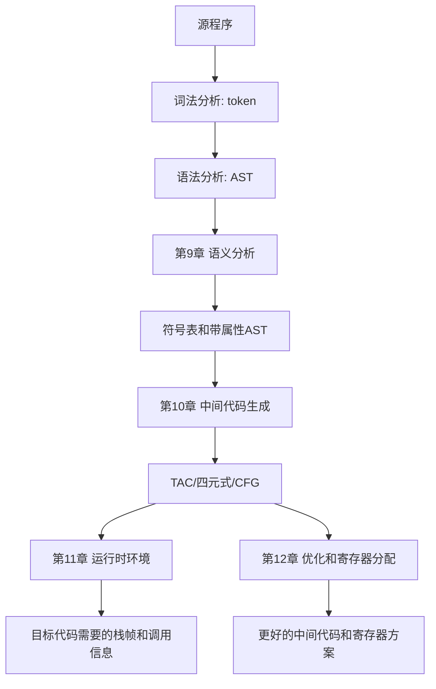

# 编译原理知识串讲：从语义分析到代码优化

> 这份文档从第 9 章语义分析开始，讲到第 12 章代码优化与寄存器分配。目标不是背术语，而是把“为什么需要这个概念、它解决什么问题、考试怎么落笔”串起来。

## 0. 先看完整流水线

前面章节已经做了词法分析和语法分析：

- 词法分析：把字符流切成 token。
- 语法分析：判断 token 串能不能按文法组成语法树。

从第 9 章开始，编译器进入“让程序真正有意义、能运行、能优化”的阶段：



一句话总括：

```text
第9章：这段程序的名字、类型、作用域是否合法？
第10章：把合法程序翻译成机器无关的中间代码。
第11章：程序运行时变量、函数调用、活动记录放在哪里？
第12章：中间代码怎么优化？变量怎么分配到有限寄存器？
```

下面用一个小例子贯穿：

```c
int a[2, 3];

void f(int b(), int k) {
    if (k > 0 && k < 3)
        a[k-1, k] = b(k, 1);
    else
        print 0;
}
```

这个例子同时覆盖语义分析、符号表、短路中间代码、数组访问、函数调用、运行时环境。

---

## 1. 第 9 章：语义分析

### 1.1 为什么语法正确还不够

语法分析只关心“形状对不对”。例如：

```c
x = y + 1;
```

只要文法允许“变量 = 表达式”，它就能通过语法分析。但语义分析还要问：

- `x` 声明过吗？
- `y` 声明过吗？
- `y` 的类型能和 `1` 相加吗？
- `x` 的类型能接收右边结果吗？
- 如果 `x` 是数组名，能不能直接被赋值？

所以，语义分析处理的是**语法树之外的规则**。

### 1.2 核心概念

| 概念   | 通俗解释                | 例子                              |
| ---- | ------------------- | ------------------------------- |
| 语义   | 程序在语言规则下的含义和合法性     | `x+1` 要求 `x` 是能参与加法的类型          |
| 语义分析 | 检查语义规则，并收集后续编译需要的信息 | 建符号表、类型检查、算宽度和偏移                |
| 符号表  | 名字到语义信息的表           | `a` 是数组，`f` 是函数，`k` 是参数         |
| 类型检查 | 判断运算、赋值、调用的类型是否匹配   | `int + int` 合法，`void + int` 不合法 |
| 作用域  | 名字在哪个范围内可见          | 函数内局部变量遮蔽外层变量                   |
| 属性   | 挂在语法树结点上的信息         | `E.type`、`T.width`、`S.chain`    |
| 属性文法 | 在 CFG 上附加属性和语义规则    | 产生式规约时计算类型、宽度、代码                |

最重要的区别：

```text
语法错误：文法推不出来。
语义错误：文法推得出来，但语言规则不允许。
```

### 1.3 符号表到底是什么

符号表可以理解为编译器的“名字档案馆”。每个名字不仅有名字本身，还要有种类、类型、宽度、偏移等信息。

对示例：

```c
int a[2, 3];
void f(int b(), int k) { ... }
```

全局符号表可以写成：

| name | kind | type / 说明 | width |
| --- | --- | --- | --- |
| `a` | array | 元素类型 `int`，维长 `[2,3]` | `2*3*4=24` |
| `f` | function | 返回 `void`，参数 `[b,k]` | 入口和子表信息 |

`f` 的局部/参数表：

| name | kind | type / 说明 |
| --- | --- | --- |
| `b` | function parameter | 返回 `int` 的函数形参 |
| `k` | parameter | `int` 参数 |

关键点：`b` 不是普通整型变量，而是“函数作为参数”。运行时调用 `b(k,1)` 时，除了知道 `b` 的代码入口，还要知道它的环境，也就是访问非局部变量时该按哪个作用域找。

### 1.4 属性文法为什么出现

语法树只有结构，不自动带类型和代码。例如表达式：

```c
k - 1
```

语法树告诉你它是一个减法表达式，但不会自动告诉你：

- `k` 是 `int`；
- `1` 是 `int`；
- 结果也是 `int`；
- 结果临时放到 `t1`；
- 需要生成 `t1 = k - 1`。

属性文法就是把这些信息挂到语法树结点上。

常见属性：

| 属性 | 含义 |
| --- | --- |
| `type` | 类型 |
| `width` | 占用字节数 |
| `offset` | 在活动记录或静态区里的偏移 |
| `place` | 表达式结果存放位置 |
| `code` | 生成的中间代码 |
| `tc` | 条件为真时等待反填的跳转链 |
| `fc` | 条件为假时等待反填的跳转链 |
| `chain` | 语句出口等待反填的跳转链 |

综合属性从孩子往父亲传，继承属性从父亲或左兄弟往下/往右传。

最典型例子：

```text
D -> T L
L.in = T.type
```

`T` 读到 `int` 后知道类型是 `int`，再把这个类型传给右边变量列表 `L`。这就是继承属性，因为变量列表的类型来自左兄弟。

### 1.5 考试怎么写

遇到“对声明进行语义分析”，按这个顺序写：

1. 先说当前作用域建哪几张符号表。
2. 从外到内扫描声明。
3. 遇到类型说明，算 `type/width`。
4. 遇到名字，查重并登记。
5. 遇到数组，记录元素类型、维数、维长、总宽度。
6. 遇到函数，登记函数项，建立函数局部表。
7. 遇到参数，登记到函数表。
8. 最后回填函数参数个数、参数类型表、返回类型。

---

## 2. 第 10 章：中间代码生成

### 2.1 为什么要有中间代码

编译器不通常直接从 AST 生成机器码，因为那样前端和目标机器绑得太死。

中间代码的作用是做桥：

```text
源语言 AST -> 中间代码 -> 目标机器代码
```

这样：

- 换源语言时，可以尽量复用后端。
- 换目标机器时，可以尽量复用前端。
- 优化可以在统一 IR 上做。

本课程里常见 IR：

| IR | 形状 | 用途 |
| --- | --- | --- |
| AST | 树 | 保留程序结构 |
| DAG | 图 | 合并公共子表达式 |
| 三地址码 TAC | 线性指令 | 最常写的中间代码 |
| 四元式 | 表格 | TAC 的实现形式 |
| CFG | 图 | 表示控制流 |
| SSA | CFG 上的单赋值形式 | 低优先级，会认即可 |

### 2.2 三地址码是什么

三地址码的核心规则：

> 一条指令最多做一个基本运算。

例如：

```c
x = (a + b) * c;
```

不能一口气写复杂表达式，要拆成：

```text
t1 = a + b
t2 = t1 * c
x = t2
```

四元式就是把它做成表：

| op | arg1 | arg2 | result |
| --- | --- | --- | --- |
| `+` | `a` | `b` | `t1` |
| `*` | `t1` | `c` | `t2` |
| `:=` | `t2` | `_` | `x` |

### 2.3 布尔表达式为什么不用先算成 0/1

对控制语句：

```c
if (k > 0 && k < 3) S1 else S2
```

最自然的不是算：

```text
t = (k > 0 && k < 3)
if t goto ...
```

而是直接生成跳转：

```text
if k > 0 goto L1
goto Lelse
L1:
if k < 3 goto Lthen
goto Lelse
```

这就是跳转法。它天然支持短路：

- 逻辑与：左边假，整体假，不看右边。
- 逻辑或：左边真，整体真，不看右边。

### 2.4 反填是什么

生成跳转时，有时还不知道目标标签。例如先生成：

```text
100: if x < y goto 0
101: goto 0
```

后来才知道真出口是 106，于是回去改：

```text
100: if x < y goto 106
```

这个“回去补目标”的动作就是反填。

常见名词：

| 名词 | 意思 |
| --- | --- |
| `tc` | 真出口链，条件为真时要补的跳转 |
| `fc` | 假出口链，条件为假时要补的跳转 |
| `chain` / `nextlist` | 语句执行完后还要补的出口 |
| `merge` | 把两条待填链接起来 |
| `bp` | backpatch，把链上跳转目标改成某个地址 |

### 2.5 用示例生成中间代码

源程序片段：

```c
if (k > 0 && k < 3)
    a[k-1, k] = b(k, 1);
else
    print 0;
```

三地址码可以写：

```text
if k > 0 goto L1
goto Lelse
L1:
if k < 3 goto Lthen
goto Lelse
Lthen:
t1 = k - 1
t2 = t1 * 3
t3 = t2 + k
param k
param 1
t4 = call b, 2
a[t3] = t4
goto Lend
Lelse:
print 0
Lend:
```

这里每段都对应一个概念：

- `k > 0 && k < 3`：短路跳转。
- `t1 = k - 1`：表达式拆临时变量。
- `t2 = t1 * 3; t3 = t2 + k`：二维数组行优先下标。
- `param` 和 `call`：函数调用。
- `goto Lend`：then 分支结束后跳过 else。

---

## 3. 第 11 章：运行时环境

### 3.1 为什么有了中间代码还不够

中间代码里有：

```text
param k
t4 = call b, 2
a[t3] = t4
```

但机器真正运行时要知道：

- `k` 在当前栈帧的哪个偏移？
- `a` 是全局数组还是局部数组？
- `b` 是函数参数，它的代码入口在哪里？
- 调用 `b` 后怎么回到原来的地方？
- 如果 `b` 访问外层变量，该沿哪条环境链找？

这些就是运行时环境要解决的问题。

### 3.2 活动和活动记录

函数每调用一次，就产生一次活动。

```text
foo(6)
```

是 `foo` 的一次活动。如果 `foo` 递归调用自己，就会有多个 `foo` 活动同时活着。

活动记录，也叫栈帧，是这次活动在运行时栈里的存储块。它通常包含：

| 字段 | 作用 |
| --- | --- |
| 参数区 | 保存实参/形参 |
| 返回值区 | 保存函数返回值 |
| 控制链 | 指向调用者活动记录 |
| 访问链 | 指向词法外层活动记录 |
| 返回地址 | 返回后继续执行的位置 |
| 保存寄存器 | 恢复调用者现场 |
| 局部变量区 | 保存局部变量 |
| 临时变量区 | 保存编译器临时值 |

### 3.3 控制链和访问链

控制链处理调用关系：

```text
谁调用我，我的控制链就指向谁。
```

访问链处理词法嵌套关系：

```text
我访问非局部变量时，应该去哪个词法外层活动记录找。
```

例子：

```c
void foo() {
    int z;
    void bar() {
        z = z + 1;
    }
    bar();
}
```

`bar` 的 `z` 不在 `bar` 自己的栈帧里，而在 `foo` 的栈帧里。  
所以 `bar` 的访问链要指向 `foo` 的活动记录。

### 3.4 过程参数为什么麻烦

如果函数作为参数传递：

```c
bar(row);
```

只传 `row` 的代码地址还不够。因为 `row` 可能访问它声明环境里的变量。

所以过程/函数参数要传：

```text
代码入口 + 环境指针
```

环境指针可以理解为能帮助它恢复访问链的信息。

这正是 2024 栈快照题和 exam_17 运行时题经常绕人的地方：过程参数不是一个普通变量，它有代码和环境两部分。

### 3.5 栈快照题怎么做

做题顺序：

1. 画词法嵌套树：谁声明在谁里面。
2. 画活动树：实际运行时谁调用谁。
3. 按调用顺序压栈。
4. 每个活动记录写参数、局部变量、返回地址。
5. 控制链指向实际调用者。
6. 访问链指向词法外层声明宿主的最近活动。
7. 如果有过程参数，写明代码入口和环境。

口诀：

```text
控制链看调用。
访问链看声明。
过程参数看代码入口加环境。
```

---

## 4. 第 12 章：代码优化与寄存器分配

### 4.1 优化在解决什么问题

中间代码能运行，不代表它好。

可能有：

- 重复计算；
- 永远用不到的赋值；
- 可以提前算出的常量；
- 太多临时变量；
- 寄存器不够用。

代码优化的原则是：

```text
不改变程序语义，让代码更快、更短或更省资源。
```

### 4.2 控制流图 CFG

优化首先要知道程序可能怎么走。

例如：

```text
1 if k > 0 goto 3
2 goto 8
3 t1 = k - 1
4 return t1
8 print 0
```

指令 1 有两个后继：3 和 2。  
指令 2 的后继是 8。  
这种“可能从哪条指令走到哪条指令”的图就是 CFG。

### 4.3 数据流分析

数据流分析是在 CFG 上问：

> 每个程序点有哪些信息一定或可能成立？

常见信息：

- 哪些定义能到达这里；
- 哪些变量以后还会用；
- 哪些表达式已经算过；
- 哪些变量可放入寄存器。

### 4.4 活跃变量分析

活跃变量的定义：

> 变量 `x` 在程序点 `p` 活跃，表示从 `p` 往后存在一条路径会使用 `x`，且使用前没有重新定义 `x`。

例子：

```text
1 t1 = a + b
2 c  = t1 * 2
3 t2 = d + e
4 f  = t2 + 1
```

`t1` 在第 2 行用完后就不活跃了。  
`t2` 第 3 行才产生。  
所以 `t1` 和 `t2` 可以共用寄存器。

活跃变量公式：

$$
out[i]=\bigcup_{s\in succ(i)}in[s]
$$

$$
in[i]=use[i]\cup(out[i]-def[i])
$$

读法：

- `out[i]` 看后继。
- `use[i]` 是本条指令马上要读的变量。
- `def[i]` 是本条指令重新写的变量，旧值不再需要。

### 4.5 干涉图和图着色

如果两个变量同时活跃，它们不能放同一个寄存器。

把这个关系画成图：

- 结点：变量或 web。
- 边：两个结点不能共用寄存器。

这就是干涉图。

寄存器分配就变成图着色：

- 寄存器是颜色。
- 相邻结点颜色不能相同。
- 如果有 `k` 个寄存器，就尝试用 `k` 种颜色染完整张图。

如果染不了，就要溢出：

```text
把某个变量放到内存里，需要时 load，用完后 store。
```

溢出后代码变了，所以通常要重新做活跃变量分析和寄存器分配。

### 4.6 考试怎么写

如果考寄存器分配题，按这个顺序：

1. 给中间代码编号。
2. 写每条指令的 `succ`。
3. 写每条指令的 `use/def`。
4. 反向迭代求 `in/out`。
5. 根据同时活跃关系画干涉图。
6. 用给定寄存器数做图着色。
7. 若不能着色，指出溢出变量和需要插入的 load/store。

---

## 5. 把四章连成一句话

用示例程序重新串一次：

```c
int a[2, 3];
void f(int b(), int k) {
    if (k > 0 && k < 3)
        a[k-1, k] = b(k, 1);
    else
        print 0;
}
```

第 9 章问：

- `a` 是什么？二维 `int` 数组。
- `f` 是什么？返回 `void` 的函数。
- `b` 是什么？函数型形参。
- `k` 是什么？整型形参。
- 每个名字占多宽？偏移是多少？作用域在哪里？

第 10 章问：

- `k > 0 && k < 3` 怎么短路跳转？
- `a[k-1,k]` 的下标怎么算？
- `b(k,1)` 怎么传参和调用？
- `if-else` 的标签和跳转怎么安排？
- 最后怎么写 TAC 或四元式？

第 11 章问：

- 调用 `f` 时栈帧长什么样？
- 参数 `b` 和 `k` 放在哪里？
- `b` 被调用时如何找到自己的代码入口和环境？
- 控制链和访问链分别指向谁？

第 12 章问：

- 生成的中间代码有哪些控制流路径？
- 每个程序点哪些变量还活着？
- 哪些临时变量可以共用寄存器？
- 如果寄存器不够，哪个变量要溢出到内存？

这就是 9-12 章的完整逻辑。

---

## 6. 最后冲刺优先级

如果时间很少：

1. 第 9 章先看符号表、属性文法、函数/数组声明语义分析。
2. 第 10 章先看三地址码、四元式、短路、反填、数组访问、函数调用。
3. 第 11 章先看活动记录、访问链、控制链、过程参数、栈快照。
4. 第 12 章只看 CFG、use/def、活跃变量、干涉图、图着色。

真正考试最容易拿分的不是抽象定义，而是把定义落到手算流程里：

```text
符号表题：名字 -> 类型 -> 宽度 -> 偏移 -> 作用域
中间代码题：表达式 -> 临时变量 -> 标签 -> 跳转 -> 四元式
栈快照题：词法嵌套 -> 调用顺序 -> 控制链 -> 访问链
优化题：succ -> use/def -> in/out -> 干涉图 -> 着色
```
