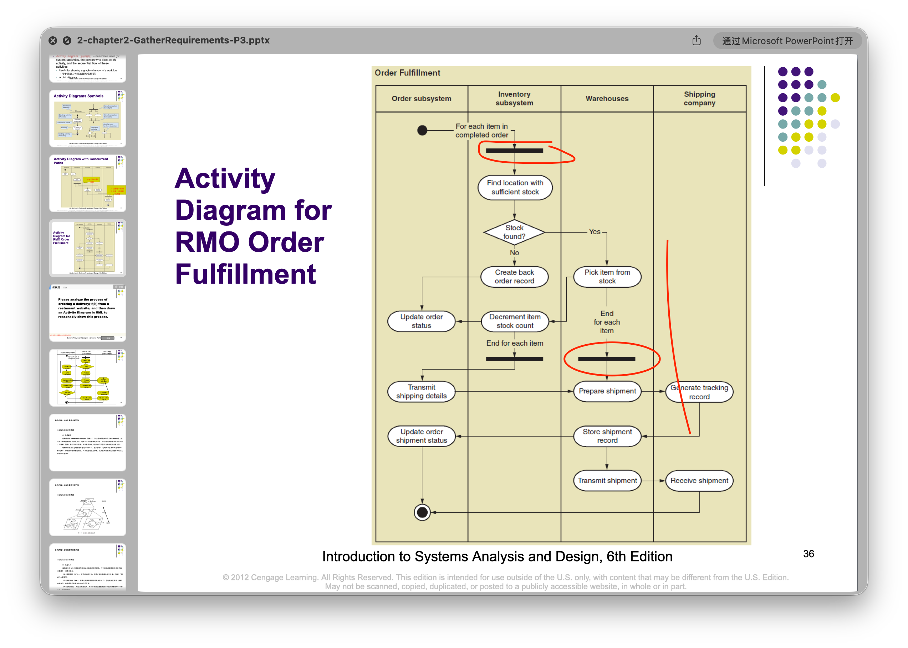

## 绪论
- 软件的定义：程序+数据+文档
- 软件危机
	- 主要表现
	
	- 原因
	- 解决方法：技术/工具+管理
## 基本概念
- UML：统一建模语言，软件开发中的标准化图形建模工具
## 项目立项
- 可行性研究；（技术、经济、社会）
- 项目计划
	- COCOMO分析
	
	
	> 

## 需求分析建模（结构化方法）
### 需求分析建模基本概念
- 分类：
	- 功能/非功能需求
	- 用户/系统需求
- 利益相关者：
	- 内部/外部
	- 操作/执行（操作直接使用软件系统/与之交互，而执行是不直接接触系统）
	
- 需求建模方法：
	- 结构化
		- 数据流图
		- 数据字典
		- 结构化语言
		- 判定表
		- 判定树
	- 面向对象
		- 用例
		- 用例图+用例描述
		- 系统顺序图
		- 活动图
		- ER图（实体-联系图）
		- 域模型类图
### 数据流图

#### 例子


### 数据字典
- `=`：定义为
- `+`：与，连接
- `[...|...]`：选择（或），`sex = [male | female]`
- `{... }`：重复。
	- `x={a}`表示x由0或者多个a组成
	- `name = 1{汉字}4`，姓名为1至4个汉字
	- `1{letter}`：至少1个字母
- `(...)`：可选，可有可无
- `..`：连接符，`x = 1..9`
- `*...*`：注释

### 结构化语言
- 选择结构：`IF` `THEN` `ELSE` `CASE`
- 循环结构：`WHILE` `DO` `REPEAT` `UNTIL`

#### 例子
借阅图书，校园学生的可借阅本数上限为5，教师为10，其他人为3
```
IF 读者类型 == "学生" THEN
	借阅上限 == 5
ELSE IF 读者类型 == "教师" THEN
	借阅上限 == 10
ELSE
	借阅上限 == 3
ENDIF
```
其他例子如：

### 判定表

#### 例题

（1）提取问题中的条件
	年龄、性别、婚姻
（2）标出条件的取值
	
（3）计算所有条件的组合数N
	
（4）提取可能采取的动作或措施，这些措施要适用于A类保险、B类保险、C类保险和额外收费。
> - 额外收费
> - 适用A类保险
> - 适用B类保险
> - 适用C类保险
> 这就是四种措施/动作。

（5）制作判定表
	
### 判定树

判定表上例中，可以按照判定树的规则，把判定表转化为对应的判定数。

> 树的每一层对应一个条件。
## 需求分析建模（面向对象方法）
### 基本内容
- 用例
- 用例图+用例描述
- 系统顺序图
- 活动图
- ER图（实体-联系图）
- 域模型类图
### 需求识别
识别出需求，**需求**催生**用例**。
#### 方式总结
见下方“**用例**”中的内容。
#### FURPS+
- Functional requirements（功能）
- Usability ...（可用性）
- Reliability（可靠性）
- Performance（性能）
- Security（安全）
- `+` stands for other categories of requirements、
>“功/用/可/能/安全”
#### 事件分解
- 外部事件：发生在系统外部
- 时间事件：由于到了某个时间点发生（在事件发生时间上加限定）
- 状态事件（内部事件）：当系统内部发生某些事情时，该事件发生。
#### CRUD
意思就是用CRUD来倒推用例。比如说对于每个对象我都要保证作用于它的CRUD四种功能正常，因此就能倒推出来用例。
>“用于验证、改进或交叉检查用例的技术”


### 用例（Use Case）
核心概念。描述**系统在外部参与者（Actor）的交互下所执行的完整功能单元。**
#### 确定方式
- FURPS+
- 事件分解
- CRUD

>也是**需求识别**的方式。
#### 确定规范
- 命名：动宾结构，“提交订单”
- 用例的粒度合适
#### 例子


>B最合适。A的操作粒度太细，只是一个操作步骤；C包含了很多可以独立的用例，所以太粗，也不行。

### 用例图
#### 符号含义
- 方框：系统边界
- 火柴人：用户
- 椭圆：用例
#### 关系

##### `<<extend>>`
如果执行A用例的时候，有些时候B会执行，有些时候不会，那么就称**B用例<<扩展>>了A用例**。（`B-<<extend>>->A`）。
> 上图，预订座位的时候如果座位满了就需要等候，如果座位还有空余就不需要排队等候，所以说排队等候是可选的。

##### `<<include>>`
A用例执行的时候一定要执行B用例。
#### 例题

>第一个：`<<include>>`
>第二/三个：`<<extend>>`

### 用例描述
采用结构化文本形式。


> 可能会画，基本项不能少。

### 活动图
- 泳道：对象
- 黑点：开始
- 圆角矩形：执行语句
- 圆圈套黑点：结束
- 黑色加粗横线：并行处理


>这个粗横线用法似乎是“同步”。老师如此回答：
>
>
>课件中有图片展示类似的用法：
>

### 系统顺序图（SSD）
- 只有`用户`和`:System`
- 分为双向箭头版和单向箭头版
#### 双向箭头
一个方向是`Method(参数)`，一个方向是返回值。

#### 单向箭头

其中语句规则如下：
`*[condition] rtn_value := msg_name(param_list)`
- 带星号表示消息重复/循环发生
- `[condition]`是消息发送的判断条件
#### 框架
##### 判断框架（Alt）

##### 可选框架（Opt）

##### 循环框架（Loop）

#### 例子

### 实体关系图（E-R图）
> [!Quote]
> *It is not a UML diagram, but it is widely used by data analysts in database management*


鱼尾纹符号：

- 每个Entity用矩形表示；
- PK：Primary Key，作为主要标识的Key；
- CK：Candidate Key，所有能够唯一标识一条记录的最小属性集合，所以PK来自CK。
- **符号靠近哪个实体，就表示对面一个实体可以关联多少个该实体**；
>所以如何解读上图？
>- 一个Order只能关联一个顾客；
>- 一个顾客可以有$\geq0$个订单
>- 一个订单必须关联$\geq1$个商品
>- 一个商品必须关联一个Order
>- 注意这里的“商品”不是指品类，每一件商品有可以与其他商品唯一区分的PK（Item ID）

### 域模型类图 Domain Model Class Diagram

> Entity和关系的表示实际上和ER图区别不大，只是符号变了。
#### 关系符号：泛化/继承（Generalization/Extension）
就是上图的空心三角箭头。箭头永远指向**父类**。
写成伪代码就是：
```java
class Account {
	String acoountID;
	Date dateOpened;
	double balance;
}

class SavingAccount extends Account {
	double interestRate;
}

class CheckingAccount extends Account {
	Strign checkStyle;
	double minimumBalance;
}
```

#### 关系符号：数量关系

- 一元：回归关系，表示同一个类实例之间的关系，可以表示**层级结构/递归关系**。（上下级/客户及其好友）
- 二元：不同类之间的关系，（一对一/一对多/多对多）可以用到上面的符号
- 三元：如**供应商-产品-定价**，表达三因素共同决定的业务约束
#### 关系符号：整体-部分关系
用菱形。

#### 关系符号：关联关系
记录某种联系本身所具有的属性。用虚线表示。

### 状态机图
用于**识别对象行为**。


### 例题与补充

>- 聚集：整体-部分
>- 一般关联：在UML图对应普通直线

---
## 系统设计
### 定义
是软件设计阶段的核心任务，细化需求分析模型，最终形成**设计模型**和**设计文档**。
#### 两个阶段
- 概要设计：描述软件总体体系结构，回答宏观问题。（包括数据结构与数据库如何设计）
- 详细设计：细化设计每个模块的具体执行过程，算法实现，数据定义等。
### 设计原理
- 模块化
- 抽象
- 信息隐蔽（可以借助封装这个概念来理解）
- 模块独立性
	- 耦合性
	- 内聚性
#### 模块独立性
##### 耦合性


- 数据耦合：交换数据，**低耦合**
- 控制耦合：传递控制信息，**中等程度耦合**
- 公共耦合：通过**公共数据环境**（变量、共享的通信区、内存的公共覆盖区、文件、物理设备等）相互作用，
- 内容耦合：**最高程度**
	
- 设计原则：**尽量使用数据耦合、少用控制耦合，限制公共环境耦合的范围，完全不用内容耦合。**
##### 内聚性


> [!Important]
> **从模块独立性的角度出发，一般就是：内聚性越高越好，耦合性越低越好。**
### 概要设计
#### 系统架构设计
是概要设计的核心活动，定义了软件系统的整体结构和组织方式。
主要分为以下三种：
1. 集中式架构
2. 分布式架构
3. 分层架构
#### 经典三层架构
- 表示层：负责与用户交互
- 业务逻辑层：阐述业务对象，处理核心业务逻辑
- 数据访问层：负责访问数据库，进行CRUD操作，持久化对象
#### 设计原则
- 关注点分离：将系统划分为职责清晰、相互独立的部分
- 高内聚低耦合
- 可拓展性
- 可重用性
#### 架构设计原则
- 最小知识：每个模块只通过公开接口与其他模块交流，尽可能少地了解其他模块的内部细节；
- 渐进式设计：架构设计要支持**增量开发/迭代交付**，至少应该**分阶段**实现系统功能。
### 详细设计
#### 主要内容
- 模块内部逻辑设计
- 数据结构详细设计
- 算法设计
- 数据库详细设计
- 用户界面设计
- 安全与性能设计
- ...
#### 用户界面设计：人机交互设计
##### 原则
- 可用性
- 反馈原则：每个操作都给出明确响应
- 容错性
- 效率
- 一致性：相似的操作应该交互方式相似

##### 用户界面设计
###### 结构化方法
1. 程序流程图
	
2. N-S图，也被称为盒图。
	
	

3. PAD图
	
	
###### 面向对象
1. 设计类图
	
	>“导航可见性”是说，**箭头指向哪个类，就表示可以从当前类“找到、访问、调用”箭头所指的那个类。**
	
	考法：根据图写出对应的代码。
	
2. 顺序图
	
3. 协作图
	
	```
	1  顾客请求加入商品
	│
	├─ 1.1 如果是第一件商品，创建购物车
	│   └─ 1.1.1 真正建立一个 OnlineCart 对象
	│
	└─ 1.2 将商品加入 OnlineCart
	    └─ 1.2.1 创建 CartItem
	        ├─ 1.2.1.1 查询促销价格
	        ├─ 1.2.1.2 查询商品描述
	        └─ 1.2.1.3 更新库存数量
	```
4. 包图：分为View Layer/Domain Layer/Data Access Layer（表示层、业务逻辑层、数据访问层），箭头表示依赖关系。
	
---
## 设计模式
### 组成
- Controller
- Adapter
- Singleton（单例）
- Factory
### Controller 控制器
为了使表示层和业务逻辑层的类更松耦合。

>通过这样一个Handler可以让`:CustomerForm`和`:Customer`减少直接交互，从而耦合性也会更松。

### Adapter 适配器
为了应对**类的修改**。

>系统内部只留下了`TaxCalculator`一种接口，这个Adapter就是为了应对外部接口频繁变化（从而和系统接口不兼容），而充当转换器的角色
>- 虚线空心三角箭头是**实现**关系（Realization）。A类指向B类表示`class A类 implements B类`。

上图英文大意为：
> 在 RMO 系统中，有几个地方使用了购买来的类库，以提供一些专门处理功能。  
> 这些购买来的类库可以提供诸如税费计算、运输费用和邮资计算等专业服务。  
> 随着时间推移，这些服务类库会升级到新的版本。  
> 有时，某个服务类库甚至会被另一家供应商提供的全新类库替代。 
> 为了避免系统受到不同版本、不同供应商接口差异的影响，RMO 系统的开发人员采用了“防止变化”和“间接访问”的设计原则，在每个可能被替换的类前面放置一个适配器。

### Singleton 单例
**系统中有且只有一个单例对象。**
保证一个类在整个系统运行期间只能创建一个对象，并提供一个统一入口来取得这个对象。

数据对象必须私有，构造方法也需要私有。然后`get`方法公有，用来取得唯一对象，如果初始对象为空就在`get`方法里调用私有构造函数来创建。
```java
class Singleton {
    // 1. 保存唯一对象
    private static Singleton instance;

    // 2. 私有构造方法，禁止外部 new
    private Singleton() {
    }

    // 3. 提供公共方法取得唯一对象
    public static Singleton getInstance() {
        if (instance == null) {
            instance = new Singleton();
        }
        return instance;
    }
}
```
### Factory 工厂
专门负责生产对象，而不需要User自己来创建对象。
```java
class ShapeFactory {
    public static Shape createShape(String type) {
        if (type.equals("circle")) {
            return new Circle();
        } else if (type.equals("rectangle")) {
            return new Rectangle();
        }
        return null;
    }
}
```


---
## 测试
### 基本介绍
#### 按照测试规模大小分类
从小到大一般是：
> 单元测试 → 集成测试 → 确认/验收测试 → 系统测试

#### 按是否查看程序内部分类
- 白盒测试
- 黑盒测试
#### 测试惯例
- 单元测试通常用白盒测试
- 集成测试可黑可白
- 确认/验收测试一般用黑盒测试
- 系统测试用黑盒测试

### 白盒测试
白盒测试中，测试人员知道内部代码和逻辑。设计测试用例的**根据**是**程序的内部逻辑结构**，更具体就是**代码、流程图、控制流图**。
#### 测试用例设计：逻辑覆盖

> - 语句覆盖就是至少要让这个语句执行一次，所以就是让$A \land B$ 成立一次。但是要注意，**如果这个判断语句真假都对应了可执行语句，那么语句覆盖也要让真假情况都出现，所以$A \land B$真假的情况都需要覆盖一次。**
> - 判定覆盖是要覆盖所有分支，所以就是$A \land B$真假的情况都需要各覆盖至少一次。


> - 条件覆盖就是每个基本条件都要至少取过一次真一次假，所以最小的一个测试取值集合就是A真B假和A假B真。
> - 判定/条件覆盖：在上个覆盖的前提下还要保证整个判定的结果也取过真假；
> - 条件组合覆盖：遍历所有可能的真假组合，就是$2^2$种。也就是条件真假取值的组合，故名“条件组合”。

##### 语句覆盖


>这个里面`[2,0,4]`和`[2,0,3]`都可以作为唯一的测试用例覆盖语句。

##### 判定覆盖（分支覆盖）

> [!Quote]
> *“所谓的判定覆盖就是设计若干个测试用例，运行被测程序，使得程序中每个判断的取真分支和取假分支至少经历一次。”*

所以说，只需要取`[2,0,4]`和`[1,1,1]`就可以了（“真-真”“假-假”）。这样第一个分支和第二个分支都取过真假。

##### 条件覆盖
> [!Quote]
> 所谓的条件覆盖就是设计若干个测试用例，运行被测程序，使得程序中每个判断的每个条件的可能取值至少执行一次。


> 这样能覆盖了所有基本条件的真假取值。

##### 判定/条件覆盖

##### 条件组合覆盖

遍历一遍组合。

#### 测试用例设计：路径覆盖

>[!Important]
>路径测试就是设计足够的测试用例，覆盖程序中每一条可能的程序*执行路径* **至少测试一次**，如果程序中含有**循环**(在程序图中表现为环)则**每个循环至少执行一次**。

先把程序流程图转化成控制流图，如下图：


##### 点覆盖
经过所有的节点，每个节点都是一个可执行语句（对应上面逻辑覆盖中的语句覆盖）

##### 边覆盖
经过每一条边（两个节点之间，对应上面的分支覆盖）；

##### 路径覆盖
从入口到出口的每一条可能完整路径，都至少执行一次。


#### 测试用例上限（环形复杂度）
##### 环形复杂度
它表示**控制流图中线性独立路径的数量。**
可以指示出**为基本路径测试至少需要考虑多少独立路径**。
所谓独立路径，是指：
> **与前面已经选出的路径相比，至少包含一条以前没有经过的新边。**

<u>测试用例上限（环形复杂度）给出基本路径集合中独立路径的数量。</u>
##### 复杂度计算

###### 数区域
转化成控制流图后，其中有4个连通域，所以有：
$$V(G)=4$$
###### 边数减节点+2
$$V(G) = E-N+2$$
E 是边数，N是节点数。这里N是12, E是14。
###### P+1
里面有三个判断节点。
- `TOTAL < 1000`
- `A != 0`
- `A > 0`
>因为用`&&`连接的语句，执行判断的时候先会判断前面的语句，如果是假，那就直接跳转了，所以要拆成`d`和`d'`两个语句。
### 黑盒测试
#### 等价类划分
##### 什么是等价类
把所有可能的输入，按照“程序会不会用同一种方式处理”分成几组。每一组就是一个等价类。
##### 划分标准


例题：

> PPT中做法不知所云，还是要自己做。
> 原则：
> - 等价类之间（最好）不要有交集


##### 边界值分析


